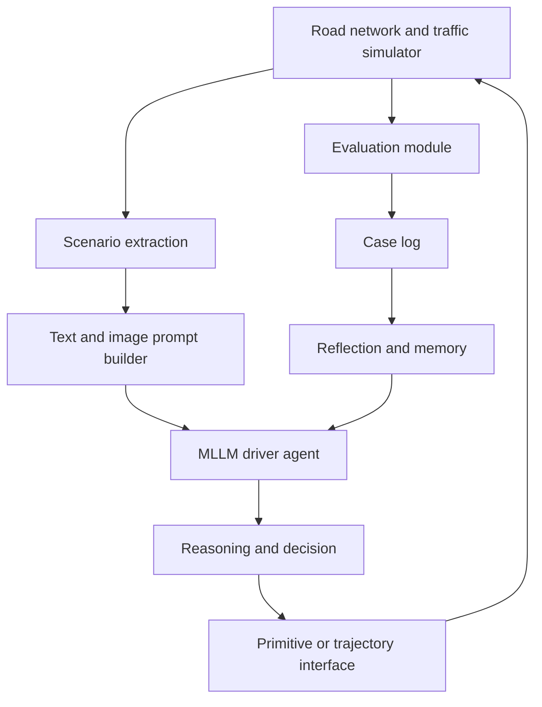

# LimSim++ (Fu et al., 2024)

LimSim++, introduced by Fu, Lei, Wen, Cai, Mao, Dou, Shi, and Qiao at the 2024 IEEE Intelligent Vehicles Symposium, is a closed-loop platform for deploying multimodal LLM-driven autonomous-driving agents. It extends LimSim with support for scenario descriptions, image/text prompts, decision-making, reflection, memory, and quantitative evaluation across intersections, roundabouts, ramps, and other interactive scenarios.

This page belongs under [simulation and data](/cs/autonomous-driving/simulation-and-data) and the [MLLM for Driving Survey](/cs/autonomous-driving/mllm-for-driving-survey). LimSim++ is not a driving policy by itself; it is infrastructure for testing language-model-based driving agents in closed loop. That is important because offline QA and captioning benchmarks do not reveal how a language agent behaves when its decisions change the future traffic state.

## Definitions

A **closed-loop simulator** updates the world after the ego agent acts. The next observation depends on the agent's previous decisions:

$$
s_{t+1}=F(s_t,u_t,u_t^{\mathrm{others}}).
$$

This differs from open-loop log replay, where the world follows recorded trajectories regardless of the model output.

An **MLLM-driven agent** uses a multimodal language model for scenario understanding, reasoning, decision-making, and sometimes self-reflection. In LimSim++, a prompt may include text scenario descriptions, navigation goals, surrounding vehicle states, and panoramic images.

The platform loop is:

$$
\text{simulate}\rightarrow\text{prompt}\rightarrow\text{reason}\rightarrow\text{decide}\rightarrow\text{control}\rightarrow\text{evaluate}.
$$

LimSim++ supports multiple output interfaces. An agent may output behavior primitives such as accelerate, decelerate, left turn, and right turn, or it may output trajectories directly. The simulator then converts decisions to vehicle motion and computes metrics.

The paper describes modules including multimodal prompt generation, decision-making, dynamic evaluation, reflection, memory, and case logging. Memory is especially relevant for LLM agents: failed cases can be reflected on and stored as examples for later decisions.

## Key results

The source abstract states that LimSim++ is an open-source evaluation platform designed for research on autonomous driving with MLLMs, supporting long-term closed-loop simulations across multiple scenarios. It also introduces a baseline MLLM-driven framework and validates it through quantitative experiments across diverse scenarios.

The key result is infrastructural. VLM and LLM driving systems can look competent in single-frame QA but fail in interactive traffic. A closed-loop platform exposes compounding effects:

- A delayed merge can create a new conflict.
- A hallucinated right of way can cause a near collision.
- A cautious answer repeated too often can block traffic.
- A memory/reflection module can improve or degrade future choices.

LimSim++ also formalizes the interface problem. Language models output text. Vehicles need trajectories or controls. The platform's role is to package scenario information into prompts and translate decisions back into simulated motion.

The paper reports route completion and driving score style evaluation. A simple route-completion metric is

$$
R=\frac{L_{\mathrm{completed}}}{L_{\mathrm{total}}}.
$$

But route completion alone is insufficient: an unsafe agent can complete a route by forcing its way through traffic. Safety, comfort, traffic-rule compliance, and interaction quality must be measured too.

LimSim++ is also a prompt-interface benchmark. A driving prompt must compress a large, continuous, multi-agent state into language and images that a model can handle. If the prompt omits a fast vehicle in the adjacent lane, the LLM may choose an unsafe lane change. If the prompt includes too much low-level detail, the model may exceed context limits or reason slowly. Good prompt design is therefore an engineering component, not a cosmetic wrapper.

The platform's memory and reflection modules are useful but risky. A case log can store situations where the model made a poor decision, then retrieve similar cases later. This resembles experience replay for language agents. But memory quality matters: if a failed decision is summarized incorrectly, or if a retrieved case differs in a crucial traffic-rule detail, the agent can become confidently wrong. A closed-loop platform can test whether memory improves aggregate behavior or merely changes the failure distribution.

LimSim++ also provides a way to compare output authority. One agent may output only a behavior primitive, another may output a target speed and lane, and another may output full waypoints. These interfaces have different safety profiles. Primitive actions are easier to constrain but less expressive. Full trajectories are expressive but require stronger feasibility checking. For MLLM driving research, comparing these authority levels is as important as comparing base models.

Finally, closed-loop simulation is still not public-road validation. Traffic agents in simulation may be simpler than humans, sensor rendering may omit edge cases, and language prompts may expose information that a real vehicle would not know. LimSim++ should be read as a necessary intermediate testbed for MLLM agents, not as sufficient evidence for deployment.

A useful evaluation design is to separate scenario understanding from action execution. The same MLLM answer can be scored for whether it correctly identifies hazards, whether it chooses a reasonable maneuver, and whether the converted vehicle trajectory is safe. This separation prevents a strong controller from hiding weak reasoning, or a good explanation from hiding poor motion. LimSim++-style platforms make that decomposition possible because they own the simulator state, prompt, agent decision, and resulting trajectory.

The platform also encourages long-horizon testing. Many language-agent failures are not immediate collisions; they are inefficient hesitation, repeated indecision, or poor recovery after a bad merge. Long-term closed-loop simulation can reveal those patterns better than single-turn prompts.

LimSim++ is therefore best viewed as a bridge between language-model evaluation and autonomy evaluation. A normal MLLM benchmark asks whether an answer is textually correct. An AV benchmark asks whether the vehicle behaves safely and efficiently over time. LimSim++ combines those questions by making the model's text reasoning affect the simulated vehicle, then measuring the consequences. That is exactly the missing link for many LLM-driving papers: without closed-loop consequences, a driving "decision" is only a sentence.

The platform also lets researchers study prompt frequency. A language agent may not need to reason every simulator tick; it may reason at a lower behavioral frequency while a conventional controller handles continuous motion. Testing that split is essential for latency-aware MLLM driving.

That makes LimSim++ a systems benchmark, not only a prompt benchmark.

The closed-loop consequence is the point.

## Visual



| LimSim++ component | Purpose | Failure it can expose |
|---|---|---|
| Prompt builder | Convert traffic state to text/images | Missing critical context |
| Driver agent | Reason and choose action | Hallucinated right of way |
| Control interface | Apply decisions to vehicle | Text-action mismatch |
| Evaluation | Score route and safety | Hidden closed-loop risk |
| Memory/reflection | Learn from cases | Bad examples reinforcing errors |

## Worked example 1: Route completion score

Problem: In a LimSim++ run, the route length is 1,200 m and the ego completes 930 m before timeout. Compute route completion.

1. Use

$$
R=\frac{L_{\mathrm{completed}}}{L_{\mathrm{total}}}.
$$

2. Substitute:

$$
R=\frac{930}{1200}=0.775.
$$

3. Convert to percent:

$$
0.775\cdot100=77.5\%.
$$

Answer: route completion is 0.775, or 77.5 percent.

Check: This says nothing about infractions. A full driving score should also penalize collisions, red-light violations, off-road motion, and uncomfortable behavior.

## Worked example 2: Primitive decision to trajectory

Problem: An MLLM outputs "decelerate" for a vehicle traveling 12 m/s. The low-level interface maps decelerate to acceleration $a=-2$ m/s squared for 2 seconds. What speed and distance result under constant acceleration?

1. Final speed:

$$
v_f=v_0+at=12+(-2)(2)=8\ \mathrm{m/s}.
$$

2. Distance:

$$
d=v_0t+\frac{1}{2}at^2=12(2)+\frac{1}{2}(-2)(4)=24-4=20\ \mathrm{m}.
$$

Answer: the vehicle travels 20 m and slows to 8 m/s.

Check: A primitive word becomes a concrete motion only through an interface. Different mappings can change safety outcomes.

## Code

```python
from dataclasses import dataclass

@dataclass
class EvalState:
    route_total_m: float
    route_completed_m: float
    collisions: int
    red_light_violations: int

def limsim_score(state: EvalState):
    route = state.route_completed_m / max(state.route_total_m, 1e-6)
    penalty = 0.5 * state.collisions + 0.2 * state.red_light_violations
    return max(0.0, route - penalty)

run = EvalState(1200.0, 930.0, collisions=0, red_light_violations=1)
print(limsim_score(run))
```

## Common pitfalls

- Evaluating LLM driving only with static prompts. Closed-loop actions change the next state.
- Letting text decisions bypass physical feasibility checks.
- Overfitting prompts to a small scenario set.
- Measuring route completion without safety penalties.
- Treating reflection memory as automatically beneficial. It can store misleading cases.
- Ignoring simulator realism and traffic-agent behavior.
- Assuming an LLM agent can run at arbitrary decision frequency without latency problems.

## Connections

- [Simulation and data](/cs/autonomous-driving/simulation-and-data)
- [MLLM for Driving Survey](/cs/autonomous-driving/mllm-for-driving-survey)
- [VLA for Driving Survey](/cs/autonomous-driving/vla-for-driving-survey)
- [DriveVLM](/cs/autonomous-driving/drivevlm)
- [Safety, ISO 26262, SOTIF, and scenario testing](/cs/autonomous-driving/safety-iso26262-sotif-scenario-testing)
- [Decision making and behavior planning](/cs/autonomous-driving/decision-making-and-behavior-planning)
- Further reading: LimSim++, CARLA, SUMO, nuPlan, AWSIM, Drive as You Speak, LanguageMPC, DiLu, GPT-Driver, and Dolphins.
