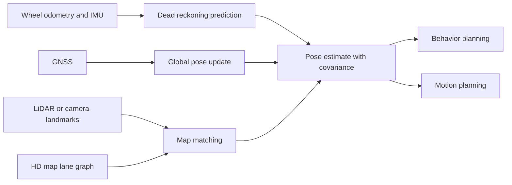

# Localization and HD Maps

Localization estimates where the ego vehicle is, how fast it is moving, and how uncertain that estimate is. HD maps encode lane geometry, traffic-control elements, road boundaries, crosswalks, speed limits, and topology at a level of precision useful for automated driving. Together, localization and maps let a vehicle reason about where it is in the road network, not only where it is on Earth.

This page covers GNSS plus IMU dead reckoning, visual-inertial odometry, lidar-inertial odometry, GraphSLAM, map matching, vector maps, lanelet maps, and map-light alternatives. It connects [sensors](/cs/autonomous-driving/sensors-cameras-lidar-radar-imu) and [sensor fusion](/cs/autonomous-driving/sensor-fusion) to [behavior planning](/cs/autonomous-driving/decision-making-and-behavior-planning), because a planner cannot choose the correct lane, yield line, or turn if the vehicle's pose and map context are ambiguous.

## Definitions

**Localization** estimates the vehicle pose, usually position and orientation, in a coordinate frame. A common planar pose is $(x,y,\psi)$, where $\psi$ is yaw. Full 3D pose uses translation and rotation in $SE(3)$.

**Dead reckoning** propagates pose using motion measurements such as wheel speed, steering angle, accelerometer data, and gyroscope data. It works over short intervals but drifts without external correction.

**SLAM**, simultaneous localization and mapping, estimates the vehicle trajectory and a map at the same time. **VIO** uses visual and inertial measurements. **LIO** uses lidar and inertial measurements. **GraphSLAM** represents poses and landmarks as graph nodes connected by measurement constraints.

An **HD map** is a high-definition road map that can contain centimeter-level lane geometry, lane boundaries, traffic lights, stop lines, signs, crosswalks, curbs, drivable areas, and semantic topology. It is not just a navigation map.

A **vector map** stores geometric primitives such as lane centerlines, lane boundaries, polygons, stop lines, and traffic-control objects. A **lanelet** is a map element representing a lane segment with boundaries and connectivity, widely used in research and open-source autonomy stacks.

**Map matching** aligns current sensor observations or estimated pose to a map. It may use GNSS priors, lane markings, lidar intensity, traffic signs, poles, curbs, road edges, or learned descriptors.

**Localization without HD maps** refers to approaches that rely less on prebuilt centimeter maps. They may use online perception, standard-definition maps, crowdsourced map layers, lane graph inference, or end-to-end learned representations. These approaches reduce map maintenance burden but shift more responsibility to online perception and planning.

## Key results

Pose propagation for planar dead reckoning can use a kinematic bicycle model:

$$
\begin{aligned}
x_{t+\Delta t} &= x_t + v_t\cos(\psi_t)\Delta t, \\
y_{t+\Delta t} &= y_t + v_t\sin(\psi_t)\Delta t, \\
\psi_{t+\Delta t} &= \psi_t + \frac{v_t}{L}\tan(\delta_t)\Delta t,
\end{aligned}
$$

where $v$ is speed, $L$ is wheelbase, and $\delta$ is steering angle. This is simple and useful, but tire slip, slopes, steering calibration, and wheel-speed errors cause drift.

An EKF localization system separates prediction from update:

$$
\begin{aligned}
x_t^- &= f(x_{t-1}^+, u_t), \\
P_t^- &= F_tP_{t-1}^+F_t^\top + Q_t, \\
K_t &= P_t^-H_t^\top(H_tP_t^-H_t^\top + R_t)^{-1}, \\
x_t^+ &= x_t^- + K_t(z_t - h(x_t^-)).
\end{aligned}
$$

Here $P$ is covariance, $Q$ process noise, $R$ measurement noise, $F$ the motion Jacobian, and $H$ the measurement Jacobian. The core idea is that dead reckoning predicts continuously, while GNSS, lidar map matching, visual landmarks, or lane detections correct drift.

GraphSLAM solves a nonlinear least-squares problem:

$$
\min_X \sum_i \left\| r_i(X_i, X_j, z_i) \right\|_{\Omega_i}^2,
$$

where residuals compare predicted measurements to observed constraints, and $\Omega_i$ is information. Loop closures are powerful because revisiting a place constrains accumulated drift.

HD maps improve prediction and planning by providing lane topology, legal connections, crosswalks, stop lines, traffic-light associations, and speed limits. They also introduce operational dependencies: map coverage, freshness, construction changes, lane closures, temporary traffic control, and localization confidence. A map-aware system must know when the map is stale or incompatible with current observations.

Map maintenance is a data problem. A fleet may detect changed lane markings, new work zones, missing signs, or altered speed limits, but those observations must be validated before becoming trusted map updates. The system needs provenance, confidence, versioning, rollback, and region-specific release controls. A bad map update can be as dangerous as a bad perception model because it can affect many vehicles consistently.

Map-light autonomy reduces some maintenance burden but increases online uncertainty. If the vehicle infers lane topology and traffic-control relationships on the fly, it needs stronger perception, prediction, and rule reasoning at intersections and construction zones. The engineering choice is not "map or no map"; it is how much prior structure to depend on and how the system behaves when online evidence disagrees with that prior.

Localization accuracy should be evaluated relative to task risk. A 30 cm pose error may be acceptable on a wide highway lane but unacceptable near a curb, narrow construction barrier, toll gate, or stop line. Heading error is equally important: a small yaw mistake projects into a large lateral error at long lookahead distances, which can distort lane association and planned trajectories.

A good localization interface reports degradation early. Planning can slow down or increase margins when covariance grows, but only if the estimator exposes uncertainty before the pose becomes obviously wrong.

## Visual



## Worked example 1: Dead-reckoning pose update

Problem: A vehicle has wheelbase $L=2.8$ m, speed $v=10$ m/s, yaw $\psi=0$, steering angle $\delta=5^\circ$, and time step $\Delta t=0.1$ s. Use the kinematic bicycle model to estimate the next pose from $(x,y,\psi)=(0,0,0)$.

1. Convert steering to radians:

$$
5^\circ = 5\frac{\pi}{180} \approx 0.0873\ \mathrm{rad}.
$$

2. Compute position update:

$$
\begin{aligned}
x_{1} &= 0 + 10\cos(0)(0.1)=1.0\ \mathrm{m}, \\
y_{1} &= 0 + 10\sin(0)(0.1)=0.
\end{aligned}
$$

3. Compute yaw update:

$$
\begin{aligned}
\Delta \psi &= \frac{v}{L}\tan(\delta)\Delta t \\
&= \frac{10}{2.8}\tan(0.0873)(0.1) \\
&\approx 3.571(0.0875)(0.1) \\
&\approx 0.0313\ \mathrm{rad}.
\end{aligned}
$$

4. Convert yaw change to degrees:

$$
0.0313 \times \frac{180}{\pi} \approx 1.79^\circ.
$$

Answer: the next pose is approximately $(1.0,0,0.0313)$, with yaw changed by about $1.79^\circ$.

Check: The vehicle has moved about 1 m in 0.1 s, which matches 10 m/s. Small steering produces a modest yaw change.

## Worked example 2: Simple map-matching likelihood

Problem: A localization module predicts that the vehicle is 0.45 m to the right of a mapped lane centerline. The lateral localization standard deviation is $\sigma=0.30$ m. Under a Gaussian lateral error model, compute the unnormalized likelihood factor $\exp(-e^2/(2\sigma^2))$.

1. Define lateral error:

$$
e = 0.45\ \mathrm{m}.
$$

2. Compute denominator:

$$
2\sigma^2 = 2(0.30)^2 = 0.18.
$$

3. Compute exponent:

$$
-\frac{e^2}{2\sigma^2}
= -\frac{0.45^2}{0.18}
= -\frac{0.2025}{0.18}
= -1.125.
$$

4. Exponentiate:

$$
\exp(-1.125)\approx 0.325.
$$

Answer: the unnormalized likelihood factor is about 0.325.

Check: Since the error is $1.5\sigma$, the likelihood is lower than a near-center hypothesis but not impossible. A competing lane hypothesis with smaller error may dominate.

## Code

```python
import numpy as np

def bicycle_step(state, speed, steer, wheelbase, dt):
    x, y, yaw = state
    x += speed * np.cos(yaw) * dt
    y += speed * np.sin(yaw) * dt
    yaw += speed / wheelbase * np.tan(steer) * dt
    return np.array([x, y, yaw])

def lane_likelihood(lateral_error_m, sigma_m):
    return np.exp(-(lateral_error_m ** 2) / (2.0 * sigma_m ** 2))

state = np.array([0.0, 0.0, 0.0])
for _ in range(10):
    state = bicycle_step(state, speed=10.0, steer=np.deg2rad(5.0), wheelbase=2.8, dt=0.1)

print("pose after 1s:", state)
print("map likelihood:", lane_likelihood(0.45, 0.30))
```

## Common pitfalls

- Treating GNSS as ground truth. GNSS can be biased by multipath, blocked in tunnels, or attacked.
- Using HD maps without freshness checks. Construction, temporary closures, repainted lanes, and movable signs can invalidate map assumptions.
- Ignoring covariance. A pose estimate without uncertainty is not enough for planning near curbs, narrow lanes, or stop lines.
- Confusing localization accuracy with control accuracy. Even perfect localization cannot compensate for tire slip, actuator delay, or bad trajectory generation.
- Building maps that downstream modules cannot interpret. Lane geometry must include topology, traffic-control associations, and legal connectivity.
- Assuming map-light means perception-light. Removing HD maps often increases the burden on online perception, prediction, and rule reasoning.

## Connections

- [Sensor fusion](/cs/autonomous-driving/sensor-fusion)
- [Motion planning](/cs/autonomous-driving/motion-planning)
- [Decision making and behavior planning](/cs/autonomous-driving/decision-making-and-behavior-planning)
- [Simulation and data](/cs/autonomous-driving/simulation-and-data)
- [Engineering math for estimation](/math/engineering-math/)
- [Embedded systems](/cs/embedded/)
- Further reading: *Probabilistic Robotics*; GraphSLAM and factor graph papers; Lanelet2; lidar-inertial odometry and visual-inertial odometry surveys.
