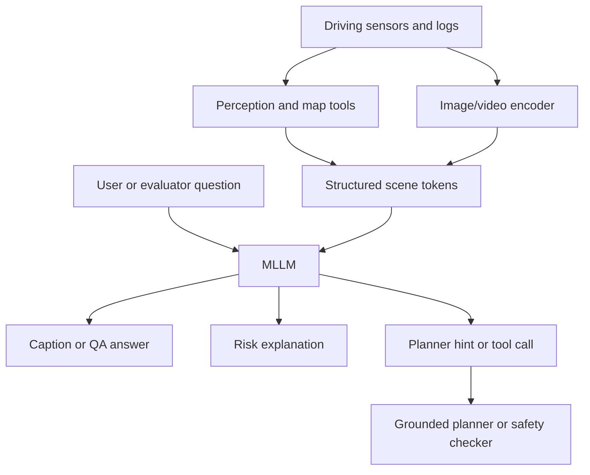

# MLLM for Driving Survey (Cui et al., 2024)

This page synthesizes Cui and collaborators' WACV 2024 workshop survey "A Survey on Multimodal Large Language Models for Autonomous Driving" with related survey PDFs in the source folder, including broader reviews of foundation models, VLMs in autonomous driving, and applications of LLMs and multimodal large models. It focuses on MLLMs as reasoning and interaction modules for driving, maps, transportation, and in-cabin systems.

The distinction from the [VLA for Driving Survey](/cs/autonomous-driving/vla-for-driving-survey) page is scope. MLLM-for-driving includes perception, map systems, traffic reasoning, user interaction, data generation, question answering, and planning support. VLA is narrower: the model must connect to action generation. Many MLLM systems are useful even when they do not directly drive.

## Definitions

A **large language model** processes text tokens and produces text tokens. A **multimodal large language model** aligns text with other modalities such as images, video, LiDAR-derived features, maps, audio, or tool outputs.

For driving, an MLLM may consume:

$$
X = \{I_{\mathrm{front}},I_{\mathrm{side}},V_{\mathrm{video}},M_{\mathrm{map}},B_{\mathrm{boxes}},T_{\mathrm{traffic}},q_{\mathrm{text}}\}.
$$

It may output:

- Scene captions.
- Answers to driving questions.
- Explanations of ego behavior.
- Risk descriptions.
- High-level decisions.
- Tool calls.
- Route or map instructions.

A **driving language dataset** augments driving logs with text: captions, question-answer pairs, object references, explanations, or advice. Examples discussed across the surveys include BDD-X, Talk2Car, nuScenes-QA, NuPrompt, DriveLM-style graph VQA, and other derived QA datasets.

An **MLLM driving agent** often uses tools. The language model can call perception, map, retrieval, rule-checking, or planning tools, then compose a decision or explanation. Tool use is important because raw LLMs are weak at exact metric geometry and up-to-date map facts.

## Key results

The Cui et al. survey states that it reviews MLLM background, autonomous-driving history, existing MLLM tools for driving/transportation/map systems, datasets and benchmarks, and accepted works from the first WACV Workshop on Large Language and Vision Models for Autonomous Driving. It identifies opportunities in perception, motion planning, motion control, user interaction, and industry applications.

The main synthesis is that MLLMs can improve the **semantic layer** of autonomy. They can describe unusual objects, reason about road signs and human instructions, answer why a maneuver is needed, and help mine or annotate data. But they are not naturally metric planners. Their output must be grounded in calibrated sensors, HD maps, vehicle state, and safety rules.

Common MLLM roles include:

1. **Perception explanation:** describe objects and scene context beyond class labels.
2. **Driving QA:** answer questions about who has priority, what hazards exist, or why ego should stop.
3. **Planning support:** produce high-level maneuvers or planner parameters.
4. **Human-vehicle interaction:** interpret passenger preferences or natural-language route requests.
5. **Data engine support:** generate labels, captions, or long-tail scenario descriptions.

The surveys also highlight hazards: hallucination, weak spatial grounding, latency, privacy, benchmark fragmentation, and unclear safety certification. For autonomous driving, an eloquent but wrong answer is worse than a terse uncertainty estimate.

MLLMs are therefore most credible when used with tools. A map tool can provide route restrictions, a perception tool can provide calibrated object tracks, a traffic-rule tool can check priority, and a planner can test trajectory feasibility. The MLLM can compose these results into a human-readable interpretation or choose which tool to call next. This is closer to an operations assistant or high-level reasoning module than a standalone controller.

The map and transportation angle is also broader than ego driving. MLLMs can help summarize traffic incidents, convert passenger requests into route constraints, explain why a navigation system rerouted, or mine fleet logs for unusual scenarios. These uses are valuable even if the model never directly controls steering. They may also be easier to validate because the output can be reviewed before it affects vehicle motion.

For safety-critical autonomy, uncertainty communication matters. If the model is unsure whether a light is red, whether a sign applies to the ego lane, or whether a pedestrian intends to cross, it should surface uncertainty rather than produce a confident story. A practical MLLM stack should include confidence thresholds, abstention behavior, and escalation to deterministic safety policies.

The survey literature is moving quickly, so this page should be read as a taxonomy, not a frozen catalog. New models will change names and benchmarks, but the core questions will remain: what modalities are grounded, what tools are used, what action authority the model has, and how failures are detected.

Compared with VLA systems, many MLLM applications can be deployed with lower risk because they remain advisory. A fleet-analysis assistant that summarizes rare scenes can be reviewed offline. A map assistant that explains route changes can be checked against navigation data. An in-cabin assistant that answers passenger questions can be sandboxed away from direct control. These applications still need privacy and reliability controls, but they do not carry the same immediate actuation risk as a trajectory-generating model.

The driving domain also stresses multimodality more than ordinary image QA. A correct answer may require camera views, temporal video, LiDAR tracks, map lanes, traffic-light state, route intent, and local law. If any modality is missing or misaligned, the language model may fill gaps with plausible but false assumptions. Robust MLLM systems should therefore expose provenance: which sensor or tool supports each claim.

This provenance requirement is a bridge to safety engineering. A safety monitor cannot act on "the scene seems clear"; it needs grounded objects, distances, velocities, and uncertainties.

For that reason, the best near-term MLLM uses in driving may be constrained, auditable workflows: dataset triage, scenario explanation, map-query assistance, and human-facing summaries.

Direct control should require a much higher evidentiary bar.

## Visual



| MLLM role | Example output | Needs grounding by |
|---|---|---|
| Scene captioning | "Pedestrian near crosswalk" | Detector, tracking, map |
| Driving QA | "Ego should yield" | Traffic rules and geometry |
| Planner advice | "Slow down and change left" | Motion planner feasibility |
| Map assistant | "Avoid closed road" | Live map and traffic data |
| Data annotation | Long-tail scenario labels | Human or rule audit |

## Worked example 1: Grounding a text answer

Problem: An MLLM answers, "The ego should stop because the light is red." A traffic-light classifier reports red probability 0.55 and green probability 0.40, while the map says the ego is 8 m before the stop line. A safety system requires red probability at least 0.8 for a confident red-light explanation. Is the explanation grounded?

1. Red probability:

$$
p_{\mathrm{red}}=0.55.
$$

2. Required confidence:

$$
p_{\min}=0.8.
$$

3. Compare:

$$
0.55<0.8.
$$

4. The stop-line distance is relevant, but the color evidence is not confident enough.

Answer: the explanation is not confidently grounded. The system should say the light state is uncertain or request a conservative fallback.

Check: The vehicle may still slow down under uncertainty, but the explanation should not overstate perception confidence.

## Worked example 2: Tool-using route advice

Problem: A passenger says, "Take the faster route but avoid highways." The navigation tool returns Route A: 18 min with highway, Route B: 22 min no highway, Route C: 25 min no highway. Which route should the MLLM choose?

1. The instruction has a hard constraint: avoid highways.

2. Route A violates the constraint, despite being fastest.

3. Among valid routes, compare times:

$$
B=22\ \mathrm{min},\qquad C=25\ \mathrm{min}.
$$

4. Route B is faster among non-highway routes.

Answer: choose Route B.

Check: The MLLM should not invent route facts; it should use the navigation tool outputs.

## Code

```python
from dataclasses import dataclass

@dataclass
class Route:
    name: str
    minutes: float
    uses_highway: bool

def choose_route(routes, avoid_highways=True):
    candidates = [r for r in routes if not (avoid_highways and r.uses_highway)]
    if not candidates:
        return min(routes, key=lambda r: r.minutes)
    return min(candidates, key=lambda r: r.minutes)

routes = [
    Route("A", 18, True),
    Route("B", 22, False),
    Route("C", 25, False),
]
print(choose_route(routes).name)
```

## Common pitfalls

- Treating MLLM output as perception ground truth.
- Asking language models for metric geometry without using calibrated tools.
- Using benchmark QA accuracy as a proxy for driving safety.
- Ignoring hallucination in rare or adversarial scenes.
- Letting passenger preferences override traffic law or safety constraints.
- Sending raw personal driving video or location context to external models without privacy controls.
- Confusing MLLM support with autonomous-driving certification.

## Connections

- [VLA for Driving Survey](/cs/autonomous-driving/vla-for-driving-survey)
- [DriveVLM](/cs/autonomous-driving/drivevlm)
- [AutoVLA](/cs/autonomous-driving/autovla)
- [Decision making and behavior planning](/cs/autonomous-driving/decision-making-and-behavior-planning)
- [V2X and connected vehicles](/cs/autonomous-driving/v2x-and-connected-vehicles)
- [Adversarial and physical attacks on AV](/cs/autonomous-driving/adversarial-and-physical-attacks-on-av)
- Further reading: Cui et al. MLLM survey, Vision Language Models in Autonomous Driving survey, foundation models for AD surveys, DriveLM, NuScenes-QA, Talk2Car, BDD-X, and LingoQA.
