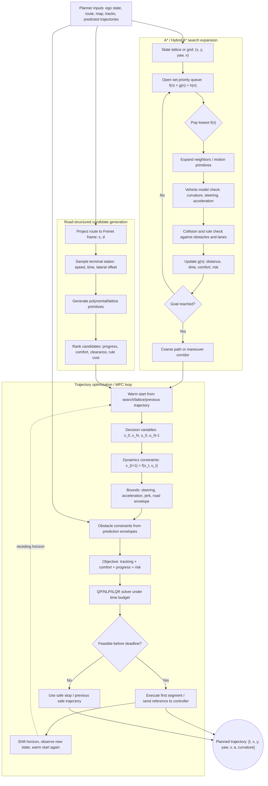

# Motion Planning

Motion planning converts goals and scene understanding into a physically executable trajectory. It must respect obstacles, lanes, traffic rules, comfort, vehicle dynamics, actuator limits, uncertainty, and the future motion of other agents. In an autonomous-driving stack, planning is where perception errors and prediction uncertainty become concrete choices: brake, continue, yield, change lanes, creep, pull over, or reroute.

This page covers search-based planning, sampling-based planning, optimization-based planning, model predictive control, iLQR, trajectory optimization, and lattice planners. It links [prediction](/cs/autonomous-driving/prediction-and-motion-forecasting), [behavior planning](/cs/autonomous-driving/decision-making-and-behavior-planning), and [control](/cs/autonomous-driving/control-pid-mpc-pure-pursuit-stanley), because planning sits between high-level intent and low-level actuation.

## Definitions

**Motion planning** finds a time-parameterized path or trajectory from the ego vehicle's current state to a desired state while satisfying constraints. A **path** describes geometry without timing, such as $x(s), y(s)$. A **trajectory** includes time, such as $x(t), y(t), v(t), a(t)$.

**Search-based planners** discretize the problem into graph nodes and edges. A* searches a graph using a cost-to-come plus heuristic. **Hybrid A*** extends A* with continuous vehicle heading and motion primitives, making it useful for car-like vehicles.

**Sampling-based planners** explore continuous spaces through sampled states or controls. **RRT** rapidly expands a tree toward random samples. **RRT*** improves asymptotic optimality by rewiring. **PRM** builds a roadmap, then queries it.

**Optimization-based planners** formulate trajectory generation as minimizing a cost subject to constraints. They can encode smoothness, comfort, obstacle clearance, lane preference, progress, and dynamic feasibility.

**MPC**, or model predictive control, repeatedly solves a finite-horizon constrained optimization problem, executes the first control action, observes the new state, and solves again. In AV stacks, MPC may appear as a planner, a controller, or both.

**iLQR**, iterative linear quadratic regulator, solves nonlinear trajectory optimization by repeatedly linearizing dynamics and quadratizing costs around a nominal trajectory.

**Lattice planning** precomputes or generates motion primitives in a structured grid, such as Frenet coordinates along a lane centerline. It is common in road driving because lane-following geometry gives strong structure.

## Key results

A* minimizes path cost on a graph when edge costs are nonnegative and the heuristic is admissible, meaning it never overestimates the remaining cost. The priority of a node is:

$$
f(n) = g(n) + h(n),
$$

where $g(n)$ is the known cost from start to node and $h(n)$ is the heuristic estimate to the goal. For grid planning, Euclidean or Manhattan distance is often used depending on allowed moves.

Car-like vehicle constraints are nonholonomic. The vehicle cannot move sideways instantaneously, so a path that looks collision-free for a point robot may be impossible for a car. The kinematic bicycle model gives:

$$
\begin{aligned}
\dot{x} &= v\cos\psi, \\
\dot{y} &= v\sin\psi, \\
\dot{\psi} &= \frac{v}{L}\tan\delta, \\
\dot{v} &= a.
\end{aligned}
$$

The steering angle $\delta$ and acceleration $a$ are controls, and $L$ is wheelbase. Planning with this model prevents trajectories that require impossible curvature or acceleration.

A typical trajectory optimization problem is:

$$
\begin{aligned}
\min_{x_{0:T},u_{0:T-1}}\quad
& \sum_{t=0}^{T-1}
\left(
\|x_t-x_t^{\mathrm{ref}}\|_Q^2
+ \|u_t\|_R^2
+ c_{\mathrm{obs}}(x_t)
+ c_{\mathrm{comfort}}(u_t)
\right) \\
\mathrm{s.t.}\quad
& x_{t+1}=f(x_t,u_t), \\
& x_t \in \mathcal{X}_{\mathrm{safe}}, \\
& u_t \in \mathcal{U}.
\end{aligned}
$$

The hard part is not writing this equation. The hard part is making the cost and constraints produce legal, comfortable, robust behavior under uncertainty and real-time compute limits.

Frenet planning represents motion relative to a reference path with longitudinal coordinate $s$ and lateral offset $d$. This simplifies lane-following and lane-change candidates, but it can become awkward in intersections, parking lots, complex merges, and map errors.

Planners usually mix hard constraints and soft costs. A hard constraint forbids collision or actuator-limit violation. A soft cost discourages discomfort, lane-center deviation, or unnecessary braking. Moving a requirement from hard to soft changes system behavior: a soft obstacle cost can be violated if progress reward is high enough, while a hard obstacle constraint can make the optimization infeasible. Safety-critical constraints should be chosen deliberately and paired with fallback behavior when no feasible plan exists.

Uncertainty must change the plan, not merely be logged. A predicted vehicle with high uncertainty may require a larger clearance, lower speed, or a contingency plan. A pedestrian hidden behind a parked van may create an occlusion zone that is treated as potentially occupied. In dense urban driving, planning against the mean prediction is often less safe than planning against a set of plausible futures.

Real-time planning is also a scheduling problem. A theoretically better plan that arrives after the control deadline may be worse than a simpler plan delivered on time. Production planners often keep a previously safe trajectory, use warm starts, and maintain emergency fallback trajectories so that solver hiccups do not immediately become unsafe behavior.

## Visual



This diagram expands planning into a search/candidate layer and a constrained optimization layer. A*/Hybrid A* makes graph expansion, heuristic priority, dynamics checks, and collision checks explicit, while MPC shows the finite-horizon variables, constraints, solver deadline, first-action execution, and dotted receding-horizon feedback.

## Worked example 1: A* priorities on a small grid

Problem: A grid planner starts at $S=(0,0)$ and wants goal $G=(3,0)$. Moves cost 1. There is an obstacle at $(1,0)$, so the planner considers node $A=(0,1)$ and node $B=(1,1)$. Use Manhattan heuristic $h(x,y)=\vert 3-x\vert +\vert 0-y\vert $. Compute $f=g+h$ for both.

1. Node $A=(0,1)$ is one move from start:

$$
g(A)=1.
$$

2. Its heuristic is:

$$
h(A)=|3-0|+|0-1|=3+1=4.
$$

3. Its priority is:

$$
f(A)=1+4=5.
$$

4. Node $B=(1,1)$ is reached by $S \to A \to B$, so:

$$
g(B)=2.
$$

5. Its heuristic is:

$$
h(B)=|3-1|+|0-1|=2+1=3.
$$

6. Its priority is:

$$
f(B)=2+3=5.
$$

Answer: both nodes have priority 5. A* may choose either depending on tie-breaking, but both lie on shortest detours around the obstacle.

Check: The obstacle blocks the direct path, so the shortest feasible route must step up, go around, and step down.

## Worked example 2: Checking curvature from steering

Problem: A vehicle with wheelbase $L=2.8$ m has maximum steering angle $30^\circ$. What is the minimum turning radius under the kinematic bicycle model? Can it follow a planned curve with radius 4 m?

1. The curvature relation is:

$$
\kappa = \frac{\tan\delta}{L}.
$$

2. Turning radius is $R = 1/\kappa = L/\tan\delta$.

3. Substitute $\delta=30^\circ$:

$$
R_{\min} = \frac{2.8}{\tan(30^\circ)}
= \frac{2.8}{0.577}
\approx 4.85\ \mathrm{m}.
$$

4. Compare planned radius:

$$
4.0\ \mathrm{m} < 4.85\ \mathrm{m}.
$$

Answer: the vehicle cannot follow a 4 m radius curve under this steering limit. The planner must relax the path, use a multi-point maneuver, or choose another route.

Check: Smaller radius means higher curvature. Since required curvature exceeds the vehicle's maximum curvature, the path is dynamically infeasible.

## Code

```python
import heapq
import math

def astar_grid(start, goal, blocked, width, height):
    def heuristic(p):
        return abs(goal[0] - p[0]) + abs(goal[1] - p[1])

    open_set = [(heuristic(start), 0, start)]
    parent = {start: None}
    best_g = {start: 0}

    while open_set:
        _, g, node = heapq.heappop(open_set)
        if node == goal:
            path = []
            while node is not None:
                path.append(node)
                node = parent[node]
            return path[::-1]

        x, y = node
        for nxt in [(x+1, y), (x-1, y), (x, y+1), (x, y-1)]:
            if not (0 <= nxt[0] < width and 0 <= nxt[1] < height):
                continue
            if nxt in blocked:
                continue
            new_g = g + 1
            if new_g < best_g.get(nxt, math.inf):
                best_g[nxt] = new_g
                parent[nxt] = node
                heapq.heappush(open_set, (new_g + heuristic(nxt), new_g, nxt))
    return None

print(astar_grid((0, 0), (3, 0), blocked={(1, 0)}, width=4, height=3))
```

## Common pitfalls

- Planning a path without timing. Collision avoidance needs time because other agents move.
- Ignoring vehicle footprint. A centerline can be collision-free while the vehicle body clips a curb or cone.
- Using a point-mass planner for a car-like vehicle. Nonholonomic constraints and steering limits matter.
- Treating predictions as deterministic obstacles. Planners should account for uncertainty and multiple possible futures.
- Over-tuning comfort costs until the vehicle becomes indecisive. Comfort matters, but safety and progress still require assertive behavior in some scenarios.
- Validating on easy log replay only. Planning must be tested in closed-loop simulation because planner actions change future scene evolution.

## Connections

- [Prediction and motion forecasting](/cs/autonomous-driving/prediction-and-motion-forecasting)
- [Decision making and behavior planning](/cs/autonomous-driving/decision-making-and-behavior-planning)
- [Control: PID, MPC, pure pursuit, and Stanley](/cs/autonomous-driving/control-pid-mpc-pure-pursuit-stanley)
- [Simulation and data](/cs/autonomous-driving/simulation-and-data)
- [Reinforcement learning](/cs/reinforcement-learning/)
- [Engineering math for optimization and ODEs](/math/engineering-math/)
- Further reading: LaValle's planning text, A*, Hybrid A*, RRT*, lattice planning papers, MPC and iLQR trajectory optimization literature.
