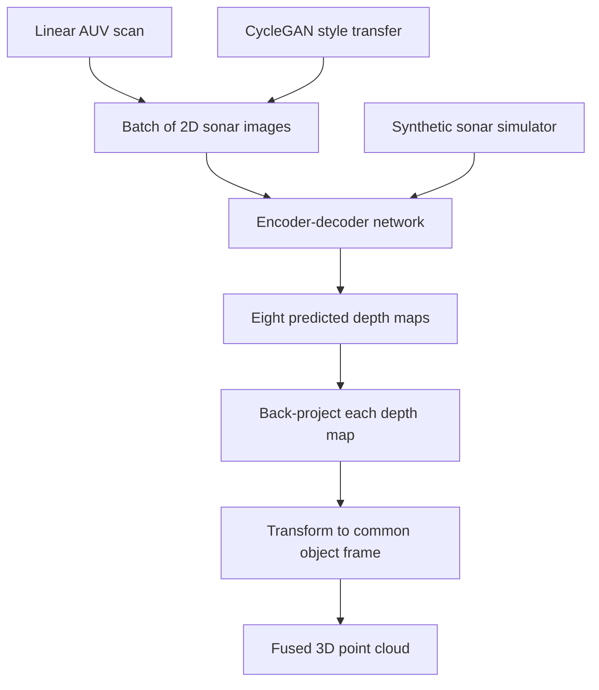

# MV3D Sonar (Jaber et al., 2025)

MV3D Sonar, introduced by Jaber, Wehbe, Christensen, and Kirchner in the IEEE Robotics and Automation Letters 2025 paper "MV3D: Multi-View 3D Reconstruction of Objects Using Forward-Looking Sonar," is a domain-specific autonomous-vehicle perception system for underwater robotics. It learns from a batch of 2D forward-looking sonar images and predicts multiple depth maps that can be fused into a dense 3D reconstruction.

This page is marked as a non-road autonomous-vehicle deep dive. It is relevant to the autonomous-driving section because it exposes a different sensing regime: cameras can fail in turbid water, and sonar images lose elevation information. The problem is analogous to [depth estimation](/cs/autonomous-driving/depth-estimation-and-stereo-vision) and [perception](/cs/autonomous-driving/perception-object-detection-and-segmentation), but the physics and ambiguity differ from road LiDAR/camera perception.

## Definitions

A **forward-looking sonar** emits acoustic beams and measures returns. A 2D sonar image generally records range and bearing, but not a unique elevation angle. This creates a 2D-to-3D ambiguity: one image pixel can correspond to multiple possible 3D points.

The **elevation ambiguity** is the missing vertical angle. If a sonar pixel gives range $r$ and bearing $\theta$, a family of 3D points may be possible:

$$
x=r\cos\phi\cos\theta,\quad
y=r\cos\phi\sin\theta,\quad
z=r\sin\phi,
$$

where $\phi$ is the unknown elevation angle.

MV3D predicts multiple depth maps from a small batch of sonar images collected during a linear scan. The network is an encoder-decoder. Its output is a set of depth images from different viewpoints; each can be transformed into a point cloud and fused.

The paper uses synthetic training data and CycleGAN-style transfer to reduce the simulation-to-real gap. This is necessary because real paired sonar-depth datasets are difficult to collect underwater. The source abstract reports real-environment tests with an underwater vehicle and an average Chamfer distance error of 0.06 m against laser-scanned ground truth.

The **Chamfer distance** between point sets $P$ and $Q$ is commonly written as

$$
d_{\mathrm{CD}}(P,Q)=
\frac{1}{|P|}\sum_{p\in P}\min_{q\in Q}\|p-q\|_2^2+
\frac{1}{|Q|}\sum_{q\in Q}\min_{p\in P}\|q-p\|_2^2.
$$

It measures bidirectional geometric mismatch.

## Key results

The source abstract states that MV3D can perform dense 3D reconstruction from forward-looking sonar, trained on synthetic data, and tested in simulation and a real underwater environment. It reports an average Chamfer distance error of 0.06 m in real tests against laser-scanned ground truth.

The key result is that multi-view depth prediction can reduce sonar ambiguity. A single sonar image often cannot determine elevation. A batch of images from a linear scan creates variations in shadow and appearance. MV3D learns features from the batch and predicts several depth maps, covering the object from different viewpoints.

The paper's data pipeline is also important:

1. Simulate sonar images and corresponding multi-view depth maps.
2. Train the encoder-decoder on synthetic data.
3. Use image-style transfer to reduce the synthetic-real appearance gap.
4. Run the trained model on real sonar scans.
5. Transform predicted depth maps into point clouds and fuse them.

The method is not road autonomous driving, and it should not be confused with the older road-scene MV3D detector from LiDAR-camera fusion literature. The filename here uses `mv3d-sonar` to avoid that ambiguity. The autonomous-driving connection is representation learning under sensor-specific ambiguity.

The multi-view output is important because sonar ambiguity is not only noise; it is a many-to-one projection. In a camera, perspective projection loses depth, but stereo, motion, texture, and learned priors can recover much of it. In forward-looking sonar, elevation is fundamentally compressed by the acoustic imaging geometry, and shadows carry important shape cues. Predicting several depth maps lets the model represent object surfaces from multiple virtual viewpoints rather than forcing one incomplete depth image to explain the whole object.

The synthetic-data strategy is also a lesson for non-road autonomy. Road-driving researchers often rely on large public datasets, but underwater robotics may not have comparable labeled data. Simulators such as Stonefish can produce paired sonar and depth supervision, yet the acoustic style of real sonar differs from synthetic output. Style transfer is a practical attempt to reduce that gap, but it does not guarantee physical fidelity. A model can learn realistic-looking speckle while still mispredicting geometry.

MV3D's evaluation with laser-scanned ground truth is therefore important. Reconstruction methods need geometric metrics, not only visual inspection of point clouds. Chamfer distance captures bidirectional closeness, but it can hide topological mistakes: a point cloud may have low average error while missing a thin structure or filling a hole. For safety-critical underwater inspection, downstream task metrics such as grasping, avoidance, or infrastructure measurement may also be needed.

The page is included in the autonomous-driving section as a domain-specific supplement. It broadens the reader's intuition: the AV stack pattern remains, but the sensor physics, datasets, and failure modes change dramatically outside roads.

The method also shows how "visual" deep learning changes when the sensor is acoustic. Edges, texture, and color are not available in the usual way; shadows and return intensity become central cues. A network trained on RGB assumptions would not transfer directly. The encoder must learn sonar-specific patterns, and the data generator must model sonar geometry well enough that synthetic training is meaningful.

For autonomy, the reconstructed object is only an intermediate product. An underwater vehicle may use it for inspection, manipulation, mapping, or collision avoidance. Each downstream task may care about different errors: a small Chamfer distance may be acceptable for obstacle avoidance but not for measuring infrastructure damage. This mirrors road autonomy, where a perception metric must be tied to planning and safety consequences.

## Visual



| Sensor regime | Road LiDAR | Forward-looking sonar |
|---|---|---|
| Medium | Air | Water |
| Main measurement | 3D range points | 2D acoustic image |
| Common failure | Sparsity, reflectance, weather | Elevation ambiguity, shadows, speckle |
| Reconstruction cue | Direct 3D geometry | Learned depth from acoustic appearance |
| Dataset issue | Large public driving datasets | Limited paired real sonar-depth data |

## Worked example 1: Back-projecting a sonar depth pixel

Problem: A sonar pixel has predicted range $r=4$ m, bearing $\theta=30^\circ$, and inferred elevation $\phi=10^\circ$. Compute the 3D point using

$$
x=r\cos\phi\cos\theta,\quad y=r\cos\phi\sin\theta,\quad z=r\sin\phi.
$$

1. Use approximate values:

$$
\cos 10^\circ=0.985,\quad \sin 10^\circ=0.174,
$$

$$
\cos 30^\circ=0.866,\quad \sin 30^\circ=0.5.
$$

2. Compute $x$:

$$
x=4(0.985)(0.866)=3.41\ \mathrm{m}.
$$

3. Compute $y$:

$$
y=4(0.985)(0.5)=1.97\ \mathrm{m}.
$$

4. Compute $z$:

$$
z=4(0.174)=0.696\ \mathrm{m}.
$$

Answer: the reconstructed point is approximately $(3.41,1.97,0.70)$ m.

Check: The horizontal range is $r\cos\phi\approx3.94$ m, and $\sqrt{3.41^2+1.97^2}\approx3.94$ m, so the projection is consistent.

## Worked example 2: Simple Chamfer distance

Problem: Predicted point set $P=\{0,2\}$ and ground-truth set $Q=\{1,3\}$ on a 1D line. Compute squared Chamfer distance using the bidirectional average formula.

1. For $p=0$, nearest point in $Q$ is 1, squared distance 1.

2. For $p=2$, nearest point in $Q$ is 1 or 3, squared distance 1.

3. Average from $P$ to $Q$:

$$
\frac{1+1}{2}=1.
$$

4. For $q=1$, nearest point in $P$ is 0 or 2, squared distance 1.

5. For $q=3$, nearest point in $P$ is 2, squared distance 1.

6. Average from $Q$ to $P$:

$$
\frac{1+1}{2}=1.
$$

7. Total:

$$
d_{\mathrm{CD}}=1+1=2.
$$

Answer: the squared Chamfer distance is 2.

Check: The sets have the same shape shifted by 1, so every nearest distance is 1.

## Code

```python
import torch

def backproject_sonar(range_m, bearing_rad, elevation_rad):
    x = range_m * torch.cos(elevation_rad) * torch.cos(bearing_rad)
    y = range_m * torch.cos(elevation_rad) * torch.sin(bearing_rad)
    z = range_m * torch.sin(elevation_rad)
    return torch.stack([x, y, z], dim=-1)

def chamfer_distance(p, q):
    dist = torch.cdist(p, q) ** 2
    return dist.min(dim=1).values.mean() + dist.min(dim=0).values.mean()

r = torch.tensor([4.0])
theta = torch.deg2rad(torch.tensor([30.0]))
phi = torch.deg2rad(torch.tensor([10.0]))
print(backproject_sonar(r, theta, phi))

p = torch.tensor([[0.0], [2.0]])
q = torch.tensor([[1.0], [3.0]])
print(chamfer_distance(p, q))
```

## Common pitfalls

- Confusing this sonar MV3D with the road-scene MV3D LiDAR-camera detector.
- Treating a 2D sonar image like a camera image. Sonar geometry and shadows are different.
- Ignoring elevation ambiguity. Range and bearing alone do not determine a unique 3D point.
- Trusting synthetic training without checking sim-to-real transfer.
- Reporting Chamfer distance without scale and ground-truth acquisition details.
- Assuming the method generalizes to arbitrary underwater objects without coverage in training data.

## Connections

- [Depth estimation and stereo vision](/cs/autonomous-driving/depth-estimation-and-stereo-vision)
- [Perception, object detection, and segmentation](/cs/autonomous-driving/perception-object-detection-and-segmentation)
- [Sensors, cameras, LiDAR, radar, and IMU](/cs/autonomous-driving/sensors-cameras-lidar-radar-imu)
- [Sensor fusion](/cs/autonomous-driving/sensor-fusion)
- [PointPillars](/cs/autonomous-driving/pointpillars)
- [Simulation and data](/cs/autonomous-driving/simulation-and-data)
- Further reading: MV3D sonar, forward-looking sonar reconstruction, acoustic SLAM, CycleGAN sim-to-real transfer, and underwater AUV perception.
