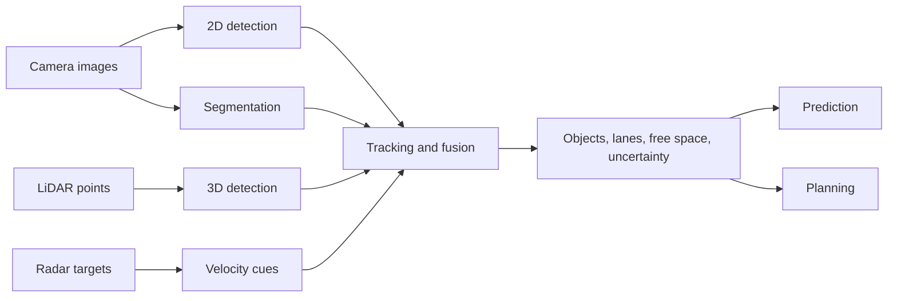

# Perception, Object Detection, and Segmentation

Perception turns raw sensor data into scene understanding: vehicles, pedestrians, cyclists, lanes, drivable space, traffic lights, signs, cones, barriers, and free space. It is the gateway between sensing and action, but it is not a single neural network. Production stacks usually combine 2D image models, 3D lidar or radar models, tracking, map priors, temporal smoothing, uncertainty estimates, and safety monitors.

This page introduces the core perception tasks and metrics that later pages on [sensor fusion](/cs/autonomous-driving/sensor-fusion), [prediction](/cs/autonomous-driving/prediction-and-motion-forecasting), [planning](/cs/autonomous-driving/motion-planning), and [adversarial attacks](/cs/autonomous-driving/adversarial-and-physical-attacks-on-av) build on. The main engineering theme is that perception outputs are not just labels; they are uncertain, delayed, partially observed state estimates used by downstream planners.

## Definitions

**Object detection** localizes and classifies objects. In 2D detection, the output is usually an image bounding box and class label. In 3D detection, the output is a metric box with position, size, heading, class, and confidence in a vehicle, lidar, camera, or global coordinate frame.

**Semantic segmentation** assigns a class to each pixel or point, such as road, sidewalk, vehicle, vegetation, building, lane marking, or sky. It does not distinguish between separate instances of the same class.

**Instance segmentation** identifies separate object instances and gives each its own mask. Two adjacent pedestrians receive different instance IDs.

**Panoptic segmentation** combines semantic and instance segmentation. It labels every pixel or point while distinguishing countable objects, often called "things," from background regions, often called "stuff."

**Lane detection** estimates lane markings, lane boundaries, lane centerlines, topology, and sometimes lane connectivity through intersections. Lane perception may be image-based, map-assisted, or inferred from trajectories and drivable geometry.

**Drivable-area detection** estimates where the ego vehicle can physically and legally drive. It can include road surface, lane boundaries, curbs, crosswalks, construction zones, and blocked regions.

**IoU**, or intersection over union, measures overlap between a predicted region and a ground-truth region:

$$
\mathrm{IoU}(A,B) = \frac{|A \cap B|}{|A \cup B|}.
$$

**Average precision** summarizes the precision-recall curve for a class. **mAP** averages AP across classes and often across IoU thresholds. AV benchmarks may add center-distance thresholds, heading error, velocity error, tracking metrics, or planning-aware scores.

## Key results

Modern AV perception draws from several detector families. One-stage detectors such as YOLO and RetinaNet directly predict boxes from dense feature maps. Two-stage detectors generate proposals and refine them. Transformer-based detectors such as DETR use set prediction and bipartite matching to avoid hand-designed anchor assignment. 3D lidar detectors such as PointPillars convert point clouds into pseudo-images, while CenterPoint detects object centers in bird's-eye view. Camera-only 3D detection often predicts depth, lifts image features into 3D or BEV, and reasons over multiple cameras and time.

The precision-recall tradeoff matters more than raw accuracy. Precision is:

$$
\mathrm{precision} = \frac{\mathrm{TP}}{\mathrm{TP}+\mathrm{FP}},
$$

and recall is:

$$
\mathrm{recall} = \frac{\mathrm{TP}}{\mathrm{TP}+\mathrm{FN}}.
$$

For planning, false negatives can hide real hazards, while false positives can cause unnecessary braking or stuck behavior. The best operating point depends on object type, range, speed, and maneuver. Missing a pedestrian in the lane is much worse than temporarily over-segmenting a bush near the sidewalk, but persistent false obstacles can still create unsafe traffic interactions.

3D boxes need coordinate discipline. A predicted box may be represented by center $(x,y,z)$, dimensions $(l,w,h)$, yaw $\theta$, velocity $(v_x,v_y)$, class $c$, and confidence $p$. The downstream planner needs to know the frame, timestamp, and covariance or confidence calibration. A 3D box with the right label but the wrong timestamp can be operationally wrong.

Temporal perception reduces flicker. A single frame may miss an occluded cyclist or misread a traffic light under glare. Tracking, recurrent networks, temporal transformers, and multi-frame BEV encoders allow the system to maintain hypotheses over time. Temporal smoothing, however, can also preserve stale objects after the scene changes, so deletion logic and uncertainty growth are important.

Lane and drivable-area perception are not solved by local image edges alone. Intersections, faded markings, snow, construction, reversible lanes, temporary traffic control, and emergency worker gestures often require map context, semantics, traffic rules, and behavioral reasoning.

Open-set perception is a practical requirement. The road contains objects outside a fixed label taxonomy: fallen cargo, unusual trailers, temporary barriers, animals, hand signals, flooded lanes, and damaged infrastructure. A detector may not know the exact class, but the stack still needs to represent occupancy, motion, size, and risk. Unknown-object handling is one reason occupancy and free-space estimation remain important alongside named-object detection.

Perception outputs also need lifecycle management. A detection becomes a track, a track accumulates history, and stale tracks must be deleted when evidence disappears. Deleting too aggressively causes flicker; deleting too slowly leaves phantom obstacles. This tradeoff is central to usable AV perception.

## Visual



## Worked example 1: Computing IoU for two boxes

Problem: A ground-truth 2D box spans $x = 10$ to $50$ and $y = 20$ to $60$. A detector predicts $x = 30$ to $70$ and $y = 40$ to $80$. Compute IoU.

1. Compute ground-truth area:

$$
A_{\mathrm{gt}} = (50-10)(60-20)=40 \times 40=1600.
$$

2. Compute predicted area:

$$
A_{\mathrm{pred}} = (70-30)(80-40)=40 \times 40=1600.
$$

3. Compute intersection limits:

$$
\begin{aligned}
x_{\min} &= \max(10,30)=30, \\
x_{\max} &= \min(50,70)=50, \\
y_{\min} &= \max(20,40)=40, \\
y_{\max} &= \min(60,80)=60.
\end{aligned}
$$

4. Intersection width and height are $20$ and $20$, so:

$$
A_{\cap}=20 \times 20=400.
$$

5. Union area is:

$$
A_{\cup}=1600+1600-400=2800.
$$

6. IoU is:

$$
\mathrm{IoU}=\frac{400}{2800}=0.1429.
$$

Answer: IoU is about 0.143. At a 0.5 IoU threshold this prediction is not a true positive, even though the boxes overlap visually.

## Worked example 2: Precision and recall for pedestrian detection

Problem: In a validation slice, there are 20 labeled pedestrians. A detector reports 25 pedestrian boxes. Of those, 15 match true pedestrians at the required IoU threshold. Compute precision and recall.

1. True positives are matched detections:

$$
\mathrm{TP}=15.
$$

2. False positives are reported boxes that do not match:

$$
\mathrm{FP}=25-15=10.
$$

3. False negatives are labeled pedestrians missed by the detector:

$$
\mathrm{FN}=20-15=5.
$$

4. Compute precision:

$$
\mathrm{precision}=\frac{15}{15+10}=0.60.
$$

5. Compute recall:

$$
\mathrm{recall}=\frac{15}{15+5}=0.75.
$$

Answer: precision is 60 percent and recall is 75 percent.

Check: The detector found three quarters of real pedestrians but produced many extra detections. A downstream planner might tolerate extra detections at low speed but not repeated phantom braking at highway speed.

## Code

```python
import numpy as np

def box_iou_xyxy(a, b):
    xa1, ya1, xa2, ya2 = a
    xb1, yb1, xb2, yb2 = b
    ix1, iy1 = max(xa1, xb1), max(ya1, yb1)
    ix2, iy2 = min(xa2, xb2), min(ya2, yb2)
    iw, ih = max(0.0, ix2 - ix1), max(0.0, iy2 - iy1)
    inter = iw * ih
    area_a = max(0.0, xa2 - xa1) * max(0.0, ya2 - ya1)
    area_b = max(0.0, xb2 - xb1) * max(0.0, yb2 - yb1)
    union = area_a + area_b - inter
    return 0.0 if union == 0.0 else inter / union

def greedy_match(pred_boxes, gt_boxes, threshold=0.5):
    used_gt = set()
    matches = []
    for i, pred in enumerate(pred_boxes):
        scores = [(box_iou_xyxy(pred, gt), j) for j, gt in enumerate(gt_boxes) if j not in used_gt]
        if not scores:
            continue
        score, j = max(scores)
        if score >= threshold:
            used_gt.add(j)
            matches.append((i, j, score))
    return matches

pred = np.array([[30, 40, 70, 80], [100, 100, 130, 160]])
gt = np.array([[10, 20, 50, 60], [98, 96, 132, 161]])
print(greedy_match(pred, gt, threshold=0.5))
```

## Common pitfalls

- Reporting mAP without showing operating points. A planner needs thresholded behavior, not only benchmark summaries.
- Ignoring calibration of confidence scores. A detector that says 0.9 confidence should be right roughly 90 percent of the time in comparable conditions if downstream modules treat confidence probabilistically.
- Evaluating only clear-weather daytime data. Night, rain, glare, construction, unusual vehicles, and occlusion dominate safety risk.
- Treating segmentation as truth. Pixel masks can be crisp but semantically wrong, especially on reflective surfaces, shadows, snow, and road debris.
- Forgetting temporal latency. A high-quality detection that arrives too late can be worse than a noisier but timely estimate.
- Overfitting to benchmark taxonomies. Real roads contain objects outside the training label set, such as fallen cargo, temporary signs, animals, and hand gestures.

## Connections

- [Sensors, cameras, lidar, radar, and IMU](/cs/autonomous-driving/sensors-cameras-lidar-radar-imu)
- [Depth estimation and stereo vision](/cs/autonomous-driving/depth-estimation-and-stereo-vision)
- [Sensor fusion](/cs/autonomous-driving/sensor-fusion)
- [Prediction and motion forecasting](/cs/autonomous-driving/prediction-and-motion-forecasting)
- [Deep learning](/cs/deep-learning/)
- [Adversarial attacks on AV perception](/cs/autonomous-driving/adversarial-and-physical-attacks-on-av)
- Further reading: YOLO, RetinaNet, DETR, PointPillars, CenterPoint, Mask R-CNN, Panoptic FPN, and nuScenes or Waymo Open Dataset benchmark papers.
