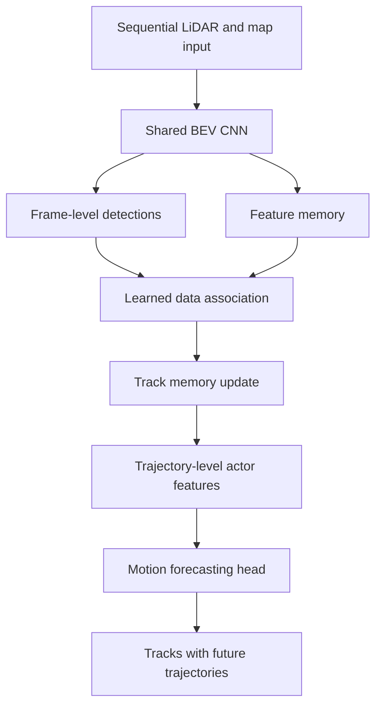

# PnPNet (Liang et al., 2020)

PnPNet, introduced by Liang, Yang, Zeng, Chen, Hu, Casas, and Urtasun in the CVPR 2020 paper "PnPNet: End-to-End Perception and Prediction with Tracking in the Loop," is a joint perception-and-prediction model for self-driving vehicles. Its key move is to put online tracking inside the trainable model rather than treating tracking as a post-processing step after detection.

The paper addresses an interface problem in the autonomous-driving stack. Detection estimates the current world, tracking links objects through time, and prediction forecasts future motion. If these modules are trained separately, the prediction module may receive only compact track states and cannot correct upstream mistakes. PnPNet keeps richer temporal features alive so [perception](/cs/autonomous-driving/perception-object-detection-and-segmentation), [tracking](/cs/autonomous-driving/prediction-and-motion-forecasting), and forecasting can support each other.

## Definitions

**Perception** estimates current objects from sensor data. In PnPNet, the detector uses BEV features from sequential LiDAR sweeps and map inputs to produce object detections.

**Tracking** solves two coupled problems:

1. **Data association:** decide which detection belongs to which existing object track.
2. **Trajectory estimation:** update the continuous state and history of that object.

**Motion forecasting** predicts future trajectories for tracked objects. A forecast for actor $i$ can be written as

$$
\hat{Y}_i=[(\hat{x}_{i,1},\hat{y}_{i,1}),\dots,(\hat{x}_{i,T},\hat{y}_{i,T})].
$$

The phrase **tracking in the loop** means the tracker is not a separate non-learned post-processor. It is part of the model's sequential computation and supplies trajectory-level representations to prediction.

PnPNet maintains two memories:

- A memory of global sensor feature maps across time.
- A memory of past object trajectories and associated features.

For a track $q$ and detection $d$, an affinity score can be represented as

$$
s(q,d)=\psi([h_q,h_d,\Delta x,\Delta y,\Delta t]),
$$

where $h_q$ is track history, $h_d$ is detection feature, and $\psi$ is learned. Association can then use these scores to connect detections to tracks.

## Key results

The source abstract states that PnPNet was validated on two large-scale driving datasets and showed significant improvements over prior state of the art, including better occlusion recovery and more accurate future prediction. The paper's main result is a modeling claim: long-term trajectory-level features help both tracking and prediction, especially when objects are temporarily occluded.

The three paradigms compared in the paper are:

1. Modular perception, tracking, and prediction.
2. End-to-end detection plus prediction, with tracking outside the loop.
3. End-to-end perception and prediction with tracking inside the loop.

PnPNet argues that the third option is better because motion forecasting is a sequential problem. If an object is hidden for one frame, a detector may miss it, but a tracker with memory can maintain the hypothesis. If prediction uses the track representation, it can know whether the actor was accelerating, slowing, or occluded, rather than relying only on the latest detection.

The model still preserves useful modular structure. It has a detector, tracker, and predictor, but they share features and can be optimized jointly. This makes PnPNet different from a purely black-box policy such as [ChauffeurNet](/cs/autonomous-driving/chauffeurnet): PnPNet does not output ego control. It improves the scene representation that a planner will consume.

The main tradeoff is implementation complexity. Once tracking enters the trainable loop, training must handle variable numbers of detections, births, deaths, occlusions, and false positives. That is harder than training a detector on independent frames, but it aligns better with the temporal nature of driving.

PnPNet is also a useful reminder that "end-to-end" can mean end-to-end over a subsystem, not necessarily sensor-to-steering. The system is end-to-end trainable for perception and prediction, but it still produces tracks and future trajectories as interpretable artifacts. This makes it closer to a production autonomy interface than a black-box driver: planners can inspect object identities, histories, and futures, and safety monitors can reason over them.

The tracking-in-the-loop design helps with a specific failure class: temporal inconsistency. A detector might flicker on and off for a partially occluded pedestrian, a distant cyclist, or a vehicle behind a truck. If prediction is attached only to frame detections, every flicker becomes a new prediction problem. A track memory can maintain continuity, smooth velocity, and provide a richer feature state. That richer state can also improve association, creating a feedback loop between tracking quality and forecasting quality.

In modern stacks, the idea appears in many forms: query-based trackers, recurrent BEV memories, temporal fusion modules, and joint detection-prediction heads. PnPNet is one of the clean early statements that tracking should not be an afterthought if the goal is reliable prediction.

The model also changes what labels and metrics matter. Frame-level detection labels are not enough; the training and evaluation pipeline must preserve identities through time, measure track fragmentation, and connect forecast error to the correct actor. A prediction attached to the wrong track can look geometrically plausible but be semantically useless for planning. This is why PnPNet's sequence-level framing is more demanding than ordinary 3D detection, but also more aligned with how an ego planner consumes the world.

That alignment is the reason the page is placed in the forecasting cluster rather than only the perception cluster.

## Visual



| Stack design | Tracking role | Prediction input | Main weakness |
|---|---|---|---|
| Modular | Separate tracker | Compact track states | Error propagation and thin interfaces |
| Joint detection-prediction | Post-processing | Short sensor history | Weak occlusion handling |
| PnPNet | Trainable loop | Track-level learned features | More complex sequential training |

## Worked example 1: Data association by affinity

Problem: An existing track has predicted center $(10.0,2.0)$ m. Three detections arrive at $(10.4,2.1)$, $(13.0,4.0)$, and $(9.5,-1.0)$ m. Use negative Euclidean distance as a simple affinity. Which detection should be associated?

1. Distance to detection 1:

$$
d_1=\sqrt{(10.4-10.0)^2+(2.1-2.0)^2}
=\sqrt{0.16+0.01}
=0.412.
$$

2. Distance to detection 2:

$$
d_2=\sqrt{(13.0-10.0)^2+(4.0-2.0)^2}
=\sqrt{9+4}
=3.606.
$$

3. Distance to detection 3:

$$
d_3=\sqrt{(9.5-10.0)^2+(-1.0-2.0)^2}
=\sqrt{0.25+9}
=3.041.
$$

4. Negative distance is largest for the smallest distance.

Answer: associate the track with detection 1.

Check: A learned PnPNet affinity would also use appearance, BEV features, motion history, and occlusion cues, but the nearest-neighbor calculation illustrates the association subproblem.

## Worked example 2: Why occlusion memory helps prediction

Problem: A vehicle is observed at $x=0$ m, $x=2$ m, and $x=4$ m at times $0$, $1$, and $2$ seconds. It is occluded at time $3$ seconds. Estimate its position at $t=3$ using constant velocity, then forecast $t=5$.

1. The displacement from $t=0$ to $t=1$ is

$$
2-0=2\ \mathrm{m}.
$$

2. The displacement from $t=1$ to $t=2$ is

$$
4-2=2\ \mathrm{m}.
$$

3. The estimated velocity is $2$ m/s.

4. At $t=3$, even with no detection, the track estimate is

$$
x_3=4+2(1)=6\ \mathrm{m}.
$$

5. At $t=5$, two seconds after $t=3$:

$$
x_5=6+2(2)=10\ \mathrm{m}.
$$

Answer: the memory-based track estimates $x_3=6$ m and forecasts $x_5=10$ m.

Check: A frame-only detector at $t=3$ would have no object state. Tracking memory prevents one missed frame from erasing the actor.

## Code

```python
import torch
import torch.nn as nn

class TrackAffinity(nn.Module):
    def __init__(self, feat_dim=32):
        super().__init__()
        self.score = nn.Sequential(
            nn.Linear(feat_dim * 2 + 3, 64),
            nn.ReLU(),
            nn.Linear(64, 1),
        )

    def forward(self, track_feat, det_feat, delta_xy_dt):
        # track_feat: [T, C], det_feat: [D, C], delta_xy_dt: [T, D, 3]
        t, c = track_feat.shape
        d = det_feat.shape[0]
        tf = track_feat[:, None, :].expand(t, d, c)
        df = det_feat[None, :, :].expand(t, d, c)
        x = torch.cat([tf, df, delta_xy_dt], dim=-1)
        return self.score(x).squeeze(-1)

tracks = torch.randn(4, 32)
detections = torch.randn(6, 32)
delta = torch.randn(4, 6, 3)
scores = TrackAffinity()(tracks, detections, delta)
assignment = scores.argmax(dim=1)
print(assignment)
```

## Common pitfalls

- Treating tracking as only an evaluation detail. In driving, tracking quality affects prediction and planning.
- Training detection on isolated frames and expecting robust forecasting through occlusion.
- Passing only boxes and velocities downstream when richer sensor features are available.
- Ignoring track birth and death. Real scenes include new actors, disappearing actors, and false detections.
- Assuming end-to-end means unstructured. PnPNet is end-to-end trainable but still has interpretable detection, tracking, and prediction stages.
- Comparing systems only by detection mAP. PnPNet's value is strongest in sequence metrics and forecasting quality.

## Connections

- [Prediction and motion forecasting](/cs/autonomous-driving/prediction-and-motion-forecasting)
- [Perception, object detection, and segmentation](/cs/autonomous-driving/perception-object-detection-and-segmentation)
- [CenterPoint](/cs/autonomous-driving/centerpoint)
- [VectorNet](/cs/autonomous-driving/vectornet)
- [Sensor fusion](/cs/autonomous-driving/sensor-fusion)
- [Motion planning](/cs/autonomous-driving/motion-planning)
- Further reading: FAF, IntentNet, SpAGNN, NeuralMP, CenterTrack, AB3DMOT, and joint perception-prediction models.
