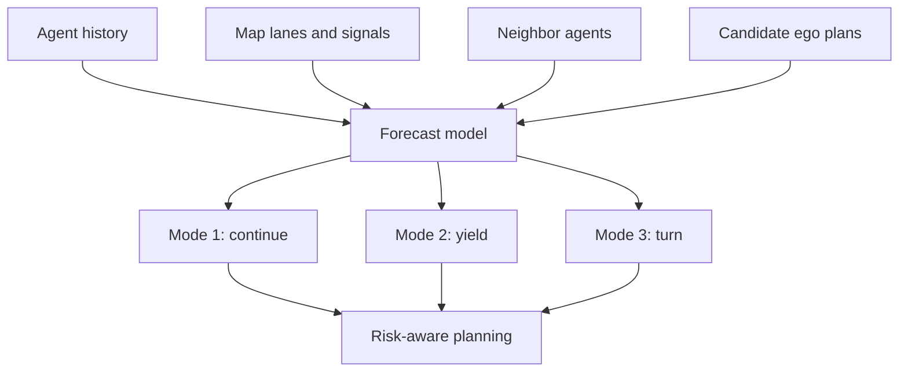

# Prediction and Motion Forecasting

Prediction estimates how other agents may move over the next few seconds. It is harder than extrapolation because road users respond to maps, signals, social context, hidden intentions, and the ego vehicle's planned motion. A pedestrian near a crosswalk, a cyclist approaching a parked car, and a vehicle edging into an unprotected left turn all require multiple plausible futures rather than one deterministic path.

This page introduces constant-velocity baselines, map-aware trajectory forecasting, social interaction models, multimodal prediction, scene-level prediction, and common datasets. Prediction consumes [perception](/cs/autonomous-driving/perception-object-detection-and-segmentation), [sensor fusion](/cs/autonomous-driving/sensor-fusion), and [localization/map](/cs/autonomous-driving/localization-and-hd-maps) outputs, then informs [behavior planning](/cs/autonomous-driving/decision-making-and-behavior-planning) and [motion planning](/cs/autonomous-driving/motion-planning).

## Definitions

An **agent** is a road user whose state and future behavior may affect the ego vehicle: car, truck, bus, motorcycle, pedestrian, cyclist, scooter, emergency vehicle, or construction worker.

A **trajectory** is a sequence of future states. A simple planar trajectory may be:

$$
\tau = \left((x_1,y_1), (x_2,y_2), \ldots, (x_T,y_T)\right).
$$

**Motion forecasting** predicts one or more possible future trajectories for each agent, usually over a horizon of 3 to 8 seconds in driving benchmarks.

**Multimodal prediction** represents multiple plausible futures. A car at an intersection may go straight, turn left, turn right, or stop. A single averaged trajectory can be physically and behaviorally wrong.

**Scene-level prediction** models joint futures of multiple agents. This matters because agents interact: one vehicle yields, another proceeds; a pedestrian's crossing decision may depend on ego speed; a merge gap changes as traffic reacts.

**Social-LSTM** is an early deep model that used recurrent networks and social pooling for pedestrian trajectories. **Trajectron++** is a representative graph-structured multimodal forecasting model. Modern AV systems often use graph neural networks, transformers, rasterized BEV encoders, vectorized map encoders, or joint prediction-planning networks.

**Argoverse** and **Waymo Open Motion Dataset** are influential motion forecasting datasets. They provide standardized scenarios, agent histories, map context, and future labels for benchmark evaluation.

## Key results

A constant-velocity baseline predicts:

$$
\hat{p}_{t+k} = p_t + k\Delta t\ v_t.
$$

It is simple, transparent, and surprisingly useful over short horizons, especially for vehicles moving steadily in-lane. It fails at stops, turns, merges, yielding, crosswalk behavior, and map-constrained maneuvers.

A constant-acceleration baseline extends the state:

$$
\hat{p}_{t+k} = p_t + k\Delta t\ v_t + \frac{1}{2}(k\Delta t)^2 a_t.
$$

This can model braking or acceleration but is still weak for intent. A vehicle slowing before an intersection could be stopping, yielding, preparing a turn, or reacting to a pedestrian.

Multimodal predictors often output $K$ trajectories with probabilities:

$$
\left\{(\tau^{(1)}, \pi_1), \ldots, (\tau^{(K)}, \pi_K)\right\},
\quad
\sum_{k=1}^{K}\pi_k = 1.
$$

Evaluation should avoid rewarding averaged futures. Common metrics include average displacement error:

$$
\mathrm{ADE} = \frac{1}{T}\sum_{t=1}^{T}\left\|\hat{p}_t-p_t\right\|_2,
$$

and final displacement error:

$$
\mathrm{FDE} = \left\|\hat{p}_T-p_T\right\|_2.
$$

For multimodal outputs, benchmarks often report minADE or minFDE across the best of $K$ modes, sometimes combined with probability calibration. A model that produces many guesses can look good under min error but still be poorly calibrated.

Prediction is coupled to planning. The ego vehicle's future action changes other agents' futures. If the ego slows, another car may merge; if the ego accelerates, it may not. A purely open-loop predictor can be inconsistent with the planner's chosen trajectory. Interactive prediction and game-theoretic planning address this coupling, but they are harder to validate.

Probability calibration matters. If a predictor assigns 90 percent probability to a crossing pedestrian mode, then over many similar cases that mode should occur about 90 percent of the time. Poorly calibrated probabilities can make planning either timid or reckless. A model with good minFDE but bad calibration may produce one accurate trajectory among many candidates while assigning it the wrong probability.

Prediction horizons should match decisions. A 0.5-second forecast helps emergency braking and cut-in response. A 3-second forecast helps lane changes and intersection yielding. A 7-second forecast may help high-level negotiation but has wide uncertainty. Long-horizon outputs should usually be treated as distributions or intentions, not precise paths. The farther the horizon, the more map topology, traffic rules, and social interaction dominate raw kinematics.

The prediction module should expose uncertainty in a form the planner can use. Covariances, mode probabilities, occupancy over time, reachable sets, and agent intent labels are all possible interfaces. A single polyline without confidence is easy to visualize but often insufficient for safe planning.

Prediction must also represent agents that are only partially observed. A vehicle hidden behind a truck, a pedestrian emerging from between parked cars, or a cyclist occluded by a bus cannot be tracked in the usual way. Some stacks model occlusion zones and generate hypothetical agents from map context and visibility. These hypotheses may have low probability, but they can dominate safety decisions when the ego vehicle is fast or close to the occluded region.

Dataset metrics should be sliced by scenario. A model can have excellent average minADE while performing poorly for unprotected turns, dense crosswalks, emergency vehicles, or unusual road geometry. Useful evaluation reports break down performance by agent class, speed, range, occlusion, map element, weather, and interaction type.

Forecast freshness is another interface requirement: a good old prediction may be less useful than a rough current one when traffic changes quickly.

## Visual



## Worked example 1: Constant-velocity forecast

Problem: A tracked car is at position $(x,y)=(12,4)$ m in the ego frame and has velocity $(v_x,v_y)=(8,0)$ m/s. Predict its position after 0.5 s, 1.0 s, and 2.0 s using constant velocity.

1. Use:

$$
\hat{p}(t)=p_0+tv.
$$

2. At $t=0.5$ s:

$$
\hat{p}(0.5)=(12,4)+0.5(8,0)=(16,4).
$$

3. At $t=1.0$ s:

$$
\hat{p}(1.0)=(12,4)+1.0(8,0)=(20,4).
$$

4. At $t=2.0$ s:

$$
\hat{p}(2.0)=(12,4)+2.0(8,0)=(28,4).
$$

Answer: predicted positions are $(16,4)$ m, $(20,4)$ m, and $(28,4)$ m.

Check: The car advances 8 m each second along $x$ and stays in the same lateral position. If it is approaching a curve or red light, this baseline may become wrong quickly.

## Worked example 2: Evaluating two predicted trajectories

Problem: Ground-truth future positions at three seconds are $(5,0)$, $(10,0)$, and $(15,0)$. Predictor A gives $(4,0)$, $(9,0)$, $(14,0)$. Predictor B gives $(5,1)$, $(10,2)$, $(15,3)$. Compute ADE and FDE for both.

1. Predictor A errors at each step:

$$
\begin{aligned}
e_1 &= \|(4,0)-(5,0)\|=1, \\
e_2 &= \|(9,0)-(10,0)\|=1, \\
e_3 &= \|(14,0)-(15,0)\|=1.
\end{aligned}
$$

2. Predictor A metrics:

$$
\mathrm{ADE}_A = \frac{1+1+1}{3}=1,\quad \mathrm{FDE}_A=1.
$$

3. Predictor B errors:

$$
\begin{aligned}
e_1 &= \|(5,1)-(5,0)\|=1, \\
e_2 &= \|(10,2)-(10,0)\|=2, \\
e_3 &= \|(15,3)-(15,0)\|=3.
\end{aligned}
$$

4. Predictor B metrics:

$$
\mathrm{ADE}_B=\frac{1+2+3}{3}=2,\quad \mathrm{FDE}_B=3.
$$

Answer: Predictor A has ADE 1 m and FDE 1 m; Predictor B has ADE 2 m and FDE 3 m.

Check: B becomes increasingly laterally wrong, so its final error is worse. For planning, that may matter if B incorrectly predicts lane occupancy.

## Code

```python
import numpy as np

def constant_velocity_forecast(position, velocity, dt, steps):
    times = dt * np.arange(1, steps + 1)
    return position[None, :] + times[:, None] * velocity[None, :]

def ade_fde(pred, truth):
    errors = np.linalg.norm(pred - truth, axis=1)
    return errors.mean(), errors[-1]

pos = np.array([12.0, 4.0])
vel = np.array([8.0, 0.0])
forecast = constant_velocity_forecast(pos, vel, dt=0.5, steps=4)
print(forecast)

truth = np.array([[16.0, 4.0], [20.0, 4.0], [24.0, 4.0], [28.0, 4.0]])
print("ADE, FDE:", ade_fde(forecast, truth))
```

## Common pitfalls

- Averaging incompatible futures. The mean of "turn left" and "go straight" may leave the road.
- Evaluating forecasts without map context. A low ADE path can still violate lane direction, curbs, or traffic rules.
- Assuming independent agents. Merges, unprotected turns, and crosswalks involve coupled decisions.
- Overtrusting long-horizon predictions. Uncertainty grows quickly beyond a few seconds, especially in dense urban scenes.
- Ignoring ego influence. Other agents react to the ego vehicle's speed, position, turn signals, and assertiveness.
- Optimizing benchmark minADE while neglecting probability calibration. Planning needs the likelihood of modes, not only a best-case candidate.

## Connections

- [Perception, object detection, and segmentation](/cs/autonomous-driving/perception-object-detection-and-segmentation)
- [Sensor fusion](/cs/autonomous-driving/sensor-fusion)
- [Motion planning](/cs/autonomous-driving/motion-planning)
- [Decision making and behavior planning](/cs/autonomous-driving/decision-making-and-behavior-planning)
- [Deep learning](/cs/deep-learning/)
- [Reinforcement learning](/cs/reinforcement-learning/)
- Further reading: Social-LSTM, Trajectron++, VectorNet, TNT, LaneGCN, Argoverse forecasting, and Waymo Open Motion Dataset papers.
