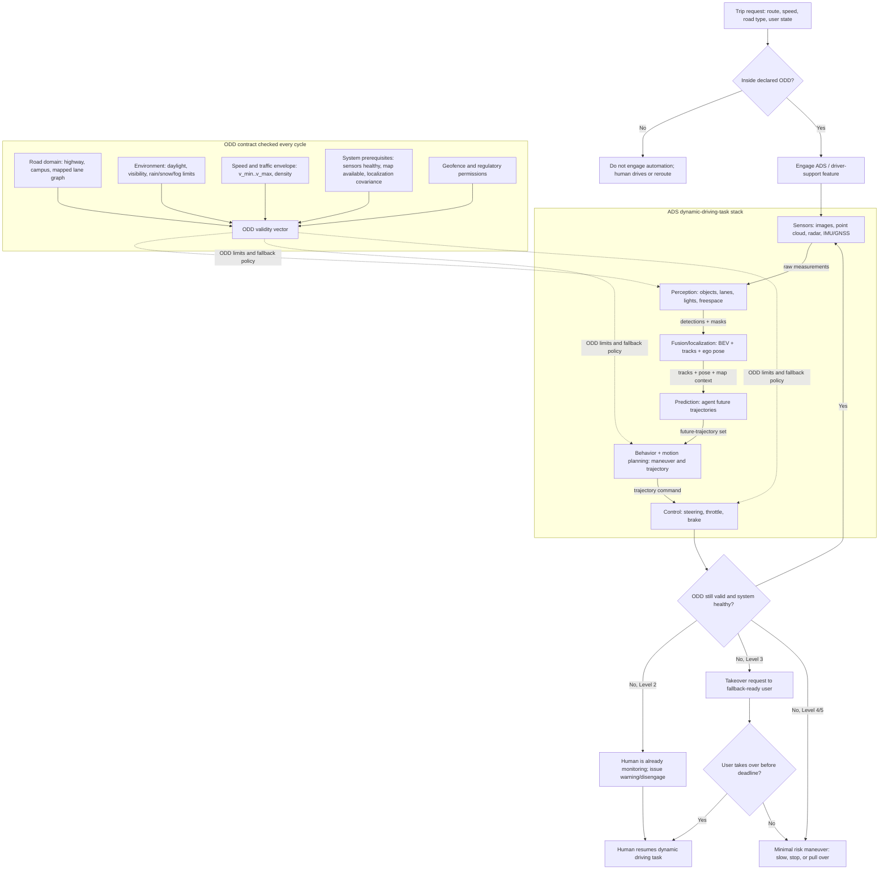

# SAE Levels and Operational Design Domain

The SAE J3016 levels are the common vocabulary for describing how much of the driving task is automated, but the levels are often misread as a ladder of product quality. They are really a responsibility map: who performs the dynamic driving task, who monitors the driving environment, and who must respond when the automation reaches its limits. Operational design domain, usually shortened to ODD, is the other half of the vocabulary because a system is never simply "self-driving" in the abstract; it is automated under stated roads, speeds, weather, geography, lighting, traffic rules, and vehicle states.

This page gives the foundational taxonomy used throughout the autonomous-driving section. Later pages on [sensors](/cs/autonomous-driving/sensors-cameras-lidar-radar-imu), [prediction](/cs/autonomous-driving/prediction-and-motion-forecasting), [planning](/cs/autonomous-driving/motion-planning), [control](/cs/autonomous-driving/control-pid-mpc-pure-pursuit-stanley), and [safety](/cs/autonomous-driving/safety-iso26262-sotif-scenario-testing) assume this distinction between capability, domain, fallback responsibility, and legal permission.

## Definitions

The **dynamic driving task** is the real-time operational and tactical work of driving: lateral control, longitudinal control, object and event detection, response planning, maneuver execution, and compliance with road rules. It excludes trip planning choices such as choosing to go to the airport, but it includes the driving actions needed to execute the trip.

An **automated driving system** is the hardware and software that performs part or all of the dynamic driving task on a sustained basis. In strict SAE language, the ADS is associated with Levels 3 through 5, while lower levels are driver support rather than automated driving. In informal writing, "AV stack" often refers to all automation levels, but the responsibility distinction still matters.

The **ego vehicle** is the vehicle whose automation stack is being discussed. Other road users are **agents**, such as vehicles, pedestrians, cyclists, construction workers, and emergency vehicles. In simulation, scripted or externally controlled agents are often called **NPCs**, borrowed from game terminology.

An **operational design domain** is the set of operating conditions under which an automated feature is designed to function. An ODD can include road type, map coverage, weather, visibility, time of day, traffic density, speed range, geographic region, construction status, lane markings, sensor health, and vehicle load. A highway lane-centering feature at 0 to 130 km/h in clear weather has a different ODD from an urban robotaxi service limited to mapped streets in a city.

The **fallback** is the response when the system cannot continue the dynamic driving task within its ODD. At lower levels the human driver performs fallback immediately. At Level 3 the system may request that the fallback-ready user take over. At Levels 4 and 5 the automated system itself must achieve a minimal risk condition if it cannot complete the trip.

A **minimal risk condition** is a stable state intended to reduce danger after a failure or ODD exit, such as pulling over, stopping in-lane with hazard signaling when no shoulder is available, or following a degraded route to a safe harbor. It is not automatically "safe" in all contexts; it is the system's designed fallback behavior.

A **regulatory authorization** is separate from SAE level. A jurisdiction may approve a particular deployment, require a safety driver, restrict operation to certain roads, impose reporting duties, or suspend a permit. SAE terminology helps describe capability, but it does not by itself grant legal permission to operate.

## Key results

The most useful way to read SAE levels is as a table of responsibility rather than a marketing scale.

| SAE level | Informal name | Lateral and longitudinal control | Environment monitoring | Fallback responsibility | Typical ODD scope |
|---:|---|---|---|---|---|
| 0 | No driving automation | Human | Human | Human | All human driving |
| 1 | Driver assistance | Human plus one assisted axis | Human | Human | Narrow feature, such as adaptive cruise |
| 2 | Partial automation | System can assist both axes | Human | Human | Lane keeping plus cruise under conditions |
| 3 | Conditional automation | ADS | ADS inside ODD | Fallback-ready user after request | Limited highway or traffic jam ODD |
| 4 | High automation | ADS | ADS inside ODD | ADS | Geofenced or otherwise bounded service |
| 5 | Full automation | ADS | ADS | ADS | All publicly drivable conditions a human could handle |

Two consequences follow. First, a Level 2 system can feel impressive because it steers and controls speed, but the human remains responsible for supervision. Second, a Level 4 system can be narrower than a Level 2 product in where it operates, yet higher in automation responsibility because it does not rely on immediate human rescue inside its ODD.

ODD design is a set operation. If a feature supports clear weather, mapped divided highways, speed below 120 km/h, lane markings visible, and driver monitoring active, then the operational domain can be represented as an intersection:

$$
\mathrm{ODD}
= R_{\mathrm{highway}}
\cap W_{\mathrm{clear}}
\cap V_{\mathrm{lane\ visible}}
\cap S_{\leq 120}
\cap H_{\mathrm{driver\ available}}.
$$

The automation is responsible only when all required predicates are true. A rigorous system therefore needs ODD monitors, not just perception and control. It must detect whether it is still within the conditions assumed by its safety case.

Regulatory mapping should be handled carefully. Some jurisdictions write rules around "automated driving systems," some around testing permits, some around remote assistance, and some around driver-assistance misuse. A statement such as "this is Level 4" is not enough for legal deployment; it must be paired with the location, permit, vehicle class, reporting obligations, insurance framework, and whether the system carries passengers or goods.

The levels also do not specify architecture. A Level 4 system might use camera-only perception, lidar-rich sensor fusion, map-heavy localization, map-light learning, hand-coded behavior rules, or a large learned planner. The level says who is responsible for the driving task, not which algorithmic stack is used.

## Visual



This diagram separates SAE responsibility from architecture: the same perception, fusion, prediction, planning, and control stack can sit behind different fallback rules. The ODD validity vector feeds the running stack through dotted constraint paths, and the exit branch shows how Level 2, Level 3, and Level 4/5 differ when the domain is no longer valid.

## Worked example 1: Classifying a highway assistant

Problem: A production vehicle can keep its lane and maintain headway on a highway. It requires the driver to keep eyes on the road, issues escalating warnings if the driver looks away, and disengages if lane markings disappear. What SAE level is this feature?

1. Identify who controls lateral motion. The system provides steering assistance, so lateral control is automated while active.
2. Identify who controls longitudinal motion. Adaptive cruise controls acceleration and braking, so longitudinal control is also automated while active.
3. Identify who monitors the environment. The human driver must watch the road and respond to hazards, cut-ins, unclear markings, and warnings.
4. Identify fallback responsibility. If the feature reaches a limit, the human must immediately take over.
5. Compare to the SAE table. Both control axes are assisted, but monitoring and fallback remain human responsibilities.

Answer: this is Level 2 partial automation, not Level 3. The system may perform a large fraction of continuous control, but the human still supervises and remains responsible for fallback.

Check: If the vehicle instead watched the environment, drove in a traffic-jam ODD, and gave the user a takeover request only when leaving that ODD, the classification could move to Level 3. The difference is not the smoothness of steering; it is monitoring and fallback responsibility.

## Worked example 2: Writing a precise ODD statement

Problem: A campus shuttle drives at low speed between fixed stops. It uses lidar, cameras, GNSS, and a prebuilt map. It is intended for private campus roads, daylight operation, no heavy rain or snow, and speeds up to 25 km/h. Write an ODD statement and identify two ODD exit triggers.

1. Start with geography. The route is private campus roads between fixed stops, so the geographic ODD is route-bound rather than citywide.
2. Add road users and road type. The shuttle may encounter pedestrians, cyclists, maintenance vehicles, and low-speed mixed traffic.
3. Add environmental conditions. Daylight, no heavy rain, no snow, and sufficient sensor visibility.
4. Add speed. Maximum operational speed is 25 km/h.
5. Add system prerequisites. The map must be available, localization uncertainty must remain bounded, and required sensors must be healthy.

A precise ODD statement is:

"The shuttle may operate autonomously on mapped private campus roads between approved stops, during daylight, at speeds no greater than 25 km/h, when precipitation and visibility remain within validated limits, required sensors are healthy, and localization uncertainty remains below the service threshold."

Two ODD exit triggers are:

- Lidar visibility degrades because of heavy rain, making obstacle detection unreliable.
- Localization covariance grows above the threshold because GNSS and map matching disagree near a construction detour.

Checked answer: the ODD statement includes where, when, speed, weather, map dependency, and sensor health. It does not claim generic autonomy outside those conditions.

## Code

```python
from dataclasses import dataclass

@dataclass
class VehicleState:
    speed_kmh: float
    on_approved_route: bool
    daylight: bool
    heavy_precipitation: bool
    localization_sigma_m: float
    required_sensors_ok: bool

def campus_shuttle_odd(state: VehicleState) -> tuple[bool, list[str]]:
    reasons = []
    if not state.on_approved_route:
        reasons.append("outside approved route")
    if not state.daylight:
        reasons.append("outside daylight operation")
    if state.heavy_precipitation:
        reasons.append("precipitation exceeds validation envelope")
    if state.speed_kmh > 25.0:
        reasons.append("speed above ODD limit")
    if state.localization_sigma_m > 0.30:
        reasons.append("localization uncertainty too high")
    if not state.required_sensors_ok:
        reasons.append("required sensor fault")
    return len(reasons) == 0, reasons

state = VehicleState(
    speed_kmh=18.0,
    on_approved_route=True,
    daylight=True,
    heavy_precipitation=False,
    localization_sigma_m=0.12,
    required_sensors_ok=True,
)

inside, exit_reasons = campus_shuttle_odd(state)
print("inside ODD:", inside, "reasons:", exit_reasons)
```

## Common pitfalls

- Treating SAE levels as a linear maturity score. A constrained Level 4 robotaxi can have a narrower ODD than a broad Level 2 driver-assistance feature.
- Calling a Level 2 system "self-driving" because it steers well. If the human monitors and performs fallback, it is still driver support.
- Omitting ODD from technical claims. Accuracy, disengagement rate, and comfort are meaningful only relative to the operating domain.
- Confusing safety driver presence with SAE level. A prototype may have a safety driver for testing even if the intended deployed system is Level 4.
- Assuming regulations map cleanly to SAE levels. Legal permissions depend on jurisdiction, deployment type, reporting, insurance, vehicle class, and operational constraints.
- Forgetting ODD exit handling. Detecting an unsupported condition is only half the problem; the system also needs a validated fallback maneuver.

## Connections

- [Sensors and sensor failure modes](/cs/autonomous-driving/sensors-cameras-lidar-radar-imu)
- [Safety, ISO 26262, SOTIF, and scenario testing](/cs/autonomous-driving/safety-iso26262-sotif-scenario-testing)
- [Decision making and behavior planning](/cs/autonomous-driving/decision-making-and-behavior-planning)
- [Simulation and data](/cs/autonomous-driving/simulation-and-data)
- [Embedded systems](/cs/embedded/)
- [Engineering math for state estimation and control](/math/engineering-math/)
- Further reading: SAE J3016 terminology, NHTSA automated vehicle guidance, ISO 26262, ISO 21448, and Mobileye's Responsibility-Sensitive Safety papers.
