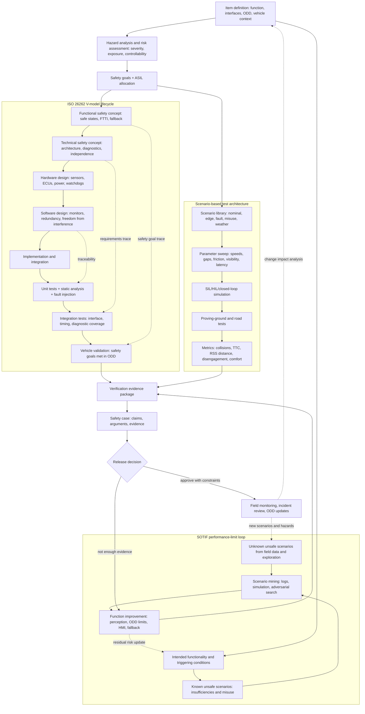

# Safety, ISO 26262, SOTIF, and Scenario Testing

Autonomous-driving safety is not a single metric. It combines functional safety, intended-functionality safety, cybersecurity, validation, operational limits, human factors, scenario coverage, monitoring, and organizational discipline. A vehicle can fail because a component breaks, because a component works as designed but the design was insufficient, because a machine-learning model generalizes poorly, or because the operational design domain was misunderstood.

This page introduces ISO 26262, ISO 21448 SOTIF, ASIL, scenario testing, formal safety arguments, Mobileye RSS, edge-case mining, and the difference between component reliability and system-level safety. It is the foundation for evaluating every technical page in this section, from [sensors](/cs/autonomous-driving/sensors-cameras-lidar-radar-imu) to [end-to-end driving](/cs/autonomous-driving/end-to-end-driving).

## Definitions

**Functional safety** addresses unreasonable risk caused by malfunctioning electrical or electronic systems. ISO 26262 is the main automotive functional-safety standard for road vehicles.

**ASIL**, Automotive Safety Integrity Level, is a risk classification in ISO 26262. It ranges from QM, meaning quality management with no assigned ASIL, through ASIL A, B, C, and D. ASIL D is the most stringent. Classification considers severity, exposure, and controllability.

**SOTIF**, Safety of the Intended Functionality, is addressed by ISO 21448. It concerns hazards that arise without a malfunction, such as a perception system that works according to specification but cannot correctly interpret an unusual construction scene.

**Hazard analysis and risk assessment**, or HARA, identifies hazardous events, rates them, and derives safety goals. In AVs, HARA must be tied to ODD and system responsibility.

**Scenario-based testing** evaluates the system on structured situations rather than only accumulated miles. Scenarios can be functional descriptions, logical parameter ranges, or concrete instantiated tests.

**RSS**, Responsibility-Sensitive Safety, is Mobileye's formal model for maintaining safe longitudinal and lateral distances under stated assumptions. It provides mathematically defined safety envelopes, not a complete proof that an AV is safe in all situations.

**Safety case** is a structured argument, supported by evidence, that a system is acceptably safe for a defined context. It may include requirements, tests, analyses, simulations, field data, process evidence, and residual-risk arguments.

**Edge-case mining** searches logs and simulations for rare, difficult, or high-risk situations: unusual objects, near misses, perception disagreement, abrupt cut-ins, map mismatches, emergency vehicles, or ODD boundary cases.

## Key results

ISO 26262 and SOTIF address complementary failure classes. ISO 26262 asks whether the system malfunctions and how hazards are controlled. SOTIF asks whether the intended function is insufficient under foreseeable conditions even when no component has failed.

| Safety concern | Example | Primary framing | Typical mitigation |
|---|---|---|---|
| Random hardware fault | Steering sensor fails high | ISO 26262 | Diagnostics, redundancy, safe state |
| Systematic software fault | Planner violates speed limit due to bug | ISO 26262 process and verification | Requirements, testing, review, static analysis |
| Performance limitation | Camera classifier misses unusual trailer | SOTIF | Scenario analysis, data expansion, monitors |
| ODD misuse | Feature used outside validated road type | SOTIF and human factors | ODD detection, driver monitoring, HMI |
| Cyber attack | GNSS spoofing or sensor tampering | Cybersecurity engineering | Authentication, detection, isolation |

ASIL classification is often summarized as a function of severity $S$, exposure $E$, and controllability $C$. The standard uses categories rather than a simple arithmetic formula, but the intuition is:

$$
\mathrm{risk} \uparrow
\quad \text{as} \quad
S \uparrow,\ E \uparrow,\ C \uparrow.
$$

For automated driving, controllability changes with automation level. If a Level 4 system has no expectation of immediate human takeover inside its ODD, hazards cannot be mitigated by assuming a human driver will correct them in time.

Scenario testing helps address the impossibility of proving safety by miles alone. If a rare hazardous condition occurs once per ten million miles, observing enough natural miles to estimate it tightly is impractical. Structured scenario generation, accelerated evaluation, simulation, track testing, and field monitoring are used to focus on risk.

Safety cases should be scoped. A claim such as "the system is safe" is too broad. A defensible claim is closer to: "For this vehicle platform, software version, sensor suite, map version, operational design domain, and remote-assistance policy, the residual risk is acceptable under these safety goals and evidence."

Safety evidence should combine leading and lagging indicators. Lagging indicators include collisions, police-reportable incidents, disengagements, and hard braking after deployment or testing. Leading indicators include requirement coverage, scenario coverage, monitor activations, perception uncertainty, near-miss margins, simulator regression results, and unresolved safety anomalies. Waiting for severe incidents to measure safety is unacceptable; relying only on synthetic leading metrics is also weak.

A release process should define what blocks deployment. Examples include an increase in collision-risk scenarios, unresolved ASIL-related defects, degraded ODD detection, stale map coverage, or regression in minimal-risk maneuvers. Clear release gates turn safety from an after-the-fact report into an engineering control.

Incident analysis should look for systemic causes, not only immediate triggers. A crash or near miss may involve perception uncertainty, map assumptions, behavior arbitration, remote-assistance policy, test-driver procedure, and organizational release pressure. Safety engineering treats those interactions as part of the system.

## Visual



This diagram combines the ISO 26262 V-model, SOTIF performance-limit loop, and scenario-testing pipeline. Requirements and safety goals flow down into architecture and implementation, evidence flows back up through verification and validation, and the dotted feedback paths show how field monitoring updates hazards, scenarios, ODD limits, and the safety case.

## Worked example 1: Qualitative ASIL reasoning

Problem: An automated highway feature could unintentionally command hard braking from 100 km/h in dense traffic because of a false obstacle. Reason qualitatively about severity, exposure, controllability, and why this may lead to a high ASIL.

1. Severity: sudden hard braking at highway speed can cause rear-end collisions and serious injury, so severity is high.
2. Exposure: if the feature is intended for highways and dense traffic is common, exposure is not rare.
3. Controllability: a following human driver may not have enough time to react. The ego occupant may not control braking if automation is active.
4. Safety goal: prevent unintended severe braking or limit it through plausibility checks, redundancy, graded braking, driver or system fallback, and monitoring.
5. ASIL implication: high severity, meaningful exposure, and difficult controllability push the hazard toward a stringent ASIL classification under the standard's tables.

Answer: the exact ASIL requires the formal ISO 26262 classification process, but the qualitative reasoning indicates this is a high-criticality hazardous event.

Check: The analysis focuses on the hazardous event, not the component label. A camera false positive, radar ghost, fusion bug, or planner error can all contribute to the same hazardous braking event.

## Worked example 2: RSS-style safe following distance

Problem: Use a simplified longitudinal safety calculation. Ego speed is $v_e=25$ m/s, lead vehicle speed is $v_l=20$ m/s, response time is $\rho=1$ s, maximum ego acceleration during response is $a_{\max}=2$ m/s², comfortable ego braking is $b_e=4$ m/s², and lead braking is $b_l=6$ m/s². Compute:

$$
d_{\min} = v_e\rho + \frac{1}{2}a_{\max}\rho^2
+ \frac{(v_e+\rho a_{\max})^2}{2b_e}
- \frac{v_l^2}{2b_l}.
$$

1. Distance during response:

$$
v_e\rho + \frac{1}{2}a_{\max}\rho^2
= 25(1)+0.5(2)(1)^2 = 26\ \mathrm{m}.
$$

2. Ego speed after response:

$$
v_e+\rho a_{\max}=25+2=27\ \mathrm{m/s}.
$$

3. Ego braking distance:

$$
\frac{27^2}{2(4)}=\frac{729}{8}=91.125\ \mathrm{m}.
$$

4. Lead braking distance:

$$
\frac{20^2}{2(6)}=\frac{400}{12}=33.333\ \mathrm{m}.
$$

5. Safe distance:

$$
d_{\min}=26+91.125-33.333=83.792\ \mathrm{m}.
$$

Answer: the simplified safe following distance is about 83.8 m.

Check: The required distance is large because ego is faster than the lead vehicle and may continue accelerating during response time.

## Code

```python
def rss_longitudinal_distance(v_ego, v_lead, response_time, accel_max, brake_ego, brake_lead):
    response_dist = v_ego * response_time + 0.5 * accel_max * response_time ** 2
    v_after_response = v_ego + response_time * accel_max
    ego_brake_dist = v_after_response ** 2 / (2.0 * brake_ego)
    lead_brake_dist = v_lead ** 2 / (2.0 * brake_lead)
    return max(0.0, response_dist + ego_brake_dist - lead_brake_dist)

def severity_score(collisions, near_misses, hard_brakes):
    return 1000 * collisions + 50 * near_misses + hard_brakes

d = rss_longitudinal_distance(
    v_ego=25.0,
    v_lead=20.0,
    response_time=1.0,
    accel_max=2.0,
    brake_ego=4.0,
    brake_lead=6.0,
)
print("safe distance:", d)
print("scenario score:", severity_score(collisions=0, near_misses=2, hard_brakes=7))
```

## Common pitfalls

- Treating ISO 26262 compliance as full AV safety. It addresses malfunctioning E/E systems, not every intended-functionality limitation.
- Treating SOTIF as only a perception standard. Planning, control, HMI, ODD monitoring, and fallback can also have performance limitations.
- Counting miles without scenario coverage. Miles are evidence, but rare hazardous situations require targeted testing.
- Writing vague safety claims. Safety arguments must specify vehicle, software, ODD, assumptions, mitigations, and evidence.
- Assuming human fallback is available at any automation level. Level 4 safety cannot rely on instant human takeover inside the ODD.
- Ignoring post-release monitoring. Field data, incident analysis, and regression controls are part of the safety lifecycle.

## Connections

- [SAE levels and operational design domain](/cs/autonomous-driving/sae-levels-and-operational-design-domain)
- [Simulation and data](/cs/autonomous-driving/simulation-and-data)
- [Decision making and behavior planning](/cs/autonomous-driving/decision-making-and-behavior-planning)
- [Adversarial and physical attacks on AV](/cs/autonomous-driving/adversarial-and-physical-attacks-on-av)
- [Embedded systems](/cs/embedded/)
- [Engineering math for probability and control](/math/engineering-math/)
- Further reading: ISO 26262, ISO 21448 SOTIF, Mobileye RSS, UL 4600, safety-case literature, scenario-based testing papers, and public AV safety reports.
