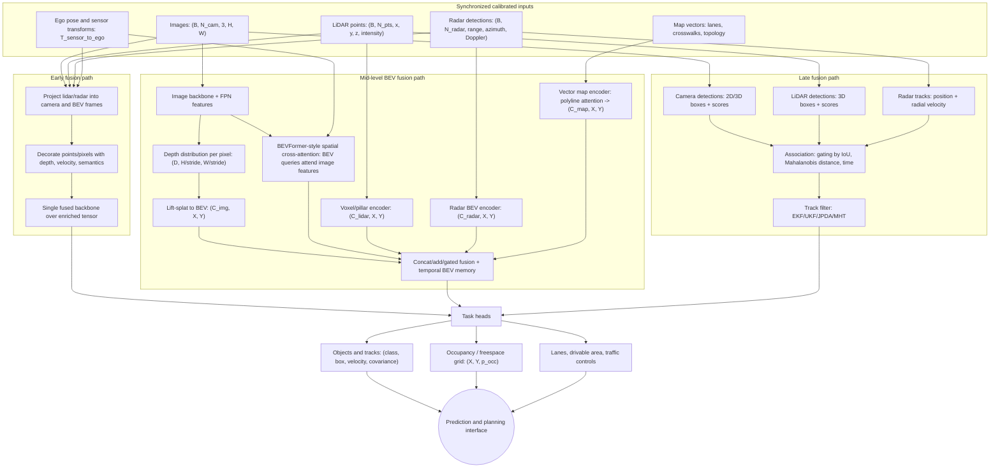

# Sensor Fusion

Sensor fusion combines measurements from cameras, lidar, radar, IMU, GNSS, maps, and vehicle odometry into a more useful estimate than any sensor can provide alone. The goal is not merely to average sensors. Fusion must respect coordinate frames, timestamps, uncertainty, occlusion, failure modes, and semantic meaning. A lidar point, a radar target, a camera detection, and a map lane boundary are different kinds of evidence.


*Figure: PointPillars shows how sparse LiDAR becomes convolution-friendly perception input. Image: [ar5iv](https://arxiv.org/abs/1812.05784), Lang et al., educational use with attribution.*

This page sits between [sensors](/cs/autonomous-driving/sensors-cameras-lidar-radar-imu), [perception](/cs/autonomous-driving/perception-object-detection-and-segmentation), [localization](/cs/autonomous-driving/localization-and-hd-maps), and [prediction](/cs/autonomous-driving/prediction-and-motion-forecasting). It introduces early, mid, and late fusion; bird's-eye-view representations; occupancy networks; and calibration. The practical lesson is that fusion is a systems problem as much as a model-design problem.

## Definitions

**Early fusion** combines raw or lightly processed sensor data before high-level perception. Examples include projecting lidar points into camera images, painting point clouds with image features, or concatenating radar and lidar features in a common voxel grid.

**Mid-level fusion** combines learned features from different sensor streams. A camera backbone may produce image features, a lidar backbone may produce BEV features, and a transformer or convolutional module fuses them into a shared representation.

**Late fusion** combines high-level outputs such as object tracks, boxes, velocities, lane hypotheses, and occupancy probabilities. Late fusion is easier to modularize and debug, but it can lose information discarded by earlier modules.

**Bird's-eye view**, or **BEV**, is a top-down representation indexed by ground-plane coordinates around the ego vehicle. BEV is natural for driving because planning, occupancy, lanes, and motion are mostly organized on the road surface.

**BEVFormer** is a representative camera-based approach that uses transformer attention to build BEV features from multi-camera images over time. **BEVFusion** is a representative multi-sensor approach that fuses camera and lidar features in BEV. These names are useful landmarks, not fixed production recipes.

An **occupancy grid** stores whether each cell in space is free, occupied, or unknown. Modern **occupancy networks** may predict 3D voxel occupancy, semantic occupancy, motion, and uncertainty from multiple sensors.

**Extrinsic calibration** is the rigid transform between sensors, such as $T_{\mathrm{camera}\leftarrow\mathrm{lidar}}$. **Time synchronization** aligns measurements taken at different times. **Ego-motion compensation** transforms old measurements into a common reference time using vehicle motion estimates.

## Key results

Fusion requires consistent coordinate transforms. A lidar point in lidar coordinates can be projected into the camera by:

$$
\tilde{p}_{\mathrm{image}}
= K\ T_{\mathrm{camera}\leftarrow\mathrm{vehicle}}\ T_{\mathrm{vehicle}\leftarrow\mathrm{lidar}}\ \tilde{p}_{\mathrm{lidar}},
$$

where $K$ is the camera intrinsic matrix and tildes denote homogeneous coordinates. If either transform is wrong, learned fusion may appear to work on average but fail badly near object boundaries or at long range.

Late fusion often uses Bayesian intuition. For an occupancy grid cell with prior occupancy probability $p$, a measurement can update log odds:

$$
\ell_t = \ell_{t-1} + \log \frac{p(z_t \mid \mathrm{occ})}{p(z_t \mid \mathrm{free})},
$$

where $\ell = \log(p/(1-p))$. Log odds are convenient because independent evidence adds. Real AV systems must weaken the independence assumption when sensors are correlated or share failure modes.

Tracking fusion commonly uses Kalman filters, extended Kalman filters, unscented Kalman filters, particle filters, or learned trackers. A generic linear Kalman update is:

$$
\begin{aligned}
K_t &= P_t H^\top (H P_t H^\top + R)^{-1}, \\
x_t^+ &= x_t^- + K_t(z_t - Hx_t^-), \\
P_t^+ &= (I - K_tH)P_t^-.
\end{aligned}
$$

The measurement covariance $R$ should reflect sensor-specific uncertainty. Radar velocity, lidar position, and camera bearing should not be given identical trust.

BEV fusion is popular because it aligns with planning. Multi-camera features can be lifted into BEV using predicted depth distributions. Lidar points can be voxelized directly. Radar detections can add long-range velocity cues. Map vectors can be rasterized or attended to as lane elements. The shared BEV then supports detection, segmentation, occupancy, prediction, and planning.

Fusion can fail in correlated ways. Heavy snow may degrade lidar, obscure cameras, and change road appearance simultaneously. Sun glare may blind multiple cameras. Construction can break map priors and lane perception at the same time. A safe system needs health monitoring and fallback, not only a larger neural network.

Association is one of the hardest parts of fusion. A camera box, lidar cluster, and radar detection may describe the same vehicle, or they may describe adjacent agents at different timestamps. Wrong association can create a fused object with high confidence but wrong position or velocity. Data association methods range from nearest-neighbor gating and Hungarian matching to joint probabilistic data association and learned association networks. All of them depend on uncertainty estimates and timing.

Out-of-sequence measurements are common. A radar packet, camera frame, or map-matching update may arrive after the fusion state has advanced. The system can drop it, rewind and replay, or apply a delayed update with approximation. The right answer depends on latency, compute budget, and safety impact. Ignoring this issue produces subtle bugs where the fused scene is precise but temporally inconsistent.

Fusion interfaces should expose disagreement. If lidar sees an obstacle, camera semantics say road surface, and radar reports no return, the planner should not receive a falsely clean object list. It should receive occupancy, uncertainty, and possibly a sensor-disagreement flag. This is especially important for debris, dark objects, glass, spray, and unusual vehicles where sensors naturally disagree.

The best fusion design is often observable in logs. Engineers should be able to inspect which sensors contributed to an object, how old each measurement was, and why a track was created, merged, split, or deleted.

## Visual



This diagram shows early, mid-level, and late fusion as distinct architectural choices rather than synonyms. The mid-level BEV path makes the main shape transition explicit: camera, lidar, radar, and map features are transformed into aligned BEV tensors, with spatial cross-attention and temporal memory providing the shared representation used by detection, occupancy, and lane heads.

## Worked example 1: Projecting a lidar point into a camera

Problem: A lidar point in camera coordinates is $P=(X,Y,Z)=(2.0,0.5,10.0)$ m after extrinsic transformation. The camera intrinsics are $f_x=f_y=800$ px, $c_x=640$, and $c_y=360$. Compute pixel coordinates.

1. Use the pinhole projection:

$$
\begin{aligned}
u &= f_x \frac{X}{Z} + c_x, \\
v &= f_y \frac{Y}{Z} + c_y.
\end{aligned}
$$

2. Substitute $X/Z = 2.0/10.0 = 0.2$:

$$
u = 800(0.2)+640 = 160+640=800.
$$

3. Substitute $Y/Z = 0.5/10.0 = 0.05$:

$$
v = 800(0.05)+360 = 40+360=400.
$$

Answer: the point projects to pixel $(800,400)$.

Check: The point is to the right and slightly below the optical center, matching $X\gt 0$ and $Y\gt 0$ under the chosen coordinate convention.

## Worked example 2: Updating occupancy log odds

Problem: A grid cell has prior occupancy probability $p_0 = 0.20$. A radar measurement gives likelihood ratio $p(z \mid \mathrm{occ}) / p(z \mid \mathrm{free}) = 3$. Compute the updated probability using log odds.

1. Convert prior probability to log odds:

$$
\ell_0 = \log \frac{0.20}{0.80} = \log(0.25) \approx -1.386.
$$

2. Add the measurement log likelihood ratio:

$$
\ell_1 = -1.386 + \log(3) \approx -1.386 + 1.099 = -0.287.
$$

3. Convert back to probability:

$$
p_1 = \frac{1}{1+\exp(-\ell_1)}
= \frac{1}{1+\exp(0.287)}
\approx 0.429.
$$

Answer: the occupancy probability rises from 0.20 to about 0.43.

Check: The measurement favors occupancy, so the probability increases, but it remains below 0.5 because the prior was strongly biased toward free.

## Code

```python
import numpy as np

def transform_points(points, T):
    ones = np.ones((points.shape[0], 1))
    homog = np.hstack([points, ones])
    return (T @ homog.T).T[:, :3]

def fuse_log_odds(prior_prob, likelihood_ratios):
    odds = prior_prob / (1.0 - prior_prob)
    log_odds = np.log(odds)
    for ratio in likelihood_ratios:
        log_odds += np.log(ratio)
    return 1.0 / (1.0 + np.exp(-log_odds))

points_lidar = np.array([[5.0, 0.0, 0.2], [8.0, 1.0, 0.1]])
T_vehicle_lidar = np.eye(4)
points_vehicle = transform_points(points_lidar, T_vehicle_lidar)

prob = fuse_log_odds(0.20, likelihood_ratios=[3.0, 1.5])
print(points_vehicle)
print("updated occupancy:", prob)
```

## Common pitfalls

- Fusing measurements with mismatched timestamps. At city speeds, tens of milliseconds can move objects enough to corrupt associations.
- Assuming all sensors are conditionally independent. Camera and lidar may both fail under the same weather or occlusion.
- Using camera-lidar projection without checking calibration drift. A small angular error creates large pixel errors at long range.
- Treating BEV as automatically metric. Camera BEV features depend on depth estimates and calibration, so their uncertainty varies with range and visibility.
- Letting a dominant sensor silence others. Fusion should preserve redundancy and flag disagreement rather than hide it.
- Ignoring unknown space. Free, occupied, and unknown are different; a planner should not treat unobserved space as guaranteed free.

## Connections

- [Sensors, cameras, lidar, radar, and IMU](/cs/autonomous-driving/sensors-cameras-lidar-radar-imu)
- [Perception, object detection, and segmentation](/cs/autonomous-driving/perception-object-detection-and-segmentation)
- [Localization and HD maps](/cs/autonomous-driving/localization-and-hd-maps)
- [Prediction and motion forecasting](/cs/autonomous-driving/prediction-and-motion-forecasting)
- [Deep learning](/cs/deep-learning/)
- [Engineering math for Bayesian filtering](/math/engineering-math/)
- Further reading: Kalman filtering texts, occupancy grid mapping, BEVFormer, BEVFusion, CenterPoint, and multi-sensor calibration literature.
