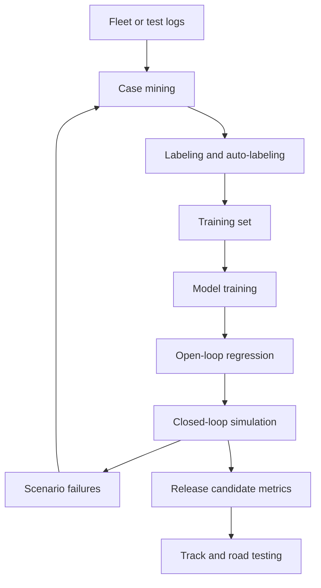

# Simulation and Data

Autonomous driving depends on data twice: first to train and evaluate perception, prediction, planning, and control, and second to build a safety case that the system behaves acceptably across its operational design domain. Real-world driving logs are indispensable, but they are expensive, imbalanced, and risky for rare events. Simulation fills the gap by replaying logs, generating scenarios, testing closed-loop behavior, and creating synthetic sensor data.

This page introduces CARLA, NVIDIA DRIVE Sim, AirSim, LGSVL or SVL, scenario generation, synthetic data, sim-to-real transfer, log replay, and data mining. It connects every stack layer from [sensors](/cs/autonomous-driving/sensors-cameras-lidar-radar-imu) through [safety](/cs/autonomous-driving/safety-iso26262-sotif-scenario-testing), because no AV module can be evaluated seriously without a strategy for data coverage and closed-loop testing.

## Definitions

**Log replay** re-runs recorded sensor data and annotations through the autonomy stack. It is useful for deterministic regression testing and measuring perception or prediction changes on real scenes. Standard log replay is usually open-loop: the ego vehicle does not change the recorded future.

**Closed-loop simulation** allows the autonomy system to act, and the simulated world responds. This is necessary for testing planning and control because ego decisions change future interactions.

**Scenario-based testing** defines structured situations such as unprotected left turns, cut-ins, jaywalking pedestrians, emergency vehicles, work zones, and sensor faults. Scenarios can be hand-authored, generated, mined from logs, or mutated from seed cases.

**Synthetic data** is generated by simulation or rendering. It can include perfect labels for segmentation, depth, flow, boxes, lanes, and object states. Its value depends on whether it improves real-world performance and coverage.

**Sim-to-real** is the transfer problem from simulated training or testing to real deployment. Gaps include sensor noise, material appearance, traffic behavior, weather, road geometry, and rare social interactions.

**CARLA** is an open-source simulator for autonomous driving research. **AirSim** is a simulator originally from Microsoft for drones and cars. **LGSVL**, later known as SVL Simulator, was an open-source AV simulator associated with LG and later ecosystem use. **NVIDIA DRIVE Sim** is a commercial simulation platform with high-fidelity sensor and world modeling.

**Data engine** refers to the loop of collecting fleet data, mining interesting cases, labeling or auto-labeling them, training models, evaluating regressions, and redeploying. Public descriptions of Tesla, Waymo, and other AV developers often emphasize this loop, though internal details differ.

## Key results

Open-loop evaluation answers: "Given the recorded past, did the module predict or classify the recorded future?" Closed-loop evaluation answers: "When the system acts, does the resulting interaction remain safe and useful?" Both are needed. A planner can match logged expert behavior open-loop but fail when a simulated agent reacts differently to a hesitant maneuver.

Scenario coverage can be thought of as sampling a high-dimensional parameter space:

$$
\theta =
(\mathrm{speed},\ \mathrm{visibility},\ \mathrm{friction},\ \mathrm{agent\ gap},\ \mathrm{reaction\ time},\ \mathrm{road\ geometry},\ldots).
$$

A scenario generator chooses $\theta$, runs the system, and records metrics such as collision, time-to-collision, rule violation, harsh braking, comfort, progress, and ODD exit. The challenge is combinatorial explosion: even a few parameters with many values create thousands of cases.

Synthetic data is most valuable when it targets gaps. Rendering random perfect-weather driving may add little if the real dataset already covers it. Synthetic rain, fog, night glare, rare vehicles, unusual signage, or construction layouts may help if the domain gap is controlled.

Log mining is a core AV discipline. Interesting examples include hard braking, near misses, manual interventions, perception disagreement, prediction surprises, high planner cost, rare object classes, ODD exits, and safety monitor activations. A mature data pipeline does not label everything equally; it prioritizes cases that reveal risk or uncertainty.

A simulation stack needs sensor models and behavior models. Sensor realism covers camera optics, motion blur, rolling shutter, lens flare, lidar intensity and dropouts, radar multipath, GNSS multipath, and IMU noise. Behavior realism covers how human drivers, pedestrians, cyclists, and traffic controllers respond to the ego vehicle.

Metrics should be tied to decisions. A perception metric may use IoU or AP, a prediction metric may use minADE, and a planner metric may use collisions, comfort, progress, and rule compliance. A release gate should not rely on a single aggregate score, because improvements in common easy cases can hide regressions in rare severe cases. Scenario-weighted metrics and severity-weighted metrics are common ways to keep attention on safety-critical tails.

A useful validation pyramid has several layers. Unit tests catch local software errors. Log replay catches deterministic regressions on real data. Open-loop benchmarks compare model outputs against labels. Closed-loop simulation tests interaction. Track testing exercises the physical vehicle in controlled conditions. Limited public-road deployment monitors real ODD behavior. No layer replaces the others; each catches different failure modes.

Data governance matters because AV datasets are living artifacts. Labels, map versions, calibration files, scenario definitions, train-validation splits, and simulator versions must be tracked. If a model improves after a data change, the team needs to know whether it learned better driving structure or merely benefited from label leakage or easier validation cases.

Simulation credibility should be argued, not assumed. For each use, the team should state what the simulator is trusted to test. It may be credible for planner logic around right-of-way, less credible for camera perception in glare, and highly credible for deterministic software regression. Matching the simulator's fidelity to the decision being made prevents both underuse and overclaiming.

Rare-event acceleration is useful when natural frequency is low. Instead of waiting for millions of miles of natural cut-ins, a scenario engine can sample aggressive cut-ins near the safety boundary. The resulting statistics must be interpreted carefully because the sampling distribution is artificial, but the tests are valuable for finding failures and validating margins.

Human review remains useful even in automated data engines. Expert triage can identify whether a failure is a model weakness, a bad label, a simulator artifact, a map issue, or an ambiguous policy choice.

## Visual



## Worked example 1: Counting scenario combinations

Problem: A test team defines a cut-in scenario with 5 ego speeds, 4 cut-in gaps, 3 weather settings, 3 road-curvature settings, and 2 lighting conditions. How many parameter combinations exist before repetitions?

1. Identify independent parameter counts:

$$
5,\quad 4,\quad 3,\quad 3,\quad 2.
$$

2. Multiply:

$$
N = 5 \times 4 \times 3 \times 3 \times 2.
$$

3. Compute step by step:

$$
5 \times 4 = 20,\quad 3 \times 3 \times 2 = 18.
$$

4. Final count:

$$
N = 20 \times 18 = 360.
$$

Answer: there are 360 combinations before random seeds, agent variations, sensor noise, or map variations.

Check: If each combination is run with 10 random seeds, the suite becomes 3600 simulations. Scenario design must balance coverage and compute budget.

## Worked example 2: Measuring a closed-loop regression

Problem: A planner release candidate is tested on 1000 simulated unprotected-left scenarios. The previous version had 12 hard-brake events and 0 collisions. The new version has 6 hard-brake events and 2 collisions. A hard brake costs 1 severity point and a collision costs 100 severity points. Compare severity totals.

1. Previous severity:

$$
S_{\mathrm{old}} = 12(1) + 0(100) = 12.
$$

2. New severity:

$$
S_{\mathrm{new}} = 6(1) + 2(100)=206.
$$

3. Difference:

$$
\Delta S = 206 - 12 = 194.
$$

Answer: despite fewer hard brakes, the new version is much worse under this severity model because collisions dominate.

Check: Comfort metrics cannot be evaluated without safety metrics. A model that reduces braking by accepting unsafe gaps should be rejected.

## Code

```python
from itertools import product

speeds = [5, 10, 15, 20, 25]
gaps = [1.0, 1.5, 2.0, 3.0]
weather = ["clear", "rain", "fog"]
curvature = ["straight", "mild", "sharp"]
lighting = ["day", "night"]

def scenario_suite():
    for speed, gap, w, curve, light in product(speeds, gaps, weather, curvature, lighting):
        yield {
            "ego_speed_mps": speed,
            "cut_in_gap_s": gap,
            "weather": w,
            "road_curvature": curve,
            "lighting": light,
        }

suite = list(scenario_suite())
print(len(suite))
print(suite[0])
print(suite[-1])
```

## Common pitfalls

- Treating log replay as sufficient for planning. Open-loop logs do not show how the world responds to new ego actions.
- Measuring only average performance. Rare failures dominate safety risk.
- Overtrusting simulation realism. A simulator can prove regressions, but passing simulation does not prove real-world safety.
- Generating synthetic data without a target gap. More data is not automatically better.
- Ignoring label quality. A large dataset with inconsistent boxes, lanes, or tracks can teach the wrong behavior.
- Failing to version data, maps, simulator code, and metrics. Reproducibility is impossible if any part of the evaluation pipeline drifts silently.

## Connections

- [SAE levels and operational design domain](/cs/autonomous-driving/sae-levels-and-operational-design-domain)
- [Motion planning](/cs/autonomous-driving/motion-planning)
- [Control: PID, MPC, pure pursuit, and Stanley](/cs/autonomous-driving/control-pid-mpc-pure-pursuit-stanley)
- [Safety, ISO 26262, SOTIF, and scenario testing](/cs/autonomous-driving/safety-iso26262-sotif-scenario-testing)
- [Deep learning](/cs/deep-learning/)
- [Embedded systems](/cs/embedded/)
- Further reading: CARLA papers and documentation, NVIDIA DRIVE Sim materials, AirSim, SVL Simulator, PEGASUS scenario concepts, and AV dataset papers from KITTI, nuScenes, Argoverse, and Waymo.
