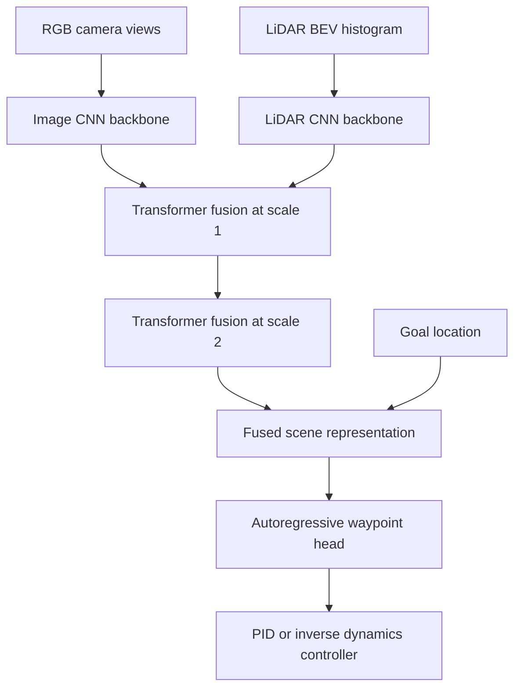

# TransFuser (Chitta et al., 2022)

TransFuser, introduced by Chitta, Prakash, Jaeger, Yu, Renz, and Geiger in "TransFuser: Imitation with Transformer-Based Sensor Fusion for Autonomous Driving," is an end-to-end driving architecture that fuses camera and LiDAR features using transformers. It was developed for closed-loop urban driving in CARLA, where dense traffic and long routes expose weaknesses in simple late fusion or geometry-local fusion.

The model is best read as a [sensor fusion](/cs/autonomous-driving/sensor-fusion) page and an [end-to-end driving](/cs/autonomous-driving/end-to-end-driving) page at the same time. It still predicts waypoints rather than raw steering, but it learns the driving policy from image and LiDAR inputs. Its main argument is that safe driving in complex scenes requires global cross-modal context: a traffic light, crossing vehicle, and ego route may be far apart in pixels or BEV cells but tightly related behaviorally.

## Definitions

**Multi-modal end-to-end driving** maps sensor observations and a high-level route command to a trajectory:

$$
\pi_\theta(I_t, P_t, g_t) \rightarrow \hat{Y}_{t:t+T},
$$

where $I_t$ are RGB images, $P_t$ is a LiDAR representation, $g_t$ is a goal or route command, and $\hat{Y}$ is a sequence of ego waypoints.

**Late fusion** encodes each modality independently and concatenates final features. It is simple but can miss interactions between low-level visual and geometric features.

**Geometry-local fusion** projects features between camera and LiDAR spaces using calibration, usually aggregating local neighborhoods. This is powerful for perception but may be too local for global driving decisions.

**Transformer fusion** forms tokens from feature maps and lets self-attention connect distant locations and modalities:

$$
\mathrm{Attention}(Q,K,V)=\mathrm{softmax}\left(\frac{QK^\top}{\sqrt{d}}\right)V.
$$

In TransFuser, image and LiDAR branches are connected by transformer modules at multiple resolutions. The fused features feed an autoregressive waypoint prediction head.

The LiDAR input in the paper is represented as a BEV histogram pseudo-image over a local region, and the RGB input uses multiple front-facing camera views. The output is a small set of future waypoints in ego coordinates, later converted to control by an inverse dynamics or PID-style controller.

## Key results

The source abstract reports that TransFuser outperformed prior work on the CARLA leaderboard at submission time and reduced average collisions per kilometer by 48 percent compared with geometry-based fusion. The paper also introduced a more challenging Longest6 benchmark with long routes, dense traffic, and pre-crash scenarios.

The central result is that fusion timing matters. If the model waits until the end to combine image and LiDAR features, it may never align traffic-light semantics with BEV geometry. If it fuses only local projected neighborhoods, it may miss global relationships. TransFuser uses attention so a LiDAR BEV token can exchange information with image tokens that are behaviorally relevant but spatially distant in the feature grid.

The architecture can be summarized as:

1. RGB images enter an image CNN backbone.
2. LiDAR BEV histograms enter a LiDAR CNN backbone.
3. Transformer modules fuse features at several scales.
4. Auxiliary tasks provide additional supervision in a multi-task setup.
5. A waypoint decoder predicts future ego waypoints.
6. A controller converts waypoints to throttle, brake, and steering.

TransFuser should not be interpreted as a complete safety solution. It is a closed-loop simulation result in CARLA, and real deployment requires calibration, synchronization, ODD definition, fallback, and safety validation. Its durable contribution is architectural: global attention is a strong fusion mechanism for end-to-end driving.

The paper is also important because it evaluates fusion under driving outcomes, not only perception quality. A fusion method that improves object detection may still fail to improve closed-loop driving if the planner cannot use the representation or if the model misses long-range interactions. TransFuser's CARLA setup asks whether fusion reduces collisions, route failures, and infractions when the learned policy is actually in control.

The multi-resolution design matters. Shallow features preserve local detail such as lane markings and nearby obstacles. Deep features encode broader semantics such as intersections, traffic lights, and route context. Fusing only at the final layer can miss early cross-modal correspondences; fusing at every pixel can be expensive. TransFuser's staged transformer modules are a compromise between representation richness and compute.

From an engineering perspective, TransFuser still relies on a controller and simulator-specific assumptions. The waypoint head predicts a small horizon, and a PID or inverse-dynamics controller converts those waypoints to low-level commands. If the controller saturates, if LiDAR and camera timestamps drift, or if calibration is wrong, the learned fusion policy may degrade sharply. These are not weaknesses unique to TransFuser; they are the practical realities of multi-sensor autonomy.

The CARLA setting is also useful because it emphasizes infractions, not only route completion. A model can finish a route while clipping vehicles, running lights, or making uncomfortable maneuvers. TransFuser's reported collision reduction is therefore more meaningful than a pure waypoint error improvement. It suggests that the fused representation changed behavior in closed loop, where perception, prediction implicit in the policy, planning, and control interact.

For a reader comparing TransFuser with later VLM/VLA systems, the difference is that TransFuser's reasoning is entirely latent. It may attend to a traffic light and crossing vehicle, but it does not produce a textual rationale. Later systems add language and interpretable outputs; TransFuser shows what can be achieved with sensor-token attention alone.

That makes it a clean baseline for asking whether language adds driving value or merely adds a more verbose interface to a policy that still needs grounded perception and control.

## Visual



| Fusion style | Where modalities meet | Strength | Weakness |
|---|---|---|---|
| Early fusion | Raw or shallow input | Simple alignment if modalities match | Hard when image and LiDAR grids differ |
| Late fusion | Final feature vector | Easy to implement | Weak cross-modal spatial reasoning |
| Geometry-local fusion | Projected local neighborhoods | Strong calibration use | May miss global context |
| TransFuser attention | Multiple feature scales | Long-range cross-modal interaction | Attention and token design cost |

## Worked example 1: Token attention size

Problem: An image branch produces 64 tokens and a LiDAR branch produces 64 tokens at one scale. They are concatenated for transformer fusion. How many pairwise attention scores are computed in one head?

1. Total token count:

$$
N=64+64=128.
$$

2. Self-attention computes one score for each query-key pair:

$$
N^2=128^2=16384.
$$

3. These scores include image-image, LiDAR-LiDAR, image-LiDAR, and LiDAR-image interactions.

Answer: one attention head computes 16,384 pairwise scores at that scale.

Check: This is why multi-scale fusion must manage token counts carefully. Doubling spatial resolution roughly quadruples token count and makes attention much more expensive.

## Worked example 2: Waypoint tracking error

Problem: A TransFuser-style model predicts future waypoints $(2,0)$, $(4,0.2)$, and $(6,0.5)$ meters. The expert waypoints are $(2,0)$, $(4,0)$, and $(6,0)$. Compute mean L2 waypoint error.

1. First waypoint error:

$$
e_1=\sqrt{(2-2)^2+(0-0)^2}=0.
$$

2. Second waypoint error:

$$
e_2=\sqrt{(4-4)^2+(0.2-0)^2}=0.2.
$$

3. Third waypoint error:

$$
e_3=\sqrt{(6-6)^2+(0.5-0)^2}=0.5.
$$

4. Mean error:

$$
\bar{e}=\frac{0+0.2+0.5}{3}=0.233\ \mathrm{m}.
$$

Answer: the mean L2 waypoint error is about 0.233 m.

Check: Low open-loop waypoint error does not guarantee safe closed-loop driving. A 0.5 m lateral error near a curb or pedestrian may be serious.

## Code

```python
import torch
import torch.nn as nn

class CrossModalFusion(nn.Module):
    def __init__(self, dim=128, heads=4):
        super().__init__()
        self.attn = nn.MultiheadAttention(dim, heads, batch_first=True)
        self.norm = nn.LayerNorm(dim)

    def forward(self, image_tokens, lidar_tokens):
        tokens = torch.cat([image_tokens, lidar_tokens], dim=1)
        fused, _ = self.attn(tokens, tokens, tokens)
        fused = self.norm(tokens + fused)
        img_out = fused[:, :image_tokens.shape[1]]
        lidar_out = fused[:, image_tokens.shape[1]:]
        return img_out, lidar_out

image = torch.randn(2, 64, 128)
lidar = torch.randn(2, 64, 128)
fusion = CrossModalFusion()
img_fused, lidar_fused = fusion(image, lidar)
print(img_fused.shape, lidar_fused.shape)
```

## Common pitfalls

- Treating TransFuser as only a transformer paper. Its importance comes from sensor fusion in closed-loop driving.
- Assuming LiDAR solves all geometry and cameras solve all semantics. The model must learn when and how to combine them.
- Comparing open-loop waypoint loss without closed-loop collisions. CARLA leaderboard-style metrics reveal different failures.
- Ignoring field of view and calibration. Fusion only helps when sensor geometry and timing are consistent.
- Using attention at high resolution without considering quadratic cost.
- Overstating simulation results as real-world deployment evidence. CARLA is useful but not a safety case.

## Connections

- [Sensor fusion](/cs/autonomous-driving/sensor-fusion)
- [End-to-end driving](/cs/autonomous-driving/end-to-end-driving)
- [Simulation and data](/cs/autonomous-driving/simulation-and-data)
- [InterFuser](/cs/autonomous-driving/interfuser)
- [ChauffeurNet](/cs/autonomous-driving/chauffeurnet)
- [Control, PID, MPC, Pure Pursuit, and Stanley](/cs/autonomous-driving/control-pid-mpc-pure-pursuit-stanley)
- Further reading: TransFuser, InterFuser, NEAT, Learning by Cheating, CARLA leaderboard, and BEV sensor-fusion models.
