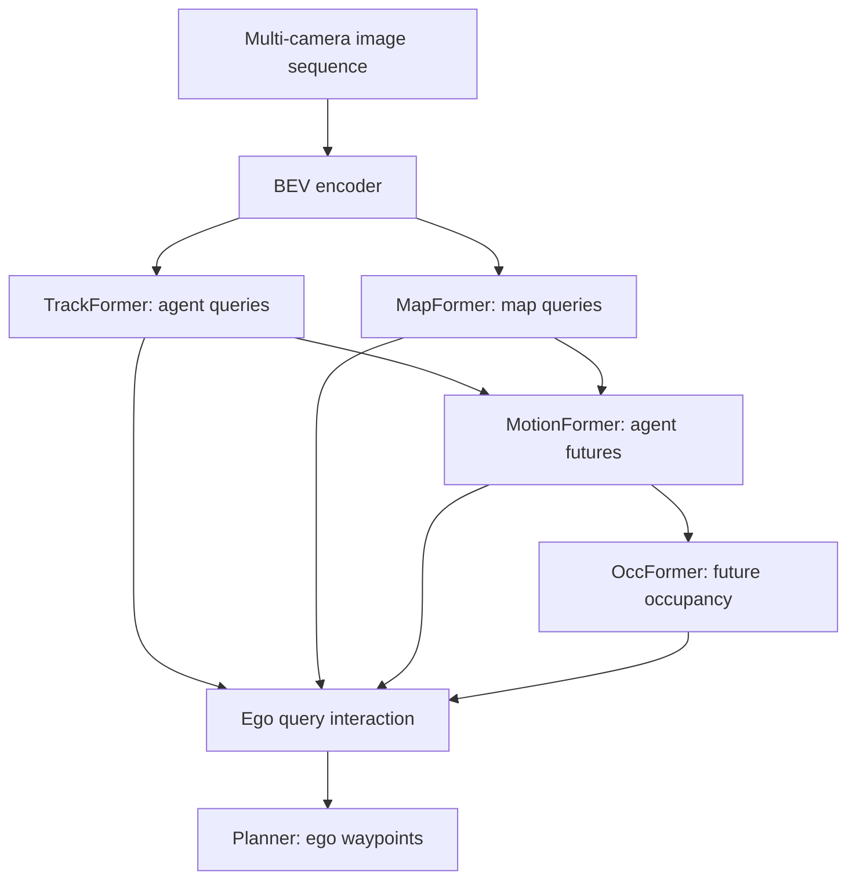

# UniAD (Hu et al., 2023)

UniAD, introduced by Hu and collaborators in the 2023 paper "Planning-oriented Autonomous Driving," is a unified autonomous-driving framework that connects perception, prediction, and planning tasks through query-based transformer modules. Instead of optimizing detection, tracking, mapping, forecasting, occupancy, and planning as isolated tasks, UniAD organizes them around the final goal: an ego plan.

The paper is important because it makes "planning-oriented" an explicit design principle. A good detector is not automatically a good driving system; a detector's output must support tracking, map reasoning, motion forecasting, occupancy prediction, and ego planning. UniAD is therefore a bridge from modular stack pages such as [perception](/cs/autonomous-driving/perception-object-detection-and-segmentation) and [prediction](/cs/autonomous-driving/prediction-and-motion-forecasting) to learned full-stack systems.

## Definitions

A **query** is a learnable token that asks a transformer decoder for a particular kind of scene information. In UniAD, different query sets represent tracks, map elements, occupancy regions, and the ego vehicle.

The overall input is multi-camera image history. A BEV encoder, such as BEVFormer in the paper's implementation, converts perspective features into a bird's-eye-view feature tensor:

$$
B = \mathrm{BEVEncoder}(I_{t-k:t}).
$$

**TrackFormer** uses detection and track queries to detect and track dynamic agents. **MapFormer** uses map queries to represent lanes, dividers, crossings, and drivable area. **MotionFormer** forecasts multimodal trajectories for agents using track and map queries. **OccFormer** predicts future occupancy. The **Planner** uses the ego query and preceding knowledge to output ego waypoints.

The planning output is a future ego trajectory:

$$
\hat{Y}_{\mathrm{ego}}=[(\hat{x}_1,\hat{y}_1),\dots,(\hat{x}_T,\hat{y}_T)].
$$

The phrase **planning-oriented** means upstream modules are selected and coordinated because they improve planning, not merely because they improve standalone metrics. The loss is multi-task, but the architecture makes query communication central.

## Key results

The source abstract reports that UniAD was instantiated on nuScenes and substantially outperformed previous state of the art across the evaluated tasks at publication time. The paper emphasizes extensive ablations showing the value of coordinating tasks with planning as the objective.

The key result is that full-stack learning needs interfaces, not just a shared backbone. A naive multi-task network may attach separate heads to one feature extractor, but heads can compete or fail to pass the right information. UniAD's queries provide a more structured interface:

$$
Q_{\mathrm{track}}\rightarrow Q_{\mathrm{motion}}\rightarrow Q_{\mathrm{ego}}\rightarrow \hat{Y}_{\mathrm{ego}}.
$$

This structure is useful for interaction. The ego vehicle is an agent too; its future affects and is affected by other agents. UniAD includes an ego query so the planner can interact with agent and map representations, rather than planning from a detached feature vector.

The occupancy module is also planning-relevant. Forecasted agent trajectories are sparse; occupancy gives a denser representation of future occupied space. A planner can use occupancy to avoid regions even when agent identity or exact trajectory is uncertain.

UniAD's limitation is cost and complexity. It combines many tasks in one architecture, so training, debugging, and evaluation are harder than for a single detector or predictor. It also relies on dataset labels and benchmark definitions. Still, it changed the research conversation by making the final plan the organizing objective.

The query interface is the most reusable idea. A track query can carry identity and temporal information. A map query can carry geometric road structure. A motion query can carry future hypotheses. An ego query can attend to all of them and produce a plan. Because all of these are tokens in a transformer-style system, information can move through attention rather than through hand-designed serialized messages.

This differs from simply sharing a backbone. In a basic multi-task model, detection, mapping, and planning heads might all read the same BEV tensor but not talk to one another. UniAD's modules pass updated query representations downstream. That creates a learned communication pathway, closer to a differentiable version of the modular stack.

The architecture also clarifies why planning is hard to evaluate with only one number. A bad plan may come from a missed object, a bad track id, a map query that missed a divider, a motion forecast that chose the wrong mode, an occupancy module that overestimated free space, or a planner that ignored a correct prediction. UniAD makes these modules visible enough to ablate them, but integrated enough that errors can still interact.

The practical tradeoff is deployment. Large unified models can be expensive, and safety-critical systems often prefer redundancy and independent monitors. UniAD is therefore best understood as a research framework for task coordination and representation learning, not as a claim that every AV stack should collapse into one network.

UniAD also helps explain the difference between an auxiliary task and a planning-relevant task. A depth or segmentation head might improve feature learning, but UniAD's selected tasks are directly tied to decisions: tracks say what moves now, maps say where driving is legal, motion forecasts say what may move next, and occupancy says which future regions may be blocked. This is why the paper argues for choosing preceding tasks in service of planning rather than adding every possible label.

Another practical implication is supervision balance. If the perception losses dominate, the network may become a good detector with a weak planner. If planning loss dominates too early, upstream representations may be unstable. Planning-oriented training is therefore not only an architecture; it is a curriculum and weighting problem.

This is why UniAD's ablations matter: they test whether each preceding task helps the final plan rather than assuming that more heads automatically produce a better driver.

## Visual



| Module | Query type | Output | Planning relevance |
|---|---|---|---|
| TrackFormer | Agent and track queries | 3D tracks | Current dynamic scene |
| MapFormer | Map queries | Lane and road elements | Drivable structure |
| MotionFormer | Agent-motion queries | Multimodal futures | Interaction risk |
| OccFormer | BEV/occupancy queries | Future occupancy | Dense collision prior |
| Planner | Ego query | Ego trajectory | Final driving action |

## Worked example 1: Combining planning losses

Problem: A simplified UniAD training step has detection loss 1.2, map loss 0.7, motion loss 0.9, occupancy loss 0.5, and planning loss 2.0. Weights are $0.5$, $0.5$, $1.0$, $1.0$, and $2.0$ respectively. Compute total loss.

1. Weighted detection loss:

$$
0.5(1.2)=0.6.
$$

2. Weighted map loss:

$$
0.5(0.7)=0.35.
$$

3. Weighted motion loss:

$$
1.0(0.9)=0.9.
$$

4. Weighted occupancy loss:

$$
1.0(0.5)=0.5.
$$

5. Weighted planning loss:

$$
2.0(2.0)=4.0.
$$

6. Total:

$$
L=0.6+0.35+0.9+0.5+4.0=6.35.
$$

Answer: the total loss is 6.35.

Check: Planning dominates because its weight is high. That matches the planning-oriented philosophy in this simplified example.

## Worked example 2: Occupancy-aware waypoint rejection

Problem: A candidate ego waypoint at time $t=2$ lands in BEV cell $(10,12)$. The forecast occupancy grid has probability $0.72$ for that cell. A planner rejects cells with occupancy above $0.5$. Is the waypoint allowed?

1. Occupancy at the waypoint cell:

$$
p_{\mathrm{occ}}=0.72.
$$

2. Threshold:

$$
p_{\max}=0.5.
$$

3. Since

$$
0.72>0.5,
$$

the cell is too risky.

Answer: the waypoint should be rejected or penalized.

Check: A dense occupancy forecast catches risk even if no single agent trajectory is selected as the culprit.

## Code

```python
import torch
import torch.nn as nn

class QueryPlanner(nn.Module):
    def __init__(self, dim=128, heads=4, horizon=6):
        super().__init__()
        self.cross_attn = nn.MultiheadAttention(dim, heads, batch_first=True)
        self.ffn = nn.Sequential(nn.LayerNorm(dim), nn.Linear(dim, horizon * 2))
        self.ego_query = nn.Parameter(torch.randn(1, 1, dim))

    def forward(self, scene_tokens):
        batch = scene_tokens.shape[0]
        ego = self.ego_query.expand(batch, -1, -1)
        updated, _ = self.cross_attn(ego, scene_tokens, scene_tokens)
        return self.ffn(updated.squeeze(1)).reshape(batch, -1, 2)

scene = torch.randn(3, 256, 128)  # tracks, map, motion, occupancy tokens
planner = QueryPlanner()
print(planner(scene).shape)
```

## Common pitfalls

- Calling any multi-task driving model planning-oriented. UniAD's point is explicit task coordination through queries toward planning.
- Treating perception metrics as sufficient. A better mAP can still produce a worse plan if task interfaces are poor.
- Ignoring ego-agent interaction. The ego plan changes the future scene, so it should not be modeled as a passive readout.
- Assuming occupancy replaces tracking. Occupancy and tracks answer different questions.
- Forgetting compute budget. A unified full-stack model can be hard to deploy without careful optimization.
- Comparing nuScenes planning results without checking input sensors, labels, and protocol.

## Connections

- [Perception, object detection, and segmentation](/cs/autonomous-driving/perception-object-detection-and-segmentation)
- [Prediction and motion forecasting](/cs/autonomous-driving/prediction-and-motion-forecasting)
- [Motion planning](/cs/autonomous-driving/motion-planning)
- [VAD](/cs/autonomous-driving/vad)
- [TransFuser](/cs/autonomous-driving/transfuser)
- [Simulation and data](/cs/autonomous-driving/simulation-and-data)
- Further reading: BEVFormer, DETR3D, UniAD, VAD, ST-P3, P3, ViP3D, and planning-oriented BEV models.
