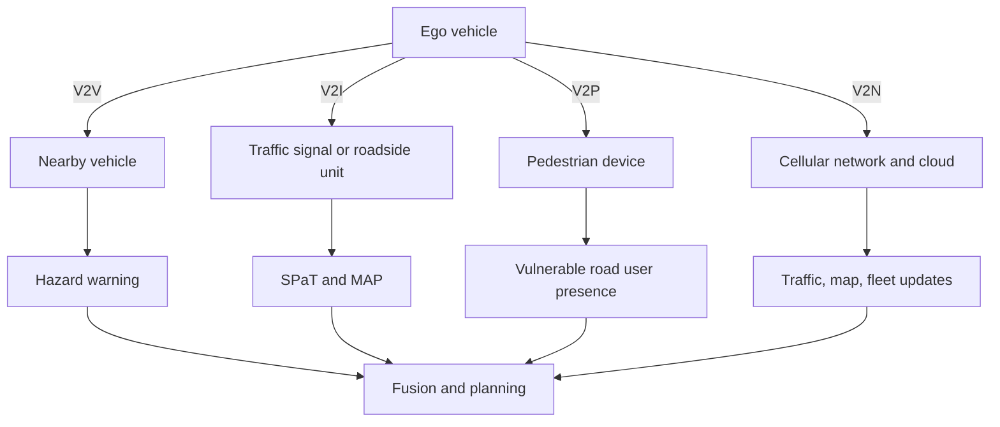

# V2X and Connected Vehicles

Vehicle-to-everything communication, or V2X, lets vehicles exchange information with other vehicles, infrastructure, pedestrians, networks, and cloud services. It can extend perception beyond line of sight, coordinate traffic signals, warn about hazards, and improve efficiency. But V2X is not a substitute for onboard autonomy because messages can be delayed, absent, spoofed, jammed, misconfigured, or unavailable across fleets and regions.


*Figure: A real autonomous vehicle grounds the driving stack in a physical platform. Image: [Wikimedia Commons](https://commons.wikimedia.org/wiki/File:Waymo_self-driving_car_front_view.gk.jpg), Grendelkhan, CC BY-SA 4.0.*

This page introduces DSRC, C-V2X, V2V, V2I, V2P, V2N, cooperative perception, security, privacy, latency budgets, and deployment constraints. It connects [sensor fusion](/cs/autonomous-driving/sensor-fusion), [prediction](/cs/autonomous-driving/prediction-and-motion-forecasting), [safety](/cs/autonomous-driving/safety-iso26262-sotif-scenario-testing), and [adversarial attacks](/cs/autonomous-driving/adversarial-and-physical-attacks-on-av).

## Definitions

**V2X** means vehicle-to-everything communication. It includes several subtypes.

**V2V** is vehicle-to-vehicle communication. Vehicles can broadcast position, speed, heading, braking status, or hazard warnings.

**V2I** is vehicle-to-infrastructure communication. Roadside units, traffic lights, work-zone beacons, toll systems, or smart signs communicate with vehicles.

**V2P** is vehicle-to-pedestrian communication, often through phones or wearable devices. It is challenging because vulnerable road users should not be required to carry or maintain special devices to be safe.

**V2N** is vehicle-to-network communication through cellular or cloud services. It can provide map updates, traffic information, fleet learning, remote assistance, and non-real-time context.

**DSRC**, Dedicated Short-Range Communications, refers to IEEE 802.11p-style vehicular communication. **C-V2X**, Cellular V2X, uses cellular technology and includes direct sidelink communication as well as network-assisted modes. Technology choices have varied by region and policy.

**Cooperative perception** shares object detections, occupancy, or sensor-derived features between vehicles or infrastructure. It can help detect occluded agents, but it requires trust, synchronization, bandwidth, and careful fusion.

**SPaT** means signal phase and timing. A traffic signal can broadcast current phase and time to next phase. **MAP** messages can describe intersection geometry.

## Key results

V2X improves information but does not remove uncertainty. A connected traffic light may tell the vehicle when it will turn red, but the vehicle still needs to see pedestrians, construction workers, emergency vehicles, and non-connected road users. A connected vehicle may broadcast hard braking, but the ego vehicle must still verify with onboard sensors when possible.

Latency budgets are scenario-dependent. If a vehicle travels at speed $v$ and a message is delayed by $\Delta t$, the stale position error can be roughly:

$$
\Delta x \approx v\Delta t.
$$

At 30 m/s, a 100 ms delay corresponds to 3 m of travel. For cooperative collision avoidance, this is significant. For traffic congestion summaries, it may be acceptable.

Security is central. V2X systems usually require message authentication so receivers can verify that messages come from authorized participants and have not been modified. Privacy requires changing identifiers or limiting tracking, but safety requires enough accountability to reject malicious or faulty messages. This tension is fundamental.

Cooperative perception can be fused like another sensor, but with different failure modes. A roadside unit may have a high vantage point but stale calibration. Another vehicle may see around a truck but may have inaccurate localization. A network message may be delayed. Fusion should track source, timestamp, uncertainty, and trust.

Deployment is uneven. A robust AV cannot assume that every vehicle, pedestrian, intersection, work zone, or emergency responder has compatible communication. V2X should be treated as an enhancement and redundancy layer unless the ODD explicitly requires equipped infrastructure and includes fallback for communication loss.

Message semantics matter as much as radio technology. A basic safety message may contain pose, speed, heading, brake status, and vehicle size. Infrastructure messages may contain signal phase and timing, intersection geometry, work-zone restrictions, or priority requests. Cooperative perception messages may contain object lists, confidence, classification, and sensor origin. The receiver must know whether a message is advisory, authoritative, stale, uncertain, or legally binding inside the ODD.

Trust should be contextual. A signed message proves that a credential was used, not that the physical claim is true. A connected vehicle may be mislocalized; a roadside unit may have stale calibration; an emergency-vehicle priority message may be authentic but still require onboard perception to clear a path safely. Plausibility checks compare V2X claims with ego sensors, maps, kinematics, and traffic rules before the planner relies on them.

Fail-operational design is important when V2X is part of the ODD. If a shuttle route depends on instrumented intersections, the system must define what happens when a roadside unit fails, messages become delayed, or certificate validation is unavailable. Reasonable responses include slowing, stopping before the intersection, requesting remote assistance, falling back to onboard perception, or leaving service. The response should be specified before deployment, not improvised after communication loss.

Latency budgets differ by message type. A hard-braking V2V alert may need tens of milliseconds to be useful for collision avoidance. SPaT information can tolerate longer delays if the timestamp and phase prediction are clear. Map updates and traffic summaries can be seconds or minutes old and still useful. Treating all V2X data with one freshness threshold either rejects useful context or accepts dangerously stale safety messages.

V2X also raises human-factors questions. A vehicle might receive a priority request from an emergency vehicle before occupants hear a siren, or a connected work zone might request a merge earlier than visible cones. The autonomy stack can use those messages internally, but external behavior still needs to be legible to human drivers, pedestrians, police, and road workers. Connected intelligence that produces surprising motion can create risk even when the message itself is correct.

Privacy controls can affect technical design. Rotating identifiers protect against long-term tracking, but rotation must not break short-term safety association. Certificates, pseudonyms, and misbehavior reporting need a balance between accountability and anonymity. For AV engineering, the important point is that V2X data is not just another sensor feed; it carries policy, trust, and governance assumptions.

Operational monitoring should include communication health. Packet loss, certificate failures, clock drift, roadside-unit outages, and unusual message rates are not merely networking details; they can change whether the vehicle is still inside a V2X-dependent ODD.

## Visual



## Worked example 1: Staleness from message latency

Problem: A connected vehicle broadcasts its position while traveling at 27 m/s. The ego vehicle receives the message 150 ms later. Estimate how far the sender may have moved during that latency.

1. Convert latency:

$$
150\ \mathrm{ms}=0.150\ \mathrm{s}.
$$

2. Use:

$$
\Delta x = v\Delta t.
$$

3. Substitute:

$$
\Delta x = 27(0.150)=4.05\ \mathrm{m}.
$$

Answer: the sender may have moved about 4.05 m during the message delay.

Check: At highway speeds, even subsecond latency creates vehicle-length position errors. Fusion should use timestamps and motion compensation.

## Worked example 2: Bandwidth for cooperative perception

Problem: A roadside unit sends 50 object detections at 10 Hz. Each detection message uses 64 bytes after packing. Estimate raw payload bandwidth in kilobytes per second.

1. Bytes per update:

$$
50 \times 64 = 3200\ \mathrm{bytes}.
$$

2. Updates per second:

$$
10\ \mathrm{Hz}.
$$

3. Payload per second:

$$
3200 \times 10 = 32000\ \mathrm{bytes/s}.
$$

4. Convert to kilobytes per second using 1000 bytes per kilobyte:

$$
32000 / 1000 = 32\ \mathrm{kB/s}.
$$

Answer: the raw payload is about 32 kB/s before protocol overhead, signatures, retries, or compression.

Check: Cooperative perception can become bandwidth-heavy if it sends dense point clouds or images. Object-level messages are cheaper but less rich.

## Code

```python
from dataclasses import dataclass

@dataclass
class V2XMessage:
    source_id: str
    timestamp_s: float
    x_m: float
    y_m: float
    vx_mps: float
    vy_mps: float
    authenticated: bool

def compensate_message(msg, receive_time_s, max_age_s=0.5):
    age = receive_time_s - msg.timestamp_s
    if not msg.authenticated:
        raise ValueError("reject unauthenticated V2X message")
    if age < 0.0 or age > max_age_s:
        raise ValueError("reject stale or future-dated V2X message")
    return (
        msg.x_m + msg.vx_mps * age,
        msg.y_m + msg.vy_mps * age,
        age,
    )

msg = V2XMessage("veh-12", 100.0, 10.0, 2.0, 27.0, 0.0, True)
print(compensate_message(msg, receive_time_s=100.15))
```

## Common pitfalls

- Treating V2X as guaranteed infrastructure. Many roads and agents will be unequipped.
- Trusting messages without authentication and plausibility checks. Spoofed or faulty messages can create unsafe behavior.
- Ignoring latency and clock synchronization. Stale positions can be meters wrong.
- Sending too much raw sensor data. Bandwidth and privacy constraints often require compact representations.
- Forgetting non-connected vulnerable road users. Pedestrians and cyclists must remain safe without devices.
- Overlooking privacy. Persistent identifiers can turn safety beacons into tracking infrastructure.

## Connections

- [Sensor fusion](/cs/autonomous-driving/sensor-fusion)
- [Prediction and motion forecasting](/cs/autonomous-driving/prediction-and-motion-forecasting)
- [Safety, ISO 26262, SOTIF, and scenario testing](/cs/autonomous-driving/safety-iso26262-sotif-scenario-testing)
- [Adversarial and physical attacks on AV](/cs/autonomous-driving/adversarial-and-physical-attacks-on-av)
- [Embedded systems](/cs/embedded/)
- [Physics of signals and systems](/physics/signals-systems/)
- Further reading: IEEE 802.11p and DSRC materials, 3GPP C-V2X specifications, ETSI and SAE V2X message standards, cooperative perception papers, and vehicular PKI literature.
