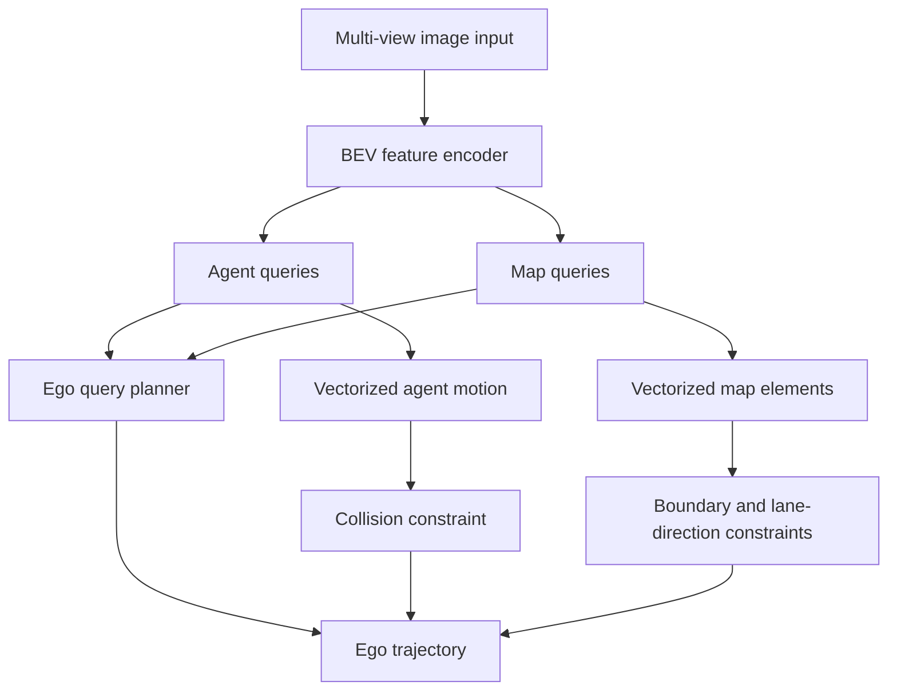

# VAD (Jiang et al., 2023)

VAD, introduced by Jiang and collaborators in "VAD: Vectorized Scene Representation for Efficient Autonomous Driving," is an end-to-end planning model that represents the driving scene with vectors rather than dense raster maps. It learns agent queries and map queries, predicts vectorized agent motion and map elements, and uses explicit vector-based planning constraints for collision avoidance, boundary avoidance, and lane-direction consistency.

The paper follows the planning-oriented direction of [UniAD](/cs/autonomous-driving/uniad), but argues that dense rasterized scene representations are computationally expensive and lose instance-level structure. VAD's central bet is that [motion planning](/cs/autonomous-driving/motion-planning) benefits from explicit vectors: lane boundaries, dividers, crossings, and other agents' future motion are natural constraints on ego trajectory generation.

## Definitions

A **vectorized map** represents road elements as point sequences or vectors. VAD considers elements such as lane dividers, road boundaries, and pedestrian crossings. A predicted map vector can be written as

$$
\hat{V}^{m}_j=[(\hat{x}_{j,1},\hat{y}_{j,1}),\dots,(\hat{x}_{j,P},\hat{y}_{j,P})].
$$

A **vectorized agent motion** represents each dynamic agent's future as multimodal trajectory vectors:

$$
\hat{V}^{a}_{i,k}=[(\hat{x}_{i,k,1},\hat{y}_{i,k,1}),\dots,(\hat{x}_{i,k,T},\hat{y}_{i,k,T})],
$$

where $i$ indexes agents and $k$ indexes modes.

An **ego query** is a learned token that attends to agent and map queries before the planning head predicts ego trajectory:

$$
\hat{Y}_{\mathrm{ego}} = f(q_{\mathrm{ego}}, Q_a, Q_m, s_{\mathrm{ego}}, c),
$$

where $s_{\mathrm{ego}}$ is ego status and $c$ is a high-level command.

VAD uses explicit planning constraints:

- **Ego-agent collision constraint:** keep ego trajectory away from predicted agent motion.
- **Ego-boundary overstepping constraint:** keep ego trajectory inside road boundaries.
- **Ego-lane direction constraint:** align future ego motion with lane direction.

These constraints make vectorized predictions useful beyond visualization; they become differentiable or trainable signals for planning.

## Key results

The source abstract reports state-of-the-art end-to-end planning performance on nuScenes at publication time. It states that VAD-Base reduced average collision rate by 29.0 percent and ran 2.5 times faster than the previous best method, while VAD-Tiny ran up to 9.3 times faster with comparable planning performance. The introduction gives a specific comparison to UniAD: average planning displacement error of 0.72 m versus 1.03 m, collision rate of 0.22 percent versus 0.31 percent, and speed of 4.5 FPS versus 1.8 FPS for the compared settings.

The main architectural result is that vectorized planning can be both interpretable and efficient. Dense raster maps put information into a grid. That is convenient for convolution, but the planner then has to infer object identity, boundary continuity, and lane direction from pixels. VAD keeps instance-level map and agent structure available.

The vectorized constraints make the planner less dependent on hidden feature learning. For example, if the ego trajectory crosses a road boundary vector, the boundary loss can penalize that directly. If it passes too close to a predicted agent motion vector, the collision constraint can penalize it directly. This is closer to classical planning cost design, but integrated into a learned model.

VAD does not remove the need for perception. It still relies on image-to-BEV feature encoding and query-based scene learning. Its contribution is the representation and planning interface after BEV features are built.

The explicit constraints also make VAD a bridge between classical planning and learned planning. Classical planners often define costs for collision, lane keeping, boundary crossing, comfort, and route progress. VAD learns the perception and representation, but it keeps several of those costs visible as vector relations. This gives the training objective more structure than a pure waypoint loss.

Vectorization has a latency motivation as well. Dense BEV maps are convenient for CNNs and occupancy reasoning, but they scale with grid area and resolution. Vectors scale more directly with the number of relevant agents and map elements. A mostly empty road scene should not require the same planning representation as a crowded intersection just because the grid size is fixed. VAD's reported speedups are tied to this representation choice, though exact runtime depends on backbone, hardware, and implementation.

The representation can fail when the vector extraction fails. If an online map module misses a road boundary, the boundary constraint cannot protect the plan. If an agent query produces a poor motion vector, the collision constraint may be falsely permissive or overly conservative. For that reason, vectorized planners still benefit from dense fallback checks, occupancy monitors, and uncertainty-aware margins.

VAD's comparison with UniAD is instructive. UniAD uses a richer set of coordinated tasks, including occupancy, while VAD emphasizes concise vector constraints and speed. This is not a simple winner-take-all tradeoff. Dense occupancy can represent uncertain occupied regions without committing to a particular instance, while vectors provide clear instance-level structure. Modern planners often combine both: sparse objects and lanes for reasoning, dense occupancy for safety envelopes.

For students, VAD is a good example of how representation determines loss design. Once boundaries and lanes are vectors, it becomes natural to write geometric losses against those vectors. If the same information were only a raster semantic map, the planner would need a different cost, often based on grid lookup or convolutional features.

The page is therefore also a representation-design lesson: choose data structures that make the safety-relevant constraints easy to express and cheap to evaluate.

## Visual



| Representation | Planning signal | VAD interpretation |
|---|---|---|
| Agent boxes/tracks | Dynamic obstacles | Agent motion vectors |
| Lane divider | Direction and lane structure | Map vectors plus lane-direction loss |
| Road boundary | Drivable-area limit | Boundary overstepping loss |
| Crosswalk | Semantic caution zone | Map query/type feature |
| High-level command | Route intent | Planner conditioning |

## Worked example 1: Collision margin to an agent vector

Problem: The ego candidate waypoint at $t=2$ is $(5.0,1.0)$ m. A predicted agent waypoint at the same time is $(5.6,1.3)$ m. The required safety radius is 1.0 m. Compute the collision violation.

1. Difference:

$$
\Delta=(5.0-5.6,1.0-1.3)=(-0.6,-0.3).
$$

2. Distance:

$$
d=\sqrt{(-0.6)^2+(-0.3)^2}=\sqrt{0.36+0.09}=\sqrt{0.45}\approx0.671.
$$

3. Violation is positive when $r-d\gt 0$:

$$
v=\max(0,1.0-0.671)=0.329.
$$

Answer: the waypoint violates the safety radius by about 0.329 m.

Check: If the distance were 1.2 m, the violation would be zero.

## Worked example 2: Lane-direction consistency

Problem: A lane vector points from $(0,0)$ to $(10,0)$. The ego trajectory segment points from $(2,0)$ to $(4,1)$. Compute the cosine alignment.

1. Lane direction:

$$
d_l=(10,0)-(0,0)=(10,0).
$$

2. Ego direction:

$$
d_e=(4,1)-(2,0)=(2,1).
$$

3. Dot product:

$$
d_l\cdot d_e=10(2)+0(1)=20.
$$

4. Norms:

$$
\|d_l\|=10,\qquad \|d_e\|=\sqrt{2^2+1^2}=\sqrt{5}.
$$

5. Cosine:

$$
\cos\alpha=\frac{20}{10\sqrt{5}}=\frac{2}{\sqrt{5}}\approx0.894.
$$

Answer: the segment is well aligned with the lane, with cosine about 0.894.

Check: A reverse-direction segment would have negative cosine and should receive a strong penalty.

## Code

```python
import torch

def vectorized_collision_loss(ego, agents, radius=1.0):
    # ego: [T, 2], agents: [A, T, 2]
    diff = ego[None, :, :] - agents
    dist = torch.linalg.norm(diff, dim=-1)
    violation = torch.relu(radius - dist)
    return violation.max(dim=0).values.mean()

def lane_alignment_loss(ego_points, lane_direction):
    seg = ego_points[1:] - ego_points[:-1]
    lane = lane_direction / lane_direction.norm().clamp_min(1e-6)
    seg_unit = seg / seg.norm(dim=-1, keepdim=True).clamp_min(1e-6)
    cosine = (seg_unit * lane).sum(dim=-1)
    return (1.0 - cosine).mean()

ego = torch.tensor([[0., 0.], [2., 0.], [4., 1.]])
agents = torch.randn(5, 3, 2)
print(vectorized_collision_loss(ego, agents))
print(lane_alignment_loss(ego, torch.tensor([1., 0.])))
```

## Common pitfalls

- Treating vectorized representation as only a memory optimization. VAD uses vectors as explicit planning constraints.
- Assuming dense BEV maps are always worse. Dense occupancy can be useful; VAD argues vectors are efficient and structurally direct for planning.
- Forgetting high-level command conditioning. A vector scene alone does not specify route intent.
- Using map vectors without uncertainty. Online map predictions can be wrong, especially under occlusion or unusual lane markings.
- Comparing speedups without hardware, backbone, and input resolution details.
- Treating a collision-rate number as a full safety guarantee. It is a benchmark metric, not a safety case.

## Connections

- [UniAD](/cs/autonomous-driving/uniad)
- [Motion planning](/cs/autonomous-driving/motion-planning)
- [Prediction and motion forecasting](/cs/autonomous-driving/prediction-and-motion-forecasting)
- [Localization and HD maps](/cs/autonomous-driving/localization-and-hd-maps)
- [VectorNet](/cs/autonomous-driving/vectornet)
- [Safety, ISO 26262, SOTIF, and scenario testing](/cs/autonomous-driving/safety-iso26262-sotif-scenario-testing)
- Further reading: VAD, UniAD, MapTR, BEVFormer, ST-P3, SparseDrive, and vectorized end-to-end planning.
