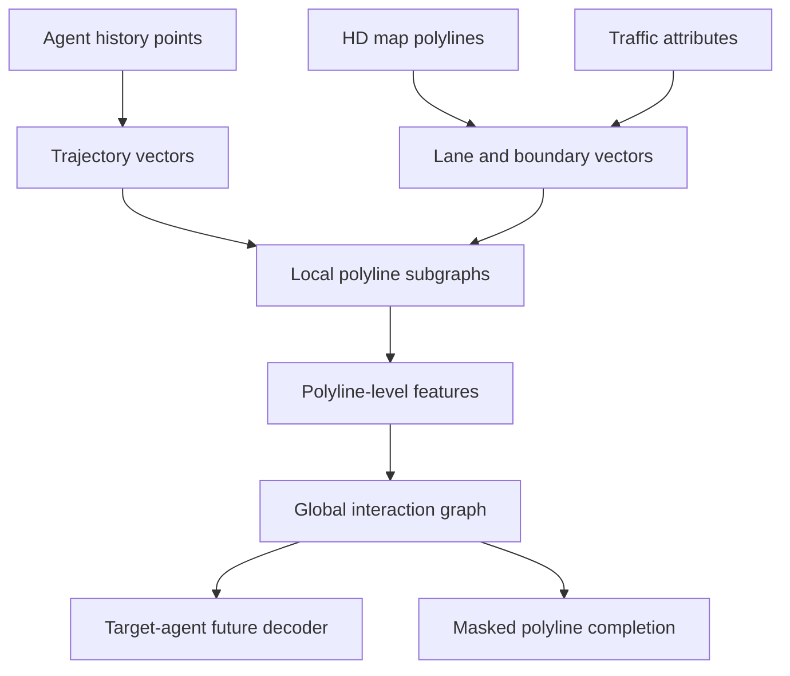

# VectorNet (Gao et al., 2020)

VectorNet, introduced by Gao, Sun, Zhao, Shen, Anguelov, Li, and Schmid in the CVPR 2020 paper "VectorNet: Encoding HD Maps and Agent Dynamics from Vectorized Representation," is a motion forecasting model that replaces rasterized map images with vectorized polylines. It treats lanes, crosswalks, stop signs, traffic-light states, and agent histories as structured vector sets, then learns local polyline features before modeling global interactions.

The paper is a useful pivot point in [prediction and motion forecasting](/cs/autonomous-driving/prediction-and-motion-forecasting). Before VectorNet-style models, many forecasting systems rendered the driving scene into a BEV image and used a CNN. That is simple, but it can blur topology: a lane graph, lane direction, and agent trajectory become colored pixels. VectorNet keeps the native geometry and topology closer to the form used by [HD maps](/cs/autonomous-driving/localization-and-hd-maps).

## Definitions

A **polyline** is an ordered sequence of points. A lane centerline, lane boundary, crosswalk edge, stop-line segment, or agent trajectory can be approximated as a polyline. A polyline with points $q_0,q_1,\dots,q_m$ produces vectors

$$
v_i = (q_i, q_{i+1}, a_i),
$$

where $a_i$ contains attributes such as semantic type, traffic-light state, timestamp, or polyline id.

The **local polyline subgraph** encodes vectors that belong to the same entity. For an agent trajectory, this local graph captures the motion pattern. For a lane polyline, it captures lane shape and direction. A simplified update is

$$
h_i^{(\ell+1)} = \phi\left(h_i^{(\ell)}, \mathrm{pool}_{j\in P(i)} h_j^{(\ell)}\right),
$$

where $P(i)$ is the set of vectors in the same polyline.

The **global interaction graph** connects polyline-level features. After local aggregation, each lane, crosswalk, and agent becomes a node. Self-attention or a fully connected graph then lets every component exchange information:

$$
z_p = \mathrm{Attention}(f_p,\{f_q\}_{q=1}^M).
$$

The **node completion auxiliary task** masks parts of the vectorized scene and asks the model to reconstruct them from context. This is a self-supervised regularizer: if a lane segment is masked, the model must infer it from surrounding lanes and agent motion.

VectorNet's output is a predicted future trajectory for the target agent. For a horizon $T$, a single-mode output is

$$
\hat{Y} = [(\hat{x}_1,\hat{y}_1),\dots,(\hat{x}_T,\hat{y}_T)].
$$

Many practical variants predict multiple modes and probabilities, but the central representation idea is independent of the decoder.

## Key results

The paper's abstract reports that VectorNet matched or improved a competitive rendering baseline while saving over 70 percent of model parameters and reducing FLOPs by an order of magnitude. It also reports state-of-the-art performance on the Argoverse forecasting dataset at the time. The important claim is not just benchmark rank; it is that vectorized maps can be more efficient and structurally faithful than raster images.

VectorNet has three durable lessons:

1. HD maps are already structured data, so forcing them into images is lossy.
2. Local geometry and global interaction are different modeling problems.
3. Auxiliary reconstruction of map and trajectory entities can improve context learning.

The hierarchy matters. If every vector segment attends to every other vector segment, the graph becomes large. If the model first compresses each polyline locally, the global layer operates on a smaller set of meaningful entities. This is the same general design pressure later seen in [HiVT](/cs/autonomous-driving/hivt): exploit locality first, then handle scene-level interaction.

VectorNet also clarified notation that has become common in forecasting papers. A scene is not only an agent history tensor. It is a set of typed entities:

$$
\mathcal{S} = \mathcal{A}_{\mathrm{hist}} \cup \mathcal{M}_{\mathrm{lanes}} \cup \mathcal{M}_{\mathrm{crosswalks}} \cup \mathcal{T}_{\mathrm{signals}}.
$$

The target agent's future is conditioned on all of $\mathcal{S}$. This is why map encoding and agent interaction are not optional details; they define the space of plausible futures. A vehicle approaching an intersection can continue, stop, turn left, or turn right only if the map and traffic controls make those futures valid.

The architectural details are deliberately modest compared with later models. Local polyline features can be produced by multilayer perceptrons and max pooling, while global interactions can use attention over polyline tokens. This makes VectorNet a good teaching model: the representational choice is the main point. Once the scene is a set of typed polylines, the model can scale by changing the global graph, decoder, or auxiliary tasks without abandoning the vector interface.

VectorNet also exposes a practical data-contract issue. A vectorized model needs clean map extraction, consistent semantic labels, and well-defined coordinate transforms. Raster methods can hide small map errors by blurring them into pixels; vector methods often fail more sharply when a lane id, heading, or traffic-light association is wrong. That does not make vectors worse, but it means map preprocessing becomes part of the model, not an invisible data-loading detail.

## Visual



| Encoding style | Preserves lane topology | Typical model | Cost profile | Failure mode |
|---|---:|---|---|---|
| Raster BEV image | Indirectly | CNN | Dense pixels | Blurs thin lanes and graph connectivity |
| VectorNet polyline graph | Yes | GNN plus attention | Sparse entities | Requires careful vector attributes |
| LaneGCN lane graph | Yes | Multi-adjacency graph convolution | Sparse graph | Needs lane graph construction |
| HiVT local/global vectors | Yes | Hierarchical transformer | Efficient for many agents | More involved invariance design |

## Worked example 1: Vectorizing a lane and trajectory

Problem: A lane centerline has points $L_0=(0,0)$, $L_1=(10,0)$, and $L_2=(20,5)$. A vehicle history has points $A_0=(2,-1)$, $A_1=(4,-0.5)$, and $A_2=(6,0)$. Build the vector list used by a VectorNet-style encoder.

1. Lane vectors connect consecutive lane points:

$$
v^L_0 = ((0,0),(10,0),a_L),\qquad
v^L_1 = ((10,0),(20,5),a_L).
$$

2. The lane direction vectors are

$$
d^L_0=(10,0)-(0,0)=(10,0),
$$

$$
d^L_1=(20,5)-(10,0)=(10,5).
$$

3. Trajectory vectors connect consecutive agent positions:

$$
v^A_0 = ((2,-1),(4,-0.5),a_A),\qquad
v^A_1 = ((4,-0.5),(6,0),a_A).
$$

4. The trajectory displacement vectors are

$$
d^A_0=(2,0.5),\qquad d^A_1=(2,0.5).
$$

5. The two lane vectors share a polyline id, and the two trajectory vectors share a different polyline id. Local subgraphs connect vectors only inside their own polyline.

Answer: the scene becomes four vector nodes, grouped into two local subgraphs: one lane polyline and one agent-history polyline.

Check: The agent appears to be moving roughly parallel to the first lane segment because its displacements point mostly in the positive $x$ direction.

## Worked example 2: Computing a masked completion loss

Problem: A model masks one lane vector whose true endpoint displacement is $d=(10,5)$ meters. The reconstruction head predicts $\hat{d}=(8,4)$ meters. Compute the squared error and explain what this auxiliary task teaches.

1. The prediction error is

$$
e=\hat{d}-d=(8-10,4-5)=(-2,-1).
$$

2. The squared error is

$$
\|e\|_2^2=(-2)^2+(-1)^2=4+1=5.
$$

3. If this is one term in a mean squared reconstruction loss, the contribution is 5 before averaging or weighting.

4. The model can reduce this loss only by using context: the previous lane vector, adjacent lanes, map type, and agent motion.

Answer: the masked vector contributes a squared error of 5.

Check: If the model predicted $(10,5)$ exactly, the loss would be zero. The auxiliary task encourages the global context representation to preserve map structure, not only target-agent motion.

## Code

```python
import torch
import torch.nn as nn

class PolylineEncoder(nn.Module):
    def __init__(self, in_dim=8, hidden=64):
        super().__init__()
        self.point_mlp = nn.Sequential(
            nn.Linear(in_dim, hidden),
            nn.ReLU(),
            nn.Linear(hidden, hidden),
            nn.ReLU(),
        )

    def forward(self, vectors, polyline_id):
        # vectors: [N, D], polyline_id: [N] with ids from 0 to M-1
        h = self.point_mlp(vectors)
        num_poly = int(polyline_id.max().item()) + 1
        pooled = []
        for pid in range(num_poly):
            pooled.append(h[polyline_id == pid].max(dim=0).values)
        return torch.stack(pooled, dim=0)

encoder = PolylineEncoder()
vectors = torch.randn(12, 8)
polyline_id = torch.tensor([0,0,0,1,1,2,2,2,2,3,3,3])
poly_features = encoder(vectors, polyline_id)
attn = nn.MultiheadAttention(embed_dim=64, num_heads=4, batch_first=True)
context, _ = attn(poly_features[None], poly_features[None], poly_features[None])
print(context.shape)
```

## Common pitfalls

- Rasterizing the map and then claiming to use VectorNet. The defining feature is native vector/polyline input.
- Dropping direction attributes. A lane segment without direction is much less useful for predicting legal motion.
- Treating all polylines as equal. Agent histories, lane centerlines, boundaries, and crosswalks need type information.
- Ignoring coordinate frames. Normalizing around the target agent can help, but it must be consistent across agents and map entities.
- Overusing fully connected vector-level attention. Local compression exists to reduce cost and impose useful structure.
- Reporting only average displacement error. Motion forecasting is multimodal; miss rate and final displacement matter too.

## Connections

- [Prediction and motion forecasting](/cs/autonomous-driving/prediction-and-motion-forecasting)
- [Localization and HD maps](/cs/autonomous-driving/localization-and-hd-maps)
- [HiVT](/cs/autonomous-driving/hivt)
- [LaneGCN](/cs/autonomous-driving/lanegcn)
- [PnPNet](/cs/autonomous-driving/pnpnet)
- [Motion planning](/cs/autonomous-driving/motion-planning)
- [Deep learning](/cs/deep-learning/)
- Further reading: Argoverse forecasting, LaneGCN, TNT, MultiPath, DenseTNT, Wayformer, and map-vector encoders in modern planning systems.
