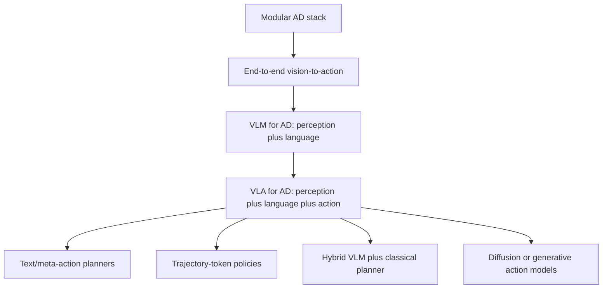

# VLA for Driving Survey (Jiang et al., 2025)

The VLA for Driving survey page synthesizes the 2025 paper "A Survey on Vision-Language-Action Models for Autonomous Driving" by Jiang and collaborators with the system papers in this folder, including [DriveVLM](/cs/autonomous-driving/drivevlm), [AutoVLA](/cs/autonomous-driving/autovla), OpenDriveVLA, DiffVLA, Senna, and related language-agent work. The survey formalizes VLA4AD as a research direction: models that connect visual perception, language understanding, and vehicle action.

This page is supplementary to the older foundational [end-to-end driving](/cs/autonomous-driving/end-to-end-driving) page. The classical end-to-end question is "can a model map sensors to actions?" The VLA question is sharper: can a model use language and world knowledge to reason about rare scenes, follow instructions, explain decisions, and still produce physically valid trajectories under real-time constraints?

## Definitions

A **vision-language-action model for autonomous driving** consumes visual observations, optional text instructions or route prompts, ego state, and sometimes map context, then produces a driving action. Abstractly:

$$
a_{1:T}=\pi_\theta(I_{1:n},s_{\mathrm{ego}},\tau_{\mathrm{text}},m),
$$

where $I_{1:n}$ are images or video frames, $s_{\mathrm{ego}}$ is ego state, $\tau_{\mathrm{text}}$ is language input, and $m$ is optional map or route context.

The survey distinguishes related paradigms:

- **End-to-end AD:** raw or mid-level sensors to trajectory/control.
- **VLM for AD:** visual-language reasoning about scenes, often without direct action.
- **VLA for AD:** perception, reasoning, and action in one policy or tightly coupled system.

A **language-conditioned driving task** may ask the system to follow an instruction such as "yield to the ambulance," answer a scene question, produce a rationale, or generate an ego trajectory. The action interface may be:

1. Textual meta-actions.
2. Discrete action tokens.
3. Continuous waypoints.
4. Latent action tokens passed to a planner.
5. Control commands.

The survey also emphasizes evaluation across multiple axes:

$$
\mathrm{score} =
f(\mathrm{safety},\mathrm{route\ completion},\mathrm{comfort},\mathrm{language\ fidelity},\mathrm{explanation\ quality}).
$$

No single metric captures the whole problem.

## Key results

The survey's abstract says it formalizes common architectural building blocks, traces evolution from explainers to reasoning-centric VLA models, compares more than 20 representative models, consolidates datasets and benchmarks, and identifies open challenges such as robustness, real-time efficiency, and formal verification.

The useful synthesis is a three-stage research arc:

1. **Explainer systems:** models describe scenes or justify actions, but do not control the vehicle.
2. **Reasoning advisors:** models output decisions, meta-actions, or critiques that guide a planner.
3. **Action-generating VLA systems:** models directly output action tokens, trajectories, or controls.

This arc is visible in the papers in the source folder. [DriveVLM](/cs/autonomous-driving/drivevlm) uses chain-of-thought scene description, scene analysis, and hierarchical planning, then proposes a dual system for grounding. [AutoVLA](/cs/autonomous-driving/autovla) integrates action tokens into an autoregressive VLA. DiffVLA combines VLM guidance with diffusion planning. Language-agent papers such as GPT-Driver, DriveAgent, Reason2Drive, LingoQA, and Senna explore text interfaces, reasoning chains, and driving QA.

The survey's most important caution is that language ability does not solve driving by itself. VLA systems must bridge the **action gap**: a plausible explanation must become a safe trajectory. They must also handle the **spatial grounding gap**: text and images do not automatically give centimeter-level geometry. Finally, they must handle the **latency gap**: large models may reason too slowly for high-frequency control.

The taxonomy is useful because papers often use overlapping terms. A model that answers questions about a traffic scene is not necessarily a VLA model. A model that outputs a high-level command such as "change lanes" may still need a conventional planner. A model that outputs waypoints but has no language interface is end-to-end driving, not VLA. The action channel and the language channel both matter.

Datasets are another dividing line. Some datasets evaluate visual question answering or caption quality; others evaluate trajectory imitation; still others evaluate closed-loop driving. A strong score on one does not transfer automatically. For example, a model can explain why a pedestrian matters while failing to stop in simulation. Conversely, a model can drive acceptably while producing vague or wrong explanations. VLA evaluation must therefore align the textual and physical outputs.

The survey also points toward social alignment. Human road users communicate through gestures, conventions, emergency signals, and context. Language-capable models may help parse these cues, but only if they are grounded in local law, ODD, and sensor evidence. In driving, "commonsense" is jurisdiction-dependent and safety-critical. A VLA system needs not only a large prior, but also strict interfaces to rule checking and fallback behavior.

A useful practical classification is by action authority. Low-authority VLA systems produce explanations or advice for a separate planner. Medium-authority systems choose maneuver classes or planner costs. High-authority systems output trajectories or controls. The higher the authority, the stronger the requirements on latency, calibration, safety monitoring, and verification. Many papers blur this distinction, but it is central for engineering risk.

The survey also makes clear that benchmarks need to combine language and control. If a model follows a trajectory but ignores a natural-language instruction, it fails the language side. If it follows the instruction but violates traffic safety, it fails the driving side. VLA is the intersection, so evaluation should penalize failures in either modality.

For SJ Wiki, this page should serve as a map of the literature rather than a recommendation to deploy VLA drivers. The field is promising because language can expose intent and reasoning; it is risky because language models are not naturally safety-certified control systems.

A mature VLA stack would need the same engineering discipline as any AV stack: ODD limits, redundancy, monitoring, scenario testing, and clear authority boundaries.

Those boundaries should be explicit in every paper comparison.

## Visual



| Paradigm | Typical output | Example systems | Main open issue |
|---|---|---|---|
| VLM explainer | Caption, QA, rationale | DriveLM, LingoQA | Not directly executable |
| Language agent | Decision or meta-action | GPT-Driver, DriveAgent | Tool grounding and latency |
| Hybrid VLM planner | Guidance plus trajectory | DriveVLM-Dual | Interface validation |
| VLA action model | Tokens or waypoints | AutoVLA, OpenDriveVLA | Feasibility and safety |
| VLM-guided diffusion | Multimodal trajectories | DiffVLA | Sampling cost and closed-loop reliability |

## Worked example 1: Scoring language fidelity and safety

Problem: A benchmark scores a VLA output using safety score $S=0.8$, route score $R=0.9$, and language fidelity $L=0.6$. The combined score is

$$
J=0.5S+0.3R+0.2L.
$$

Compute $J$ and interpret the result.

1. Safety contribution:

$$
0.5S=0.5(0.8)=0.4.
$$

2. Route contribution:

$$
0.3R=0.3(0.9)=0.27.
$$

3. Language contribution:

$$
0.2L=0.2(0.6)=0.12.
$$

4. Total:

$$
J=0.4+0.27+0.12=0.79.
$$

Answer: the combined score is 0.79.

Check: The model drives reasonably well but language fidelity is weaker. A VLA evaluation should expose that difference instead of hiding it inside one number.

## Worked example 2: Detecting the action gap

Problem: A model outputs the text "yield to the pedestrian" but produces waypoints $(2,0)$, $(4,0)$, $(6,0)$ at 1-second intervals. A pedestrian occupies the crosswalk at $x=5$, $y=0$. Does the action match the language?

1. The language says yield, which implies slowing or stopping before the crosswalk.

2. The third waypoint is $(6,0)$, beyond the pedestrian at $x=5$.

3. If the ego follows these waypoints, it passes through the occupied crosswalk zone.

4. Therefore, the action contradicts the language.

Answer: this is an action-gap failure.

Check: A text-only metric might reward the correct phrase. A driving metric must inspect the trajectory.

## Code

```python
def vla_composite_score(safety, route, language, weights=(0.5, 0.3, 0.2)):
    return weights[0] * safety + weights[1] * route + weights[2] * language

def action_gap(yield_text, waypoints, pedestrian_x, stop_margin=1.0):
    if not yield_text:
        return False
    max_x = max(x for x, _ in waypoints)
    return max_x > pedestrian_x - stop_margin

score = vla_composite_score(0.8, 0.9, 0.6)
gap = action_gap(True, [(2, 0), (4, 0), (6, 0)], pedestrian_x=5.0)
print(score, gap)
```

## Common pitfalls

- Treating VLA as just VLM with a driving prompt. The action interface is the defining feature.
- Rewarding explanations without checking trajectories.
- Ignoring real-time constraints. A good answer after two seconds may be useless for control.
- Assuming internet-scale commonsense is enough for traffic law compliance.
- Evaluating only open-loop imitation. VLA systems need closed-loop, instruction-following, and safety tests.
- Forgetting formal verification and fallback. Language models are hard to certify.

## Connections

- [DriveVLM](/cs/autonomous-driving/drivevlm)
- [AutoVLA](/cs/autonomous-driving/autovla)
- [MLLM for Driving Survey](/cs/autonomous-driving/mllm-for-driving-survey)
- [Diffusion Planning for Driving](/cs/autonomous-driving/diffusion-planning-for-driving)
- [End-to-end driving](/cs/autonomous-driving/end-to-end-driving)
- [Safety, ISO 26262, SOTIF, and scenario testing](/cs/autonomous-driving/safety-iso26262-sotif-scenario-testing)
- Further reading: A Survey on VLA Models for Autonomous Driving, DriveVLM, AutoVLA, OpenDriveVLA, DiffVLA, Senna, GPT-Driver, DriveAgent, Reason2Drive, and LingoQA.
