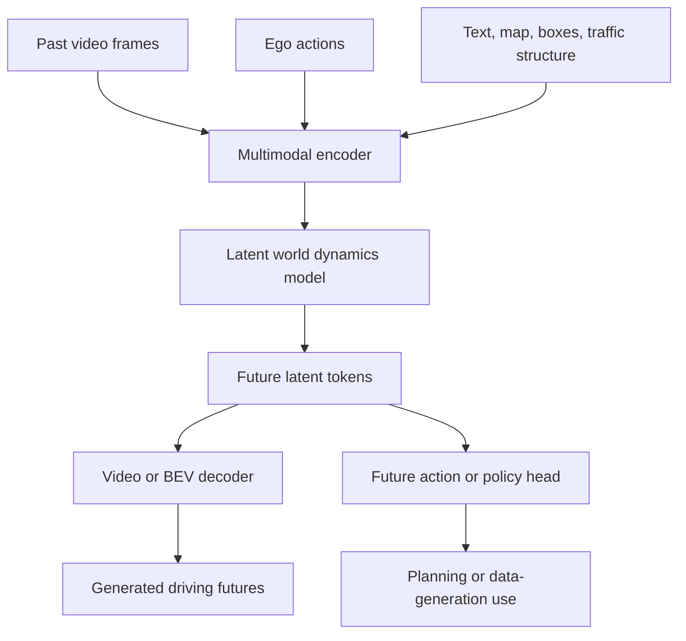

# World Models for Driving (DriveDreamer and GAIA-1)

World models for driving learn to predict or generate future driving scenes conditioned on observations, text, actions, maps, or traffic structure. This page synthesizes DriveDreamer, introduced by Wang and collaborators in 2023, and GAIA-1, introduced by Hu, Russell, Yeo, Murez, Fedoseev, Kendall, and collaborators in 2023, with related generative driving papers in the folder such as GenAD and 3D-VLA.

The page is supplementary modern context for [simulation and data](/cs/autonomous-driving/simulation-and-data), [prediction](/cs/autonomous-driving/prediction-and-motion-forecasting), and [end-to-end driving](/cs/autonomous-driving/end-to-end-driving). A world model is not just a pretty video generator. For autonomy, its value is whether it captures scene dynamics well enough to support training, planning, counterfactual testing, and long-tail scenario generation.

## Definitions

A **world model** learns a representation of environment dynamics:

$$
p_\theta(s_{t+1:t+T}\mid s_{\le t}, a_{t:t+T}, c),
$$

where $s$ is scene state or video, $a$ is ego action, and $c$ is conditioning such as text, map, or traffic structure.

A **generative driving video model** produces future video frames or latent frame tokens. It may be conditioned on text, actions, maps, bounding boxes, or previous frames.

DriveDreamer uses a diffusion-based approach and a two-stage training pipeline. The first stage learns traffic structural conditions; the second stage performs future video prediction and action generation. The source abstract calls it a world model derived from real-world driving scenarios and reports experiments on nuScenes.

GAIA-1 frames world modeling as unsupervised sequence modeling. It encodes video, text, and action into tokens, uses an autoregressive world model to predict future image tokens, and decodes them with a video diffusion decoder. The source abstract emphasizes video, text, and action inputs with fine-grained control over ego behavior and scene features.

A useful decomposition is:

$$
\text{encoder}\rightarrow\text{latent dynamics}\rightarrow\text{decoder}.
$$

The latent dynamics are what make the model useful for prediction and planning. The decoder quality determines whether generated scenes are visually useful.

## Key results

DriveDreamer's source abstract states that it can generate high-quality driving videos and reasonable driving policies from real-world driving data, with controllable generation aligned to traffic constraints and open-loop planning results on nuScenes. GAIA-1's source abstract states that it generates realistic driving scenarios from video, text, and action inputs and shows emerging properties such as high-level structure, contextual awareness, generalization, and geometry understanding.

The shared result is that generative models can represent more than static perception. They can ask counterfactual questions:

- What happens if ego accelerates?
- What if the light turns green?
- What if the weather changes?
- What if a pedestrian starts crossing?

For driving, the most important conditioning is action. A passive video predictor may extrapolate likely futures, but a planner needs action-conditioned futures:

$$
p(s_{t+1:t+T}\mid s_{\le t}, a^{\mathrm{ego}}_{t:t+T}).
$$

If the model cannot distinguish "ego brakes" from "ego accelerates," it cannot evaluate plans.

The limitation is evaluation. A video can look realistic while being dynamically wrong. A world model used for planning must preserve geometry, actor intent, traffic rules, and causal reaction. Generated data must not teach perception models impossible artifacts. Therefore, world-model pages should be connected to [safety and scenario testing](/cs/autonomous-driving/safety-iso26262-sotif-scenario-testing), not only to deep generative modeling.

A useful distinction is between **rendering fidelity** and **dynamics fidelity**. Rendering fidelity asks whether frames look like real driving video. Dynamics fidelity asks whether agents move, yield, accelerate, brake, and react in ways consistent with traffic physics and human behavior. A model can have high rendering fidelity but poor dynamics fidelity, especially over long horizons. For planning, dynamics fidelity is usually more important.

Another distinction is between **data generation** and **decision support**. For data generation, a world model might create rare weather, lighting, or object configurations to train perception systems. For decision support, it must forecast the consequences of ego actions. The latter is harder because it requires causal conditioning: if ego slows, other agents may proceed; if ego nudges forward, a pedestrian may stop or continue. Static scene generation does not test this.

World models also raise validation questions. A generated near-miss scenario can be useful for stress testing, but the scenario should be physically plausible and semantically consistent. If a generated traffic light changes color inconsistently or a vehicle teleports, a planner trained on it may learn the wrong behavior. Scenario filtering, physical constraints, and human review remain important parts of a generative data pipeline.

Another practical issue is horizon. Short-horizon generation can preserve appearance and motion continuity, but planning often needs several seconds of foresight. Errors compound over time: lane geometry can drift, agents can blur, and traffic-rule state can become inconsistent. A world model used for long-horizon planning must either maintain a structured latent state or periodically re-ground itself with map and perception constraints.

There is also a difference between ego-conditioned and scene-conditioned generation. Text such as "rainy night" changes appearance, while an ego action such as braking changes interactions. A strong driving world model should support both. Appearance control helps data augmentation; action control helps planning. Mixing the two without clear interfaces can produce videos that are visually diverse but causally weak.

In an AV data engine, world models are most useful when paired with scenario search. The system can generate candidate long-tail scenes, filter them for plausibility, run planners through them, and keep failures for regression testing.

That workflow treats generation as a way to find hard cases, not as a substitute for real logs, formal scenario design, or closed-loop validation.

Generated futures should earn trust through downstream tests.

Visual plausibility alone is too weak.

## Visual



| Model | Core representation | Conditioning | Main use |
|---|---|---|---|
| DriveDreamer | Diffusion with traffic structure | Text, action, HD map, 3D boxes | Controllable video and policy generation |
| GAIA-1 | Autoregressive latent tokens plus diffusion decoder | Video, text, action | Multimodal future rollouts |
| GenAD | Generative end-to-end driving | Driving scene inputs | Generative planning |
| 3D-VLA | 3D VLA world model | 3D-aware inputs | Vision-language-action generation |

## Worked example 1: Action-conditioned branching

Problem: A world model predicts ego position after 2 seconds. Current speed is 10 m/s. Branch A keeps speed constant. Branch B brakes at $a=-3$ m/s squared. Compute ego travel distance for both branches using constant acceleration.

1. Constant-speed branch:

$$
d_A=vt=10(2)=20\ \mathrm{m}.
$$

2. Braking branch:

$$
d_B=vt+\frac{1}{2}at^2=10(2)+\frac{1}{2}(-3)(2^2).
$$

3. Compute:

$$
d_B=20-6=14\ \mathrm{m}.
$$

4. Difference:

$$
d_A-d_B=6\ \mathrm{m}.
$$

Answer: action conditioning should produce futures separated by about 6 m after 2 seconds.

Check: If a generated video shows the same ego progress for both actions, the model is not action-grounded enough for planning.

## Worked example 2: Diffusion noise step for a trajectory

Problem: A clean 1D trajectory endpoint is $x_0=10$. A diffusion forward process uses $\alpha=0.8$, $\sigma=0.6$, and noise $\epsilon=-1$. Compute noisy sample $x_t=\alpha x_0+\sigma\epsilon$.

1. Signal term:

$$
\alpha x_0=0.8(10)=8.
$$

2. Noise term:

$$
\sigma\epsilon=0.6(-1)=-0.6.
$$

3. Add:

$$
x_t=8-0.6=7.4.
$$

Answer: the noisy sample is 7.4.

Check: The noisy sample is closer to the clean value than pure noise because $\alpha$ is still large.

## Code

```python
import torch

def forward_diffusion(x0, alpha, sigma):
    eps = torch.randn_like(x0)
    xt = alpha * x0 + sigma * eps
    return xt, eps

def constant_accel_rollout(x, v, accel, dt=0.5, steps=6):
    out = []
    for _ in range(steps):
        x = x + v * dt + 0.5 * accel * dt * dt
        v = v + accel * dt
        out.append(torch.stack([x, v]))
    return torch.stack(out)

x0 = torch.tensor([10.0, 20.0, 30.0])
xt, eps = forward_diffusion(x0, alpha=0.8, sigma=0.6)
rollout = constant_accel_rollout(torch.tensor(0.0), torch.tensor(10.0), torch.tensor(-3.0))
print(xt, rollout[-1])
```

## Common pitfalls

- Judging world models only by image realism. Planning needs causal and metric correctness.
- Ignoring action conditioning. A planner needs different futures for different ego actions.
- Training perception on generated data without checking domain artifacts.
- Treating open-loop video prediction as closed-loop driving validation.
- Assuming text control is exact. "Rainy night" or "green light" prompts must correspond to consistent scene state.
- Forgetting rare-event coverage. World models can generate long-tail scenarios, but those scenarios still need validation.

## Connections

- [Simulation and data](/cs/autonomous-driving/simulation-and-data)
- [Prediction and motion forecasting](/cs/autonomous-driving/prediction-and-motion-forecasting)
- [End-to-end driving](/cs/autonomous-driving/end-to-end-driving)
- [Diffusion Planning for Driving](/cs/autonomous-driving/diffusion-planning-for-driving)
- [VLA for Driving Survey](/cs/autonomous-driving/vla-for-driving-survey)
- [Safety, ISO 26262, SOTIF, and scenario testing](/cs/autonomous-driving/safety-iso26262-sotif-scenario-testing)
- Further reading: DriveDreamer, GAIA-1, GenAD, 3D-VLA, DriveGAN, MILE, SEM2, diffusion video models, and action-conditioned world models.
