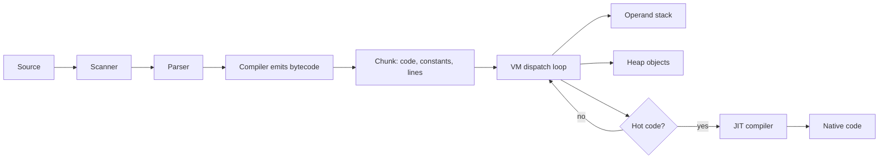

# Bytecode Compilation and Virtual Machines

Bytecode compilation is the step from a high-level representation, often an AST, to compact instructions for a virtual machine. Nystrom's second Lox implementation, clox, compiles source code directly to bytecode and executes it on a stack VM written in C [1]. This shifts work from tree traversal to instruction dispatch, improves locality, and prepares the implementation for optimization techniques used by larger systems.

A virtual machine is a software processor. Its instruction set is not x86, ARM, or RISC-V, but a language-specific design that makes common operations easy to encode. A VM may be deliberately simple, as in clox, or industrially sophisticated, as in the JVM, .NET CLR, Lua, CPython, or JavaScript engines that combine bytecode with just-in-time compilation.

## Definitions

**Bytecode** is a dense instruction sequence for a virtual architecture. Each instruction has an **opcode** and may have **immediate operands**. In clox, an `OP_CONSTANT` instruction is followed by a byte that indexes a constant pool [1].

A **constant pool** stores literals and other compile-time constants separately from the instruction stream. This avoids embedding arbitrary-size strings or numbers inline. It also lets instructions use compact indexes.

A **chunk** is Nystrom's term for a bytecode object containing code bytes, constants, and line information [1]. Other VMs call similar objects code objects, methods, functions, or basic blocks.

A **stack-based VM** stores intermediate values on an operand stack. An instruction such as `ADD` pops two values and pushes the result. A **register-based VM** names virtual registers explicitly; `ADD r3, r1, r2` reads two registers and writes another. Stack bytecode is compact and easy to generate. Register bytecode often uses fewer dispatches but wider instructions [1], [4].

The **instruction pointer** points to the next bytecode instruction. A **dispatch loop** fetches the opcode, decodes operands, executes the operation, and repeats. Common dispatch styles include `switch` dispatch, computed goto, direct threading, and inline threaded code. Computed goto can reduce branch overhead in C compilers that support labels as values.

A **compiler pass** from AST to bytecode traverses source constructs and emits instructions. It must preserve expression evaluation order, stack discipline, control flow, local-variable lifetimes, and source-location mapping.

A **JIT compiler** translates bytecode or an internal IR to native machine code at runtime. A **template JIT** expands bytecodes into prebuilt machine-code snippets, a **method JIT** compiles whole functions or methods, and a **tracing JIT** records hot loops or paths and compiles those traces [5].

## Key results

The first result is stack effect accounting. Each bytecode instruction has a stack effect. For example:

| Instruction | Stack before | Stack after | Effect |
|---|---|---|---|
| `CONSTANT k` | `...` | `..., const[k]` | +1 |
| `ADD` | `..., a, b` | `..., a+b` | -1 |
| `NEGATE` | `..., a` | `..., -a` | 0 |
| `POP` | `..., a` | `...` | -1 |
| `RETURN` | `..., a` | exits | depends |

A correct compiler guarantees that every instruction sees the values it expects. This replaces the tree-walker's implicit host call stack with an explicit operand stack.

The second result is that compilation order follows evaluation order. For `1 + 2 * 3`, compile `1`, compile `2`, compile `3`, multiply the last two values, then add. The emitted bytecode is postorder traversal for pure expressions. Statements add control-flow and stack-cleanup obligations.

The third result is that local variables can be stack slots. In clox, locals are not stored in a hash table; the compiler tracks local declarations and emits slot accesses. This is much faster than environment lookup. Closures complicate the story because captured locals must survive after the declaring function returns. clox handles this with **upvalues**, open upvalue lists, and closing operations [1].

The fourth result is that control flow is encoded with jumps. A compiler emits placeholder offsets for forward jumps and patches them once the target location is known. For loops, it emits a backward jump. Offset width becomes a real design limit: one byte is compact but too small for large functions; two or four bytes are more flexible.

The fifth result is that dispatch dominates simple interpreter performance. In a `switch` loop, each bytecode often costs an indirect branch plus C control-flow overhead. Direct threading can improve branch prediction by jumping directly to the next opcode handler, but it is less portable. Superinstructions combine common sequences, and quickening rewrites generic bytecodes to specialized bytecodes after runtime information is known.

The sixth result is that bytecode is not the same as an optimizing IR. Bytecode is usually compact and executable; an optimizer often wants explicit control-flow graphs, SSA, and typed operations. Many systems therefore parse to AST, lower to bytecode for baseline execution, and also lower hot code to richer IR for JIT optimization.

The seventh result is that call frames are the VM's replacement for host recursion. A frame records the function or closure being executed, the instruction pointer for that function, and the base slot where its locals begin. Calls push frames; returns pop them and leave a result for the caller. This is how clox supports recursion without recursively calling C for every Lox call [1]. Frame layout also determines how stack traces, debugging, tail calls, and exception unwinding can be implemented.

The eighth result is that VM verification can be a separate safety layer. A bytecode loader may check that every jump lands on an instruction boundary, every stack access is valid, every local slot is initialized, and every function returns with a consistent stack height. Small educational VMs often trust their own compiler, but distributed bytecode formats such as JVM class files need validation because bytecode can come from outside the current compiler pipeline.

The ninth result is that globals, locals, and captured variables deserve different bytecodes. A global lookup often goes through a hash table because names can be resolved late or exposed across modules. A local access can be a direct stack-slot read. A captured variable may be an upvalue that points either to an open stack slot or to a closed heap cell after the declaring function returns. Treating all three cases as one generic name lookup is simple but loses most of the performance benefit that bytecode compilation is meant to provide.

## Visual



| VM design | Instruction example | Strength | Cost |
|---|---|---|---|
| Stack VM | `PUSH 1; PUSH 2; ADD` | Compact code, simple compiler | More dispatches, implicit operands |
| Register VM | `ADD r3, r1, r2` | Fewer moves and dispatches | Wider bytecode, register allocation or naming |
| AST interpreter | `Binary(Literal(1), "+", Literal(2))` | Clear semantics | Pointer-heavy execution |
| Native code | `add rax, rbx` | Fastest steady state | Complex code generation and portability work |

## Worked example 1: Compiling and running an expression

Problem: compile and execute:

```text
print 1 + 2 * 3;
```

Method:

1. Parse according to precedence. The AST is `Print(Binary(1, "+", Binary(2, "*", 3)))`.
2. Emit constants into the constant pool:

$$
C_0=1,\quad C_1=2,\quad C_2=3.
$$

3. Compile the left operand of `+`: emit `CONSTANT 0`. Stack becomes `[1]` at runtime.
4. Compile the right operand `2 * 3`: emit `CONSTANT 1`, `CONSTANT 2`, then `MULTIPLY`. Stack evolves:

```text
[] -> [1] -> [1, 2] -> [1, 2, 3] -> [1, 6]
```

5. Emit `ADD`. Stack becomes `[7]`.
6. Emit `PRINT`. It pops and prints `7`.
7. Emit `RETURN` or `EOF` to stop the VM.

Checked bytecode:

| Offset | Instruction | Operand | Stack after execution |
|---:|---|---:|---|
| 0 | `CONSTANT` | 0 | `[1]` |
| 2 | `CONSTANT` | 1 | `[1, 2]` |
| 4 | `CONSTANT` | 2 | `[1, 2, 3]` |
| 6 | `MULTIPLY` | none | `[1, 6]` |
| 7 | `ADD` | none | `[7]` |
| 8 | `PRINT` | none | `[]` |
| 9 | `RETURN` | none | halted |

The output is `7`, proving that compile order preserved precedence.

## Worked example 2: Patching a forward jump

Problem: compile:

```text
if (cond) print 1; else print 2;
```

Use a stack VM with `JUMP_IF_FALSE offset`, `JUMP offset`, and `POP`.

Method:

1. Compile `cond`; it leaves a truth value on the stack.
2. Emit `JUMP_IF_FALSE ??` with a placeholder offset. Record the instruction location as `then_jump`.
3. Emit `POP` to discard the condition before the then branch.
4. Compile `print 1`.
5. Emit `JUMP ??` to skip the else branch. Record this as `else_jump`.
6. Patch `then_jump` to point to the first instruction of the else path.
7. Emit `POP` to discard the condition before the else branch.
8. Compile `print 2`.
9. Patch `else_jump` to point after the else branch.

Checked layout:

| Offset | Instruction | Meaning |
|---:|---|---|
| 0 | code for `cond` | leaves condition |
| 5 | `JUMP_IF_FALSE 8` | skip then branch when false |
| 8 | `POP` | discard condition for true path |
| 9 | `CONSTANT 1` | then value |
| 11 | `PRINT` | print then value |
| 12 | `JUMP 5` | skip else branch |
| 15 | `POP` | discard condition for false path |
| 16 | `CONSTANT 2` | else value |
| 18 | `PRINT` | print else value |
| 19 | next code | patched target |

The exact offsets depend on operand width, but the invariant is fixed: both paths clean the condition, and only one branch prints.

## Code

```python
from enum import IntEnum

class Op(IntEnum):
    CONSTANT = 1
    ADD = 2
    MULTIPLY = 3
    PRINT = 4
    RETURN = 5

class VM:
    def __init__(self, code, constants):
        self.code = code
        self.constants = constants
        self.stack = []
        self.ip = 0

    def read_byte(self):
        value = self.code[self.ip]
        self.ip += 1
        return value

    def run(self):
        while True:
            op = Op(self.read_byte())
            if op == Op.CONSTANT:
                index = self.read_byte()
                self.stack.append(self.constants[index])
            elif op == Op.ADD:
                b = self.stack.pop()
                a = self.stack.pop()
                self.stack.append(a + b)
            elif op == Op.MULTIPLY:
                b = self.stack.pop()
                a = self.stack.pop()
                self.stack.append(a * b)
            elif op == Op.PRINT:
                print(self.stack.pop())
            elif op == Op.RETURN:
                return

if __name__ == "__main__":
    constants = [1, 2, 3]
    code = [
        Op.CONSTANT, 0,
        Op.CONSTANT, 1,
        Op.CONSTANT, 2,
        Op.MULTIPLY,
        Op.ADD,
        Op.PRINT,
        Op.RETURN,
    ]
    VM(code, constants).run()
```

## Common pitfalls

- Emitting bytecode before defining a precise stack effect for every instruction.
- Forgetting to pop temporary values after expression statements or branches.
- Patching jump offsets from the wrong base address.
- Using one-byte operands without checking large functions or constant pools.
- Losing source line information during bytecode generation.
- Treating stack VM bytecode as if it were automatically suitable for optimization.
- Allowing host integer or floating behavior to differ silently from language semantics.
- Implementing `return` without unwinding call frames correctly.
- Closing over stack locals after their frame has been popped.
- Assuming computed goto is portable C.
- Measuring dispatch speed without realistic programs or branch behavior.
- Mixing compile-time locals and runtime globals in one lookup mechanism.
- Forgetting that native calls can reenter the VM or trigger garbage collection.
- Adding JIT compilation before the bytecode interpreter is semantically stable.
- Treating bytecode as portable without specifying versioning, operand widths, and endianness for serialized chunks.
- Forgetting to validate stack height at branch merge points when bytecode can be loaded from untrusted sources.

## Connections

- [Tree-Walking Interpreters](/cs/compilers/tree-walking-interpreters) provide the direct semantic model that bytecode preserves more efficiently.
- [Intermediate Representations and Optimization](/cs/compilers/intermediate-representations-and-optimization) explains why optimizing compilers often lower bytecode to CFG or SSA.
- [Garbage Collection and Runtime Systems](/cs/compilers/garbage-collection-and-runtime-systems) manages heap objects referenced by VM stacks, frames, and constants.
- [Semantic Analysis and Type Checking](/cs/compilers/semantic-analysis-and-type-checking) can annotate ASTs before bytecode generation.
- [Computer Architecture](/cs/computer-architecture/intro) explains dispatch, branch prediction, registers, and native code generation.
- [Operating Systems](/cs/operating-systems/intro) covers executable loading, virtual memory, signals, and threads relevant to VMs.
- [Programming Language Theory](/cs/programming-language-theory/intro) provides semantics that bytecode execution must implement.
- [Theory of Computation](/cs/theory/intro) supplies formal models of computation underlying virtual machines.

## References

[1] R. Nystrom, *Crafting Interpreters*. Genever Benning, 2021.  
[2] A. V. Aho, M. S. Lam, R. Sethi, and J. D. Ullman, *Compilers: Principles, Techniques, and Tools*, 2nd ed. Pearson, 2006.  
[3] A. W. Appel, *Modern Compiler Implementation in ML*. Cambridge University Press, 1998.  
[4] K. D. Cooper and L. Torczon, *Engineering a Compiler*, 2nd ed. Morgan Kaufmann, 2012.  
[5] S. S. Muchnick, *Advanced Compiler Design and Implementation*. Morgan Kaufmann, 1997.  
[6] M. Anton Ertl and D. Gregg, "The structure and performance of efficient interpreters," *Journal of Instruction-Level Parallelism*, vol. 5, 2003.  
[7] J. Aycock, "A brief history of just-in-time," *ACM Computing Surveys*, vol. 35, no. 2, pp. 97-113, 2003.
