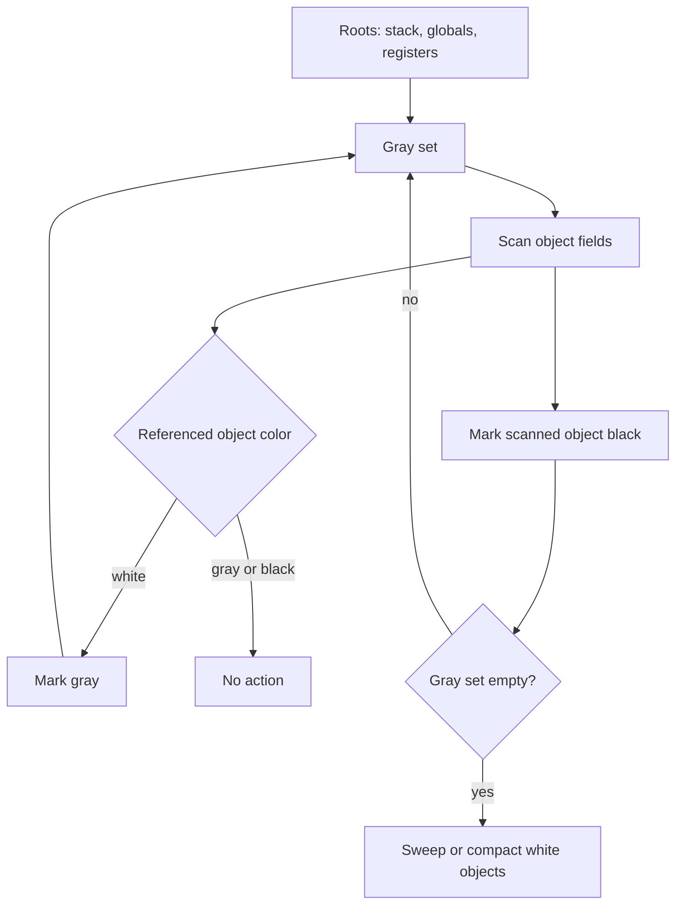

# Garbage Collection and Runtime Systems

A language runtime is the part of an implementation that keeps programs alive while they execute. It manages call stacks, heap objects, strings, classes, method tables, exceptions, native calls, synchronization, and memory reclamation. Nystrom's clox runtime deliberately stays small: values, objects, strings, tables, call frames, upvalues, and a simple mark-and-sweep garbage collector [1]. Production runtimes add generational, incremental, concurrent, and compacting collectors because allocation behavior dominates real workloads [2]-[5].

Garbage collection, or GC, is automatic memory management. Instead of requiring user code to free every object manually, the runtime discovers which heap objects are still reachable and reclaims the rest. The design space is wide: reference counting, tracing, copying, mark-compact, generational, and concurrent collectors all make different tradeoffs among throughput, latency, locality, implementation complexity, and interaction with native code.

## Definitions

A process image is commonly described using **text**, **data**, **BSS**, **stack**, and **heap** regions. The text segment holds executable code. The data segment holds initialized globals. BSS holds zero-initialized globals. The stack holds call frames, return addresses, spills, and local activation data. The heap holds dynamically allocated objects whose lifetime is not tied to a single stack frame.

A **runtime system** is the support code and metadata required by the language during execution. In a VM, the runtime is often inside the VM process. In an ahead-of-time compiled language, runtime routines may be linked into the executable.

A **GC root** is a reference that the collector treats as initially live. Roots include VM operand stacks, call frames, global variables, open upvalues, registers, native handles, class tables, interned strings, and compiler-generated safepoint maps. If the collector misses a root, it may free a live object.

**Reference counting** stores a count on each object. Assigning or copying a reference increments the count; dropping a reference decrements it; a zero count triggers immediate reclamation. CPython uses reference counting plus a cycle detector, and Swift uses ARC for many object lifetimes. Reference counting gives prompt destruction but struggles with cycles and write overhead.

**Tracing GC** starts from roots and traverses object references. Any object reached is live; unreached objects are garbage. **Mark-and-sweep** marks live objects, then sweeps the heap list to free unmarked objects. **Copying collection**, such as Cheney's algorithm, copies live objects from from-space to to-space and leaves garbage behind [6]. **Mark-compact** marks live objects and moves them together to reduce fragmentation.

The **generational hypothesis** says most objects die young. A generational collector allocates new objects in a nursery and collects it frequently with minor collections. Surviving objects are promoted to older generations collected less often. Remembered sets and write barriers track old-to-young references.

An **incremental collector** splits collection work into small pieces interleaved with program execution. A **concurrent collector** performs some work on separate threads while the program runs. Both must preserve a correctness invariant while the program mutates the object graph.

The **tri-color invariant** colors objects white, gray, or black. White objects are not yet proven live. Gray objects are live but their outgoing references have not been fully scanned. Black objects are live and fully scanned. A common invariant is that no black object points directly to a white object without the collector knowing. Read and write barriers preserve this under mutation [7].

## Key results

The first result is reachability. A tracing collector computes a graph search:

$$
\mathrm{Live} = \mathrm{Reachable}(\mathrm{Roots}, \mathrm{ObjectReferences}).
$$

It does not know whether an object will be used again in the semantic future; exact liveness is undecidable in general. It uses reachability as a safe approximation. If a program keeps a reference in a global cache, the collector must treat the object as live.

The second result is mark-and-sweep correctness. Marking starts from roots and recursively marks every referenced object. Sweeping reclaims unmarked objects and clears mark bits on marked objects for the next cycle. Nystrom's clox collector follows this direct design, with object lists and explicit marking functions for each object type [1].

The third result is that moving collectors need pointer updating. Copying and compacting collectors improve locality and remove fragmentation, but every reference to a moved object must be updated. This is easy when the runtime controls all references and has precise root maps. It is harder with conservative stack scanning or native extensions.

The fourth result is that generational collection depends on barriers. If an old object stores a reference to a young object, a nursery collection that scans only young objects and roots would miss that edge unless the runtime records it. A write barrier can add the old object or card-table entry to a remembered set whenever such a store occurs.

The fifth result is that low latency requires cooperation between compiler and runtime. Safepoints identify locations where all roots are known and the program can pause. Concurrent collectors such as modern JVM G1/ZGC and Go's collector are supplementary modern context beyond Crafting Interpreters; they combine barriers, concurrent marking, stack scanning, pacing, and OS memory tricks to reduce pause time while preserving throughput.

The sixth result is that runtime layout shapes performance. Object headers may contain type tags, mark bits, forwarding pointers, hash codes, lock state, or vtable pointers. Alignment affects cache lines. Tagged values can store small integers directly without heap allocation. String interning speeds equality but adds root-management complexity. These choices determine the cost of every allocation, field access, method call, and collection.

## Visual



```text
Process memory sketch

high addresses
+------------------+
| stack frames     |  roots: locals, return values, VM slots
| ... grows down   |
+------------------+
| mmap/shared libs |
+------------------+
| heap objects     |  strings, closures, classes, arrays
| ... grows up     |
+------------------+
| BSS              |  zero-initialized globals
+------------------+
| data             |  initialized globals
+------------------+
| text             |  code
+------------------+
low addresses
```

| Collector | Moves objects? | Handles cycles? | Typical strength | Typical cost |
|---|---|---|---|---|
| Reference counting | No | Not alone | Prompt reclamation | Increment/decrement overhead; cycles |
| Mark-and-sweep | No | Yes | Simple tracing design | Fragmentation; stop-the-world pauses |
| Copying | Yes | Yes | Fast allocation; compaction | Needs space reserve and pointer updates |
| Mark-compact | Yes | Yes | Reduces fragmentation | More complex relocation phase |
| Generational | Usually young gen moves | Yes | Exploits young-object mortality | Barriers and remembered sets |
| Concurrent | Maybe | Yes | Lower pause times | Synchronization and barrier complexity |

## Worked example 1: Mark-and-sweep reachability

Problem: decide which heap objects survive a collection. The root set contains references to `A` and `D`. Object references are:

```text
A -> B
B -> C
C -> B
D -> none
E -> F
F -> none
```

Method:

1. Initially all objects are white:

$$
White = \{A,B,C,D,E,F\}.
$$

2. Push roots `A` and `D` onto the gray worklist and mark them gray:

$$
Gray = [A,D], \quad White = \{B,C,E,F\}.
$$

3. Pop `D`. It has no outgoing references. Mark `D` black:

$$
Black = \{D\}.
$$

4. Pop `A`. It references `B`, which is white. Mark `B` gray. Mark `A` black:

$$
Gray = [B], \quad Black = \{D,A\}.
$$

5. Pop `B`. It references `C`, which is white. Mark `C` gray. Mark `B` black:

$$
Gray = [C], \quad Black = \{D,A,B\}.
$$

6. Pop `C`. It references `B`, already black. Mark `C` black:

$$
Gray = [], \quad Black = \{D,A,B,C\}.
$$

7. The gray set is empty. Sweep white objects:

$$
White = \{E,F\}.
$$

Checked answer: `A`, `B`, `C`, and `D` survive. `E` and `F` are reclaimed. The cycle `B <-> C` survives because it is reachable from `A`; a separate unreachable cycle would be collected by tracing but not by naive reference counting.

## Worked example 2: Reference counting cycle

Problem: show why simple reference counting cannot reclaim a cycle.

Program sketch:

```text
a = Node()
b = Node()
a.next = b
b.next = a
a = nil
b = nil
```

Method:

1. Allocate `Node A` and assign it to variable `a`. Count:

$$
rc(A)=1,\quad rc(B)=0.
$$

2. Allocate `Node B` and assign it to `b`:

$$
rc(A)=1,\quad rc(B)=1.
$$

3. Execute `a.next = b`. `A` now references `B`, so increment `B`:

$$
rc(A)=1,\quad rc(B)=2.
$$

4. Execute `b.next = a`. `B` now references `A`, so increment `A`:

$$
rc(A)=2,\quad rc(B)=2.
$$

5. Execute `a = nil`. Remove the variable's reference to `A`:

$$
rc(A)=1,\quad rc(B)=2.
$$

6. Execute `b = nil`. Remove the variable's reference to `B`:

$$
rc(A)=1,\quad rc(B)=1.
$$

Checked answer: no root can reach `A` or `B`, but both have nonzero counts because they reference each other. Simple reference counting leaks them. A tracing collector would start from roots, fail to reach `A` or `B`, and reclaim both. This is why CPython supplements reference counting with a cycle detector and why ARC systems often require weak references for parent pointers.

## Code

```python
class Obj:
    def __init__(self, name):
        self.name = name
        self.fields = []
        self.marked = False

    def __repr__(self):
        return self.name

class Heap:
    def __init__(self):
        self.objects = []

    def allocate(self, name):
        obj = Obj(name)
        self.objects.append(obj)
        return obj

    def mark(self, obj):
        if obj is None or obj.marked:
            return
        obj.marked = True
        for child in obj.fields:
            self.mark(child)

    def collect(self, roots):
        for root in roots:
            self.mark(root)
        survivors = []
        freed = []
        for obj in self.objects:
            if obj.marked:
                obj.marked = False
                survivors.append(obj)
            else:
                freed.append(obj)
        self.objects = survivors
        return freed

if __name__ == "__main__":
    heap = Heap()
    a = heap.allocate("A")
    b = heap.allocate("B")
    c = heap.allocate("C")
    d = heap.allocate("D")
    e = heap.allocate("E")
    f = heap.allocate("F")
    a.fields = [b]
    b.fields = [c]
    c.fields = [b]
    e.fields = [f]
    print("freed:", heap.collect([a, d]))
    print("survivors:", heap.objects)
```

## Common pitfalls

- Forgetting that roots include VM internals, not only user globals.
- Scanning a stack conservatively when the runtime assumes precise moving collection.
- Freeing an object reachable through an open upvalue, native handle, or intern table.
- Implementing mark recursion directly without guarding against deep object graphs.
- Sweeping marked objects without clearing mark bits for the next collection.
- Moving objects without updating every pointer to them.
- Ignoring finalizers, destructors, and weak references when defining reachability.
- Treating reference counting as cycle-safe by default.
- Adding a generational nursery without write barriers for old-to-young references.
- Breaking the tri-color invariant during concurrent mutation.
- Allocating during GC without a clear policy for new object color.
- Forgetting that compiler optimizations must preserve GC safepoints and root maps.
- Measuring GC only by throughput while ignoring tail latency.
- Exposing raw heap pointers through FFI without pinning or handle discipline.
- Interning strings forever, turning a speed optimization into a memory leak.

## Connections

- [Bytecode Compilation and Virtual Machines](/cs/compilers/bytecode-compilation-and-virtual-machines) defines VM stacks, frames, constants, and heap references that become GC roots.
- [Tree-Walking Interpreters](/cs/compilers/tree-walking-interpreters) allocate environments and closures whose lifetimes may exceed call frames.
- [Intermediate Representations and Optimization](/cs/compilers/intermediate-representations-and-optimization) must preserve safepoints, barriers, and root information.
- [Semantic Analysis and Type Checking](/cs/compilers/semantic-analysis-and-type-checking) can enforce ownership or provide precise type maps for runtime layout.
- [Operating Systems](/cs/operating-systems/intro) explains virtual memory, pages, signals, threads, and allocation interfaces.
- [Computer Architecture](/cs/computer-architecture/intro) explains cache locality, alignment, memory barriers, and atomic operations.
- [Programming Language Theory](/cs/programming-language-theory/intro) relates memory safety to semantics and type soundness.
- [Theory of Computation](/cs/theory/intro) gives the graph-reachability framing behind tracing collectors.

## References

[1] R. Nystrom, *Crafting Interpreters*. Genever Benning, 2021.  
[2] A. V. Aho, M. S. Lam, R. Sethi, and J. D. Ullman, *Compilers: Principles, Techniques, and Tools*, 2nd ed. Pearson, 2006.  
[3] A. W. Appel, *Modern Compiler Implementation in ML*. Cambridge University Press, 1998.  
[4] K. D. Cooper and L. Torczon, *Engineering a Compiler*, 2nd ed. Morgan Kaufmann, 2012.  
[5] S. S. Muchnick, *Advanced Compiler Design and Implementation*. Morgan Kaufmann, 1997.  
[6] C. J. Cheney, "A nonrecursive list compacting algorithm," *Communications of the ACM*, vol. 13, no. 11, pp. 677-678, 1970.  
[7] E. W. Dijkstra, L. Lamport, A. J. Martin, C. S. Scholten, and E. F. M. Steffens, "On-the-fly garbage collection: An exercise in cooperation," *Communications of the ACM*, vol. 21, no. 11, pp. 966-975, 1978.  
[8] R. Jones, A. Hosking, and E. Moss, *The Garbage Collection Handbook*. CRC Press, 2012.
