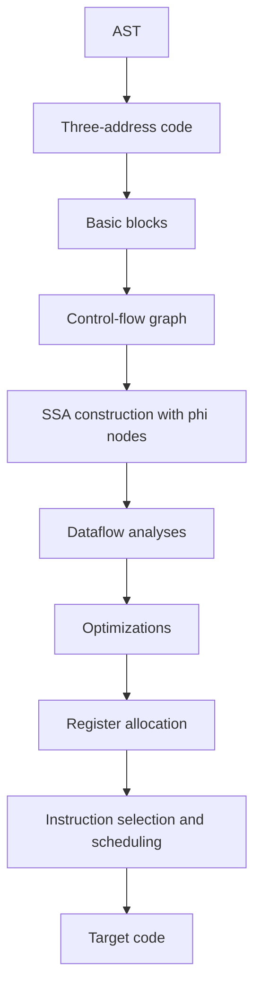

# Intermediate Representations and Optimization

An intermediate representation, or IR, is the compiler's working language between source syntax and target code. Nystrom introduces IR from a practical angle: bytecode is a compact representation for a virtual machine, and the broad compiler pipeline may include richer forms before code generation [1]. The standard compiler texts go deeper, treating IR as the place where control flow, data flow, machine independence, and optimization meet [2]-[5].

Optimization is semantics-preserving program improvement. The compiler replaces a program with another program that has the same observable behavior under the language rules but runs faster, uses less memory, exposes more parallelism, or generates better machine code. The hard part is not inventing a faster-looking transformation; it is proving that the transformation is legal.

## Definitions

**Three-address code** (TAC) represents operations with at most three explicit addresses: two sources and one destination. For example, `t1 = b * c` and `a = t1 + d`. TAC is simple, close to assembly, and easy to analyze.

**Static single assignment** (SSA) form requires every variable to be assigned exactly once. When control-flow paths merge, SSA uses $\phi$ functions to choose the value coming from each predecessor. Cytron et al. made efficient SSA construction central to modern optimization [7].

A **basic block** is a maximal straight-line sequence of instructions with one entry and one exit. A **control-flow graph** (CFG) has basic blocks as nodes and possible transfers of control as edges. Optimizations such as liveness, reaching definitions, loop detection, and dominance operate on CFGs.

**LLVM IR** is a typed, SSA-based intermediate language used by the LLVM compiler infrastructure. It is lower-level than most source ASTs but higher-level than machine code. It exposes operations, types, basic blocks, calls, memory operations, and metadata while remaining mostly target-independent.

A **local optimization** works within a basic block. Examples include constant folding, algebraic simplification, local common subexpression elimination, dead store elimination, and strength reduction. A **global optimization** uses CFG-wide information. Examples include global value numbering, liveness-based dead code elimination, code motion, and interprocedural inlining.

**Dataflow analysis** computes facts at program points by solving equations over the CFG. **Reaching definitions** asks which assignments may reach a use. **Liveness** asks which variables may be read in the future. **Available expressions** asks which expressions have already been computed and not invalidated.

**Register allocation** maps many temporaries to few machine registers. Graph coloring, associated with Chaitin's allocator, models temporaries as nodes and interferences as edges [6]. **Linear scan** allocates registers by live intervals and is popular in JITs because it is fast.

**Instruction scheduling** reorders instructions to reduce stalls while preserving dependencies. It matters most for targets with pipelines, issue width, and memory latency constraints.

## Key results

The first result is that IR choice determines which analyses are easy. ASTs preserve source structure, but loops, jumps, and short-circuit conditions are awkward to analyze globally. TAC and CFGs expose control flow. SSA exposes def-use chains. Machine IR exposes registers, addressing modes, and instruction latencies.

The second result is the basic dataflow equation form:

$$
\begin{aligned}
out[B] &= \bigcup_{S \in succ[B]} in[S] \\
in[B] &= use[B] \cup (out[B] - def[B])
\end{aligned}
$$

These are the backward liveness equations for a basic block $B$. They are solved iteratively until reaching a fixed point. Similar equations exist for forward analyses such as reaching definitions.

The third result is that SSA makes many optimizations sparse. If every value has one definition, the compiler can follow def-use chains directly. Constant propagation, dead code elimination, and common subexpression elimination become simpler because definitions are explicit. $\phi$ nodes make merges visible instead of hiding them behind repeated assignments.

The fourth result is that optimization legality depends on side effects and undefined behavior. Replacing `x * 2` with `x << 1` may be wrong for signed overflow or non-integer types. Moving a load out of a loop may be wrong if another operation can write the same memory. Removing a function call is wrong if the call has observable side effects.

The fifth result is that loop optimizations require loop structure. A natural loop has a header that dominates the loop body and a back edge into the header. Loop-invariant code motion moves computations that produce the same value each iteration to a preheader. Unrolling reduces branch overhead and exposes instruction-level parallelism. Vectorization packs independent scalar operations into SIMD instructions.

The sixth result is that register allocation connects optimization to architecture. An optimizer may create many temporaries to expose facts. The allocator then maps them to finite registers, spilling some to memory when the interference graph cannot be colored with the available register count. Good allocation can dominate performance in tight code.

The seventh result is that memory is harder than scalar SSA. Variables in SSA have explicit definitions, but loads and stores can refer to overlapping memory locations through pointers, object fields, array indexes, or aliases. Optimizers therefore need alias analysis, memory SSA, or conservative barriers before moving memory operations. This is where language semantics matter: Rust-like uniqueness, Java's memory model, C's undefined behavior rules, and dynamic-language object mutation all give different optimization freedoms.

The eighth result is that optimization pipelines are staged. Early canonicalization makes later passes easier; mid-level passes use target-independent facts; late passes adapt to the target's registers, instruction set, and calling convention. LLVM's popularity comes partly from making these layers reusable across many source languages and targets, but each front end must still lower source semantics honestly into IR [8].

## Visual



| Optimization | Scope | Example | Main safety question |
|---|---|---|---|
| Constant folding | Local | `3 * 4` to `12` | Does compile-time arithmetic match runtime semantics? |
| Common subexpression elimination | Local or global | Reuse `a+b` | Were operands unchanged and are there no hidden effects? |
| Dead code elimination | Local or global | Remove unused temporary | Is the removed instruction effect-free? |
| Strength reduction | Local or loop | `i * 8` to shift or induction update | Are overflow and type rules preserved? |
| Loop-invariant code motion | Loop | Move `n * 4` before loop | Is it safe on all iterations and exceptions? |
| Vectorization | Loop | Pack scalar adds | Are iterations independent and memory aligned enough? |

## Worked example 1: SSA for an if expression

Problem: convert this pseudo-code to SSA:

```text
x = input()
if x > 0:
    y = x
else:
    y = -x
z = y + 1
```

Method:

1. Split into basic blocks:

```text
B0: x = input(); if x > 0 goto B1 else B2
B1: y = x; goto B3
B2: y = -x; goto B3
B3: z = y + 1
```

2. Rename first assignments:

```text
B0: x1 = input(); if x1 > 0 goto B1 else B2
B1: y1 = x1; goto B3
B2: y2 = -x1; goto B3
```

3. At block `B3`, the value of `y` depends on the predecessor. Insert a $\phi$ node:

```text
B3: y3 = phi(B1: y1, B2: y2)
    z1 = y3 + 1
```

4. Check dominance. `x1` is defined in `B0`, which dominates both `B1` and `B2`, so uses of `x1` are valid. `y1` and `y2` do not dominate `B3` individually, so the $\phi$ is necessary.

Checked answer:

```text
B0:
  x1 = input()
  if x1 > 0 goto B1 else B2
B1:
  y1 = x1
  goto B3
B2:
  y2 = -x1
  goto B3
B3:
  y3 = phi(B1: y1, B2: y2)
  z1 = y3 + 1
```

Every assigned name has exactly one definition, satisfying SSA.

## Worked example 2: Liveness and an interference graph

Problem: compute liveness and register interferences for:

```text
1: a = input
2: b = a + 1
3: c = b * 2
4: d = a + c
5: return d
```

Method:

1. Work backward. Before instruction 5, `d` is live because it is returned. After instruction 5, nothing is live.
2. Instruction 4 defines `d` and uses `a` and `c`:

$$
in_4 = \{a,c\} \cup (out_4 - \{d\}) = \{a,c\}.
$$

Since $out_4 = \{d\}$, definition `d` interferes with nothing after the instruction in this simple sequence.

3. Instruction 3 defines `c` and uses `b`. Its output is $in_4=\{a,c\}$:

$$
in_3 = \{b\} \cup (\{a,c\} - \{c\}) = \{a,b\}.
$$

Because `c` is defined while `a` is live out, `c` interferes with `a`.

4. Instruction 2 defines `b` and uses `a`. Its output is $in_3=\{a,b\}$:

$$
in_2 = \{a\} \cup (\{a,b\} - \{b\}) = \{a\}.
$$

Because `b` is defined while `a` is live out, `b` interferes with `a`.

5. Instruction 1 defines `a` and uses no variable. Its output is $in_2=\{a\}$:

$$
in_1 = \emptyset \cup (\{a\} - \{a\}) = \emptyset.
$$

Checked answer:

| Instruction | Live in | Live out |
|---:|---|---|
| 1 | `{}` | `{a}` |
| 2 | `{a}` | `{a, b}` |
| 3 | `{a, b}` | `{a, c}` |
| 4 | `{a, c}` | `{d}` |
| 5 | `{d}` | `{}` |

Interference edges are `(a,b)` and `(a,c)`. Thus two registers are enough: put `a` in `R1`, `b` in `R2`, `c` in `R2`, and `d` in either register after its operands are dead.

## Code

```python
def liveness(block):
    """
    block is a list of (defined_variable_or_None, used_variables, label).
    Returns live-in and live-out sets for each instruction in a straight line.
    """
    live_out = [set() for _ in block]
    live_in = [set() for _ in block]
    after = set()
    for i in range(len(block) - 1, -1, -1):
        defined, used, _ = block[i]
        live_out[i] = set(after)
        live_in[i] = set(used) | (after - ({defined} if defined else set()))
        after = live_in[i]
    return live_in, live_out

if __name__ == "__main__":
    instructions = [
        ("a", set(), "a = input"),
        ("b", {"a"}, "b = a + 1"),
        ("c", {"b"}, "c = b * 2"),
        ("d", {"a", "c"}, "d = a + c"),
        (None, {"d"}, "return d"),
    ]
    ins, outs = liveness(instructions)
    for n, (_, _, text) in enumerate(instructions, start=1):
        print(f"{n}: {text:12} in={sorted(ins[n-1])} out={sorted(outs[n-1])}")
```

## Common pitfalls

- Calling bytecode an optimizing IR without checking whether it exposes CFG and dataflow.
- Performing algebraic rewrites without considering overflow, exceptions, NaN, or language-defined order.
- Removing code whose result is unused but whose side effects matter.
- Moving loads across stores without alias analysis.
- Treating $\phi$ functions as runtime function calls.
- Building SSA without correct dominance-frontier placement or equivalent algorithms.
- Forgetting that optimization can make debugging and source mapping harder.
- Applying loop transformations before identifying canonical loop headers and exits.
- Vectorizing loops with hidden dependencies between iterations.
- Measuring optimized code without representative workloads.
- Letting register allocation spill values needed in tight loops while preserving cold temporaries.
- Assuming graph coloring is always better than linear scan; compile-time budget matters.
- Scheduling instructions before final register allocation when the target pipeline model depends on registers.
- Ignoring target ABI constraints such as caller-saved registers and stack alignment.
- Optimizing through memory operations without alias information or a conservative fallback.
- Forgetting that debug information and exception edges are part of the observable behavior in many toolchains.

## Connections

- [Bytecode Compilation and Virtual Machines](/cs/compilers/bytecode-compilation-and-virtual-machines) provides a compact executable representation that may feed or bypass deeper IR.
- [Semantic Analysis and Type Checking](/cs/compilers/semantic-analysis-and-type-checking) supplies types, bindings, and effect facts useful for optimization.
- [Garbage Collection and Runtime Systems](/cs/compilers/garbage-collection-and-runtime-systems) constrains optimization around safepoints, barriers, and roots.
- [Parsing and Syntax Trees](/cs/compilers/parsing-and-syntax-trees) explains the ASTs that are lowered to IR.
- [Computer Architecture](/cs/computer-architecture/intro) explains registers, pipelines, caches, SIMD, and instruction scheduling.
- [Operating Systems](/cs/operating-systems/intro) matters for calling conventions, object files, virtual memory, and profiling.
- [Programming Language Theory](/cs/programming-language-theory/intro) provides equivalence and semantics needed to justify transformations.
- [Theory of Computation](/cs/theory/intro) connects fixed-point dataflow algorithms to lattice theory and decidability.

## References

[1] R. Nystrom, *Crafting Interpreters*. Genever Benning, 2021.  
[2] A. V. Aho, M. S. Lam, R. Sethi, and J. D. Ullman, *Compilers: Principles, Techniques, and Tools*, 2nd ed. Pearson, 2006.  
[3] A. W. Appel, *Modern Compiler Implementation in ML*. Cambridge University Press, 1998.  
[4] K. D. Cooper and L. Torczon, *Engineering a Compiler*, 2nd ed. Morgan Kaufmann, 2012.  
[5] S. S. Muchnick, *Advanced Compiler Design and Implementation*. Morgan Kaufmann, 1997.  
[6] G. J. Chaitin, "Register allocation and spilling via graph coloring," *SIGPLAN Notices*, vol. 17, no. 6, pp. 98-105, 1982.  
[7] R. Cytron, J. Ferrante, B. K. Rosen, M. N. Wegman, and F. K. Zadeck, "Efficiently computing static single assignment form and the control dependence graph," *ACM Transactions on Programming Languages and Systems*, vol. 13, no. 4, pp. 451-490, 1991.  
[8] C. Lattner and V. Adve, "LLVM: A compilation framework for lifelong program analysis and transformation," in *CGO*, 2004.
