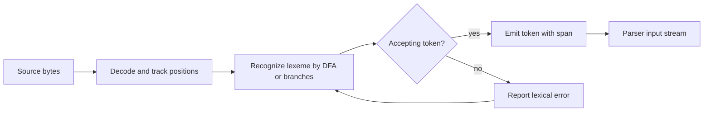

# Lexical Analysis and Scanning


*Figure: A compiler is a multi-phase pipeline; lexical analysis is the first phase that turns source characters into the token stream consumed by the parser. Image: [Wikimedia Commons](https://commons.wikimedia.org/wiki/File:Compiler.svg), Public-Domain.*

Lexical analysis is the compiler phase that turns raw source text into a stream of tokens. It is usually the first real contact between a language implementation and a user's program: characters become names, numbers, keywords, string literals, operators, punctuation, and end-of-file markers. Nystrom's Lox scanner is deliberately hand-written so that every branch is visible, while the classic compiler texts present the same job as regular-language recognition by finite automata [1], [2].

Scanning matters because every later phase depends on the token stream being precise, stable, and well located in the original file. A parser can recover from a missing semicolon only if the scanner has preserved enough position information; an interpreter can report a string-literal error only if the scanner knows where the literal began; a generated lexer can be fast only because regular expressions admit automata with simple state transitions.

## Definitions

A **lexeme** is a contiguous substring of the source program that has meaning as a unit. In `var count = 12;`, the lexemes are `var`, `count`, `=`, `12`, and `;`. A **token** is the compiler's classified record for a lexeme, usually containing a token kind, the original spelling, an optional semantic value, and a source location. The lexeme `12` might become a token such as `NUMBER("12", 12.0, line=1, column=13)`.

A **token kind** is an abstract category such as `IDENTIFIER`, `NUMBER`, `LEFT_PAREN`, or `IF`. The distinction between lexeme and token kind is important: `counter`, `total`, and `x` have different lexemes but the same token kind, while `class` and `print` are lexically identifiers in many languages but reserved keywords in Lox [1].

A **regular expression** denotes a regular language. Lexical rules such as digit sequences, identifiers, whitespace, and comments are usually regular. For example, the conventional identifier pattern is roughly:

$$
\mathrm{identifier} = [A-Za-z_][A-Za-z0-9_]*
$$

An **NFA** (nondeterministic finite automaton) may have multiple outgoing transitions for the same input and may use $\epsilon$ transitions that consume no character. A **DFA** (deterministic finite automaton) has exactly one next state for each state and input class. Thompson construction turns regular expressions into NFAs, and subset construction turns NFAs into DFAs [2]. Scanner generators such as lex and flex exploit this pipeline, then emit table-driven or direct-coded scanners.

The **longest match rule**, also called maximal munch, says that the scanner should consume the longest prefix that forms a valid token. This is why `==` becomes one equality token rather than two assignment tokens, and why `ifx` is an identifier rather than keyword `if` followed by identifier `x`. When two token rules match the same longest lexeme, lexer specifications use priority, often the rule order.

**Lookahead** is input inspected before deciding which token to emit. A hand-written scanner often needs one character of lookahead for `!` versus `!=`, `<` versus `<=`, and `/` versus `//` comments. Some languages need more lookahead or lexical modes, for example nested comments, string interpolation, or indentation-sensitive layout.

**Source locations** usually include byte offset, line, and column. For Unicode source, byte offsets and displayed columns are not identical: UTF-8 code points can occupy multiple bytes, and grapheme clusters may occupy several code points. A robust scanner can keep byte spans for machine use and line-column positions for diagnostics.

## Key results

The first key result is that token languages are usually regular. This gives the compiler writer a clean implementation choice. A hand-written scanner can encode a small DFA directly in control flow, as Nystrom does for Lox [1]. A generated scanner can combine many token regexes into one automaton and provide predictable linear-time recognition [2]. Both styles implement the same model:

1. Start at the current source position.
2. Advance while the current prefix can still match a token.
3. Remember the last accepting state.
4. Emit the token for the longest accepted prefix.
5. If no accepting state was reached, report a lexical error and resynchronize.

The second key result is the regex-to-automaton path:

$$
\text{regular expressions} \to \text{NFA} \to \text{DFA} \to \text{scanner code}.
$$

Thompson construction builds small NFA fragments for concatenation, alternation, and repetition. Subset construction represents each DFA state as a set of NFA states. If the NFA has states $Q_N$, a DFA state is an element of $2^{Q_N}$, though practical lexers rarely visit all possible subsets. DFA minimization can merge equivalent states, but many production tools skip full minimization when transition tables are already compact enough.

The third result is that lexical priority is part of the language definition, not just an implementation detail. Suppose the rules are:

| Priority | Rule | Example |
|---:|---|---|
| 1 | keyword `for` | `for` |
| 2 | identifier `[A-Za-z_][A-Za-z0-9_]*` | `format` |
| 3 | integer `[0-9]+` | `123` |
| 4 | whitespace `[ \t\r\n]+` | spaces |

For input `for`, both the keyword rule and identifier rule match length 3, so priority selects the keyword. For input `format`, the identifier rule matches length 6 while the keyword matches only length 3, so longest match selects the identifier. This is why generated lexers normally list keywords before identifiers or perform keyword lookup after reading an identifier.

The fourth result is diagnostic: a scanner should not simply crash on unknown characters. It should produce an error with the smallest helpful span, then continue at a defensible boundary. Nystrom's scanner reports an unexpected character but keeps scanning, letting the interpreter find more errors in one run [1]. Production compilers often attach file name, line, column, byte span, and a snippet.

Finally, UTF-8 handling separates lexical correctness from convenience. A scanner may treat ASCII punctuation and keywords byte by byte, but it should have an explicit policy for non-ASCII identifiers, invalid byte sequences, normalization, and display width. Languages differ: some allow Unicode identifiers; others restrict identifiers to ASCII for simplicity. Either policy is acceptable if it is documented and consistently enforced.

## Visual



| Concern | Hand-written scanner | Generated scanner |
|---|---|---|
| Main input | Source text plus manual rules | Regex specification and actions |
| Strength | Clear control over errors, modes, and small language quirks | Fast to build large token sets; proven automata algorithms |
| Weakness | Easy to miss longest-match edge cases | Diagnostics and modes can become tool-specific |
| Typical tools | Direct code, recursive helpers | lex, flex, re2c, ANTLR lexer |
| Best fit | Educational interpreters, small DSLs, custom syntax | Industrial grammars, stable specs, many token classes |

## Worked example 1: Tokenizing a small declaration

Problem: scan the Lox-like source line:

```text
var total = price * 1.08;
```

Method:

1. Start at index 0. The character `v` begins an identifier-like lexeme. Continue through letters until the space after `var`. The lexeme is `var`. Because `var` is in the keyword table, emit `VAR("var")`.
2. Skip the space. Whitespace is recognized but not emitted.
3. At index 4, `t` begins another identifier-like lexeme. Continue through `total`; stop before the space. `total` is not a reserved keyword, so emit `IDENTIFIER("total")`.
4. Skip the space. At `=`, use one-character lookahead. The next character is a space, not `=`, so emit `EQUAL("=")` rather than `EQUAL_EQUAL("==")`.
5. Skip the space. At `p`, read `price` as an identifier and emit `IDENTIFIER("price")`.
6. Skip the space. At `*`, emit `STAR("*")`.
7. Skip the space. At `1`, read digits. The scanner sees `1`, then `.`, then `0`, then `8`. Because the dot is followed by a digit, the number rule consumes the fractional part. Emit `NUMBER("1.08", 1.08)`.
8. At `;`, emit `SEMICOLON(";")`.
9. At the end of the buffer, emit `EOF`.

Checked answer:

| Order | Token kind | Lexeme | Literal value |
|---:|---|---|---|
| 1 | `VAR` | `var` | none |
| 2 | `IDENTIFIER` | `total` | none |
| 3 | `EQUAL` | `=` | none |
| 4 | `IDENTIFIER` | `price` | none |
| 5 | `STAR` | `*` | none |
| 6 | `NUMBER` | `1.08` | `1.08` |
| 7 | `SEMICOLON` | `;` | none |
| 8 | `EOF` | empty | none |

The important checks are longest match for the number and keyword lookup for `var`.

## Worked example 2: Subset construction for a tiny token

Problem: construct the reachable DFA states for the regular expression `a(b|c)*`. The language contains strings beginning with `a`, followed by zero or more `b` or `c` characters.

Method:

1. Build the intuitive NFA. State 0 expects `a` and moves to state 1. State 1 is accepting. From state 1, reading `b` or `c` returns to state 1.
2. There are no $\epsilon$ transitions in this simplified NFA, so each $\epsilon$-closure is the state itself.
3. The initial DFA state is the closure of NFA state 0:

$$
D_0 = \{0\}.
$$

4. Compute transitions from $D_0$:

$$
\delta(D_0, a) = \{1\}, \quad
\delta(D_0, b) = \emptyset, \quad
\delta(D_0, c) = \emptyset.
$$

Call $\{1\}$ state $D_1$ and $\emptyset$ the dead state $D_\bot$.

5. Compute transitions from $D_1$:

$$
\delta(D_1, a) = \emptyset, \quad
\delta(D_1, b) = \{1\}, \quad
\delta(D_1, c) = \{1\}.
$$

6. $D_1$ is accepting because it contains accepting NFA state 1. $D_0$ is not accepting. The dead state loops to itself on every input.

Checked answer:

| DFA state | NFA set | On `a` | On `b` | On `c` | Accepting? |
|---|---|---|---|---|---|
| $D_0$ | $\{0\}$ | $D_1$ | $D_\bot$ | $D_\bot$ | no |
| $D_1$ | $\{1\}$ | $D_\bot$ | $D_1$ | $D_1$ | yes |
| $D_\bot$ | $\emptyset$ | $D_\bot$ | $D_\bot$ | $D_\bot$ | no |

Testing confirms the result: `a`, `ab`, `acb`, and `abcc` are accepted; empty input, `b`, `aa`, and `ba` are rejected.

## Code

```python
from dataclasses import dataclass
from enum import Enum, auto

class Kind(Enum):
    VAR = auto()
    IDENTIFIER = auto()
    NUMBER = auto()
    EQUAL = auto()
    EQUAL_EQUAL = auto()
    STAR = auto()
    SEMICOLON = auto()
    EOF = auto()

@dataclass
class Token:
    kind: Kind
    lexeme: str
    line: int
    column: int
    literal: object = None

def scan(source: str) -> list[Token]:
    tokens: list[Token] = []
    i = 0
    line = 1
    col = 1
    keywords = {"var": Kind.VAR}

    def add(kind: Kind, start: int, end: int, start_col: int, literal=None):
        tokens.append(Token(kind, source[start:end], line, start_col, literal))

    while i < len(source):
        c = source[i]
        start = i
        start_col = col

        if c in " \t\r":
            i += 1
            col += 1
        elif c == "\n":
            i += 1
            line += 1
            col = 1
        elif c == "=":
            if i + 1 < len(source) and source[i + 1] == "=":
                add(Kind.EQUAL_EQUAL, i, i + 2, start_col)
                i += 2
                col += 2
            else:
                add(Kind.EQUAL, i, i + 1, start_col)
                i += 1
                col += 1
        elif c == "*":
            add(Kind.STAR, i, i + 1, start_col)
            i += 1
            col += 1
        elif c == ";":
            add(Kind.SEMICOLON, i, i + 1, start_col)
            i += 1
            col += 1
        elif c.isdigit():
            i += 1
            col += 1
            while i < len(source) and source[i].isdigit():
                i += 1
                col += 1
            if i + 1 < len(source) and source[i] == "." and source[i + 1].isdigit():
                i += 1
                col += 1
                while i < len(source) and source[i].isdigit():
                    i += 1
                    col += 1
            add(Kind.NUMBER, start, i, start_col, float(source[start:i]))
        elif c.isalpha() or c == "_":
            i += 1
            col += 1
            while i < len(source) and (source[i].isalnum() or source[i] == "_"):
                i += 1
                col += 1
            lexeme = source[start:i]
            add(keywords.get(lexeme, Kind.IDENTIFIER), start, i, start_col)
        else:
            raise SyntaxError(f"unexpected character {c!r} at {line}:{col}")

    tokens.append(Token(Kind.EOF, "", line, col))
    return tokens

if __name__ == "__main__":
    for token in scan("var total = price * 1.08;"):
        print(token)
```

## Common pitfalls

- Confusing lexemes with token kinds, especially when keywords are stored as special identifiers.
- Forgetting the longest match rule, which breaks `==`, `<=`, `identifier1`, and decimal literals.
- Treating keyword prefixes as complete keywords, causing `className` to tokenize as `class` plus `Name`.
- Dropping source spans after scanning, which makes later diagnostics vague.
- Reporting only the line number and not the column or offending lexeme.
- Counting UTF-8 bytes as user-visible columns in diagnostics.
- Accepting invalid numeric forms accidentally, such as `12.` or `1..2`, without a language policy.
- Letting comments update neither line count nor column count.
- Handling string literals without remembering where the opening quote occurred.
- Making every lexical error fatal when continued scanning would reveal more useful errors.
- Overusing parser lookahead for things that should be tokenized distinctly.
- Assuming generated lexers remove the need to understand token priority.
- Ignoring lexical modes when the language has interpolation, raw strings, or nested comments.

## Connections

- [Parsing and Syntax Trees](/cs/compilers/parsing-and-syntax-trees) consumes the token stream and imposes grammatical structure.
- [Tree-Walking Interpreters](/cs/compilers/tree-walking-interpreters) depend on token spans for runtime error messages.
- [Bytecode Compilation and Virtual Machines](/cs/compilers/bytecode-compilation-and-virtual-machines) often reuse scanner tokens during direct bytecode compilation.
- [Theory of Computation](/cs/theory/intro) supplies regular languages, NFAs, DFAs, and closure properties.
- [Programming Language Theory](/cs/programming-language-theory/intro) connects lexical form to formal syntax and semantics.
- [Operating Systems](/cs/operating-systems/intro) matters when scanners read files, encodings, and memory-mapped buffers.
- [Computer Architecture](/cs/computer-architecture/intro) matters for high-throughput scanners that exploit cache behavior and SIMD.

## References

[1] R. Nystrom, *Crafting Interpreters*. Genever Benning, 2021.  
[2] A. V. Aho, M. S. Lam, R. Sethi, and J. D. Ullman, *Compilers: Principles, Techniques, and Tools*, 2nd ed. Pearson, 2006.  
[3] A. W. Appel, *Modern Compiler Implementation in ML*. Cambridge University Press, 1998.  
[4] K. D. Cooper and L. Torczon, *Engineering a Compiler*, 2nd ed. Morgan Kaufmann, 2012.  
[5] S. S. Muchnick, *Advanced Compiler Design and Implementation*. Morgan Kaufmann, 1997.  
[6] K. Thompson, "Regular expression search algorithm," *Communications of the ACM*, vol. 11, no. 6, 1968.  
[7] J. E. Hopcroft and J. D. Ullman, *Introduction to Automata Theory, Languages, and Computation*. Addison-Wesley, 1979.
