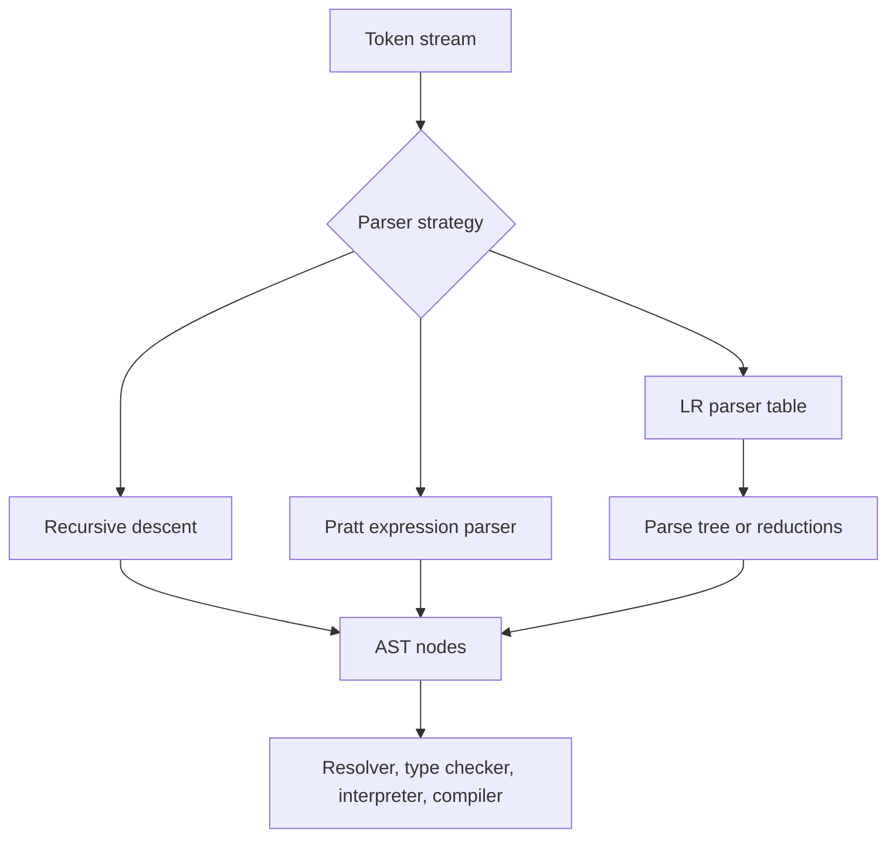

# Parsing and Syntax Trees


*Figure: A concrete abstract syntax tree built for a Euclidean-algorithm implementation. Every parser ultimately produces a tree like this for the later compiler or interpreter phases to consume. Image: [Wikimedia Commons](https://commons.wikimedia.org/wiki/File:Abstract_syntax_tree_for_Euclidean_algorithm.svg), Dcoetzee, public domain.*

Parsing turns a token stream into structure. The scanner knows that `print`, `1`, `+`, `2`, and `;` are tokens; the parser knows that `1 + 2` is an expression and that `print 1 + 2;` is a statement. Nystrom emphasizes hand-written recursive descent and Pratt parsing because they are easy to debug and align well with expression syntax [1]. The Dragon Book, Appel, Cooper-Torczon, and Muchnick place that experience inside the wider theory of context-free grammars and LR parsing [2]-[5].

Syntax trees are the main product of parsing in many interpreters and front ends. A parse tree records every grammar rule, while an abstract syntax tree, or AST, discards punctuation and helper productions so that later phases see the program's meaning rather than the grammar's bookkeeping.

## Definitions

A **context-free grammar** is a tuple $G=(N,\Sigma,P,S)$, where $N$ is a set of nonterminals, $\Sigma$ is a set of terminals, $P$ is a set of productions, and $S$ is the start symbol. A production such as:

$$
\mathrm{Expr} \to \mathrm{Expr}\;+\;\mathrm{Term}\mid \mathrm{Term}
$$

says that an expression can be another expression plus a term, or just a term.

A **derivation** repeatedly replaces nonterminals with right-hand sides. A **leftmost derivation** always expands the leftmost remaining nonterminal; a **rightmost derivation** expands the rightmost one. A grammar is **ambiguous** if some token string has more than one parse tree. The classic ambiguous expression grammar cannot decide whether `1 + 2 * 3` groups as `(1 + 2) * 3` or `1 + (2 * 3)` without precedence rules.

A **top-down parser** starts from the start symbol and predicts productions. Recursive descent represents nonterminals as functions. A **predictive parser** is a recursive descent parser that chooses alternatives using bounded lookahead, commonly one token in an LL(1) grammar. The first `L` means input is read left to right; the second `L` means the parser constructs a leftmost derivation.

A **Pratt parser** parses expressions by giving tokens prefix and infix parsing functions plus binding powers. It is especially convenient for languages with many operators. Nystrom uses a related precedence-climbing structure in jlox and a Pratt table in clox [1].

A **bottom-up parser** starts with tokens and reduces them to nonterminals. LR parsers scan left to right and construct a rightmost derivation in reverse. LR(0), SLR(1), LALR(1), and canonical LR(1) differ in how much context they keep in item sets and lookahead [2], [6]. Parser generators such as yacc, bison, and many compiler-construction courses center on this family.

An **AST node** represents a meaningful program construct, such as binary expression, variable declaration, call, or block. The **visitor pattern** separates operations over node types from the node classes themselves; Nystrom uses it to keep parsing, printing, resolving, and evaluation code separate [1].

## Key results

The first result is that grammar shape determines parser simplicity. Left recursion such as:

$$
\mathrm{Expr} \to \mathrm{Expr}\;+\;\mathrm{Term}
$$

is natural for left-associative operators but unsuitable for direct recursive descent because `expr()` would call itself before consuming input. A top-down grammar often removes left recursion:

$$
\begin{aligned}
\mathrm{Expr} &\to \mathrm{Term}\;\mathrm{Expr'} \\
\mathrm{Expr'} &\to +\;\mathrm{Term}\;\mathrm{Expr'} \mid \epsilon
\end{aligned}
$$

The transformed grammar is easier for LL parsing but less direct as an AST model. A hand parser can hide this transformation by using loops to build left-associative trees.

The second result is that precedence and associativity are semantic commitments. In the expression `a - b - c`, subtraction is normally left-associative, so the AST is `(a - b) - c`. Assignment is often right-associative, so `a = b = c` means `a = (b = c)`. Pratt parsing encodes this by comparing the current operator's binding power with the minimum binding power expected by the caller.

The third result is the LR item idea. An LR item places a dot inside a production, such as:

$$
\mathrm{Expr} \to \mathrm{Expr}\;+\;\bullet\;\mathrm{Term}.
$$

The dot records how much of the right-hand side has been seen. A set of items is a parser state. If the next token can advance a dot over a terminal, the parser shifts. If an item has the dot at the end, the parser may reduce. A **shift-reduce conflict** occurs when both actions seem valid; a **reduce-reduce conflict** occurs when two completed productions compete. Knuth's LR parsing result shows how viable prefixes can be recognized deterministically with enough state [6].

The fourth result is error recovery. A parser that stops on the first syntax error is easier to write but frustrating to use. Nystrom's Lox parser uses synchronization: after an error, it advances until a likely statement boundary such as `;`, `class`, `fun`, `var`, `for`, `if`, `while`, `print`, or `return` [1]. Parser generators offer panic-mode recovery, error productions, or recovery hooks, but all require language-specific judgment.

The fifth result is that parse trees and ASTs serve different readers. A parse tree is excellent for proving grammar properties. An AST is better for semantic analysis and interpretation. A semicolon token or grouping production may be crucial to parsing but useless after the tree is built; a source span, however, should usually survive in the AST for diagnostics.

The sixth result is that tool choice changes the maintenance problem. A hand-written parser keeps control flow close to the language designer's intent and usually makes custom diagnostics easier. A parser generator makes coverage of a large grammar more systematic, especially for LR-family grammars where table construction is tedious by hand. ANTLR emphasizes grammar readability and parse-tree visitors, while yacc and bison expose conflicts and precedence declarations in the LR tradition [7]. Neither approach removes the need to design an unambiguous language grammar, specify recovery behavior, and decide which concrete syntax details belong in the AST.

## Visual



| Parser family | Reads | Builds | Good at | Typical conflict |
|---|---|---|---|---|
| LL(1) predictive | Left to right | Leftmost derivation | Clear hand-written statement grammars | Common prefixes |
| Pratt | Left to right | Expression AST | Operator precedence and associativity | Mis-set binding powers |
| LR(0) | Left to right | Reverse rightmost derivation | Simple bottom-up examples | No lookahead |
| SLR(1) | Left to right | Reverse rightmost derivation | Many programming fragments | Coarse follow sets |
| LALR(1) | Left to right | Reverse rightmost derivation | Production compilers via yacc/bison | Merged lookahead states |
| LR(1) | Left to right | Reverse rightmost derivation | Most deterministic programming grammars | Larger tables |

## Worked example 1: Removing left recursion

Problem: convert the left-recursive grammar for addition into a form usable by recursive descent, then parse `n + n + n`.

Original grammar:

$$
\mathrm{Expr} \to \mathrm{Expr} + \mathrm{Term} \mid \mathrm{Term}, \quad
\mathrm{Term} \to n.
$$

Method:

1. Identify the left-recursive alternative: $\mathrm{Expr} \to \mathrm{Expr} + \mathrm{Term}$.
2. Separate the non-recursive base: $\mathrm{Expr} \to \mathrm{Term}$.
3. Introduce a tail nonterminal:

$$
\begin{aligned}
\mathrm{Expr} &\to \mathrm{Term}\;\mathrm{Expr'} \\
\mathrm{Expr'} &\to +\;\mathrm{Term}\;\mathrm{Expr'} \mid \epsilon \\
\mathrm{Term} &\to n.
\end{aligned}
$$

4. Derive `n + n + n`:

$$
\begin{aligned}
\mathrm{Expr}
&\Rightarrow \mathrm{Term}\;\mathrm{Expr'} \\
&\Rightarrow n\;\mathrm{Expr'} \\
&\Rightarrow n + \mathrm{Term}\;\mathrm{Expr'} \\
&\Rightarrow n + n\;\mathrm{Expr'} \\
&\Rightarrow n + n + \mathrm{Term}\;\mathrm{Expr'} \\
&\Rightarrow n + n + n\;\mathrm{Expr'} \\
&\Rightarrow n + n + n.
\end{aligned}
$$

Checked answer: the transformed grammar accepts the same sequence. To build a left-associative AST, a recursive descent implementation should not build a right-leaning tree from `Expr'`; it should parse the first term, then loop while it sees `+`, replacing `expr` by `Binary(expr, "+", next_term)`. The final AST is `Binary(Binary(n, "+", n), "+", n)`.

## Worked example 2: Pratt parsing `1 + 2 * 3`

Problem: parse `1 + 2 * 3` with `*` binding more tightly than `+`.

Method:

1. Assign binding powers: `+` has left binding power 10 and right binding power 11; `*` has left binding power 20 and right binding power 21. The exact numbers are arbitrary as long as multiplication is higher.
2. Call `expr(min_bp=0)`. Read prefix `1`, producing `Literal(1)`.
3. Look at `+`. Its left binding power 10 is at least 0, so consume it. Recurse for the right operand with `min_bp=11`.
4. In the recursive call, read prefix `2`, producing `Literal(2)`.
5. Look at `*`. Its left binding power 20 is at least 11, so consume it. Recurse with `min_bp=21`.
6. Read prefix `3`, producing `Literal(3)`. End of input has no binding power, so return `Literal(3)`.
7. Build `Binary(Literal(2), "*", Literal(3))`.
8. Return to the `+` call. End of input has no binding power, so build `Binary(Literal(1), "+", Binary(Literal(2), "*", Literal(3)))`.

Checked answer:

```text
      +
     / \
    1   *
       / \
      2   3
```

Evaluation gives $1 + (2 \times 3) = 7$, not $(1 + 2) \times 3 = 9$, so precedence was respected.

## Code

```python
from dataclasses import dataclass

@dataclass
class Num:
    value: int

@dataclass
class Bin:
    left: object
    op: str
    right: object

def tokenize(text: str) -> list[str]:
    spaced = text.replace("+", " + ").replace("*", " * ").replace("(", " ( ").replace(")", " ) ")
    return [part for part in spaced.split() if part]

class Pratt:
    def __init__(self, tokens: list[str]):
        self.tokens = tokens
        self.i = 0

    def peek(self) -> str | None:
        return self.tokens[self.i] if self.i < len(self.tokens) else None

    def pop(self) -> str:
        token = self.peek()
        if token is None:
            raise SyntaxError("unexpected end of input")
        self.i += 1
        return token

    def prefix(self):
        token = self.pop()
        if token.isdigit():
            return Num(int(token))
        if token == "(":
            node = self.expr(0)
            if self.pop() != ")":
                raise SyntaxError("expected ')'")
            return node
        raise SyntaxError(f"expected expression, got {token!r}")

    def expr(self, min_bp: int):
        left = self.prefix()
        while self.peek() in {"+", "*"}:
            op = self.peek()
            lbp, rbp = {"+": (10, 11), "*": (20, 21)}[op]
            if lbp < min_bp:
                break
            self.pop()
            right = self.expr(rbp)
            left = Bin(left, op, right)
        return left

if __name__ == "__main__":
    print(Pratt(tokenize("1 + 2 * 3")).expr(0))
```

## Common pitfalls

- Treating the grammar used for parsing as the exact AST shape required by later phases.
- Leaving direct left recursion in a recursive descent parser.
- Removing left recursion mechanically but accidentally changing associativity.
- Using precedence numbers without documenting whether larger means tighter binding.
- Forgetting that assignment and exponentiation are often right-associative.
- Failing to distinguish syntax errors from lexical errors.
- Building AST nodes without source spans, which weakens later diagnostics.
- Reporting every error after the first without synchronization, causing cascades of nonsense.
- Assuming an LL grammar is automatically unambiguous.
- Assuming an ambiguous grammar is harmless because the implementation happens to choose one parse.
- Treating parser-generator conflicts as mere warnings rather than language-design decisions.
- Overusing visitors when a simpler pattern match or method would fit a small implementation.
- Letting parse trees leak punctuation-heavy grammar details into semantic passes.
- Forgetting to test malformed inputs, where recovery and diagnostic quality matter more than successful parsing.
- Assuming an AST pretty-printer is a parser test; it can hide associativity mistakes unless expected trees are checked.

## Connections

- [Lexical Analysis and Scanning](/cs/compilers/lexical-analysis-and-scanning) supplies the tokens and source spans.
- [Tree-Walking Interpreters](/cs/compilers/tree-walking-interpreters) evaluate AST nodes directly.
- [Semantic Analysis and Type Checking](/cs/compilers/semantic-analysis-and-type-checking) attaches meaning to names and types in the AST.
- [Intermediate Representations and Optimization](/cs/compilers/intermediate-representations-and-optimization) lowers ASTs to CFGs, TAC, or SSA.
- [Theory of Computation](/cs/theory/intro) covers grammars, pushdown automata, and formal-language classes.
- [Programming Language Theory](/cs/programming-language-theory/intro) studies syntax, semantics, type systems, and proof techniques.
- [Operating Systems](/cs/operating-systems/intro) is relevant when parsing build scripts, shells, and configuration languages.
- [Computer Architecture](/cs/computer-architecture/intro) becomes relevant after parsing when code generation targets hardware.

## References

[1] R. Nystrom, *Crafting Interpreters*. Genever Benning, 2021.  
[2] A. V. Aho, M. S. Lam, R. Sethi, and J. D. Ullman, *Compilers: Principles, Techniques, and Tools*, 2nd ed. Pearson, 2006.  
[3] A. W. Appel, *Modern Compiler Implementation in ML*. Cambridge University Press, 1998.  
[4] K. D. Cooper and L. Torczon, *Engineering a Compiler*, 2nd ed. Morgan Kaufmann, 2012.  
[5] S. S. Muchnick, *Advanced Compiler Design and Implementation*. Morgan Kaufmann, 1997.  
[6] D. E. Knuth, "On the translation of languages from left to right," *Information and Control*, vol. 8, no. 6, pp. 607-639, 1965.  
[7] T. Parr, *The Definitive ANTLR 4 Reference*. Pragmatic Bookshelf, 2013.
