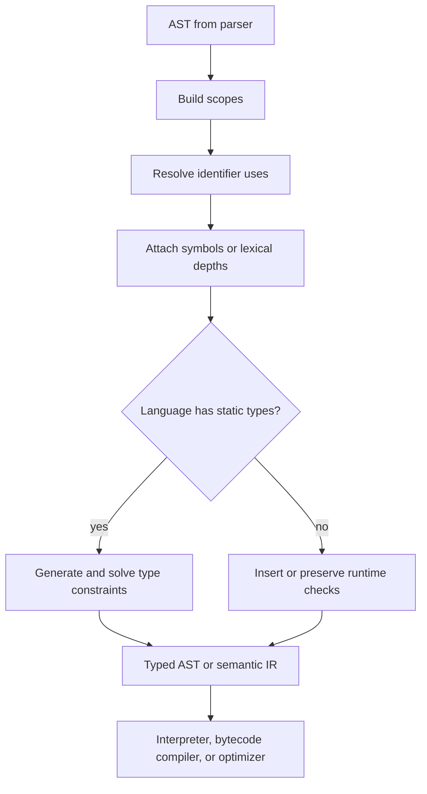

# Semantic Analysis and Type Checking

Semantic analysis asks whether a syntactically valid program actually means something the language accepts. A parser can recognize `x + y`, but it cannot by itself decide where `x` and `y` were declared, whether they are definitely assigned, whether `+` is defined for their types, or whether returning a value is legal in the current function. Nystrom's Lox is dynamically typed, so its semantic pass focuses on resolving lexical bindings and catching scope errors before runtime [1]. Traditional compiler texts broaden the phase to symbol tables, type checking, data layout, overload resolution, and preparation for optimization [2]-[5].

This page treats semantic analysis as the bridge between syntax and execution. It keeps the AST shape but adds meaning: identifiers become bindings, expressions receive types or dynamic-value expectations, and statements are checked against control-flow rules.

## Definitions

A **symbol table** maps names to declarations and associated attributes. A variable symbol may store its name, type, mutability, declaration span, storage class, and scope depth. A function symbol may store parameters, return type, arity, generic parameters, and calling convention.

A **scope** is the region where a declaration can be referenced. Scope rules may be lexical, module-based, class-based, block-based, or a combination. A semantic analyzer often maintains a stack of scopes while traversing the AST. Entering a block pushes a table; leaving pops it.

**Name resolution** connects each identifier use to one declaration. It must account for shadowing, forward declarations, imports, class members, and language-specific rules. Nystrom's resolver computes how many scopes outward a Lox variable is found, so the interpreter can perform fast lexical lookup [1].

A **type system** classifies expressions and values. A **statically typed** language checks types before execution; a **dynamically typed** language checks many operations at runtime. **Strong** and **weak** typing are informal terms about how readily a language permits implicit conversions or treating values as unrelated representations. **Nominal typing** says compatibility depends on declared names, such as class or interface identity. **Structural typing** says compatibility depends on member shape.

A **type checker** verifies that operations receive operands of permitted types and that program constructs meet declared interfaces. A simple checker might enforce that `if` conditions are booleans. A richer checker handles overloads, subtyping, generics, traits, lifetimes, effects, and ownership.

**Hindley-Milner type inference** infers principal types for a large functional core without explicit annotations, using unification and let-polymorphism [6], [7]. Modern languages extend or restrict this idea because subtyping, mutation, type classes, modules, and higher-rank polymorphism complicate principal types.

**Subtyping** allows a value of one type to be used where a supertype is expected. **Parametric polymorphism**, or generics, defines code over type parameters, such as `List<T>`. In nominal OO languages, generics interact with variance; in structural languages, they interact with constraints on members.

**Definite assignment** checks that a variable is assigned before use along every control-flow path. **Ownership** and **borrow checking**, as in Rust, statically regulate aliasing, mutation, and lifetime relationships to prevent use-after-free and data races.

## Key results

The first result is that resolution is a static approximation of runtime lookup. In lexical-scope languages, the declaration for a variable use is determined by the program text. A resolver can replace name lookup by an index or depth:

$$
\mathrm{lookup}(name, depth) = \mathrm{ancestor}(current, depth)[name].
$$

This is faster and more correct than searching dynamically at runtime. It also catches errors such as reading a local variable in its own initializer, returning from top-level code, or using `this` outside a class [1].

The second result is that type checking is a syntax-directed judgment. A typical notation is:

$$
\Gamma \vdash e : \tau
$$

which means "under type environment $\Gamma$, expression $e$ has type $\tau$." For binary addition in a simple integer language:

$$
\frac{\Gamma \vdash e_1 : \mathrm{Int} \quad \Gamma \vdash e_2 : \mathrm{Int}}
{\Gamma \vdash e_1 + e_2 : \mathrm{Int}}.
$$

An implementation turns this rule into recursive checking code.

The third result is that good error reporting is part of the algorithm. A type checker that stops at the first mismatch is easy to write but not helpful. A checker that guesses too aggressively can produce cascaded false errors. Practical systems often use error types: after reporting that `x + true` is invalid, the expression receives a special `Error` type so later checks can continue without repeating the same root cause.

The fourth result is that static and dynamic typing differ in timing, not in the need for rules. Lox checks at runtime whether `+` receives two numbers or two strings [1]. A statically typed language checks before execution. Both need a precise definition of what `+` means.

The fifth result is that type inference is constraint solving. For an expression such as `fun x -> x`, create a fresh type variable $\alpha$ for `x`. The body has type $\alpha`, so the function has type $\alpha \to \alpha`. Generalizing at `let` yields $\forall \alpha.\alpha \to \alpha$. Function application creates equality constraints that unification solves.

The sixth result is that ownership and definite assignment require control-flow reasoning. A variable declared in only one branch may not be available after an `if`. A borrowed reference may not outlive the value it references. These checks usually operate over a control-flow graph or an enriched AST, not merely local expression syntax.

The seventh result is that semantic passes usually have an order. A compiler may first collect top-level declarations so mutually recursive functions are visible, then resolve imports, then resolve local names, then check types, then perform control-flow checks such as missing returns or unreachable statements. Doing everything in one traversal is tempting for a small interpreter, but multi-pass analysis often produces clearer diagnostics and handles forward references without special cases.

The eighth result is that runtime metadata is often born in semantic analysis. Class layouts, method tables, generic instantiations, closure capture lists, and type tags can be computed or sketched here. Even dynamically typed implementations benefit from knowing which names are local, which variables are captured, and which operations may need dynamic checks.

## Visual



| Axis | Option A | Option B | Practical note |
|---|---|---|---|
| Timing | Static | Dynamic | Many languages mix both with annotations and runtime checks |
| Compatibility | Nominal | Structural | Java classes are mostly nominal; TypeScript is largely structural |
| Conversion | Explicit | Implicit | Implicit conversions improve convenience but complicate diagnostics |
| Polymorphism | Parametric | Ad hoc | Generics differ from overloads and type classes |
| Memory discipline | GC or ARC | Ownership and borrowing | Memory management can be a type-system concern |

## Worked example 1: Resolving scopes

Problem: resolve each use of `x` in:

```text
var x = 1;
{
  print x;
  var x = 2;
  print x;
}
print x;
```

Method:

1. Begin with global scope $S_0$.
2. Declare and define the first `x` in $S_0$:

$$
S_0 = \{x \mapsto x_0\}.
$$

3. Enter the block and push $S_1 = \{\}$.
4. Resolve the first block `print x`. Search $S_1$ first: not found. Search $S_0$: found $x_0$. Record depth 1, declaration $x_0$.
5. Declare the inner `x` in $S_1$, then resolve its initializer `2`, then define it:

$$
S_1 = \{x \mapsto x_1\}.
$$

6. Resolve the second block `print x`. Search $S_1$: found $x_1$. Record depth 0.
7. Leave the block and pop $S_1$.
8. Resolve the final `print x`. Search $S_0$: found $x_0$. Record depth 0 relative to the global current environment.

Checked answer:

| Use site | Declaration | Lexical depth while inside current context |
|---|---|---:|
| First `print x` in block | global `x_0` | 1 |
| Second `print x` in block | block `x_1` | 0 |
| Final `print x` | global `x_0` | 0 |

The inner declaration does not retroactively change the earlier use. A resolver that searches only at runtime without fixed lexical depths can get this wrong when closures are involved.

## Worked example 2: Inferring a simple polymorphic type

Problem: infer the type of:

```text
let id = fun x -> x in (id 3, id true)
```

Method:

1. Assign a fresh type variable $\alpha$ to parameter `x`.
2. In the function body, `x` has type $\alpha$.
3. Therefore `fun x -> x` has type $\alpha \to \alpha$.
4. At the `let`, generalize because $\alpha$ is not fixed by the outer environment:

$$
id : \forall \alpha.\alpha \to \alpha.
$$

5. For `id 3`, instantiate `id` with fresh $\beta$:

$$
id : \beta \to \beta.
$$

The argument `3` has type `Int`, so unify $\beta = \mathrm{Int}$. The result has type `Int`.

6. For `id true`, instantiate `id` again with fresh $\gamma$:

$$
id : \gamma \to \gamma.
$$

The argument `true` has type `Bool`, so unify $\gamma = \mathrm{Bool}$. The result has type `Bool`.

7. The tuple type is:

$$
(\mathrm{Int}, \mathrm{Bool}).
$$

Checked answer: the program type-checks because `id` was generalized at the `let` and instantiated separately at each use. Without let-polymorphism, the first call might force `id` to `Int -> Int`, making the second call fail.

## Code

```python
from dataclasses import dataclass

@dataclass
class Num:
    value: int

@dataclass
class Bool:
    value: bool

@dataclass
class Add:
    left: object
    right: object

@dataclass
class If:
    cond: object
    then_expr: object
    else_expr: object

def type_of(expr):
    if isinstance(expr, Num):
        return "Int"
    if isinstance(expr, Bool):
        return "Bool"
    if isinstance(expr, Add):
        left = type_of(expr.left)
        right = type_of(expr.right)
        if left != "Int" or right != "Int":
            raise TypeError(f"+ expects Int and Int, got {left} and {right}")
        return "Int"
    if isinstance(expr, If):
        cond = type_of(expr.cond)
        if cond != "Bool":
            raise TypeError(f"if condition must be Bool, got {cond}")
        then_t = type_of(expr.then_expr)
        else_t = type_of(expr.else_expr)
        if then_t != else_t:
            raise TypeError(f"branches differ: {then_t} vs {else_t}")
        return then_t
    raise TypeError(f"unknown expression {expr!r}")

if __name__ == "__main__":
    good = If(Bool(True), Add(Num(1), Num(2)), Num(3))
    print(type_of(good))
    bad = Add(Num(1), Bool(False))
    try:
        print(type_of(bad))
    except TypeError as exc:
        print(exc)
```

## Common pitfalls

- Treating parsing success as semantic validity.
- Using one flat symbol table when the language has nested scopes.
- Letting a declaration be used in its own initializer without a language rule allowing it.
- Forgetting that shadowing should not mutate the outer declaration.
- Reporting type errors at the operator rather than at the most helpful operand span.
- Confusing static typing with strong typing.
- Confusing nominal and structural compatibility.
- Assuming dynamic languages have no semantic analysis.
- Implementing implicit conversions without making them visible in diagnostics or IR.
- Letting an error type mask unrelated later errors too broadly.
- Checking definite assignment only syntactically, ignoring control-flow joins.
- Treating generics as textual macro expansion when the language requires type abstraction.
- Ignoring variance in mutable generic containers.
- Describing ownership as only a runtime memory-management technique rather than a static aliasing discipline.
- Running checks in an order that reports secondary type errors before the missing declaration that caused them.
- Forgetting that dynamically typed languages still need arity, scope, control-flow, and declaration checks.

## Connections

- [Tree-Walking Interpreters](/cs/compilers/tree-walking-interpreters) use resolver output to perform lexical lookup correctly.
- [Bytecode Compilation and Virtual Machines](/cs/compilers/bytecode-compilation-and-virtual-machines) can turn resolved locals into stack slots or upvalues.
- [Intermediate Representations and Optimization](/cs/compilers/intermediate-representations-and-optimization) often receives typed or semantically annotated IR.
- [Garbage Collection and Runtime Systems](/cs/compilers/garbage-collection-and-runtime-systems) interacts with type metadata, ownership, and object layout.
- [Programming Language Theory](/cs/programming-language-theory/intro) studies typing judgments, inference, soundness, and operational semantics.
- [Theory of Computation](/cs/theory/intro) supplies formal languages and decidability limits.
- [Operating Systems](/cs/operating-systems/intro) matters for type-safe FFI, memory safety, and concurrency checks.
- [Computer Architecture](/cs/computer-architecture/intro) affects layout decisions after type checking.

## References

[1] R. Nystrom, *Crafting Interpreters*. Genever Benning, 2021.  
[2] A. V. Aho, M. S. Lam, R. Sethi, and J. D. Ullman, *Compilers: Principles, Techniques, and Tools*, 2nd ed. Pearson, 2006.  
[3] A. W. Appel, *Modern Compiler Implementation in ML*. Cambridge University Press, 1998.  
[4] K. D. Cooper and L. Torczon, *Engineering a Compiler*, 2nd ed. Morgan Kaufmann, 2012.  
[5] S. S. Muchnick, *Advanced Compiler Design and Implementation*. Morgan Kaufmann, 1997.  
[6] R. Hindley, "The principal type-scheme of an object in combinatory logic," *Transactions of the American Mathematical Society*, vol. 146, pp. 29-60, 1969.  
[7] R. Milner, "A theory of type polymorphism in programming," *Journal of Computer and System Sciences*, vol. 17, no. 3, pp. 348-375, 1978.  
[8] L. Damas and R. Milner, "Principal type-schemes for functional programs," in *POPL*, 1982.
