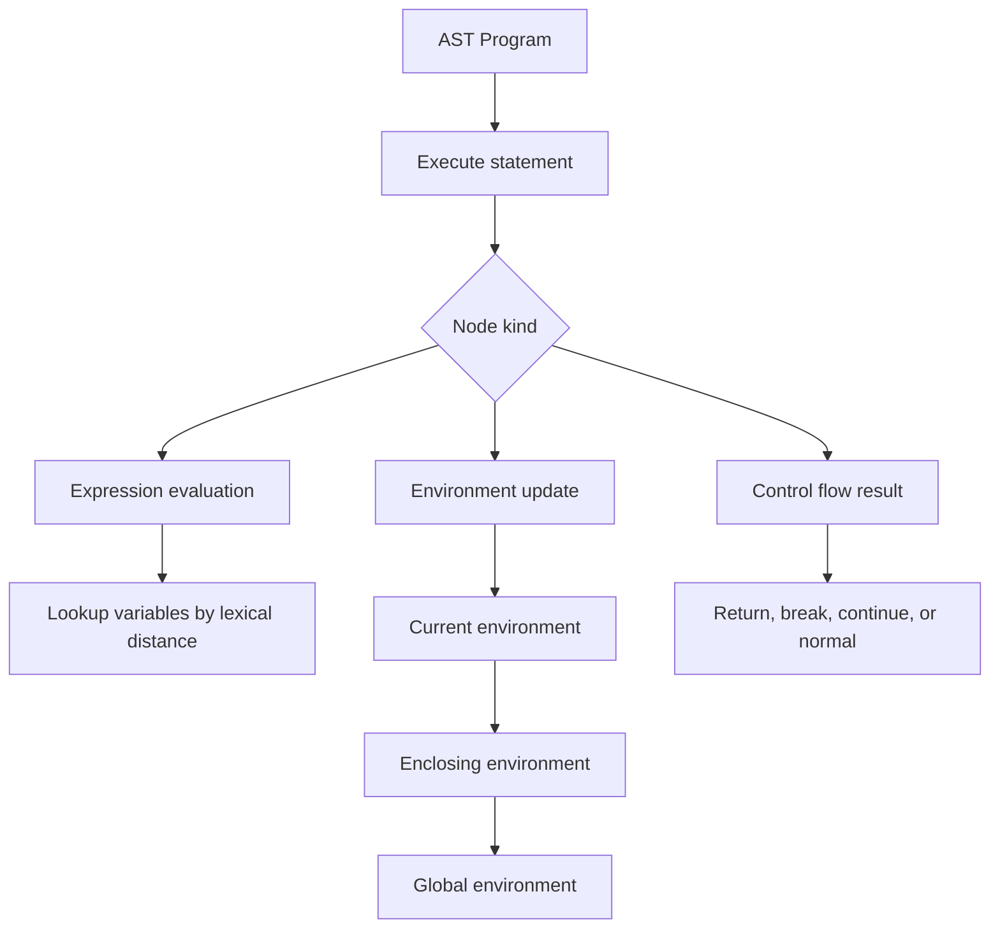

# Tree-Walking Interpreters

A tree-walking interpreter executes a program by recursively visiting its abstract syntax tree. Instead of lowering source code to bytecode or machine code, it treats the AST itself as the executable representation. Nystrom's first Lox implementation, jlox, uses this style because it keeps the semantics visible: evaluating `Binary(left, "+", right)` really means evaluating the left subtree, evaluating the right subtree, and applying the language's plus operation [1].

Tree walking is not the fastest execution strategy, but it is one of the clearest. It exposes the essential runtime ideas that every later implementation must still respect: environments, lexical scope, closures, statement execution, expression evaluation, native functions, and runtime error reporting.

## Definitions

An **interpreter** is a program that executes another program directly. In a tree-walking interpreter, the executable form is an AST. Each node type has an evaluation rule. For example, a literal evaluates to its stored value, a variable expression looks up a name, and a block statement executes a list of statements in a new environment.

An **environment** is a mapping from names to runtime values. Most languages have nested environments because blocks, functions, modules, and classes introduce scopes. An environment usually stores a pointer to an enclosing environment, forming a scope chain. Lookup checks the nearest environment first, then walks outward.

A **scope** is the textual region where a binding can be used. **Lexical scoping** means the binding for a name is determined by program text, not by the call stack at runtime. A **dynamic scope** language would resolve a free variable by the caller's environment; lexical scope resolves it by the environment surrounding the function definition.

A **first-class function** is a function value that can be stored in variables, passed as an argument, returned from another function, and called later. A **closure** is a function plus the lexical environment it captured at creation time. In Lox, a nested function can keep using variables from an outer function after that outer function has returned [1].

A **statement** performs an action and does not necessarily produce a value: `print`, `return`, `while`, and variable declaration are statements in Lox. An **expression** computes a value: literals, variables, calls, assignments, and binary expressions. Some languages blur the line by making conditionals or blocks expressions; Nystrom discusses this design choice explicitly [1].

A **resolver** is a static pass that records which declaration each variable use refers to. In jlox, it computes a lexical distance: how many environments outward the interpreter should look for a variable [1]. This preserves lexical binding even when closures and shadowing would otherwise make naive dynamic lookup misleading.

A **native function** is implemented by the host language but exposed as a function in the interpreted language. Examples include `clock`, file I/O, random numbers, or printing. Host interop is useful but dangerous because native code can break the sandbox, type assumptions, or deterministic behavior of the interpreted language.

## Key results

The first result is the big-step evaluation pattern. Each AST form has a rule:

$$
\frac{e_1 \Downarrow v_1 \quad e_2 \Downarrow v_2 \quad v = v_1 + v_2}
{e_1 + e_2 \Downarrow v}
$$

Read this as: if the left expression evaluates to $v_1$, the right expression evaluates to $v_2$, and the plus operation produces $v$, then the whole binary expression evaluates to $v$. A tree-walker implements these rules as methods or functions.

The second result is environment chaining. If a block introduces `{ var x = 2; print x; }`, lookup for `x` should find the inner binding. After the block exits, that environment can be discarded unless a closure captured it. Function calls similarly create activation environments for parameters and local variables. In a tree-walker, these are heap objects in the host language, not CPU stack frames.

The third result is closure capture. Consider:

```text
fun makeCounter() {
  var i = 0;
  fun count() {
    i = i + 1;
    return i;
  }
  return count;
}
```

The returned function must keep the environment containing `i`. This is not an implementation trick; it is the language's lexical-scoping rule. A compiler may later implement the same idea with upvalues, heap-allocated frames, closure conversion, or lambda lifting, but the semantic obligation is identical [3], [4].

The fourth result is that a resolver prevents a subtle binding bug. If variable lookup simply walks the live environment chain, then a closure may observe a later declaration in the same environment when the textual binding should already have been fixed. Nystrom's resolver marks variables as declared, defined, and used at known depths before interpretation, so the runtime lookup can go directly to the right environment distance [1].

The fifth result is that control flow can be represented either as return values from evaluator functions or as host-language exceptions. Nystrom throws a special internal exception for `return`, not because user code is exceptional, but because it unwinds multiple nested visitor calls cleanly [1]. The same technique can model `break` and `continue`, though production interpreters often use explicit control-flow results for predictability.

Finally, tree-walking interpreters trade speed for clarity. Each AST visit uses host dispatch, object allocation, pointer chasing, and recursive calls. A bytecode VM compresses the program into dense instructions and reduces per-node overhead. Still, a tree-walker is excellent for language design, testing semantic rules, writing teaching interpreters, and bootstrapping a later compiler.

A practical tree-walker also defines the language's order of evaluation. If function arguments evaluate left to right, the interpreter's call-expression visitor must evaluate the callee and arguments in that order before invoking the function. If assignment expressions return the assigned value, the assignment visitor must both update the environment and return the value. These details become observable when expressions call functions, mutate variables, or throw runtime errors. A later bytecode compiler should be checked against the tree-walker on such cases because the tree-walker often acts as the clearest executable specification.

## Visual



| Runtime object | Stored information | Lifetime driver |
|---|---|---|
| Environment | Name-to-value map and enclosing pointer | Block or function activation; extended by closures |
| Function value | Declaration node, parameter list, body, closure environment | Variable references and returned functions |
| Native function | Host callable and arity | Global registration |
| Instance or object | Fields, class, methods, runtime metadata | Reachability and garbage collection |
| Runtime error | Message, token/span, stack context | Raised during evaluation |

## Worked example 1: Scope and shadowing

Problem: evaluate this program and identify which binding each `print` uses.

```text
var x = "global";
{
  var x = "block";
  print x;
}
print x;
```

Method:

1. Start with the global environment $E_0 = \{\}$.
2. Execute `var x = "global";`. Evaluate the string literal to `"global"` and define `x` in $E_0$:

$$
E_0 = \{x \mapsto \text{"global"}\}.
$$

3. Enter the block. Create a new environment $E_1$ whose enclosing environment is $E_0$:

$$
E_1 = \{\}, \quad parent(E_1)=E_0.
$$

4. Execute `var x = "block";`. Define a new `x` in $E_1$:

$$
E_1 = \{x \mapsto \text{"block"}\}.
$$

5. Execute the first `print x;`. Lookup checks $E_1$ first and finds the inner binding. The output is `block`.
6. Leave the block. Restore the current environment to $E_0$. The block environment can be reclaimed because no closure captured it.
7. Execute the second `print x;`. Lookup checks $E_0$ and finds the global binding. The output is `global`.

Checked answer:

```text
block
global
```

The inner declaration shadows the outer one only inside the block.

## Worked example 2: Closure capture

Problem: determine the output of:

```text
fun makeAdder(a) {
  fun add(b) {
    return a + b;
  }
  return add;
}

var add10 = makeAdder(10);
print add10(7);
```

Method:

1. Define `makeAdder` in the global environment. Its function value stores the global closure environment.
2. Call `makeAdder(10)`. Create call environment $E_1$ with `a = 10`.
3. Execute the nested function declaration `add`. The created function value stores its declaration plus closure environment $E_1$.
4. Return `add`. The call to `makeAdder` ends, but $E_1$ remains reachable through the returned function's closure.
5. Bind `add10` to that returned function in the global environment.
6. Call `add10(7)`. Create call environment $E_2$ with `b = 7`, whose enclosing environment is the function's captured environment $E_1$.
7. Evaluate `a + b`. Lookup for `b` finds $E_2(b)=7$. Lookup for `a` does not find it in $E_2$, then finds $E_1(a)=10$.
8. Return $10 + 7 = 17$.

Checked answer: the program prints `17`. If the interpreter used dynamic scoping, it would look for `a` in the caller's environment and likely fail. Lexical closure capture is what makes `makeAdder` work.

## Code

```python
from dataclasses import dataclass

class Env(dict):
    def __init__(self, parent=None):
        super().__init__()
        self.parent = parent

    def get(self, name):
        if name in self:
            return self[name]
        if self.parent:
            return self.parent.get(name)
        raise NameError(name)

    def assign(self, name, value):
        if name in self:
            self[name] = value
        elif self.parent:
            self.parent.assign(name, value)
        else:
            raise NameError(name)

@dataclass
class Literal:
    value: object

@dataclass
class Var:
    name: str

@dataclass
class Assign:
    name: str
    expr: object

@dataclass
class Binary:
    left: object
    op: str
    right: object

def eval_expr(expr, env):
    if isinstance(expr, Literal):
        return expr.value
    if isinstance(expr, Var):
        return env.get(expr.name)
    if isinstance(expr, Assign):
        value = eval_expr(expr.expr, env)
        env.assign(expr.name, value)
        return value
    if isinstance(expr, Binary):
        left = eval_expr(expr.left, env)
        right = eval_expr(expr.right, env)
        if expr.op == "+":
            return left + right
        if expr.op == "*":
            return left * right
    raise TypeError(f"unknown expression {expr!r}")

if __name__ == "__main__":
    global_env = Env()
    global_env["x"] = 10
    program = Binary(Assign("x", Binary(Var("x"), "+", Literal(5))), "*", Literal(2))
    print(eval_expr(program, global_env))
    print(global_env["x"])
```

## Common pitfalls

- Implementing variable lookup dynamically when the language promises lexical scope.
- Forgetting that closures must preserve environments after the defining call returns.
- Storing a copy of every captured variable when the language requires shared mutation.
- Letting block environments leak when no closure refers to them.
- Reporting runtime errors without the token or AST span that caused them.
- Treating all host-language exceptions as user-language errors.
- Failing to restore the previous environment after a block throws or returns.
- Evaluating both sides of `and` and `or` even though the language specifies short-circuiting.
- Checking function arity after partially mutating call state.
- Allowing native functions to bypass safety rules unintentionally.
- Confusing declaration time, definition time, and assignment time in the resolver.
- Resolving variables after interpretation has already begun.
- Assuming a tree-walker is only for toys; it is also useful as a reference implementation.
- Assuming a tree-walker will be fast enough for hot loops without measurement.
- Forgetting that evaluation order is part of the language semantics.
- Implementing equality, truthiness, and numeric conversion by accidentally inheriting host-language rules.

## Connections

- [Parsing and Syntax Trees](/cs/compilers/parsing-and-syntax-trees) produces the AST that a tree-walker executes.
- [Semantic Analysis and Type Checking](/cs/compilers/semantic-analysis-and-type-checking) explains resolving, binding, and static checks before execution.
- [Bytecode Compilation and Virtual Machines](/cs/compilers/bytecode-compilation-and-virtual-machines) replaces AST visitation with compact instruction dispatch.
- [Garbage Collection and Runtime Systems](/cs/compilers/garbage-collection-and-runtime-systems) reclaims environments, closures, strings, and objects.
- [Programming Language Theory](/cs/programming-language-theory/intro) formalizes evaluation rules and scope.
- [Operating Systems](/cs/operating-systems/intro) matters when native functions expose files, clocks, processes, or environment variables.
- [Computer Architecture](/cs/computer-architecture/intro) explains why bytecode and native code can run much faster than tree walking.
- [Theory of Computation](/cs/theory/intro) provides the formal machinery behind syntax and computability.

## References

[1] R. Nystrom, *Crafting Interpreters*. Genever Benning, 2021.  
[2] A. V. Aho, M. S. Lam, R. Sethi, and J. D. Ullman, *Compilers: Principles, Techniques, and Tools*, 2nd ed. Pearson, 2006.  
[3] A. W. Appel, *Modern Compiler Implementation in ML*. Cambridge University Press, 1998.  
[4] K. D. Cooper and L. Torczon, *Engineering a Compiler*, 2nd ed. Morgan Kaufmann, 2012.  
[5] S. S. Muchnick, *Advanced Compiler Design and Implementation*. Morgan Kaufmann, 1997.  
[6] G. D. Plotkin, "A structural approach to operational semantics," Aarhus University, Tech. Rep., 1981.  
[7] R. Milner, "A theory of type polymorphism in programming," *Journal of Computer and System Sciences*, vol. 17, no. 3, pp. 348-375, 1978.
