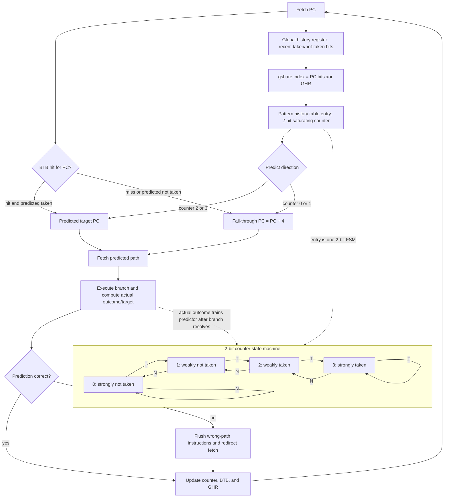

# Branch Prediction and Control Hazards

Branches are small instructions with large architectural consequences. A pipelined processor wants to fetch the next instruction every cycle, but a conditional branch may not reveal the correct next program counter until several stages later. Without prediction, the front end either stalls or fetches from a conservative path. With prediction, it guesses and keeps the pipeline busy, then repairs the machine state if the guess was wrong.

Branch prediction is one of the clearest examples of quantitative design. The hardware is useful only because real programs have patterns: loops are usually taken until the final iteration, error paths are rarely taken, and branches often correlate with recent control flow. The value of a predictor depends on branch frequency, prediction accuracy, and misprediction penalty.

## Definitions

A control hazard occurs when the next instruction address is uncertain. Conditional branches, indirect jumps, returns, and exceptions all affect instruction flow. A branch predictor guesses one or more of:

- Direction: taken or not taken.
- Target: the destination address if taken.
- Return target: the address after a call.
- Indirect target: a computed jump destination.

Static prediction uses fixed rules known before execution, such as "predict not taken" or "backward branches are taken." Dynamic prediction uses runtime history.

A one-bit predictor stores the last observed outcome for a branch. It predicts that the next outcome will match the previous one. A two-bit saturating counter predictor uses four states, usually strongly not taken, weakly not taken, weakly taken, and strongly taken. It changes direction only after two contrary outcomes, making it robust for loop branches that are taken many times and then not taken once.

The branch target buffer, or BTB, caches target addresses so the fetch unit can redirect immediately when a predicted-taken branch is recognized. A return address stack predicts procedure returns by pushing the address after a call and popping it on return.

The CPI impact of branch misprediction is:

$$
\mathrm{Branch\ stall\ CPI} =
f_{branch}
\times
r_{mispredict}
\times
\mathrm{Penalty}
$$

where $f_{branch}$ is branch frequency among executed instructions.

## Key results

The two-bit predictor is a small finite-state machine. Let counter values $0,1,2,3$ represent strongly not taken through strongly taken. Predict taken when the counter is at least 2. On a taken branch, increment the counter up to 3. On a not-taken branch, decrement it down to 0.

This helps loops. Consider a loop branch with outcomes:

$$
T,T,T,T,N
$$

repeated many times. A one-bit predictor that ends a loop in state not taken will mispredict the first taken branch of the next loop and the final not-taken branch, typically two misses per loop. A two-bit predictor often misses only the final not-taken branch, because one contrary outcome moves it from strongly taken to weakly taken without changing the next prediction.

More advanced predictors use local history, global history, tournament selection, or tagged predictor tables. Local history captures patterns specific to one branch. Global history captures correlations between branches, such as an `if` condition making a later branch likely. Tournament predictors choose between component predictors based on past success.

Speculation must be paired with recovery. When the processor predicts a branch, it may fetch, decode, issue, and even execute instructions from the predicted path. If the prediction is wrong, instructions on the wrong path must be squashed, and the architectural state must appear as if they never happened. This is why branch prediction is tightly connected to reorder buffers and precise exceptions in out-of-order cores.

Predictor accuracy is workload-dependent. A predictor that performs well on loop-heavy numeric code can struggle with input-dependent branches in interpreters, parsers, virtual machines, and compressed-data routines. Aliasing also matters: finite predictor tables mean unrelated branches may share entries and interfere. Larger tables reduce some aliasing but increase access energy and may lengthen the fetch path, so front-end timing constrains predictor design.

Target prediction is separate from direction prediction. A conditional branch may be predicted taken, but the fetch unit still needs the target address early enough to avoid a bubble. Direct branches can store targets in a BTB. Returns are better predicted with a return-address stack because the same return instruction can return to many different call sites. Indirect branches, such as virtual function calls or jump tables, are harder because one static branch can have many dynamic targets.

The performance effect grows with pipeline depth and issue width. A wide processor loses more potential work each cycle after a wrong prediction because more fetch and issue slots are wasted. A deep processor usually resolves the branch later, increasing the number of wrong-path instructions that must be flushed. This is one reason branch prediction became more important as scalar pipelines evolved into deep, speculative, multiple-issue machines.

## Visual



This branch-prediction diagram includes the direction predictor, target predictor, history register, update path, and recovery path. The gshare index combines PC bits with global history to select a 2-bit counter, while the BTB supplies a target early enough for fetch redirection. The embedded counter FSM shows why loops usually need two contrary outcomes to flip direction, and the flush edge shows the cost paid when speculation chooses the wrong path.

| Predictor | State per branch | Strength | Weakness |
|---|---:|---|---|
| Always not taken | 0 bits | No table cost | Poor for loops |
| Backward taken, forward not | 0 bits plus branch offset | Good simple compiler-era rule | Cannot learn data-dependent behavior |
| One-bit | 1 bit | Learns last outcome | Two loop-boundary misses |
| Two-bit counter | 2 bits | Stable on repeated loops | Still weak on alternating branches |
| Correlating/global | Many bits | Captures inter-branch patterns | Aliasing and complexity |

## Worked example 1: CPI cost of branch misses

Problem: A pipeline has base CPI 1. Branches are 18% of instructions. The branch predictor has a 7% misprediction rate, and each miss costs 12 cycles. Compute effective CPI.

Method:

1. Identify inputs.

$$
\begin{aligned}
f_{branch} &= 0.18 \\
r_{mispredict} &= 0.07 \\
\mathrm{Penalty} &= 12
\end{aligned}
$$

2. Compute stall cycles per instruction.

$$
\begin{aligned}
\mathrm{Branch\ CPI}
&= 0.18 \times 0.07 \times 12 \\
&= 0.1512
\end{aligned}
$$

3. Add to base CPI.

$$
\mathrm{CPI}_{effective}=1+0.1512=1.1512
$$

4. Check with one million instructions.

$$
\begin{aligned}
\mathrm{Branches} &= 180000 \\
\mathrm{Misses} &= 180000 \times 0.07 = 12600 \\
\mathrm{Stall\ cycles} &= 12600 \times 12 = 151200
\end{aligned}
$$

One million base cycles plus 151,200 stall cycles gives CPI $1.1512$.

Checked answer: Effective CPI is about $1.15$. Even a fairly accurate predictor has visible cost when branches are frequent and the miss penalty is large.

## Worked example 2: Two-bit predictor on a loop

Problem: A loop branch has outcomes `T T T N` for each execution of a four-iteration loop body pattern, and this pattern repeats twice. Start the two-bit counter in strongly taken state. Count mispredictions.

Method:

1. List the outcome sequence.

$$
T,T,T,N,T,T,T,N
$$

2. Start in state ST, predicting taken.

| Step | State before | Prediction | Outcome | Correct? | State after |
|---:|---|---|---|---|---|
| 1 | ST | T | T | yes | ST |
| 2 | ST | T | T | yes | ST |
| 3 | ST | T | T | yes | ST |
| 4 | ST | T | N | no | WT |
| 5 | WT | T | T | yes | ST |
| 6 | ST | T | T | yes | ST |
| 7 | ST | T | T | yes | ST |
| 8 | ST | T | N | no | WT |

3. Count misses.

$$
\mathrm{Misses}=2,\quad \mathrm{Predictions}=8
$$

4. Compute accuracy.

$$
\mathrm{Accuracy}=\frac{6}{8}=75\%
$$

Checked answer: There are 2 mispredictions, both on loop exits. A one-bit predictor starting taken would also miss each exit, but if the loop repeats, it would usually also miss the first taken branch after each exit.

## Code

```python
class TwoBitPredictor:
    def __init__(self, initial=3):
        self.counter = initial

    def predict(self):
        return self.counter >= 2

    def update(self, taken):
        if taken:
            self.counter = min(3, self.counter + 1)
        else:
            self.counter = max(0, self.counter - 1)

outcomes = [True, True, True, False] * 2
pred = TwoBitPredictor(initial=3)
misses = 0

for taken in outcomes:
    guess = pred.predict()
    misses += guess != taken
    pred.update(taken)

print(f"mispredictions={misses}, accuracy={(len(outcomes)-misses)/len(outcomes):.2%}")
```

The code models only direction prediction for one static branch. A real predictor indexes a table using some bits of the program counter and possibly global history, so two unrelated branches can collide in the same entry. That collision can be constructive if the branches behave similarly, or destructive if one branch is mostly taken and the other is mostly not taken.

The simplified model also leaves out target prediction and speculative update policy. Some processors update predictor state when a branch is fetched or decoded, then repair it on a squash; others update when the branch resolves. Early update can improve timeliness but increases recovery complexity. These details are why predictor evaluation normally uses instruction traces or cycle-level simulation instead of isolated formulas alone.

## Common pitfalls

- Measuring predictor accuracy without multiplying by branch frequency and miss penalty.
- Assuming a branch target buffer predicts direction; it mainly supplies target addresses.
- Forgetting that indirect jumps and returns need different prediction structures.
- Ignoring aliasing when several branches share predictor table entries.
- Evaluating branch behavior on tiny inputs that do not represent real loop and call patterns.
- Allowing wrong-path instructions to update architectural state before recovery is guaranteed.

## Connections

- [Pipelining and Hazards](/cs/computer-architecture/pipelining-hazards)
- [Speculation, Renaming, and Multiple Issue](/cs/computer-architecture/speculation-renaming-multiple-issue)
- [Quantitative Design and Performance](/cs/computer-architecture/quantitative-design-and-performance)
- [Cache Optimization and Prefetching](/cs/computer-architecture/cache-optimization-and-prefetching)
