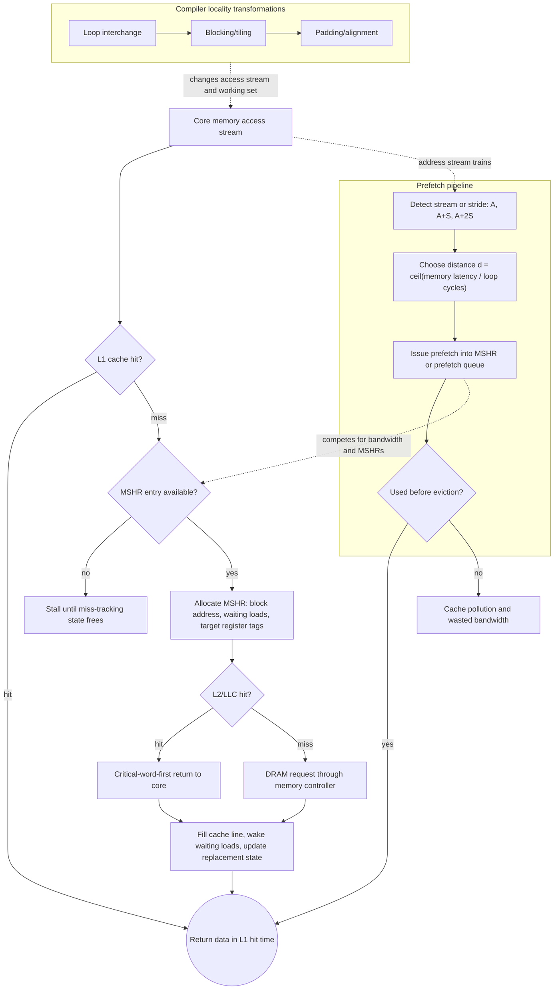

# Cache Optimization and Prefetching

Basic cache design chooses size, block size, associativity, and write policy. Advanced cache design asks how to reduce hit time, miss rate, miss penalty, bandwidth bottlenecks, and energy at the same time. These goals often conflict. A large cache may reduce misses but slow hits. A prefetcher may hide latency but waste bandwidth and power. A nonblocking cache may improve out-of-order execution but require more tracking state.

H&P organizes cache optimizations around measurable causes of memory stalls. The right question is not "does this reduce misses?" but "which term in execution time does this improve, and what does it damage?" That framing is especially important once multicore processors create shared-cache contention and bandwidth pressure.

## Definitions

Hit time is the time to access a cache when the requested block is present. Miss rate is the fraction of accesses that miss. Miss penalty is the additional time to service a miss from lower levels.

Cache bandwidth is the rate at which the cache can serve accesses. A cache can have good AMAT for one stream but insufficient bandwidth for multiple cores, vector loads, or instruction fetch plus data access.

A nonblocking cache allows hits under miss and possibly multiple outstanding misses. It uses miss status holding registers, MSHRs, to track in-flight misses and merge requests to the same block.

Critical-word-first fetch returns the requested word before the rest of the block, allowing the processor to resume earlier. Early restart is similar: resume as soon as the requested word arrives.

Prefetching fetches data before the processor explicitly requests it. Hardware prefetchers detect patterns such as streams or strides. Compiler prefetching inserts instructions based on static analysis. A useful prefetch is timely, accurate, and not harmful to cache capacity or memory bandwidth.

Loop transformations improve locality:

- Loop interchange changes loop order to access contiguous memory.
- Blocking, or tiling, reuses a small working set before moving on.
- Fusion combines loops that touch the same data.
- Padding changes layout to reduce conflict misses.

## Key results

Cache optimizations can be grouped by the AMAT terms they target:

$$
\mathrm{AMAT}=T_{hit}+MR\times P_{miss}
$$

Small simple L1 caches reduce $T_{hit}$. Way prediction tries to get direct-mapped-like speed in an associative cache by predicting the likely way. Pipelined and banked caches improve bandwidth rather than single-access latency.

Larger caches, larger blocks, higher associativity, victim caches, and compiler locality transformations reduce miss rate. Their value depends on whether misses are compulsory, capacity, or conflict misses. For example, increasing associativity helps conflict misses but not compulsory misses.

Multilevel caches, critical-word-first, read priority over writes, nonblocking caches, and prefetching reduce effective miss penalty. A prefetch does not make memory faster; it moves the miss earlier so useful computation overlaps the latency.

Prefetch distance is a key calculation. If a loop iteration takes $C$ cycles and memory latency is $L$ cycles, a prefetch should be issued roughly:

$$
d=\left\lceil \frac{L}{C} \right\rceil
$$

iterations before use, adjusted for cache pollution and control-flow uncertainty.

Nonblocking caches are most valuable when the processor has independent work to do while a miss is outstanding. A blocking cache stalls on the first miss even if later accesses would hit. A nonblocking cache can continue serving hits and can track multiple misses with MSHRs. If the program has many independent cache misses, memory-level parallelism improves; if it has a pointer chain where each miss computes the next address, there is little to overlap.

Compiler transformations and hardware prefetching are complementary. A compiler can understand loop structure, array dimensions, and future iterations, but it may lack exact runtime addresses or know whether a branch will be taken. Hardware sees actual addresses and can adapt to streams, but it may waste effort on patterns that stop suddenly. Many systems use both, relying on profiling or programmer annotations for difficult kernels.

Energy can reverse a purely performance-based conclusion. A prefetcher that improves time by 2% but increases memory traffic by 30% may be unacceptable in a mobile or WSC setting. Similarly, a highly associative cache may reduce misses but consume more dynamic energy on every hit. The best optimization is the one that improves the dominant bottleneck within the system's power and bandwidth budget.

## Visual



This cache-optimization diagram ties specific mechanisms to the miss path rather than listing them as independent tricks. Nonblocking caches use MSHRs to keep hits and multiple misses in flight, critical-word-first reduces effective miss penalty, and prefetching competes for the same bandwidth and tracking entries it tries to help. The compiler-transform branch shows that loop order, tiling, and padding change the access stream before hardware ever sees it.

| Optimization | Target | Helps most when | Can hurt by |
|---|---|---|---|
| Larger block | Compulsory miss rate | Spatial locality is strong | Raising miss penalty |
| Higher associativity | Conflict miss rate | Many blocks map to same set | Increasing hit time and power |
| Victim cache | Conflict miss rate | Direct-mapped conflicts recur | Adding lookup complexity |
| Nonblocking cache | Effective miss penalty | Independent work exists | Needing MSHRs and ordering logic |
| Prefetching | Effective miss penalty | Access pattern is predictable | Pollution and wasted bandwidth |
| Blocking | Capacity miss rate | Nested loops reuse data | More complex code |

## Worked example 1: Choosing prefetch distance

Problem: A loop processes one array element per iteration. Each iteration takes 6 cycles excluding cache misses. Main-memory latency is 90 cycles. The cache block holds 8 elements, and the hardware does not prefetch. Estimate a software prefetch distance in iterations.

Method:

1. Compute latency in loop iterations.

$$
\begin{aligned}
d
&= \left\lceil \frac{90}{6} \right\rceil \\
&= \lceil 15 \rceil \\
&= 15
\end{aligned}
$$

2. Account for block granularity. A new block is needed every 8 elements, so prefetching every iteration is unnecessary. Prefetch one block roughly 15 iterations before its first use.

3. Convert to block starts. If the current index is $i$, the block first used 16 iterations ahead starts near:

$$
i+16
$$

because 16 is the next multiple of 8 above 15.

4. Check timeliness. The prefetch issued at iteration $i$ arrives about 90 cycles later. In 16 iterations, the loop executes:

$$
16 \times 6=96\ \mathrm{cycles}
$$

Checked answer: Prefetch about 16 iterations ahead, ideally at block boundaries. This gives slightly more than the 90 cycles required, while matching the 8-element block size.

## Worked example 2: Blocking a matrix computation

Problem: A naive matrix loop repeatedly accesses rows of `A` and columns of `B` for matrix multiplication. Suppose a cache can hold 32 KiB of useful data, elements are 8-byte doubles, and we want a square tile of `A`, `B`, and `C` to fit together. Estimate a tile dimension $b$ such that three $b \times b$ tiles fit.

Method:

1. Compute bytes per tile.

$$
\mathrm{One\ tile}=b^2 \times 8
$$

2. Three tiles must fit in 32 KiB.

$$
3b^2 \times 8 \le 32768
$$

3. Solve for $b$.

$$
\begin{aligned}
24b^2 &\le 32768 \\
b^2 &\le 1365.33 \\
b &\le \sqrt{1365.33} \\
b &\le 36.95
\end{aligned}
$$

4. Choose a practical tile size. Powers of two or multiples matching vector widths are common. Choose $b=32$.

5. Check capacity.

$$
3 \times 32^2 \times 8 = 24576\ \mathrm{bytes}
$$

Checked answer: A $32 \times 32$ tile uses 24 KiB for the three tiles, leaving room for other data and avoiding a too-tight capacity assumption.

## Code

```python
from math import ceil, sqrt

def prefetch_distance(latency_cycles, cycles_per_iteration, block_elements):
    raw = ceil(latency_cycles / cycles_per_iteration)
    return ceil(raw / block_elements) * block_elements

def square_tile(cache_bytes, element_bytes=8, arrays=3):
    max_b = int(sqrt(cache_bytes / (arrays * element_bytes)))
    # Prefer a conservative power of two.
    b = 1
    while b * 2 <= max_b:
        b *= 2
    return b

print(prefetch_distance(90, cycles_per_iteration=6, block_elements=8))
print(square_tile(32 * 1024))
```

The prefetch-distance calculation is intentionally a first estimate. Real loops have branches, address-generation instructions, cache-bank conflicts, and sometimes variable latency. If the loop body becomes faster after vectorization, the correct prefetch distance may increase because fewer cycles pass per iteration. If the data is shared with other cores, prefetching can also trigger coherence traffic before the value is needed.

The tile-size calculation is similarly conservative. A tile that fits mathematically may still conflict in a set-associative cache if several arrays map to the same sets. It may also leave too little space for stack data, other arrays, hardware prefetch streams, or instruction-cache pressure from the blocked kernel. Production tuning usually starts with the formula, then sweeps nearby tile sizes and measures misses, bandwidth, and total time.

A useful validation step is to classify the remaining misses after each optimization. If compulsory misses dominate, associativity will not help much. If conflict misses dominate, padding or associativity may help. If capacity misses dominate, blocking or a larger cache is more plausible. This keeps optimization tied to cause rather than folklore.

## Common pitfalls

- Prefetching too late, which turns the prefetch into an ordinary miss.
- Prefetching too early, which evicts the data before use.
- Ignoring bandwidth: a prefetch stream can slow useful demand misses.
- Increasing cache associativity without checking hit-time and energy costs.
- Using blocking sizes that exactly fill the cache and leave no room for other data.
- Assuming compiler transformations preserve performance when aliasing or layout differs.

## Connections

- [Cache Organization and AMAT](/cs/computer-architecture/cache-organization-amat)
- [Vector, SIMD, and GPU Architectures](/cs/computer-architecture/vector-simd-gpu)
- [Dynamic Scheduling and Tomasulo](/cs/computer-architecture/dynamic-scheduling-tomasulo)
- [Storage, RAID, and SSDs](/cs/computer-architecture/storage-raid-ssds)
