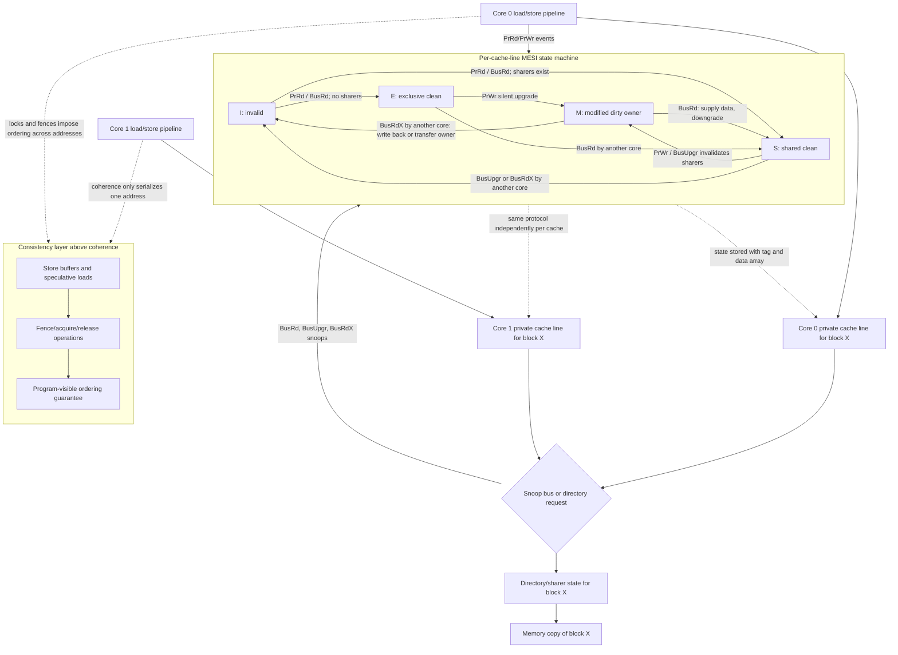

# Coherence, Consistency, and MESI

Private caches are essential for multicore performance, but they create a correctness problem. If two cores cache the same memory block and one core writes it, what should the other core see? Cache coherence protocols maintain a single coherent view of each memory location. Memory consistency models define the ordering rules that programmers can rely on across different memory locations.

These two ideas are related but not identical. Coherence is about one address: all cores should agree on the order of writes to that address. Consistency is about the ordering of operations to different addresses: when a thread writes `data` and then writes `flag`, when may another thread see the flag and the data?

## Definitions

A coherent memory system satisfies two key properties for each memory location:

- Write propagation: a write eventually becomes visible to other processors.
- Write serialization: all processors observe writes to the same location in the same order.

Snooping coherence broadcasts coherence requests on a shared medium. Each cache watches, or snoops, requests from others and updates its state. Snooping works naturally for small shared-bus systems but becomes harder as core counts and bandwidth grow.

Directory coherence stores sharing information in a directory. Instead of broadcasting to everyone, a requester contacts the directory, which forwards invalidations or data requests to known sharers or owners. Directory protocols scale better but add storage and indirection.

MESI is a common invalidate-based coherence protocol with four states:

- Modified: this cache has the only valid copy, and it is dirty relative to memory.
- Exclusive: this cache has the only valid copy, and it matches memory.
- Shared: this block may exist in multiple caches and matches memory.
- Invalid: this cache entry does not hold valid data.

False sharing occurs when independent variables occupy the same cache block and different cores write them. Coherence works correctly, but performance is poor because the whole block moves or is invalidated even though the variables are logically separate.

A memory consistency model specifies legal orderings of memory operations. Sequential consistency requires the result to appear as if operations from all processors were interleaved in a single order, while preserving each processor's program order. Relaxed models allow more reordering but require synchronization instructions or fences.

## Key results

Invalidate protocols are efficient when a core writes a block many times. Before writing, the core obtains exclusive ownership and invalidates other cached copies. Later writes can proceed locally until another core requests the block.

Update protocols broadcast new values to sharers on each write. They can help when many cores read the updated value immediately, but they often waste bandwidth when writes are frequent or sharers no longer need the data.

MESI improves on a simpler MSI protocol by distinguishing Exclusive from Shared. If a core reads a block that no one else has, it enters Exclusive and can later write silently by changing to Modified. This avoids unnecessary bus transactions for private data.

The miss categories in multicore systems include a fourth C: coherence misses. These happen when a block is invalidated or transferred due to another core's write, not because the cache lacked capacity or associativity.

Consistency affects synchronization code. A lock release must make protected writes visible before another core acquires the lock. Many architectures provide atomic read-modify-write instructions and fence instructions to enforce ordering where needed.

A coherence transaction is also a performance event. When a core obtains a block in Modified state, other sharers lose their copies. If those sharers soon read the block again, the block migrates or is supplied from the owner. This is appropriate for true sharing, such as a producer handing data to a consumer, but wasteful for false sharing. Profilers that report cache-to-cache transfers or invalidation traffic can reveal these problems.

Directory protocols replace broadcast with tracked sharing state. A simple directory may store a bit vector saying which caches have a block. For many cores, a full bit vector per memory block can be expensive, so systems use compressed directories, limited pointers, or hierarchical organizations. These design choices trade storage overhead against extra messages when the directory's information is imprecise.

Consistency models are programmer-visible, so they must be documented by the ISA. Sequential consistency is easy to reason about but can restrict performance because it limits reordering. Relaxed models allow store buffers, speculative loads, and reordering, but require synchronization operations to create happens-before relationships. Correct parallel programs use the synchronization rules rather than relying on accidental timing.

## Visual



This coherence diagram distinguishes the per-line MESI protocol from the broader consistency rules. The cache-line state machine labels processor events, snoop messages, ownership transfers, invalidations, and dirty writeback/transfer behavior for one block. The consistency subgraph shows why fences and acquire/release operations are still required: coherence serializes writes to one address, but ordering across different addresses is a separate contract.

| Concept | Scope | Example question | Mechanism |
|---|---|---|---|
| Coherence | One address | Who owns block X after a write? | MESI, snooping, directory |
| Consistency | Multiple addresses | Can flag be seen before data? | Ordering rules and fences |
| Synchronization | Program-level coordination | Is lock acquire atomic? | Test-and-set, compare-and-swap |
| False sharing | Cache-block granularity | Why do independent counters fight? | Padding and data layout |

## Worked example 1: MESI state transitions for two cores

Problem: Two cores start with block `X` invalid. Core 0 reads `X`, then Core 1 reads `X`, then Core 0 writes `X`. Track MESI states.

Method:

1. Initial state:

$$
C0=I,\quad C1=I
$$

2. Core 0 reads `X`. No other cache has it, so Core 0 receives an exclusive clean copy.

$$
C0=E,\quad C1=I
$$

3. Core 1 reads `X`. Another core has the block, so the block becomes shared in both caches.

$$
C0=S,\quad C1=S
$$

4. Core 0 writes `X`. It must invalidate other shared copies and obtain ownership. Core 0 transitions to Modified; Core 1 becomes Invalid.

$$
C0=M,\quad C1=I
$$

5. Interpret data location. Memory may now be stale because Core 0 has the modified copy. If Core 1 later reads `X`, Core 0 or the coherence system must supply the updated value and possibly write back or downgrade the block.

Checked answer: The state sequence is `(I,I) -> (E,I) -> (S,S) -> (M,I)`. The Exclusive state avoided a bus upgrade on Core 0's first private read, but once Core 1 shared the block, Core 0's write required invalidation.

## Worked example 2: False sharing cost

Problem: Core 0 increments counter `a` and Core 1 increments counter `b`. The two counters are different variables but lie in the same 64-byte cache block. Each core performs 1,000 increments, alternating one increment at a time. Estimate how many ownership transfers occur after both cores first have the block cached.

Method:

1. Because each increment is a write, the writing core needs the block in Modified state.

2. If Core 0 writes, Core 1's copy is invalidated:

$$
C0=M,\quad C1=I
$$

3. Next Core 1 writes its independent counter `b`. It must obtain ownership, invalidating or downgrading Core 0:

$$
C0=I,\quad C1=M
$$

4. This repeats on each alternating write. There are 2,000 total writes.

5. The first write obtains ownership. Every subsequent write by the other core transfers ownership.

$$
\mathrm{Transfers}\approx 2000-1=1999
$$

Checked answer: About 1,999 ownership transfers occur even though the cores update different variables. Padding the counters into separate cache blocks can remove the false-sharing traffic.

## Code

```python
def mesi_transition(state, event):
    table = {
        ("I", "read_no_sharer"): "E",
        ("I", "read_shared"): "S",
        ("E", "local_write"): "M",
        ("S", "local_write"): "M",
        ("S", "remote_write"): "I",
        ("E", "remote_read"): "S",
        ("M", "remote_read"): "S",
        ("M", "remote_write"): "I",
    }
    return table.get((state, event), state)

c0, c1 = "I", "I"
c0 = mesi_transition(c0, "read_no_sharer")
print(c0, c1)
c0 = mesi_transition(c0, "remote_read")
c1 = mesi_transition(c1, "read_shared")
print(c0, c1)
c1 = mesi_transition(c1, "remote_write")
c0 = mesi_transition(c0, "local_write")
print(c0, c1)
```

The transition function is deliberately local, so it hides the messages required to make a transition happen. A Shared-to-Modified upgrade usually sends invalidations and waits for acknowledgments before the writer can safely proceed. A Modified-to-Shared transition on a remote read may require the owner to provide the data because memory is stale. Those messages are the source of many multicore performance costs.

The code also does not model transient states. Real protocols include states such as "issued read miss, waiting for data" or "sent invalidations, waiting for acknowledgments." Transient states are necessary because messages take time and can race with one another. They make protocol verification difficult, especially when combined with relaxed memory ordering and speculative cores.

For software, the lesson is to separate correctness from performance. Coherence usually guarantees that writes to one location become visible consistently, but it does not make compound operations atomic. Incrementing a shared counter still needs synchronization, and good performance may require reducing how often the counter is shared at all.

## Common pitfalls

- Using coherence and consistency as synonyms.
- Thinking coherence operates on variables rather than cache blocks.
- Ignoring false sharing when independent per-thread data performs poorly.
- Assuming snooping scales indefinitely.
- Forgetting that write-back caches need ownership and dirty-state handling.
- Writing lock-free code without understanding the target memory model.

## Connections

- [Multicore, Synchronization, and NUMA](/cs/computer-architecture/multicore-synchronization-numa)
- [Cache Organization and AMAT](/cs/computer-architecture/cache-organization-amat)
- [Virtual Memory, TLBs, and VMs](/cs/computer-architecture/virtual-memory-tlb-vms)
- [Storage, RAID, and SSDs](/cs/computer-architecture/storage-raid-ssds)
