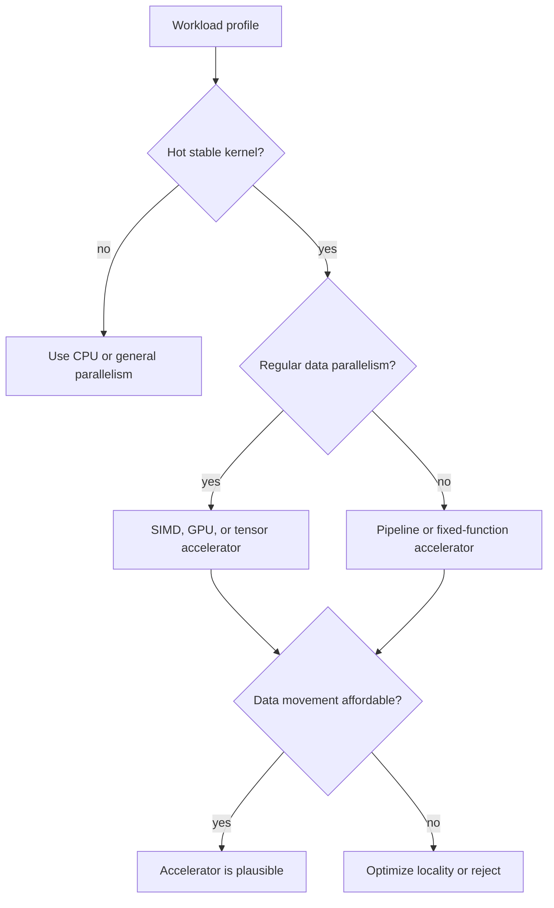

# Domain-Specific Accelerators

Domain-specific accelerators trade generality for efficiency. Instead of spending area and energy on branch prediction, wide out-of-order scheduling, and complex speculation, an accelerator builds hardware around a narrower computation pattern: matrix multiply, video encoding, cryptography, packet processing, signal processing, compression, or graphics. H&P 5e predates public TPU systems, but its treatment of SIMD, GPUs, embedded processors, and quantitative energy limits explains why later tensor and AI accelerators became attractive.

The key architectural question is not whether special hardware can be faster. It usually can. The question is whether the speedup, energy reduction, and cost justify the loss of flexibility, programming effort, data-movement overhead, and integration complexity.

## Definitions

An accelerator is a hardware unit optimized for a narrower class of tasks than a general-purpose CPU. It may be integrated on the same chip, attached over an I/O interconnect, or deployed as a separate device in a server.

A domain-specific architecture, DSA, chooses data types, memory hierarchy, interconnect, control, and execution units around a domain. Examples include:

- SIMD media units for packed integer or floating-point operations.
- GPUs for graphics and throughput-oriented parallel kernels.
- Cryptographic engines for AES, hashing, or public-key operations.
- Video codecs for motion estimation and entropy coding.
- Neural-network accelerators for dense linear algebra and tensor operations.

The accelerator speedup model must include data movement:

$$
T_{total}=T_{transfer\ in}+T_{accelerator}+T_{transfer\ out}+T_{setup}
$$

Amdahl's law still applies:

$$
\mathrm{Speedup}=
\frac{1}{(1-f)+\frac{f}{s}+O}
$$

where $O$ is overhead as a fraction of original execution time. For accelerators, overhead often includes copying, format conversion, kernel launch, synchronization, and cache-coherence maintenance.

Operational intensity, reuse, and precision are central. Many accelerators win by keeping data near compute units, using lower precision where acceptable, and organizing computation as regular arrays or pipelines.

## Key results

Accelerators save energy by reducing instruction overhead. A CPU may spend substantial energy fetching, decoding, predicting, renaming, scheduling, and committing instructions. A fixed-function or systolic accelerator can perform many operations with simpler control. This is effective when the domain has stable kernels and enough volume to amortize design cost.

Data movement can dominate. Moving a word from DRAM can cost far more energy than a simple arithmetic operation. Therefore, accelerators often use scratchpad memories, tiling, streaming, compression, or on-chip networks to maximize reuse.

Precision is a design lever. Graphics, signal processing, and machine learning often tolerate lower precision than general scientific computing. Reduced precision increases lane count, lowers memory bandwidth, and reduces energy per operation. The risk is numerical error or loss of model quality.

Programmability is the recurring challenge. Fixed-function hardware is efficient but inflexible. GPUs are programmable but less efficient for irregular tasks. Tensor accelerators may be excellent for dense matrix operations but weak on control-heavy preprocessing or sparse operations unless explicitly designed for them.

The best accelerator designs include a balanced system: host CPU, memory bandwidth, software stack, compiler or libraries, profiling tools, and fallback paths. A fast compute array with insufficient memory bandwidth is an underused area budget.

A common accelerator pattern is the systolic array. Data moves rhythmically through a grid of processing elements, and each element performs a small operation such as multiply-accumulate. The regular movement reduces control overhead and improves reuse because operands are consumed by several neighboring operations before leaving the array. This pattern is well suited to dense matrix multiplication and convolution-like computations.

Another pattern is a streaming pipeline. Video, compression, and packet-processing accelerators often pass data through a sequence of fixed stages. Each stage does specialized work and forwards results to the next stage. Throughput can be high once the pipeline is full, but changes to the algorithm or format can require new hardware or microcode support.

The host interface is part of the accelerator. If the CPU must copy data into a special buffer, flush caches, start the accelerator, wait, and copy results back, overhead may dominate small tasks. Integrated accelerators can share virtual memory or coherent caches to reduce copying, but coherence support costs area and verification effort. Discrete accelerators may have more power and area but pay interconnect latency.

Accelerator evaluation should include utilization. A unit advertised at high peak operations per second may spend time waiting for memory, waiting for the host, handling boundary cases, or running unsupported operations on the CPU. The useful metric is sustained application speedup or energy reduction for realistic workloads.

## Visual



| Accelerator style | Best fit | Main advantage | Main risk |
|---|---|---|---|
| Fixed-function block | Stable codec or crypto | Very high efficiency | Obsolete if standards change |
| SIMD extension | Small regular loops | Low call overhead | Limited width and flexibility |
| GPU | Massive data parallel kernels | High throughput | Divergence and transfer overhead |
| Systolic/tensor array | Matrix and tensor operations | High reuse and low control cost | Poor fit for irregular work |
| FPGA | Custom pipelines at lower volume | Reconfigurable hardware | Harder programming and timing closure |

## Worked example 1: Accelerator speedup with transfer overhead

Problem: A program spends 70% of its time in an image filter. A GPU runs the filter $20\times$ faster than the CPU, but transferring images and launching kernels costs 5% of the original program time. What is the total speedup?

Method:

1. Normalize original time to 1.

$$
T_{old}=1
$$

2. Unaccelerated fraction:

$$
1-f=1-0.70=0.30
$$

3. Accelerated filter time:

$$
\frac{f}{s}=\frac{0.70}{20}=0.035
$$

4. Add overhead:

$$
O=0.05
$$

5. New time:

$$
T_{new}=0.30+0.035+0.05=0.385
$$

6. Speedup:

$$
\mathrm{Speedup}=\frac{1}{0.385}=2.597
$$

Checked answer: The total speedup is about $2.60\times$, not $20\times$. Transfer and the unaccelerated 30% dominate the final result.

## Worked example 2: Reuse in tiled matrix multiplication

Problem: A tensor-style accelerator multiplies two $64 \times 64$ matrix tiles of 16-bit values and accumulates into a $64 \times 64$ output tile. Estimate multiply-add operations and input bytes loaded if each input tile is loaded once. Ignore output traffic.

Method:

1. Matrix multiplication operations. For each output element, there are 64 multiply-adds.

$$
64 \times 64 \times 64 = 262144\ \mathrm{multiply\text{-}adds}
$$

2. Input elements. Two input tiles each contain:

$$
64 \times 64 = 4096\ \mathrm{elements}
$$

Two tiles:

$$
8192\ \mathrm{elements}
$$

3. Bytes per input element:

$$
16\ \mathrm{bits}=2\ \mathrm{bytes}
$$

4. Input bytes:

$$
8192 \times 2 = 16384\ \mathrm{bytes}=16\ \mathrm{KiB}
$$

5. Arithmetic intensity using one multiply-add as two operations:

$$
\frac{262144 \times 2}{16384}=32\ \mathrm{operations/byte}
$$

Checked answer: The tile performs 262,144 multiply-adds from 16 KiB of input data, or about 32 arithmetic operations per input byte when counting multiply and add separately. This high reuse is why tiled matrix engines can be efficient.

## Code

```python
def accelerator_speedup(fraction, local_speedup, overhead):
    new_time = (1.0 - fraction) + fraction / local_speedup + overhead
    return 1.0 / new_time

def matmul_tile_intensity(tile, bytes_per_element=2):
    multiply_adds = tile * tile * tile
    input_bytes = 2 * tile * tile * bytes_per_element
    operations = 2 * multiply_adds
    return multiply_adds, input_bytes, operations / input_bytes

print(f"speedup={accelerator_speedup(0.70, 20, 0.05):.2f}x")
macs, bytes_in, intensity = matmul_tile_intensity(64)
print(f"MACs={macs}, input={bytes_in} bytes, intensity={intensity:.1f} ops/byte")
```

The speedup function shows why accelerator proposals should include an end-to-end timeline. A block diagram with a fast compute engine is not enough. The host must prepare data, start the device, handle synchronization, and consume results. If the accelerated kernel is called thousands of times on tiny inputs, setup overhead can dominate. If data stays resident across many calls, the same accelerator can become very effective.

The matrix-intensity calculation assumes perfect reuse of the two input tiles. Real accelerators need buffers and scheduling rules that actually preserve that reuse. If a tile is too large for on-chip storage, the computation spills to slower memory. If it is too small, the array may be underutilized and boundary overhead rises. This is the same locality trade-off seen in cache blocking, but expressed in an accelerator memory hierarchy.

The same analysis should be repeated for energy, not only time. A kernel can speed up by using more total power, or it can save energy by finishing quickly with simpler datapaths. The stronger accelerator result reports both application speedup and joules per completed task.

## Common pitfalls

- Reporting accelerator kernel speedup while omitting transfer and setup overhead.
- Accelerating a small fraction of total execution time.
- Building compute throughput without enough memory bandwidth or reuse.
- Ignoring precision and numerical-quality requirements.
- Underestimating software stack cost: compilers, libraries, drivers, profiling, and debugging.
- Treating GPUs, SIMD units, and tensor arrays as interchangeable just because all exploit data parallelism.

## Connections

- [Vector, SIMD, and GPU Architectures](/cs/computer-architecture/vector-simd-gpu)
- [Power, Energy, Cost, and Dependability](/cs/computer-architecture/power-energy-cost-dependability)
- [Cache Optimization and Prefetching](/cs/computer-architecture/cache-optimization-and-prefetching)
- [Quantitative Design and Performance](/cs/computer-architecture/quantitative-design-and-performance)
