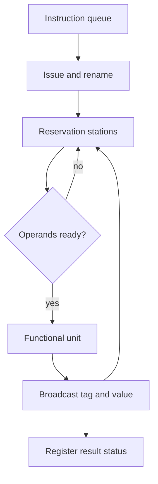

# Dynamic Scheduling and Tomasulo

Dynamic scheduling lets hardware find instruction-level parallelism that the compiler could not fully expose. In a simple in-order pipeline, one stalled instruction can block younger independent instructions. An out-of-order core decodes instructions in program order, tracks dependencies, and allows ready instructions to execute when their operands and functional units are available.

Tomasulo's algorithm is the classic model for this idea. It was developed for floating-point execution, but its concepts reappear throughout modern processors: reservation stations, tags instead of architectural register names, broadcast results, and dependency-driven wakeup. The algorithm attacks RAW hazards by waiting for values and attacks WAR/WAW name hazards by renaming registers to producer tags.

## Definitions

Instruction-level parallelism, ILP, is the amount of independent work among nearby instructions. Dependencies limit ILP:

- Data dependence: an instruction needs a value produced by another.
- Name dependence: instructions reuse the same register or memory name without true data flow.
- Control dependence: an instruction's execution depends on a branch decision.

Dynamic scheduling is a hardware technique that issues instructions when their operands are ready, possibly out of original program order. The machine must still preserve the appearance of sequential execution for the ISA.

Tomasulo-style structures include:

- Reservation stations: buffers near functional units holding waiting operations.
- Register result status: a table mapping architectural registers to the tag of the pending producer.
- Common data bus: a conceptual broadcast path carrying completed values and tags to waiting consumers.
- Tags: names for in-flight results, replacing direct dependence on architectural register names.

The basic stages are:

1. Issue: allocate a reservation station and rename destination.
2. Execute: start when all source operands are available and a unit is free.
3. Write result: broadcast result and tag to waiting instructions and register status.

Modern processors refine this with physical register files, issue queues, load/store queues, and reorder buffers, but the dependency idea is the same.

## Key results

Tomasulo's algorithm removes many stalls by separating true dependencies from name dependencies. Consider:

```text
F2 = F0 + F4
F6 = F8 * F10
F2 = F6 - F12
```

The two writes to `F2` create a WAW name dependence if the machine treats `F2` as a single storage location during execution. Renaming gives the first write one tag and the second write another tag. Consumers identify the correct producer by tag, not just by register name.

RAW dependencies remain real. If instruction B needs instruction A's result, B cannot execute before that result exists. Dynamic scheduling helps by allowing unrelated instructions C, D, and E to bypass B while B waits.

Memory dependencies are more difficult because addresses may not be known early. A load can pass an older store only when the machine knows they do not refer to the same address, or when speculation and recovery mechanisms are available. This is why load/store queues are central to out-of-order processors.

The performance benefit is bounded by available ILP, functional units, front-end bandwidth, branch prediction, and memory latency. Out-of-order execution is not magic; it rearranges independent work to cover stalls, but it cannot manufacture independence in a serial dependency chain.

The instruction window is the hardware's search space for independent work. A larger window can look farther past a stalled instruction, but it requires more entries, more wakeup comparisons, more selection logic, and more physical registers. Wakeup and select are especially hard to scale because many waiting instructions must compare their source tags against completing results every cycle, then the processor must choose a legal subset to issue.

Memory ordering makes dynamic scheduling less clean than register scheduling. Register names are known at decode, but memory addresses may require computation. A younger load might be independent of an older store, or it might read the same address. Conservative hardware waits, losing performance. Aggressive hardware predicts independence, executes the load, and replays if a violation is discovered. The right choice depends on workload behavior and recovery cost.

Tomasulo's algorithm is often taught with a common data bus, but real processors cannot broadcast unlimited results to unlimited consumers. Physical layout, wire delay, and energy force clustered schedulers, limited bypass networks, and staged wakeup paths. The conceptual model remains valuable because it explains why tags, renaming, and operand readiness are central to out-of-order execution.

## Visual



| Structure | Holds | Purpose |
|---|---|---|
| Reservation station | Operation, operands or tags | Wait until dependencies are satisfied |
| Register status table | Destination register to producer tag | Implements renaming |
| Functional unit | Executing operation | Produces value after latency |
| Common data bus | Completed tag and value | Wakes dependent instructions |
| Load/store queue | Memory operations and addresses | Preserves memory ordering when needed |

## Worked example 1: Out-of-order issue around a cache miss

Problem: A simple in-order core sees the following instructions. `I1` is a load that misses and takes 20 cycles. `I2` depends on `I1`. `I3` and `I4` are independent one-cycle ALU operations. Compare in-order execution with dynamic scheduling, ignoring fetch and write-back overhead.

```text
I1: ld  r1, 0(r2)
I2: add r3, r1, r4
I3: sub r5, r6, r7
I4: xor r8, r9, r10
```

Method:

1. In-order issue cannot pass `I2`. After `I1` starts, the core waits for the load result before issuing `I2`, even though `I3` and `I4` are independent.

Approximate cycles:

$$
\begin{aligned}
I1 &= 20 \\
I2 &= 1 \\
I3 &= 1 \\
I4 &= 1 \\
T_{inorder} &= 23
\end{aligned}
$$

2. Dynamic scheduling allows `I3` and `I4` to execute while `I2` waits for `I1`.

Approximate critical path:

$$
I1\ (20) \rightarrow I2\ (1)
$$

Independent work fits under the load miss:

$$
T_{dynamic}\approx 21
$$

3. Compute speedup.

$$
\mathrm{Speedup}=\frac{23}{21}=1.095
$$

Checked answer: Dynamic scheduling reduces this tiny sequence from about 23 to 21 cycles. The gain is small because only two independent one-cycle operations are available to cover a long miss.

## Worked example 2: Register renaming removes WAW and WAR

Problem: Consider this instruction sequence:

```text
I1: F2 = F0 + F4
I2: F6 = F2 * F8
I3: F2 = F10 - F12
I4: F14 = F2 / F16
```

Identify true dependencies and rename destinations using tags `T1`, `T2`, and `T3`.

Method:

1. Assign tags to producing instructions.

$$
\begin{aligned}
I1 &: F2 \leftarrow T1 \\
I2 &: F6 \leftarrow T2 \\
I3 &: F2 \leftarrow T3
\end{aligned}
$$

2. Rewrite sources according to the most recent producer at issue time.

```text
I1: T1 = F0 + F4
I2: T2 = T1 * F8
I3: T3 = F10 - F12
I4: F14 = T3 / F16
```

3. Identify true dependencies.

`I2` truly depends on `I1` through `T1`. `I4` truly depends on `I3` through `T3`. There is no true data dependence from `I1` to `I3`; they only reuse the architectural name `F2`.

4. Explain scheduling.

`I3` can execute before `I1` completes if its operands and subtract unit are ready, because it writes a different physical destination tag. `I4` must wait for `T3`, not for `T1`.

Checked answer: Renaming converts name reuse into distinct tags. RAW dependencies remain, but WAW and WAR hazards on `F2` disappear from the scheduling problem.

## Code

```python
class Renamer:
    def __init__(self):
        self.map = {}
        self.next_tag = 1

    def source(self, reg):
        return self.map.get(reg, reg)

    def dest(self, reg):
        tag = f"T{self.next_tag}"
        self.next_tag += 1
        self.map[reg] = tag
        return tag

program = [
    ("add", "F2", ["F0", "F4"]),
    ("mul", "F6", ["F2", "F8"]),
    ("sub", "F2", ["F10", "F12"]),
    ("div", "F14", ["F2", "F16"]),
]

renamer = Renamer()
for op, dst, srcs in program:
    renamed_srcs = [renamer.source(s) for s in srcs]
    renamed_dst = renamer.dest(dst)
    print(f"{renamed_dst} = {op}({', '.join(renamed_srcs)})")
```

The renamer code demonstrates name mapping, but a real machine must also free old physical registers. A physical register cannot return to the free list when a newer version is created, because older instructions or exceptions may still need the old value. Many processors free the previous physical register only when the redefining instruction commits and the old version is no longer part of the precise architectural state.

The model also ignores issue width and functional-unit conflicts. Renaming can reveal that two operations are independent, but they still compete for reservation stations, ports, execution units, and result buses. Dynamic scheduling is therefore a resource-allocation problem as well as a dependency problem. This is why increasing the instruction window does not automatically produce proportional IPC gains.

A practical performance study should separate front-end starvation from back-end scheduling limits. If the decoder or branch predictor fails to supply enough instructions, reservation stations sit empty. If the window is full but few instructions are ready, true dependencies or memory latency are the likely limit.

## Common pitfalls

- Assuming out-of-order execution changes the program-visible instruction order.
- Forgetting that true RAW dependencies cannot be renamed away.
- Treating memory addresses like registers before proving that loads and stores do not alias.
- Ignoring wakeup/select complexity when scaling issue width.
- Assuming an infinite common data bus or unlimited bypass bandwidth.
- Measuring ILP on code without realistic branch and cache behavior.

## Connections

- [Pipelining and Hazards](/cs/computer-architecture/pipelining-hazards)
- [Speculation, Renaming, and Multiple Issue](/cs/computer-architecture/speculation-renaming-multiple-issue)
- [Branch Prediction and Control Hazards](/cs/computer-architecture/branch-prediction)
- [Instruction Set Principles](/cs/computer-architecture/instruction-set-principles)
