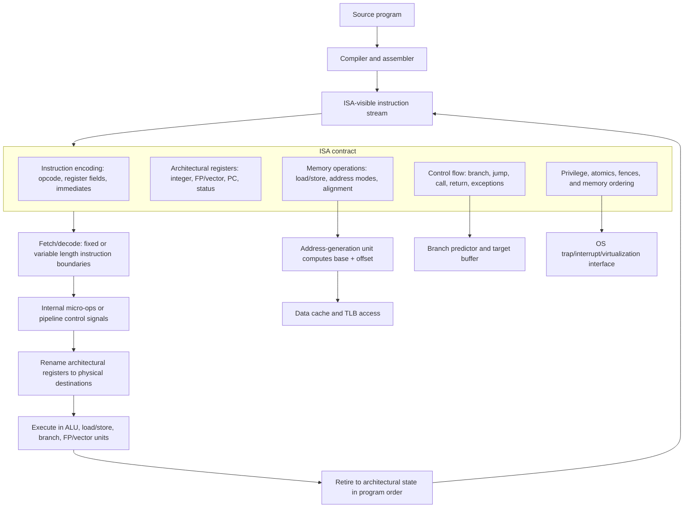

# Instruction Set Principles

An instruction set architecture, or ISA, is the contract between software and hardware. Compilers, assemblers, operating systems, debuggers, and binary tools depend on it. Microarchitectures can change radically underneath the same ISA: a simple in-order core, an out-of-order superscalar core, and a translated internal core can all implement the same programmer-visible instructions.

H&P treats ISA design as one part of architecture, not the whole field. That distinction matters. A clean load-store ISA can simplify pipelining and compiler reasoning, but performance also depends on branch prediction, caches, memory systems, and implementation technology. This page focuses on ISA concepts using MIPS-like and RISC-V-like examples, while contrasting them with more complex CISC styles such as x86.

## Definitions

An ISA specifies the programmer-visible behavior of a processor:

- Instruction operations such as add, load, store, branch, call, and return.
- Programmer-visible registers.
- Operand types and sizes.
- Memory addressing modes.
- Instruction encodings.
- Exceptions, interrupts, privilege levels, and memory-ordering rules.

A load-store ISA performs arithmetic only on registers. Memory is accessed with explicit load and store instructions:

$$
\mathrm{registers} \leftrightarrow \mathrm{load/store} \leftrightarrow \mathrm{memory}
$$

A register-memory ISA allows some arithmetic operations to read or write memory directly. A memory-memory ISA allows both operands to reside in memory, but this is uncommon in modern high-performance general-purpose cores because it complicates pipelining and dependency tracking.

RISC, reduced instruction set computer, is a design philosophy that emphasizes simple, regular instructions, many registers, load-store operation, and encodings that are easy to decode. CISC, complex instruction set computer, uses richer instructions and often variable-length encodings. Modern x86 processors decode complex instructions into simpler internal micro-operations, allowing a CISC ISA to be implemented with many RISC-like microarchitectural techniques.

Addressing modes define how an instruction computes the effective address of a memory operand. Common modes include:

$$
\begin{aligned}
\mathrm{register}:&\quad R[x] \\
\mathrm{immediate}:&\quad constant \\
\mathrm{base+offset}:&\quad R[base] + displacement \\
\mathrm{PC\ relative}:&\quad PC + displacement
\end{aligned}
$$

Control-flow instructions alter the program counter. Conditional branches choose between fall-through and target addresses. Calls save a return address and transfer control. Returns jump to the saved address.

## Key results

ISA choices strongly affect implementation complexity. Fixed-length instructions simplify fetch and decode because instruction boundaries are obvious. Variable-length instructions can improve code density, reducing instruction-cache pressure, but they need more complex decoders and length prediction. More registers reduce memory traffic and make compiler allocation easier, but increase instruction bits needed to name registers and can lengthen register-file access.

The load-store discipline supports simple pipeline stages:

1. Fetch an instruction.
2. Decode and read registers.
3. Execute ALU operation or compute address.
4. Access memory if needed.
5. Write back the result.

That stage regularity is one reason MIPS was historically useful for teaching architecture. RISC-V follows similar principles: fixed base instruction length, a register-register arithmetic style, immediate variants, explicit loads and stores, and PC-relative branches or jumps.

CISC encodings illustrate a different trade-off. A single x86 instruction may do work that takes multiple RISC instructions, and the binary may be smaller. But the processor must handle variable length, more addressing cases, and more complex side effects. High-performance x86 cores spend area and power translating the architected ISA into internal operations that can be renamed, scheduled, and speculated.

The best ISA is not always the one with the fewest instructions. It is the one whose visible contract lets software express important operations while allowing efficient implementations across many generations. Compatibility has enormous economic value; this is why old ISAs persist long after their original implementation assumptions have changed.

A useful ISA design rule is to keep the common case regular and make uncommon complexity explicit. For example, a base-plus-offset load handles stack slots, fields in records, and array elements with a compact encoding. More elaborate modes can reduce instruction count in special cases, but they may lengthen address-generation logic for every implementation. The cost is paid repeatedly by future microarchitectures, compilers, verifiers, and operating systems.

The ISA also defines what the compiler can assume. If condition codes are implicit side effects of arithmetic, instruction scheduling must preserve those side effects until the branch or conditional operation consumes them. If comparisons write ordinary registers, there may be more flexibility but also more register pressure. If the ISA has predicated instructions, short branches can sometimes be removed, but useless work may execute under false predicates. These details connect ISA design directly to pipelining, branch prediction, and ILP.

RISC-V-style teaching examples are useful because the visible rules are simple, but real systems include privileged instructions, page-table formats, atomic memory operations, floating-point state, vector extensions, and debug facilities. An ISA is not only the integer instructions shown in a datapath diagram; it is the full software-hardware contract needed to boot, isolate, interrupt, virtualize, and debug programs.

## Visual



This ISA diagram separates the programmer-visible contract from the microarchitecture that implements it. Encodings, registers, memory operations, control flow, privilege rules, atomics, and fences are stable ISA facts, while decode, micro-op formation, renaming, execution, and retirement are implementation choices. The side paths show why addressing modes, branch semantics, and privileged operations directly affect cache/TLB access, prediction, and operating-system control.

| Design choice | RISC-style tendency | CISC-style tendency | Main trade-off |
|---|---|---|---|
| Instruction length | Fixed or mostly fixed | Variable | Decode simplicity versus code density |
| Arithmetic operands | Registers only | Registers or memory | Pipeline regularity versus expressive instructions |
| Addressing modes | Few | Many | Compiler simplicity versus instruction count |
| Register count | Often larger | Historically smaller | Fewer spills versus encoding bits |
| Implementation | Direct pipeline-friendly decode | Decode into internal operations | Simpler front end versus compatibility |

## Worked example 1: Encoding a MIPS-style register instruction

Problem: Encode a simplified MIPS-style instruction `add r9, r10, r11`. Use an R-format layout with fields `opcode(6) rs(5) rt(5) rd(5) shamt(5) funct(6)`. For `add`, assume `opcode=0`, `funct=32`, `rs=r10`, `rt=r11`, `rd=r9`, and `shamt=0`.

Method:

1. Convert each field to binary with the required width.

$$
\begin{aligned}
opcode &= 0 = 000000_2 \\
rs &= 10 = 01010_2 \\
rt &= 11 = 01011_2 \\
rd &= 9 = 01001_2 \\
shamt &= 0 = 00000_2 \\
funct &= 32 = 100000_2
\end{aligned}
$$

2. Concatenate fields in instruction order.

$$
000000\ 01010\ 01011\ 01001\ 00000\ 100000
$$

3. Group into nibbles for hexadecimal.

$$
0000\ 0001\ 0100\ 1011\ 0100\ 1000\ 0010\ 0000
$$

4. Convert to hexadecimal.

$$
0x014B4820
$$

Checked answer: The encoded instruction is `0x014B4820` under this simplified MIPS-style layout. The result is checkable because the low six bits are `100000`, the expected function code for add.

## Worked example 2: Comparing load-store and memory-memory code

Problem: Compute `A[i] = B[i] + C[i]` for 64-bit integers. Assume base addresses are in `r1`, `r2`, `r3`, index byte offset is in `r4`, and temporaries are `r5`, `r6`, `r7`. Count dynamic instructions in a RISC load-store sequence, then compare with a hypothetical memory-memory instruction.

Method:

1. RISC load-store sequence:

```text
ld   r5, 0(r2+r4)   ; r5 = B[i]
ld   r6, 0(r3+r4)   ; r6 = C[i]
add  r7, r5, r6     ; r7 = B[i] + C[i]
sd   r7, 0(r1+r4)   ; A[i] = r7
```

This uses four instructions: two loads, one add, one store.

2. Hypothetical memory-memory sequence:

```text
addm 0(r1+r4), 0(r2+r4), 0(r3+r4)
```

This uses one instruction, but the instruction must read two memory operands, perform addition, and write one memory result.

3. Compare implementation effects.

The RISC sequence has higher instruction count:

$$
IC_{RISC}=4,\quad IC_{memmem}=1
$$

But the RISC pipeline sees explicit memory operations and a simple register-register ALU operation. The memory-memory instruction has lower instruction count but may require multiple memory accesses, complex addressing, and multi-cycle execution.

Checked answer: Instruction count alone favors the memory-memory ISA, but implementation simplicity and scheduling visibility favor the load-store sequence. The correct design choice depends on CPI, code density, cache behavior, and compiler support, not on instruction count alone.

## Code

```python
def encode_r_type(opcode, rs, rt, rd, shamt, funct):
    fields = [
        (opcode, 6),
        (rs, 5),
        (rt, 5),
        (rd, 5),
        (shamt, 5),
        (funct, 6),
    ]
    value = 0
    for field, width in fields:
        if field >= (1 << width):
            raise ValueError("field does not fit")
        value = (value << width) | field
    return value

inst = encode_r_type(opcode=0, rs=10, rt=11, rd=9, shamt=0, funct=32)
print(f"0x{inst:08X}")
print(f"binary={inst:032b}")
```

This encoder is intentionally small, but it illustrates why fixed fields simplify hardware. The decoder can select bit slices for register numbers and operation fields without first finding instruction boundaries. Variable-length ISAs can still be fast, but they need more front-end machinery: length decoding, instruction alignment, queues, and often translation into internal operations.

Encoding space is a scarce resource. Adding more registers, larger immediates, predication bits, or addressing modes consumes bits. If the ISA keeps a fixed 32-bit base instruction, every field competes with every other field. Compressed instruction extensions make a different trade-off by adding shorter encodings for common cases, improving code density while preserving a regular full-size base format.

## Common pitfalls

- Treating ISA and microarchitecture as the same thing.
- Assuming RISC always means faster or CISC always means slower.
- Comparing instruction counts without comparing CPI and cache behavior.
- Forgetting that compatibility can dominate clean-sheet elegance.
- Adding addressing modes that look convenient but lengthen the critical decode or execute path.
- Ignoring compiler quality when evaluating an ISA.

## Connections

- [Pipelining and Hazards](/cs/computer-architecture/pipelining-hazards)
- [Dynamic Scheduling and Tomasulo](/cs/computer-architecture/dynamic-scheduling-tomasulo)
- [Virtual Memory, TLBs, and VMs](/cs/computer-architecture/virtual-memory-tlb-vms)
- [Domain-Specific Accelerators](/cs/computer-architecture/domain-specific-accelerators)
