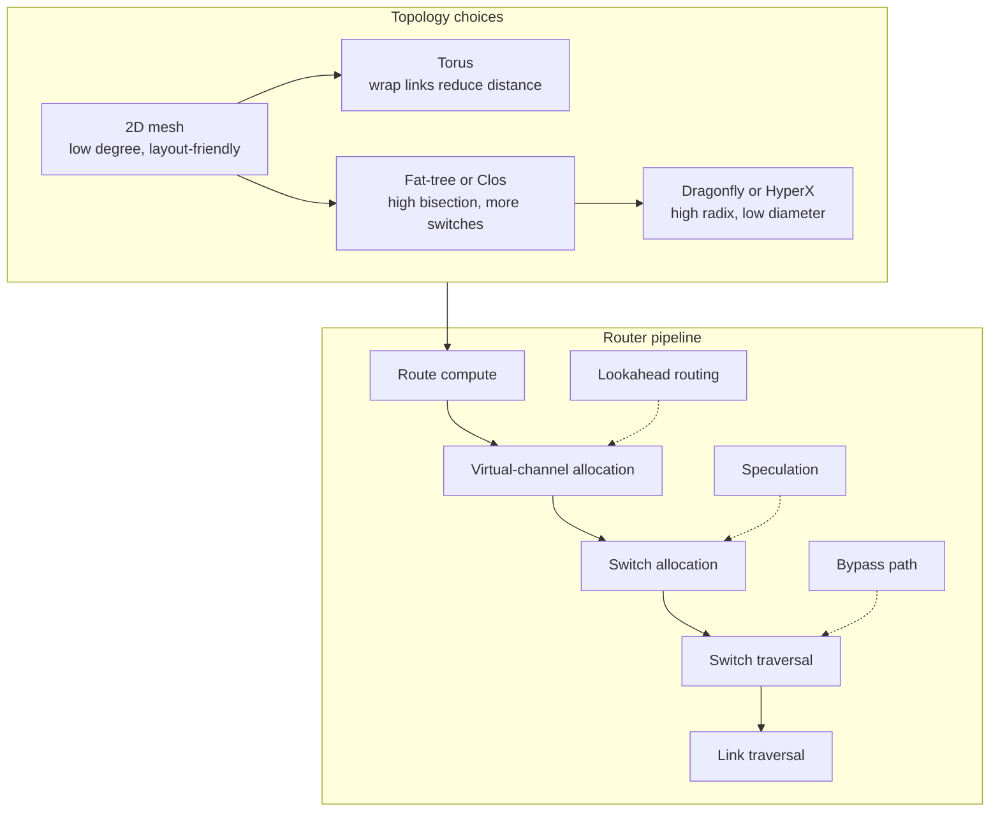

# Interconnection Networks


*Figure: Network topologies serve as the design vocabulary for interconnection networks. Direct topologies (mesh, torus, hypercube) and indirect topologies (Clos, fat-tree, butterfly) trade off diameter, bisection bandwidth, switch radix, and cost. Image: [Wikimedia Commons](https://commons.wikimedia.org/wiki/File:NetworkTopologies.svg), public domain.*


*Figure: The hypercube is a classic direct topology where node degree grows logarithmically with system size and diameter equals dimension. Image: [Wikimedia Commons](https://commons.wikimedia.org/wiki/File:Hypercube.svg), public domain.*


*Figure: A crossbar switch is the canonical non-blocking router fabric. Router microarchitecture inherits the crossbar as the switch-traversal stage between virtual-channel and switch allocators. Image: [Wikimedia Commons](https://commons.wikimedia.org/wiki/File:Crossbar.svg), public domain.*

Interconnection networks are the communication substrate inside and between computers. They move cache-line requests between cores, packets between router ports, DMA traffic between devices and memory, and gradient updates between accelerators. Dally and Towles organize the subject around a practical separation: choose a topology, choose routes through it, then choose flow control so packets can share links and buffers without wasting bandwidth or deadlocking [1].

This page fills the gap between single-machine architecture and warehouse-scale networking. It connects on-chip networks, off-chip fabrics such as PCIe, CXL, InfiniBand, RoCE, and NVLink, and AI-cluster fabrics. The vocabulary is shared, but constraints shift from wire energy and router area to cable cost, switch radix, fault isolation, congestion control, and collective efficiency.

## Definitions

An interconnection network is a programmable communication system that transports data between terminals. A terminal may be a core, cache slice, memory controller, I/O device, NIC, GPU, switch port, or server. The same channels and switches carry different source-destination pairs at different times [1].

A node is an endpoint or switch. In a direct network, endpoints attach to routers that are also part of the topology, as in a mesh, torus, or hypercube. In an indirect network, endpoints attach to switching stages, as in a butterfly, Clos, Benes, or fat-tree. A channel is a unidirectional communication resource; a physical link is often modeled as two opposite-direction channels. A packet is the network-layer unit being delivered; a flit, or flow-control digit, is the smaller unit over which buffers and link bandwidth are often allocated; a phit is the physical transfer width in one cycle.

Bandwidth is the rate at which bits or bytes can be carried by a channel, terminal, bisection, or whole network. Latency is the time from injection at the source to delivery at the destination. Throughput is the accepted traffic rate under a workload; saturation throughput is the largest offered load the network can accept before queues grow rapidly. For a lightly loaded packet, a common first-order latency model is

$$
T = T_{\text{header}} + T_{\text{serial}} + T_{\text{router}}H,
$$

where $H$ is hop count, $T_{\text{header}}$ includes injection and header movement costs not already counted per router, and $T_{\text{serial}}$ is the time to place all flits on the first link. Real latency also includes queueing delay, credit stalls, arbitration, retry, and protocol overhead.

Topology is the graph: which nodes and switches are connected. Routing maps a packet and its current state to an output channel. Flow control allocates link bandwidth and buffer space over time. These axes are studied separately, but they interact strongly. A topology may have excellent bisection bandwidth, yet a poor routing algorithm can concentrate traffic on a few channels. A good route may still perform badly if flow control causes head-of-line blocking or cyclic resource holds.

Several topology metrics appear repeatedly. Degree counts incident channels at a router. Diameter is the maximum shortest-path hop count between terminals; average distance often predicts unloaded latency better. Bisection bandwidth is the minimum bandwidth crossing an equal-half cut. Path diversity measures alternate routes.

On-chip networks, or NoCs, connect cores, cache banks, memory controllers, and accelerators on one die or package. Mesh NoCs are common because they are regular and layout-friendly; examples include MIT RAW, Tilera chips, Intel Xeon Phi, and Esperanto accelerators. 3D TSVs shorten vertical paths but add thermal and packaging constraints. Routerless interconnects save energy when traffic is predictable.

Off-chip fabrics cover board, rack, supercomputer, and datacenter scales. PCIe is a host-device I/O fabric. CXL adds coherent and memory-expansion semantics. InfiniBand and RoCE expose RDMA; GPU-direct RDMA extends low-overhead movement to GPU memory. NVLink and NVSwitch provide high-bandwidth GPU-to-GPU communication. Dragonfly, dragonfly+, flattened butterfly, HyperX, Clos, and fat-tree fabrics use high-radix switches to reduce hop count and raise bisection bandwidth [7], [8], [12].

Traffic pattern matters as much as topology. Uniform random, bit-reverse, transpose, complement, nearest-neighbor, and hot-spot patterns stress different cuts and routes. Synthetic patterns expose weaknesses; trace-driven studies are needed before claiming an application will perform well. BookSim, Garnet inside gem5, and SST-style frameworks evaluate routing, flow control, and microarchitecture before hardware exists [9], [10].

## Key results

Topology metrics give lower bounds and feasibility checks. In a $k \times k$ mesh, $N=k^2$, degree is at most $4$, diameter is $2(k-1)$, and the narrowest straight bisection crosses $k$ links. A 2D torus adds wraparound links, keeps degree $4$, reduces diameter to $2\lfloor k/2 \rfloor$, and improves bisection. A $d$-dimensional hypercube has $N=2^d$, degree $d$, diameter $d$, and bisection width $N/2$. A $k$-ary $n$-cube trades lower distance for higher degree [1].

Trees are cheap but have root bottlenecks. A binary tree with unit links has small degree and simple routing, but traffic between halves crosses the root cut. A fat-tree widens links or adds parallel links near the root. A Clos network uses input, middle, and output stages; with enough middle-stage capacity it can be strictly or rearrangeably nonblocking. Benes networks give rearrangeable nonblocking connectivity with $O(\log N)$ stages, but need control to choose a conflict-free permutation.

Butterfly networks provide logarithmic diameter and regular wiring, but a basic butterfly has only one path between a source and destination. Extra stages, randomized routing, or richer topologies add path diversity. Flattened butterfly and HyperX topologies exploit high-radix routers to connect more dimensions directly, reducing diameter at the cost of wider routers and more global wiring [7], [12].

Dragonfly networks organize routers into groups. Local links connect routers inside a group; global links connect groups. The goal is low diameter with fewer expensive global cables than a full high-radix fabric. Dragonfly+ variants often combine dragonfly intergroup structure with leaf-spine organization inside groups [8].

Routing can be deterministic, oblivious, or adaptive. Deterministic dimension-order routing, often called XY routing in a 2D mesh, consumes all hops in one dimension and then the next. It is simple and deadlock-friendly, but it uses no path diversity. Oblivious routing chooses a path independent of current congestion; Valiant routing sends packets through a random intermediate node before the final destination, sacrificing minimality to spread adversarial traffic [2]. Adaptive routing uses congestion information to choose among legal paths. Duato's theory separates an always-available deadlock-free escape subnetwork from adaptive choices, preserving correctness while allowing flexibility [6].

Minimal routing uses only shortest paths. Non-minimal routing allows extra hops to avoid congestion, faults, or global bottlenecks. Minimal routing preserves low-load latency; non-minimal routing can improve throughput under hot spots, but it must control livelock by bounding misroutes, biasing toward progress, or reserving escape paths.

Deadlock is a resource-dependence problem. Packets, connections, or flits can hold one resource while waiting for another. If the resource-dependence graph has a cycle and packets occupy it in the wrong pattern, no member can advance. Acyclic channel ordering prevents such cycles. Dimension-order routing avoids deadlock in meshes by ordering channels by dimension and direction. Tori need virtual-channel classes or datelines because wraparound links create cyclic dependence. Protocol deadlock is separate: cache-coherent systems often separate request, response, invalidation, and data traffic into distinct virtual networks [1], [4], [5].

Flow control determines when packets acquire and release resources. Store-and-forward buffers a whole packet at each router; it is simple but adds packet serialization at each hop. Virtual cut-through forwards as soon as the next packet buffer is available [3]. Wormhole flow control allocates by flit, so the head reserves the path and body flits follow in a pipeline. It reduces unloaded latency, but a blocked packet can occupy virtual channels across many routers.

Virtual channels split one physical channel into multiple logical channels with separate buffers and state. They support deadlock avoidance, throughput, QoS, and protocol separation [5]. Credit-based flow control tracks downstream buffer availability: a sender transmits only when it has credit for the target virtual channel. Ack/nack schemes acknowledge receipt or request retransmission, often for error control. Backpressure prevents buffer overflow but can spread stalls far from the congested point.

Head-of-line blocking occurs when the front packet in an input queue waits for one output while later packets could use free outputs. Virtual output queues reduce this problem by maintaining separate queues per output or output class. Allocators choose a matching between inputs and outputs. Separable allocators arbitrate in phases; wavefront allocators exploit regular crossbar structure; iSLIP iteratively matches requests with rotating priorities.

A canonical wormhole router pipeline has route computation, virtual-channel allocation, switch allocation, switch traversal, and link traversal. Body flits skip route computation and virtual-channel allocation after the head establishes state. Lookahead routing computes the next hop one router early. Speculation overlaps virtual-channel and switch allocation. Bypass paths let an arriving flit traverse a router without being written into a buffer when the output is free. These techniques trade control complexity for lower per-hop latency [1].

The latency-throughput curve has a knee. At low load, latency is close to unloaded hop and serialization cost. As load rises, contention creates queueing delay; near saturation, small traffic increases cause large latency increases. Compare designs at the application load they must sustain, not only by peak link bandwidth. AI clusters add collective pressure: tensor parallelism, pipeline parallelism, and data-parallel reductions need predictable bisection bandwidth. Ring AllReduce is bandwidth-efficient on rings but takes many phases; tree and hierarchical AllReduce reduce step count but stress upper links. Topology-aware scheduling places frequent collective partners near each other and avoids overloading the same global links.

## Visual




| Topology | Diameter trend | Bisection trend | Main strength | Main cost |
|---|---:|---:|---|---|
| 2D mesh | $O(\sqrt{N})$ | $O(\sqrt{N})$ links | Simple NoC layout | Long paths at high core counts |
| 2D torus | $O(\sqrt{N})$ with smaller constant | $O(\sqrt{N})$ to $2O(\sqrt{N})$ links | Better balance than mesh | Wrap links complicate layout and deadlock |
| Hypercube | $O(\log N)$ | $O(N)$ links across a dimension | Low diameter, high symmetry | Degree grows as $\log N$ |
| Fat-tree or Clos | $O(\log N)$ stages | Can match full injection | High bisection and multipathing | Switch and cable count |
| Dragonfly | Often small constant group hops | High if global links are balanced | Low diameter with fewer global cables | Global-link congestion sensitivity |

## Worked example 1: bisection bandwidth and diameter

Problem: Compare a $4 \times 4$ mesh, a 16-node hypercube, and a 16-terminal full-bisection fat-tree. Assume every physical link has bandwidth $B$ in each direction. Report one-way bisection bandwidth, because traffic from one half to the other is usually the limiting direction; bidirectional aggregate would be twice these values.

Method:

1. $4 \times 4$ mesh.

There are $N=4 \cdot 4=16$ terminals. The longest shortest path goes from one corner to the opposite corner:

$$
\begin{aligned}
D_{\text{mesh}}
&=(4-1)+(4-1) \\
&=6\ \text{hops}.
\end{aligned}
$$

A vertical cut between columns 1 and 2 splits the 16 nodes into 8 on the left and 8 on the right. The cut crosses one horizontal link in each row, so it crosses 4 links:

$$
B_{\text{bisect, mesh}} = 4B.
$$

2. 16-node hypercube.

A hypercube with 16 nodes has

$$
16 = 2^4,
$$

so it has dimension $d=4$. The maximum Hamming distance between two node labels is 4, hence

$$
D_{\text{cube}}=4.
$$

Cut the cube by the most significant bit. Eight nodes have bit 0 and eight have bit 1. Each node on the 0 side has exactly one edge crossing that dimension to the 1 side, so the cut crosses 8 links:

$$
B_{\text{bisect, cube}}=8B.
$$

3. 16-terminal full-bisection fat-tree.

Use the standard fat-tree assumption: upper levels are widened or replicated so that no root cut has less bandwidth than the terminals below it can inject. Half the terminals means 8 sources on one side and 8 destinations on the other. If each terminal injects at $B$, full bisection requires

$$
B_{\text{bisect, fat-tree}}=8B.
$$

For diameter, assume a binary tree view with terminals at leaves and four leaf-to-root edges for 16 leaves. The farthest pair has to go up to the least common ancestor at the root and back down:

$$
D_{\text{fat-tree}} = 4 + 4 = 8\ \text{links}.
$$

In a folded Clos implementation, designers may count switch-to-switch stages instead of terminal access links. The bandwidth conclusion is the key point: fattening the upper tree removes the root bottleneck.

Checked answer:

| Network | Diameter | One-way bisection bandwidth |
|---|---:|---:|
| $4 \times 4$ mesh | 6 hops | $4B$ |
| 16-node hypercube | 4 hops | $8B$ |
| 16-terminal full-bisection fat-tree | 8 leaf-link hops under the stated model | $8B$ |

The mesh is cheapest and most layout-friendly, but its bisection is half the hypercube or full fat-tree here. The hypercube improves diameter and bisection at degree $4$. The fat-tree can match full injection bandwidth, but pays in switches, links, and route control.

## Worked example 2: wormhole latency for a short packet

Problem: A packet has 4 flits and travels 6 hops. Each hop has a 1-cycle router traversal and a 1-cycle link traversal. There is no contention, credit stall, clock crossing, or retransmission. What is the end-to-end wormhole latency from the head flit entering the first router to the tail flit arriving at the destination?

Method:

1. Compute per-hop head-flit delay.

$$
t_{\text{hop}} = t_{\text{router}} + t_{\text{link}} = 1 + 1 = 2\ \text{cycles}.
$$

2. Move the head flit through 6 hops.

$$
T_{\text{head}} = Ht_{\text{hop}} = 6 \cdot 2 = 12\ \text{cycles}.
$$

3. Add serialization for the remaining flits. The first flit is already in the head latency. With one flit injected per cycle, the remaining serialization is

$$
T_{\text{serial-tail}} = 4 - 1 = 3\ \text{cycles}.
$$

4. Add the parts.

$$
\begin{aligned}
T_{\text{wormhole}}
&=T_{\text{head}} + T_{\text{serial-tail}} \\
&=12 + 3 \\
&=15\ \text{cycles}.
\end{aligned}
$$

Checked answer: The wormhole packet latency is 15 cycles under this convention. A simulator that counts the source injection cycle separately may report 16 cycles. The architectural point is that wormhole latency adds packet serialization once, not once per hop as in naive store-and-forward movement.

## Code

```python
def node_id(x, y, width):
    return y * width + x

def xy_next_hop(src, dst, width):
    sx, sy = src % width, src // width
    dx, dy = dst % width, dst // width
    if sx < dx:
        return node_id(sx + 1, sy, width)
    if sx > dx:
        return node_id(sx - 1, sy, width)
    if sy < dy:
        return node_id(sx, sy + 1, width)
    if sy > dy:
        return node_id(sx, sy - 1, width)
    return src

def build_xy_routing_table(width, height):
    nodes = range(width * height)
    table = {}
    for src in nodes:
        for dst in nodes:
            table[(src, dst)] = xy_next_hop(src, dst, width)
    return table

def route_from_table(src, dst, table):
    path = [src]
    current = src
    while current != dst:
        current = table[(current, dst)]
        path.append(current)
        if len(path) > len(table):
            raise RuntimeError("routing loop detected")
    return path

def route_hops(src, dst, table):
    return len(route_from_table(src, dst, table)) - 1

def mesh_edges(width, height):
    edges = set()
    for y in range(height):
        for x in range(width):
            u = node_id(x, y, width)
            if x + 1 < width:
                edges.add(tuple(sorted((u, node_id(x + 1, y, width)))))
            if y + 1 < height:
                edges.add(tuple(sorted((u, node_id(x, y + 1, width)))))
    return edges

def bisection_bandwidth(edges, left_side, link_bandwidth=1):
    left = set(left_side)
    crossing = [e for e in edges if (e[0] in left) ^ (e[1] in left)]
    return len(crossing) * link_bandwidth, crossing

width = height = 4
nodes = range(width * height)
table = build_xy_routing_table(width, height)
path = route_from_table(0, 15, table)
edges = mesh_edges(width, height)
left_half = [node_id(x, y, width) for y in range(height) for x in range(2)]
bw, cut_edges = bisection_bandwidth(edges, left_half, link_bandwidth=1)
diameter = max(route_hops(a, b, table) for a in nodes for b in nodes)

print("XY route 0 -> 15:", path)
print("4x4 mesh diameter under XY:", diameter)
print("one-way bisection bandwidth:", bw)
print("cut edges:", sorted(cut_edges))
```

The routing table stores the next hop for every source-destination pair under deterministic XY routing. The bisection checker takes one side of a cut, counts crossing links, and multiplies by per-link bandwidth.

## Common pitfalls

- Comparing topologies by diameter alone while ignoring bisection bandwidth and traffic pattern.
- Counting bidirectional bisection bandwidth in one network and one-way bandwidth in another.
- Treating a tree as a fat-tree without actually widening or replicating links near the root.
- Assuming adaptive routing is automatically deadlock-free.
- Forgetting protocol deadlock between request and response traffic in coherent machines.
- Using virtual channels as if they create physical bandwidth; they improve scheduling and dependence structure, but the physical link is still shared.
- Ignoring head-of-line blocking in input-queued switches and routers.
- Evaluating only uniform random traffic and missing transpose, complement, hot-spot, or collective patterns.
- Confusing wormhole flow control with packet switching in general; wormhole is a specific flit-buffered method.
- Ignoring credit round-trip delay and buffer depth when estimating link utilization.
- Assuming non-minimal routing improves every workload; it can waste bandwidth at low load.
- Placing AI training workers without considering collective partners and global-link contention.
- Treating PCIe, CXL, InfiniBand, RoCE, and NVLink as interchangeable because all move bytes.

## Connections

- [Cache Coherence](/cs/computer-architecture/coherence-consistency-mesi)
- [Multicore Synchronization](/cs/computer-architecture/multicore-synchronization-numa)
- [Vector, SIMD, and GPU Architectures](/cs/computer-architecture/vector-simd-gpu)
- [Domain-Specific Accelerators](/cs/computer-architecture/domain-specific-accelerators)
- [Warehouse-Scale Computers](/cs/computer-architecture/warehouse-scale-computers)
- [Quantitative Design and Performance](/cs/computer-architecture/quantitative-design-and-performance)
- [Computer Networks](/cs/computer-networks/intro)
- [Distributed Systems](/cs/distributed-systems/intro)

## References

[1] W. J. Dally and B. Towles, *Principles and Practices of Interconnection Networks*. San Francisco, CA, USA: Morgan Kaufmann, 2004, chs. 1, 3-6, 8-16, 23-25.

[2] L. G. Valiant and G. J. Brebner, "Universal schemes for parallel communication," in *Proc. 13th ACM Symp. Theory of Computing*, 1981, pp. 263-277.

[3] P. Kermani and L. Kleinrock, "Virtual cut-through: A new computer communication switching technique," *Computer Networks*, vol. 3, no. 4, pp. 267-286, 1979.

[4] W. J. Dally and C. L. Seitz, "Deadlock-free message routing in multiprocessor interconnection networks," *IEEE Trans. Computers*, vol. C-36, no. 5, pp. 547-553, May 1987.

[5] W. J. Dally, "Virtual-channel flow control," *IEEE Trans. Parallel and Distributed Systems*, vol. 3, no. 2, pp. 194-205, Mar. 1992.

[6] J. Duato, "A new theory of deadlock-free adaptive routing in wormhole networks," *IEEE Trans. Parallel and Distributed Systems*, vol. 4, no. 12, pp. 1320-1331, Dec. 1993.

[7] J. Kim, W. J. Dally, and D. Abts, "Flattened butterfly: A cost-efficient topology for high-radix networks," in *Proc. 34th Int. Symp. Computer Architecture*, 2007, pp. 126-137.

[8] J. Kim, W. J. Dally, S. Scott, and D. Abts, "Technology-driven, highly-scalable dragonfly topology," in *Proc. 35th Int. Symp. Computer Architecture*, 2008, pp. 77-88.

[9] N. Jiang et al., "A detailed and flexible cycle-accurate network-on-chip simulator," in *Proc. IEEE Int. Symp. Performance Analysis of Systems and Software*, 2013, pp. 86-96.

[10] N. Agarwal et al., "GARNET: A detailed on-chip network model inside a full-system simulator," in *Proc. IEEE Int. Symp. Performance Analysis of Systems and Software*, 2009, pp. 33-42.

[11] T. Hoefler and A. Lumsdaine, "Optimizing non-blocking collective operations for InfiniBand," in *Proc. 22nd IEEE Int. Parallel and Distributed Processing Symp. Workshops*, 2008, pp. 1-8.

[12] J. H. Ahn et al., "HyperX: topology, routing, and packaging of efficient large-scale networks," in *Proc. Conf. High Performance Computing Networking, Storage and Analysis*, 2009, pp. 1-11.

[13] M. Al-Fares, A. Loukissas, and A. Vahdat, "A scalable, commodity data center network architecture," in *Proc. ACM SIGCOMM*, 2008, pp. 63-74.

[14] A. Singh et al., "Jupiter rising: A decade of Clos topologies and centralized control in Google's datacenter network," in *Proc. ACM SIGCOMM*, 2015, pp. 183-197.

[15] CXL Consortium, *Compute Express Link Specification*, Rev. 3.0, 2022.
