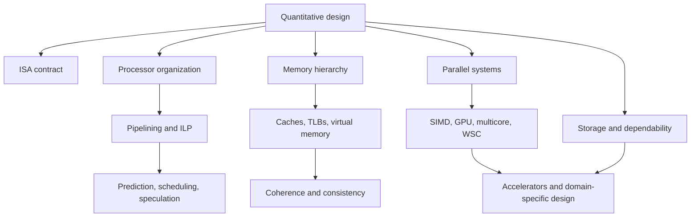

# Computer Architecture

Computer architecture studies the contract between software and hardware, and the organization that makes that contract fast, efficient, dependable, and affordable. In the quantitative tradition of Hennessy and Patterson, architectural ideas are evaluated by execution time, throughput, energy, cost, and reliability rather than by elegance alone. A cache, branch predictor, pipeline, vector unit, or multicore interconnect is useful only when it improves the measured behavior of real workloads under real constraints.

These notes follow the scope of *Computer Architecture: A Quantitative Approach*, 5th edition: quantitative design, memory hierarchy, instruction-level parallelism, data-level parallelism, thread-level parallelism, warehouse-scale computing, and supporting appendix topics such as instruction sets, pipelining, virtual memory, and storage. They are written as original study notes, with formulas, diagrams, worked examples, and small runnable models.

## Definitions

Computer architecture includes three related layers:

- Instruction set architecture, ISA: the programmer-visible contract, including instructions, registers, addressing, exceptions, and memory-ordering rules.
- Microarchitecture or organization: the internal design that implements the ISA, such as pipelines, caches, branch predictors, schedulers, functional units, and interconnects.
- Hardware implementation: circuits, physical design, packaging, power delivery, cooling, and technology choices.

The central quantitative equation for processor time is:

$$
\mathrm{CPU\ time} =
\mathrm{Instruction\ count}\times\mathrm{CPI}\times\mathrm{Clock\ cycle\ time}
$$

The central warning for local optimization is Amdahl's law:

$$
\mathrm{Speedup}=
\frac{1}{(1-f)+f/s}
$$

where fraction $f$ of the old execution time is improved by local speedup $s$. The same pattern appears in parallel processing, memory hierarchies, storage, accelerators, and warehouse-scale systems: only the affected fraction improves, and overhead can erase local gains.

Generated page list:

| Position | Page | Main scope |
|---:|---|---|
| 2 | [Quantitative Design and Performance](/cs/computer-architecture/quantitative-design-and-performance) | CPU time, CPI, benchmarks, Amdahl's law |
| 3 | [Power, Energy, Cost, and Dependability](/cs/computer-architecture/power-energy-cost-dependability) | CMOS power, energy, availability, MTTF |
| 4 | [Instruction Set Principles](/cs/computer-architecture/instruction-set-principles) | RISC/CISC, addressing, MIPS/RISC-V-style load-store design |
| 5 | [Pipelining and Hazards](/cs/computer-architecture/pipelining-hazards) | Five-stage pipeline, forwarding, stalls |
| 6 | [Branch Prediction and Control Hazards](/cs/computer-architecture/branch-prediction) | Dynamic predictors, BTBs, misprediction CPI |
| 7 | [Dynamic Scheduling and Tomasulo](/cs/computer-architecture/dynamic-scheduling-tomasulo) | Reservation stations, tags, out-of-order execution |
| 8 | [Speculation, Renaming, and Multiple Issue](/cs/computer-architecture/speculation-renaming-multiple-issue) | ROBs, precise state, issue width limits |
| 9 | [Cache Organization and AMAT](/cs/computer-architecture/cache-organization-amat) | Tags, sets, associativity, AMAT |
| 10 | [Cache Optimization and Prefetching](/cs/computer-architecture/cache-optimization-and-prefetching) | Blocking, nonblocking caches, prefetching |
| 11 | [Virtual Memory, TLBs, and VMs](/cs/computer-architecture/virtual-memory-tlb-vms) | Page tables, TLB reach, virtualization |
| 12 | [Coherence, Consistency, and MESI](/cs/computer-architecture/coherence-consistency-mesi) | MESI, snooping, directories, memory models |
| 13 | [Multicore, Synchronization, and NUMA](/cs/computer-architecture/multicore-synchronization-numa) | TLP, locks, barriers, NUMA locality |
| 14 | [Vector, SIMD, and GPU Architectures](/cs/computer-architecture/vector-simd-gpu) | DLP, SIMD lanes, SIMT, roofline model |
| 15 | [Warehouse-Scale Computers](/cs/computer-architecture/warehouse-scale-computers) | RLP, PUE, tail latency, fleet reliability |
| 16 | [Storage, RAID, and SSDs](/cs/computer-architecture/storage-raid-ssds) | Disk timing, RAID, SSD behavior, queueing |
| 17 | [Domain-Specific Accelerators](/cs/computer-architecture/domain-specific-accelerators) | Accelerators, data movement, systolic/tensor-style ideas |

## Key results

The main result of the subject is methodological: architecture is a set of trade-offs tied to workload behavior. A faster clock may increase branch penalties and power. A larger cache may reduce misses but lengthen hits. An out-of-order core may hide latency but spend more energy on wakeup, selection, speculation, and recovery. A GPU may deliver enormous throughput but lose on small or irregular tasks because transfer overhead and divergence dominate.

A second result is that parallelism exists at several levels:

- Instruction-level parallelism, ILP, is found among nearby instructions and exploited by pipelining, scheduling, speculation, and multiple issue.
- Data-level parallelism, DLP, applies the same operation to many data elements through vector units, SIMD extensions, and GPUs.
- Thread-level parallelism, TLP, runs cooperating threads on multiple cores or processors.
- Request-level parallelism, RLP, runs many mostly independent service requests across clusters and warehouse-scale computers.

Each level has a different bottleneck. ILP is limited by dependencies, branch prediction, and window size. DLP is limited by memory bandwidth, divergence, and arithmetic intensity. TLP is limited by synchronization, communication, coherence, NUMA effects, and load balance. RLP is limited by tail latency, network topology, data placement, failures, and operational cost.

Memory hierarchy is the connecting theme. Caches support scalar and out-of-order cores. TLBs make virtual memory fast enough to use. Coherence makes private caches usable in shared-memory multiprocessors. GPU shared memories and vector registers reduce bandwidth pressure. Storage systems and WSC distributed storage extend hierarchy ideas into persistence and fleet-scale reliability.

The final result is that local peak numbers are rarely enough. Peak FLOP/s, peak issue width, peak bandwidth, or advertised MTTF can be useful, but architectural judgment comes from sustained performance on a relevant workload, with energy and cost included.

## Visual



| Design question | Typical metric | Related pages |
|---|---|---|
| Is this processor faster? | CPU time, CPI, IPC | Quantitative design, pipelining, ILP |
| Is this memory design better? | AMAT, misses per instruction, bandwidth | Cache pages, VM page |
| Does this parallel machine scale? | Speedup, efficiency, tail latency | Multicore, GPU, WSC |
| Is this system affordable to run? | Energy per task, PUE, availability | Power, WSC, storage |
| Does special hardware pay off? | End-to-end speedup and joules/task | SIMD/GPU, accelerators |

## Worked example 1: Choosing which bottleneck to optimize

Problem: A program spends 50% of time in memory stalls, 30% in useful integer execution, 15% in branch stalls, and 5% in other overhead. You can either halve memory stalls or make branch prediction perfect. Which gives better speedup?

Method:

1. Normalize old time.

$$
T_{old}=1.00
$$

2. Option A halves memory stalls.

$$
\begin{aligned}
T_A
&= 0.50/2 + 0.30 + 0.15 + 0.05 \\
&= 0.25 + 0.30 + 0.15 + 0.05 \\
&= 0.75
\end{aligned}
$$

Speedup:

$$
S_A=\frac{1}{0.75}=1.333
$$

3. Option B removes branch stalls.

$$
\begin{aligned}
T_B
&= 0.50 + 0.30 + 0 + 0.05 \\
&= 0.85
\end{aligned}
$$

Speedup:

$$
S_B=\frac{1}{0.85}=1.176
$$

4. Compare:

$$
1.333 > 1.176
$$

Checked answer: Halving memory stalls is better for this workload. Perfect branch prediction sounds stronger, but it affects only 15% of baseline time, while the memory optimization affects a larger fraction.

## Worked example 2: Reading a page path through the notes

Problem: A student wants to understand why a four-core program is slower than expected. The profiler shows high lock time, many cache invalidations, and remote memory accesses. Which pages should they read first, and what quantitative checks should they perform?

Method:

1. Start with speedup and efficiency:

$$
\mathrm{Speedup}=\frac{T_1}{T_4},\quad
\mathrm{Efficiency}=\frac{\mathrm{Speedup}}{4}
$$

If efficiency is low, the problem is not just "needs more cores."

2. Read [Multicore, Synchronization, and NUMA](/cs/computer-architecture/multicore-synchronization-numa). Check whether lock contention serializes work and whether remote memory placement raises average latency.

3. Read [Coherence, Consistency, and MESI](/cs/computer-architecture/coherence-consistency-mesi). Cache invalidations may indicate true sharing, false sharing, or lock-line bouncing.

4. Read [Cache Organization and AMAT](/cs/computer-architecture/cache-organization-amat). Compute whether extra coherence misses materially change misses per instruction or AMAT.

5. Estimate an improved design. If private counters replace a global lock, model the old serialized time and new reduction time, then compare against the measured runtime.

Checked answer: The right path is multicore first, coherence second, cache effects third. The key checks are speedup, efficiency, lock wait time, invalidation traffic, and local versus remote memory access.

## Code

```python
pages = [
    ("quantitative-design-and-performance", "CPU time and Amdahl"),
    ("power-energy-cost-dependability", "energy and availability"),
    ("instruction-set-principles", "ISA contract"),
    ("pipelining-hazards", "pipeline stalls"),
    ("branch-prediction", "control hazards"),
    ("dynamic-scheduling-tomasulo", "out-of-order scheduling"),
    ("speculation-renaming-multiple-issue", "speculative ILP"),
    ("cache-organization-amat", "cache basics"),
    ("cache-optimization-and-prefetching", "cache optimizations"),
    ("virtual-memory-tlb-vms", "translation"),
    ("coherence-consistency-mesi", "shared-memory correctness"),
    ("multicore-synchronization-numa", "thread-level parallelism"),
    ("vector-simd-gpu", "data-level parallelism"),
    ("warehouse-scale-computers", "request-level parallelism"),
    ("storage-raid-ssds", "persistent storage"),
    ("domain-specific-accelerators", "specialized hardware"),
]

def print_reading_path(keyword):
    for slug, topic in pages:
        if keyword.lower() in topic.lower() or keyword.lower() in slug:
            print(f"/cs/computer-architecture/{slug} -> {topic}")

print_reading_path("parallel")
print_reading_path("cache")
```

The snippet is a tiny reading-path helper. It is not a replacement for the sidebar, but it captures the intended organization: start with the metric, then follow the bottleneck into processor, memory, parallelism, storage, or accelerator pages. The same habit applies when using the notes for design work. Do not begin with a favorite mechanism; begin with the measured bottleneck and choose the page that explains that bottleneck.

## Common pitfalls

- Treating architecture as a list of components rather than a set of quantitative trade-offs.
- Comparing processors using clock rate alone.
- Assuming peak issue width, peak FLOP/s, or peak bandwidth predicts application speed.
- Ignoring power, energy, cost, and dependability until after performance decisions are made.
- Confusing ISA compatibility with identical internal implementation.
- Studying multicore, GPU, and WSC designs without separating ILP, DLP, TLP, and RLP.
- Forgetting that the memory hierarchy affects nearly every topic in the course.

## Connections

- [Quantitative Design and Performance](/cs/computer-architecture/quantitative-design-and-performance)
- [Power, Energy, Cost, and Dependability](/cs/computer-architecture/power-energy-cost-dependability)
- [Instruction Set Principles](/cs/computer-architecture/instruction-set-principles)
- [Pipelining and Hazards](/cs/computer-architecture/pipelining-hazards)
- [Cache Organization and AMAT](/cs/computer-architecture/cache-organization-amat)
- [Coherence, Consistency, and MESI](/cs/computer-architecture/coherence-consistency-mesi)
- [Warehouse-Scale Computers](/cs/computer-architecture/warehouse-scale-computers)
