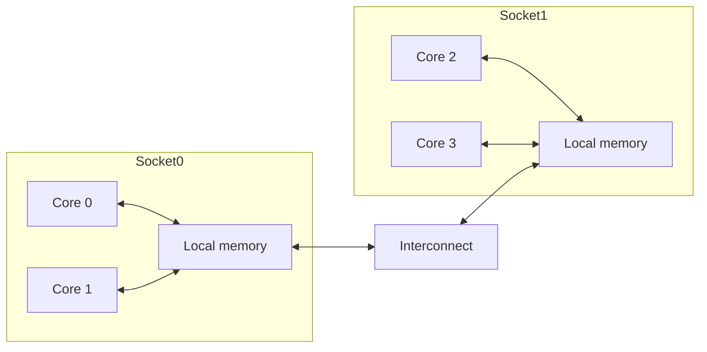

# Multicore, Synchronization, and NUMA

When single-core performance scaling slowed, architects turned to multiple cores per chip and multiple processors per system. Multicore design exploits thread-level parallelism: separate instruction streams cooperate on a shared problem or serve independent requests. The architectural challenge is to provide useful parallel speedup without letting communication, synchronization, memory bandwidth, and coherence traffic dominate.


*Figure: Opening the package links instruction-set discussions to the physical die. Image: [Wikimedia Commons](https://commons.wikimedia.org/wiki/File:Intel_4004_open.jpg), Science Museum Group, CC BY 4.0.*

Shared-memory multiprocessors are attractive because threads can communicate by reading and writing ordinary addresses. That convenience hides complexity. Locks, barriers, atomic instructions, cache coherence, memory consistency, and nonuniform memory access all determine whether a parallel program scales.

## Definitions

Thread-level parallelism, TLP, is parallelism across multiple instruction streams. A multicore processor places multiple cores on one chip. A symmetric multiprocessor, SMP, provides multiple processors or cores with a shared memory abstraction and roughly similar access to I/O and OS services.

UMA, uniform memory access, means each processor has approximately the same latency to main memory. NUMA, nonuniform memory access, means memory is physically distributed, so local memory is faster than remote memory. Cache-coherent NUMA, ccNUMA, preserves a coherent shared address space while allowing locality differences.

Synchronization enforces ordering among threads. Common primitives include:

- Atomic exchange.
- Test-and-set.
- Compare-and-swap.
- Load-linked/store-conditional.
- Fetch-and-add.
- Fences or memory barriers.

A lock protects a critical section. A barrier waits until a group of threads reaches the same program point. A condition variable or event coordinates waiting for a state change.

Parallel speedup is:

$$
\mathrm{Speedup}(N)=\frac{T_1}{T_N}
$$

Parallel efficiency is:

$$
\mathrm{Efficiency}(N)=\frac{\mathrm{Speedup}(N)}{N}
$$

## Key results

Amdahl's law limits strong scaling for a fixed problem size:

$$
\mathrm{Speedup}(N)=
\frac{1}{(1-p)+p/N+O(N)}
$$

Here $p$ is the parallel fraction and $O(N)$ represents overhead such as synchronization, communication, load imbalance, and coherence misses. The original Amdahl formula omits overhead, making it optimistic for real multicore systems.

Load balance matters as much as core count. If one thread gets more work than others, the whole parallel region waits for it. The execution time of a parallel phase is closer to the maximum thread time than the average thread time:

$$
T_{phase}\approx \max_i T_i + T_{sync}
$$

Synchronization has two costs. The direct cost is the atomic operation or fence. The indirect cost is coherence traffic and serialization. A contended lock causes cache lines to bounce among cores, and a spin loop can waste memory bandwidth if it repeatedly reads a shared variable without backoff.

NUMA placement affects performance. A thread that mostly accesses memory allocated on a remote socket pays extra latency and consumes interconnect bandwidth. First-touch allocation, thread pinning, and partitioned data structures can improve locality.

Granularity is one of the main design choices in parallel software. If tasks are too small, scheduling and synchronization overhead dominate. If tasks are too large, load imbalance leaves cores idle. Good runtimes often use work stealing or guided scheduling so that large chunks preserve locality while remaining work can be redistributed near the end of a phase.

Synchronization primitives must be matched to contention. A simple test-and-set spin lock can be acceptable when critical sections are tiny and contention is rare. Under contention, all waiting cores repeatedly try to acquire the same cache block, causing invalidations and interconnect traffic. Test-and-test-and-set, exponential backoff, queue locks, or blocking OS locks reduce traffic in different regimes.

NUMA systems reward data ownership. A thread that initializes a data partition often causes the OS to allocate the pages in that socket's local memory. If another socket later processes those pages, every access may become remote. Parallel programs should therefore align initialization, placement, and computation. The architecture exposes a shared address space, but performance follows physical locality.

Scalability should be measured over a range of core counts. A program that scales from one to four cores may flatten at eight because memory bandwidth saturates. Another may scale until a lock becomes hot. Plotting speedup, efficiency, cache misses, remote accesses, and lock time together usually explains the limit better than a single final speedup number.

## Visual



| Issue | Symptom | Architectural cause | Typical fix |
|---|---|---|---|
| Serial fraction | Speedup plateaus | Work cannot be parallelized | Algorithm change |
| Load imbalance | Some cores idle | Unequal work distribution | Dynamic scheduling or partitioning |
| Lock contention | High atomic latency | Coherence serialization | Finer locks or lock-free design |
| False sharing | Slow independent counters | Same cache block | Padding and layout |
| NUMA misses | Remote memory latency | Poor placement | First-touch and affinity |

## Worked example 1: Parallel speedup with overhead

Problem: A program has 92% parallel work and 8% serial work. On 8 cores, synchronization and communication overhead add 4% of the original single-core time. Compute speedup and efficiency.

Method:

1. Normalize single-core time.

$$
T_1=1.00
$$

2. Compute serial time.

$$
T_{serial}=0.08
$$

3. Compute parallel time on 8 cores.

$$
T_{parallel}=\frac{0.92}{8}=0.115
$$

4. Add overhead.

$$
T_8=0.08+0.115+0.04=0.235
$$

5. Compute speedup.

$$
\mathrm{Speedup}=\frac{1}{0.235}=4.255
$$

6. Compute efficiency.

$$
\mathrm{Efficiency}=\frac{4.255}{8}=0.532
$$

Checked answer: Speedup is about $4.26\times$ and efficiency is about $53.2\%$. The overhead is only 4% of original time, but it substantially reduces scaling.

## Worked example 2: Lock contention and atomic traffic

Problem: Four threads each perform 100,000 updates. With one global lock, each update enters a critical section taking 80 ns and lock acquire/release overhead averages 120 ns under contention. With four private counters and one final reduction, each update takes 20 ns, and the final reduction costs 1,000 ns. Compare total time assuming perfect parallel execution within each design except the shared lock serializes all updates.

Method:

1. Global lock total updates:

$$
4 \times 100000 = 400000
$$

2. Time per locked update:

$$
80 + 120 = 200\ \mathrm{ns}
$$

3. Because the critical section is serialized:

$$
T_{lock}=400000 \times 200 = 80000000\ \mathrm{ns}=80\ \mathrm{ms}
$$

4. Private counter work per thread:

$$
100000 \times 20 = 2000000\ \mathrm{ns}=2\ \mathrm{ms}
$$

5. Parallel phase time is the max thread time, about 2 ms. Add reduction:

$$
T_{private}=2\ \mathrm{ms}+0.001\ \mathrm{ms}=2.001\ \mathrm{ms}
$$

6. Speedup of private design:

$$
\frac{80}{2.001}=39.98
$$

Checked answer: The private-counter design is about $40\times$ faster in this simplified model. The large win comes from removing per-update serialization and coherence traffic.

## Code

```python
def parallel_time(parallel_fraction, cores, overhead_fraction=0.0):
    serial = 1.0 - parallel_fraction
    return serial + parallel_fraction / cores + overhead_fraction

def speedup(parallel_fraction, cores, overhead_fraction=0.0):
    return 1.0 / parallel_time(parallel_fraction, cores, overhead_fraction)

for n in [1, 2, 4, 8, 16]:
    s = speedup(0.92, n, overhead_fraction=0.04 if n > 1 else 0.0)
    print(f"{n:2d} cores speedup={s:.2f} efficiency={s/n:.2f}")
```

The code uses a fixed overhead for every multicore case, which is rarely true. Communication overhead often increases with the number of cores, and synchronization overhead may rise sharply once a shared structure becomes contended. A better model might include a term such as $\alpha\log N$ for a tree barrier, $\beta N$ for broadcast-like traffic, or a measured lock-wait curve from profiling.

The model also assumes the parallel fraction is constant. In weak scaling, the problem size grows with the number of cores, and the serial fraction can become less important because each processor receives more useful work. In strong scaling, the problem size is fixed, so overheads and imbalance eventually dominate. Architecture papers should state which scaling mode they evaluate.

NUMA effects can be added by splitting memory time into local and remote components. If 80% of accesses are local at 100 ns and 20% are remote at 180 ns, the average is 116 ns before cache effects. If poor placement changes the remote fraction to 60%, the average becomes 148 ns. That difference can erase much of the benefit of adding cores.

For shared-memory programs, a useful debugging question is "what cache line is moving?" If a line moves because a real producer hands data to a consumer, the traffic may be necessary. If it moves because several threads update adjacent counters, the traffic is accidental. This line-level view connects synchronization, coherence, and data layout.

The same question applies to locks: the lock variable itself is a cache line that many cores may fight over repeatedly.

## Common pitfalls

- Reporting speedup without saying whether the problem size is fixed.
- Ignoring synchronization and communication overhead in Amdahl calculations.
- Protecting a high-frequency operation with one global lock.
- Assuming shared memory means uniform memory latency.
- Forgetting that atomic operations are also coherence operations.
- Measuring with thread migration enabled when locality matters.

## Connections

- [Coherence, Consistency, and MESI](/cs/computer-architecture/coherence-consistency-mesi)
- [Warehouse-Scale Computers](/cs/computer-architecture/warehouse-scale-computers)
- [Vector, SIMD, and GPU Architectures](/cs/computer-architecture/vector-simd-gpu)
- [Power, Energy, Cost, and Dependability](/cs/computer-architecture/power-energy-cost-dependability)
