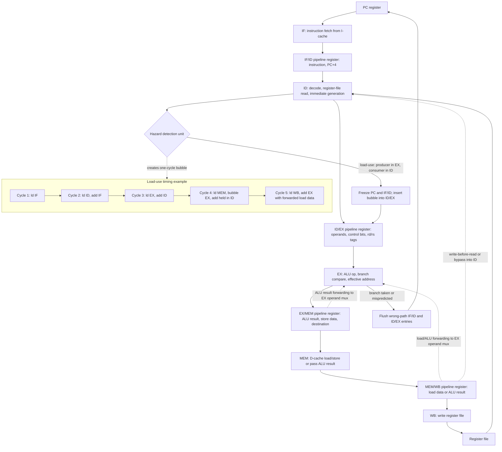

# Pipelining and Hazards

Pipelining overlaps the execution of multiple instructions by dividing processor work into stages. It is the architectural version of an assembly line: one instruction is fetched while another is decoded, another uses the ALU, another accesses memory, and another writes its result. The benefit is throughput, not the latency of one isolated instruction.


*Figure: Opening the package links instruction-set discussions to the physical die. Image: [Wikimedia Commons](https://commons.wikimedia.org/wiki/File:Intel_4004_open.jpg), Science Museum Group, CC BY 4.0.*

The classic five-stage RISC pipeline is simple enough to reason about but rich enough to expose the central problems of processor implementation. Structural hazards occur when two instructions need the same hardware resource. Data hazards occur when an instruction needs a value that an earlier instruction has not yet produced. Control hazards occur when the next instruction address depends on a branch or jump that has not yet been resolved.

## Definitions

The five standard stages are:

1. IF: instruction fetch.
2. ID: instruction decode and register read.
3. EX: execute ALU operation or compute address.
4. MEM: access data memory for loads and stores.
5. WB: write result back to the register file.

If each stage takes roughly the same time and the pipeline is full, ideal CPI approaches 1 even though each instruction still takes five stages from start to finish. The ideal speedup over an unpipelined implementation with the same stage delays is approximately the number of stages:

$$
\mathrm{Speedup}_{ideal}\approx k
$$

where $k$ is the number of pipeline stages. Real speedup is smaller because of latch overhead, imbalanced stages, and stalls.

A structural hazard happens when hardware cannot support all simultaneous uses. A single memory used for both instruction fetch and data load can cause IF and MEM conflicts. A data hazard is classified by the ordering of reads and writes:

- RAW, read after write: true dependency; the consumer needs the producer's result.
- WAR, write after read: anti-dependency; relevant in pipelines that allow later writes before earlier reads.
- WAW, write after write: output dependency; relevant when writes can complete out of order.

In the classic in-order five-stage integer pipeline, RAW hazards are the main data-hazard issue. Forwarding, also called bypassing, sends a produced value directly from a later pipeline stage to an earlier stage that needs it, without waiting for the register file write.

A load-use hazard occurs when an instruction immediately after a load needs the loaded value. Even with forwarding, the data may not be available until the end of MEM, too late for the consumer's EX stage in the next cycle. A one-cycle stall is often required in the classic pipeline.

## Key results

Pipeline execution time can be modeled as:

$$
\mathrm{Cycles} =
\mathrm{Pipeline\ fill} + \mathrm{Instructions} + \mathrm{Stall\ cycles}
$$

For long programs, fill and drain overhead are small, and performance is dominated by:

$$
\mathrm{CPI}_{pipeline}=1+\mathrm{Stall\ cycles\ per\ instruction}
$$

Forwarding reduces stalls from many ALU-ALU dependencies. Suppose instruction `add r1, r2, r3` is followed by `sub r4, r1, r5`. Without forwarding, `sub` must wait until `add` writes `r1` in WB. With forwarding, `sub` can receive the ALU result from a pipeline register and proceed earlier.

Load-use dependencies are harder because the data returns from memory later than an ALU result. Compilers can reduce the penalty by scheduling an independent instruction between load and use:

```text
ld   r1, 0(r2)
add  r8, r8, r9   ; independent filler
sub  r4, r1, r5
```

Pipeline depth is a trade-off. More stages can reduce clock cycle time, but they increase branch penalty, forwarding complexity, register overhead, and sensitivity to hazards. Extremely deep pipelines can lose if mispredictions and stalls become frequent.

Balanced stages matter because the clock period is set by the slowest stage plus pipeline-register overhead. Splitting a fast stage does not help if a different stage remains slow. Splitting a slow stage may help clock rate, but it can create more bypass paths and more cycles between producing and consuming values. This is why the clean five-stage drawing is a model, not a complete prescription for a production processor.

Hazard detection is part of correctness, not an optional performance feature. A pipeline without interlocks may be faster on carefully scheduled code, but it exposes timing details to software and becomes fragile across implementations. General-purpose ISAs normally require the hardware to preserve the architectural semantics. The compiler can still schedule instructions to reduce stalls, but incorrect code should not silently execute because a dependent instruction arrived one cycle too early.

Pipelining also changes exception handling. If several instructions are in flight, the processor must report exceptions as if instructions executed one at a time in program order. Simple in-order pipelines can usually do this by allowing earlier instructions to finish and flushing later ones. Out-of-order pipelines need reorder buffers or equivalent mechanisms, which is why precise exceptions reappear in the ILP pages.

## Visual



This five-stage pipeline diagram shows the stage boundaries, pipeline registers, forwarding paths, and interlock logic that make the textbook pipeline correct. ALU results can forward from EX/MEM or MEM/WB to the EX operand mux, but a load-use pair needs a bubble because the loaded data arrives too late for the next cycle's EX stage. The branch flush and PC feedback path make control hazards explicit rather than hiding them in a Gantt chart.

| Hazard | Cause | Typical remedy | Residual cost |
|---|---|---|---|
| Structural | Resource conflict | Duplicate or pipeline resource | Area and power |
| RAW data | Consumer needs producer | Forwarding and stalls | Load-use bubbles |
| WAR data | Later write before earlier read | In-order reads or renaming | Mostly in advanced pipelines |
| WAW data | Later write before earlier write | In-order completion or renaming | Mostly in advanced pipelines |
| Control | Next PC unknown | Prediction, delayed branch, speculation | Misprediction flush |

## Worked example 1: Pipeline cycles with no stalls

Problem: A five-stage pipeline executes 100 instructions. Assume no hazards, one instruction fetched per cycle, and one cycle per stage. How many cycles are needed? What is CPI? What is speedup over a nonpipelined processor that takes 5 cycles per instruction?

Method:

1. Compute pipeline cycles. The first instruction needs 5 cycles to pass through all stages. Each additional instruction finishes one cycle later.

$$
\begin{aligned}
\mathrm{Cycles}_{pipe}
&= k + (n-1) \\
&= 5 + 99 \\
&= 104
\end{aligned}
$$

2. Compute pipelined CPI.

$$
\mathrm{CPI}_{pipe}=\frac{104}{100}=1.04
$$

3. Compute nonpipelined cycles.

$$
\mathrm{Cycles}_{nonpipe}=100 \times 5=500
$$

4. Compute speedup.

$$
\mathrm{Speedup}=\frac{500}{104}=4.8077
$$

Checked answer: The pipeline takes 104 cycles, CPI is 1.04, and speedup is about $4.81\times$. The speedup is less than $5\times$ because filling and draining the pipeline cost cycles.

## Worked example 2: CPI with load-use stalls

Problem: A program has ideal CPI 1 on a five-stage pipeline. Loads are 25% of instructions. Of all loads, 40% are immediately followed by an instruction that uses the loaded value, causing one stall cycle. Branch stalls are ignored. Find the effective CPI.

Method:

1. Compute load-use stall frequency per instruction.

$$
\begin{aligned}
\mathrm{Load\ fraction} &= 0.25 \\
\mathrm{Dependent\ following\ fraction} &= 0.40 \\
\mathrm{Stalls/instruction} &= 0.25 \times 0.40 \times 1 \\
&= 0.10
\end{aligned}
$$

2. Add stalls to ideal CPI.

$$
\mathrm{CPI}=1+0.10=1.10
$$

3. Check with a 1000-instruction run.

$$
\begin{aligned}
\mathrm{Loads} &= 250 \\
\mathrm{Load-use\ hazards} &= 250 \times 0.40 = 100 \\
\mathrm{Extra\ cycles} &= 100 \\
\mathrm{Cycles} &\approx 1000 + 100 = 1100
\end{aligned}
$$

Checked answer: Effective CPI is $1.10$. The 1000-instruction check gives the same ratio, ignoring the small pipeline fill overhead.

## Code

```python
def pipeline_cycles(instructions, stages=5, stalls=0):
    if instructions == 0:
        return 0
    return stages + instructions - 1 + stalls

def load_use_cpi(load_fraction, dependent_fraction, stall_cycles=1):
    return 1.0 + load_fraction * dependent_fraction * stall_cycles

n = 100
cycles = pipeline_cycles(n, stages=5)
print(f"{n} instructions -> {cycles} cycles, CPI={cycles / n:.2f}")

cpi = load_use_cpi(load_fraction=0.25, dependent_fraction=0.40)
print(f"CPI with load-use stalls = {cpi:.2f}")
```

This model treats all load-use hazards as identical one-cycle bubbles. Real pipelines distinguish cache hits, cache misses, forwarding paths, issue timing, and whether the consumer is an ALU operation, branch, or store. A load miss can stall for many cycles or be overlapped by an out-of-order core. A store that uses the loaded value as store data may have different timing from an ALU consumer.

The fill-and-drain formula is most visible for short sequences, such as basic blocks in a pipeline diagram. For long-running programs, steady-state CPI dominates, so architects focus on stall frequency. However, short loops with frequent branches can repeatedly expose control penalties, which is one reason branch prediction and loop buffers are important front-end optimizations.

When comparing two pipelines, keep the clock period and CPI together. A pipeline with more stages may have a lower clock cycle time but a higher CPI from hazards. The faster design is the one with lower total execution time, not the prettier stage diagram.

## Common pitfalls

- Saying pipelining makes a single instruction faster; it mainly improves instruction throughput.
- Ignoring pipeline register overhead and stage imbalance.
- Assuming forwarding eliminates every RAW hazard.
- Forgetting that deeper pipelines usually increase branch misprediction penalties.
- Counting pipeline fill and drain overhead incorrectly for short instruction sequences.
- Treating compiler scheduling as a substitute for hardware interlocks in general-purpose systems.

## Connections

- [Instruction Set Principles](/cs/computer-architecture/instruction-set-principles)
- [Branch Prediction and Control Hazards](/cs/computer-architecture/branch-prediction)
- [Dynamic Scheduling and Tomasulo](/cs/computer-architecture/dynamic-scheduling-tomasulo)
- [Speculation, Renaming, and Multiple Issue](/cs/computer-architecture/speculation-renaming-multiple-issue)
