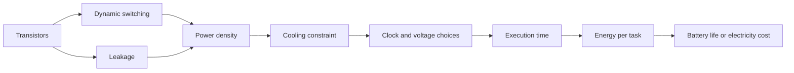

# Power, Energy, Cost, and Dependability

The end of easy clock-rate scaling changed computer architecture. Earlier designs could often spend extra transistors to make one processor faster. Modern designs must ask a harder question: does this structure deliver enough useful work per joule, per dollar, and per failure risk? Power limits shape mobile systems because batteries and heat are scarce; they shape servers because cooling and electricity dominate operating costs; they shape chips because leakage and hot spots can make transistors unusable even when there is enough silicon area.


*Figure: ENIAC gives architecture pages a physical reference point before modern chips. Image: [Wikimedia Commons](https://commons.wikimedia.org/wiki/File:ENIAC_Penn1.jpg), Paul W. Shaffer and TexasDex, CC BY-SA 3.0/GFDL.*

Dependability belongs in the same quantitative conversation. A machine that is fast but unavailable during repair is not fast for the service it supports. H&P uses reliability, availability, cost, and energy as first-class design constraints because modern systems are built from many parts, and the chance that something is broken grows as the system scales.

## Definitions

Power is energy per unit time:

$$
1\ \mathrm{watt}=1\ \mathrm{joule/second}
$$

Energy for a fixed task is:

$$
\mathrm{Energy}=\mathrm{Average\ power}\times\mathrm{Execution\ time}
$$

Dynamic energy in CMOS switching is proportional to capacitance and voltage squared:

$$
E_{dynamic} \propto C V^2
$$

Dynamic power also depends on switching frequency:

$$
P_{dynamic} \propto C V^2 f
$$

Static power comes from leakage current even when transistors are not actively switching:

$$
P_{static}=I_{static}V
$$

Thermal design power is a cooling-design target, not necessarily the instantaneous peak power or the exact average power of every workload. Peak power matters for power delivery. Average energy per task matters for battery life and datacenter electricity bills.

Reliability is commonly described by mean time to failure, MTTF. Repair is described by mean time to repair, MTTR. For a repairable module, availability is:

$$
\mathrm{Availability}=
\frac{\mathrm{MTTF}}{\mathrm{MTTF}+\mathrm{MTTR}}
$$

If components fail independently and any one failure stops a serial system, the failure rates add:

$$
\frac{1}{\mathrm{MTTF}_{system}}=
\sum_i \frac{1}{\mathrm{MTTF}_i}
$$

This is why very large systems need redundancy: even excellent components can produce frequent system-level failures when thousands or millions of them are combined.

## Key results

Voltage reduction is powerful because energy scales as $V^2$. If voltage is reduced to $0.85V$, dynamic energy per transition becomes:

$$
0.85^2=0.7225
$$

or about a $27.75\%$ reduction. If frequency also drops to $0.85f$, dynamic power becomes:

$$
0.85^2 \times 0.85 = 0.614
$$

or about a $38.6\%$ reduction. The performance loss may or may not be acceptable; the decision depends on whether the workload has slack, deadline constraints, or opportunities to sleep after finishing.

Race-to-halt is a useful counterpoint. A faster component may consume higher power while active, but if it finishes quickly enough and lets the rest of the system sleep, total energy can fall. Energy, not power alone, decides the issue for a fixed task.

For redundancy, a common approximation for two identical redundant modules where one is sufficient is:

$$
\mathrm{MTTF}_{pair}\approx
\frac{\mathrm{MTTF}^2}{2\mathrm{MTTR}}
$$

The intuition is that the pair fails only if one module fails and the second also fails before repair. This approximation assumes independent failures and constant failure rates; it does not cover common-mode failures such as a bad firmware update, a fire, or a power event that disables both modules.

Cost also has a learning curve. For chips, cost depends on die area, yield, test cost, packaging, and volume. For warehouse-scale systems, purchase price is only part of the lifetime cost; power distribution, cooling, repair, and replacement schedules can dominate architectural decisions. Thus a small efficiency improvement can be worth a large dollar amount at fleet scale.

Energy analysis should be tied to a workload boundary. If the boundary is a single function, it may miss system effects such as DRAM remaining active, fans spinning, or a radio staying awake. If the boundary is the whole device or service, it may include idle energy that hides the effect of a processor change. Both views can be useful, but they answer different questions. Architects often report energy per operation, performance per watt, and total energy for a benchmark because no single number captures every constraint.

Dependability also needs a clear boundary. A disk may have a high MTTF, but a storage service using thousands of disks will see frequent drive failures. A server may have redundant power supplies, but both may depend on the same upstream power distribution. A software deployment system may be more important to availability than a single hardware component. The quantitative formulas are starting points; the engineering task is to identify independent failures, common-mode failures, and repair procedures honestly.

## Visual



| Quantity | Formula | Design implication |
|---|---:|---|
| Dynamic energy | $C V^2$ | Lowering voltage has squared benefit |
| Dynamic power | $C V^2 f$ | Frequency reduction cuts power but may not cut task energy alone |
| Static power | $I_{static}V$ | Idle transistors still cost energy |
| Energy per task | $P_{avg}T$ | Best metric for fixed workloads |
| Availability | $\mathrm{MTTF}/(\mathrm{MTTF}+\mathrm{MTTR})$ | Repair time matters as well as failure rate |

## Worked example 1: Voltage and frequency scaling

Problem: A processor runs a task in 10 seconds at 1.0 V and 2.0 GHz. Its average dynamic power is 40 W and static power is 10 W. A low-power mode uses 0.8 V and 1.5 GHz. Assume dynamic power follows $V^2f$, static power remains 10 W, and execution time scales inversely with frequency. Compare energy.

Method:

1. Baseline power and energy:

$$
\begin{aligned}
P_{base} &= 40 + 10 = 50\ \mathrm{W} \\
T_{base} &= 10\ \mathrm{s} \\
E_{base} &= 50 \times 10 = 500\ \mathrm{J}
\end{aligned}
$$

2. Dynamic power scaling factor:

$$
\begin{aligned}
\mathrm{factor}
&= \left(\frac{0.8}{1.0}\right)^2
\left(\frac{1.5}{2.0}\right) \\
&= 0.64 \times 0.75 \\
&= 0.48
\end{aligned}
$$

3. New dynamic power:

$$
P_{dyn,new}=40 \times 0.48=19.2\ \mathrm{W}
$$

4. New time:

$$
T_{new}=10 \times \frac{2.0}{1.5}=13.333\ \mathrm{s}
$$

5. New energy:

$$
\begin{aligned}
P_{new} &= 19.2 + 10 = 29.2\ \mathrm{W} \\
E_{new} &= 29.2 \times 13.333 = 389.3\ \mathrm{J}
\end{aligned}
$$

Checked answer: The low-power mode is slower but uses about $389$ J instead of $500$ J, a $22.1\%$ energy reduction. The static power prevents the energy reduction from matching the dynamic energy reduction.

## Worked example 2: Availability and redundant power supplies

Problem: A server has a power supply with MTTF 200,000 hours and MTTR 24 hours. Estimate availability for one supply, then approximate MTTF and availability for a redundant pair where either supply can run the server.

Method:

1. Single-supply availability:

$$
\begin{aligned}
A_{single}
&= \frac{200000}{200000+24} \\
&= 0.999880
\end{aligned}
$$

That corresponds to unavailability:

$$
1-A_{single}=0.000120
$$

2. Redundant-pair MTTF approximation:

$$
\begin{aligned}
\mathrm{MTTF}_{pair}
&\approx \frac{200000^2}{2 \times 24} \\
&= \frac{40000000000}{48} \\
&= 833333333.3\ \mathrm{hours}
\end{aligned}
$$

3. Redundant-pair availability:

$$
\begin{aligned}
A_{pair}
&= \frac{833333333.3}{833333333.3+24} \\
&= 0.9999999712
\end{aligned}
$$

Checked answer: A redundant pair improves the approximation from about $99.9880\%$ availability to about $99.999997\%$. The answer assumes independent failures; it would be too optimistic if both supplies share a common cooling, firmware, or input-power failure mode.

## Code

```python
def dvfs_energy(time_s, dyn_w, static_w, old_v, new_v, old_f, new_f):
    dyn_scale = (new_v / old_v) ** 2 * (new_f / old_f)
    new_dyn = dyn_w * dyn_scale
    new_time = time_s * old_f / new_f
    old_energy = (dyn_w + static_w) * time_s
    new_energy = (new_dyn + static_w) * new_time
    return old_energy, new_energy

def availability(mttf_hours, mttr_hours):
    return mttf_hours / (mttf_hours + mttr_hours)

old_e, new_e = dvfs_energy(10, 40, 10, 1.0, 0.8, 2.0, 1.5)
print(f"old={old_e:.1f} J new={new_e:.1f} J")

mttf = 200_000
mttr = 24
pair_mttf = mttf * mttf / (2 * mttr)
print(f"single availability={availability(mttf, mttr):.8f}")
print(f"pair availability={availability(pair_mttf, mttr):.10f}")
```

The calculations assume independent failures and stable rates. Real systems experience correlated faults: firmware bugs, operator mistakes, overheating, bad batches of components, power events, and network partitions. A redundancy plan should therefore include physical separation, monitoring, testing of failover paths, and repair procedures. Quantitative availability is strongest when paired with operational evidence.

The DVFS calculation also assumes that performance scales linearly with frequency. Memory-bound workloads may slow down less than frequency because they already wait for memory. Compute-bound workloads may track frequency more closely. Measuring both kinds of workloads prevents a power policy from being tuned to one benchmark and disappointing on another.

## Common pitfalls

- Saying a processor is energy-efficient because it has low power, without checking execution time.
- Ignoring static power when slowing a processor down.
- Treating TDP as peak power or as exact workload power.
- Assuming redundancy protects against common-mode failures.
- Using component MTTF as system MTTF when many components are required at once.
- Forgetting that cooling, power delivery, and repair labor are architecture constraints in large systems.

## Connections

- [Quantitative Design and Performance](/cs/computer-architecture/quantitative-design-and-performance)
- [Warehouse-Scale Computers](/cs/computer-architecture/warehouse-scale-computers)
- [Storage, RAID, and SSDs](/cs/computer-architecture/storage-raid-ssds)
- [Domain-Specific Accelerators](/cs/computer-architecture/domain-specific-accelerators)
