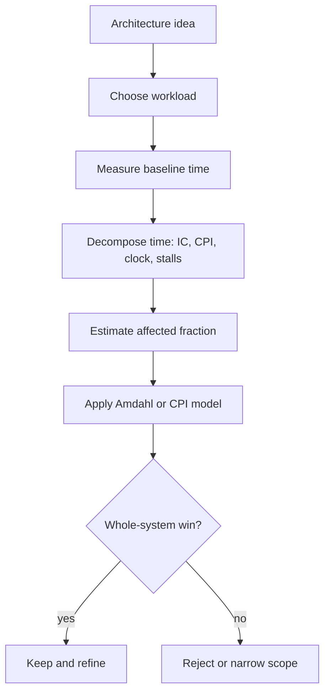

# Quantitative Design and Performance

Computer architecture is not mainly a catalog of clever hardware structures. In the Hennessy and Patterson style, it is an engineering discipline built around measurement, trade-offs, and explicit assumptions. A proposed pipeline, cache, instruction set, or multiprocessor mechanism is only meaningful after asking: what workload does it improve, by how much, at what cost, and under which power or reliability limits?

This page introduces the quantitative habits used throughout the rest of the architecture notes. The same ideas reappear in cache design, branch prediction, vector machines, warehouse-scale computers, and storage systems: define the metric, decompose execution time, estimate the affected fraction, and distrust improvements that optimize a narrow component while hurting the complete system.

## Definitions

The most important performance metric is execution time. If machine $X$ finishes a fixed program in less time than machine $Y$, then $X$ is faster for that program. Performance is the reciprocal of execution time:

$$
\mathrm{Performance}_X = \frac{1}{\mathrm{Execution\ time}_X}
$$

The speedup of a new design over an old design is:

$$
\mathrm{Speedup} =
\frac{\mathrm{Execution\ time}_{old}}{\mathrm{Execution\ time}_{new}}
=
\frac{\mathrm{Performance}_{new}}{\mathrm{Performance}_{old}}
$$

CPU execution time is commonly decomposed as:

$$
\mathrm{CPU\ time} =
\mathrm{Instruction\ count} \times \mathrm{CPI} \times \mathrm{Clock\ cycle\ time}
$$

Equivalently, because $\mathrm{Clock\ rate}=1/\mathrm{Clock\ cycle\ time}$:

$$
\mathrm{CPU\ time} =
\frac{\mathrm{Instruction\ count} \times \mathrm{CPI}}{\mathrm{Clock\ rate}}
$$

For an instruction mix with classes $i$, total CPI is a weighted average:

$$
\mathrm{CPI} =
\frac{\sum_i IC_i \times CPI_i}{\sum_i IC_i}
$$

where $IC_i$ is the number of executed instructions of class $i$. This formula is useful because it makes a hidden workload assumption explicit: a faster floating-point unit helps only in proportion to how much floating-point work is actually executed.

Benchmarks are controlled workloads used to compare systems. A good benchmark suite includes real programs, reproducible build and run conditions, input sets large enough to exercise the system, and reporting rules that prevent benchmark-specific tricks from replacing genuine design improvement. Throughput benchmarks measure completed jobs per unit time; latency benchmarks measure time for one job.

The geometric mean is often used to summarize normalized benchmark ratios:

$$
\mathrm{Geomean}(r_1,\ldots,r_n) =
\left(\prod_{k=1}^{n} r_k\right)^{1/n}
$$

It is preferred for ratios because it treats reciprocal changes symmetrically: a $2\times$ improvement and a $2\times$ slowdown average to $1\times$, not to an arithmetic mean of $1.25\times$.

## Key results

Amdahl's law is the central warning against over-valuing local optimization. If fraction $f$ of the original execution time can be improved by factor $s$, the overall speedup is:

$$
\mathrm{Speedup}_{overall} =
\frac{1}{(1-f)+\frac{f}{s}}
$$

The proof is a direct normalization. Let old execution time be $1$. The unaffected part remains $(1-f)$. The improved part becomes $f/s$. The new time is $(1-f)+f/s$, so speedup is the reciprocal.

The same idea applies to parallel processors. If fraction $p$ can run perfectly on $N$ processors and the rest is serial, then:

$$
\mathrm{Speedup}(N)=
\frac{1}{(1-p)+\frac{p}{N}}
$$

As $N \to \infty$, the limiting speedup is $1/(1-p)$. A program that is $95\%$ parallel has an upper bound of $20\times$ no matter how many processors are purchased, unless the serial fraction is reduced.

The CPU time equation also explains why comparing only clock rates is a pitfall. A design with a higher clock rate can still lose if it executes more instructions or has a worse CPI. A compressed instruction set may reduce instruction count and instruction-cache misses but complicate decoding. A deeper pipeline may shorten clock cycle time but increase branch misprediction penalties. A wider issue processor may reduce CPI on one benchmark and waste power on another.

A useful performance argument therefore has three parts:

- Workload: the exact program or benchmark family being optimized.
- Decomposition: the pieces of time, CPI, miss penalty, or stall time that explain the result.
- Constraint: cost, energy, die area, complexity, verification risk, and availability.

The decomposition step is also how architects avoid double counting. Suppose a branch predictor reduces branch stalls, and a larger instruction window also reduces the visible cost of some branch stalls by finding independent work. Adding the two isolated speedups will overstate the combined result, because both features attack some of the same baseline cycles. A safer method is to build a single baseline time budget, subtract or scale each component once, and then recompute total time.

Another useful habit is to distinguish latency-oriented and throughput-oriented claims. A faster core may reduce the response time of one request, while more cores may increase requests per second. These are both performance improvements, but they answer different questions. In a web service, the better design may be the one that delivers more throughput at a fixed 99th percentile latency. In an interactive application, the better design may be the one that lowers one user's response time even if peak throughput is unchanged.

Finally, measurements should be reproducible. A benchmark report should describe hardware, compiler version, flags, memory size, operating system, input set, thermal settings, and whether turbo or automatic parallelization was enabled. Without those details, a number may be true for one run but not useful for engineering comparison.

## Visual



| Metric | Formula | Best use | Common trap |
|---|---:|---|---|
| Execution time | measured seconds | User-visible latency | Ignoring I/O and OS effects |
| CPU time | $IC \times CPI \times T_{cycle}$ | Processor-focused studies | Treating it as wall-clock time |
| Throughput | jobs per second | Servers and WSCs | Ignoring response-time limits |
| Speedup | $T_{old}/T_{new}$ | Comparing two designs | Reporting only the optimized component |
| Geomean ratio | $(\prod r_i)^{1/n}$ | Benchmark-suite summaries | Mixing unrelated baselines |

## Worked example 1: CPI from an instruction mix

Problem: A program executes 2.0 billion instructions on a 2.5 GHz processor. The instruction mix is 45% integer ALU at CPI 1, 25% loads/stores at CPI 2, 20% branches at CPI 1.5, and 10% floating-point at CPI 4. Find average CPI and CPU time.

Method:

1. Convert percentages into weights.

$$
\begin{aligned}
w_{int} &= 0.45 \\
w_{mem} &= 0.25 \\
w_{br} &= 0.20 \\
w_{fp} &= 0.10
\end{aligned}
$$

2. Compute weighted CPI.

$$
\begin{aligned}
\mathrm{CPI}
&= 0.45(1) + 0.25(2) + 0.20(1.5) + 0.10(4) \\
&= 0.45 + 0.50 + 0.30 + 0.40 \\
&= 1.65
\end{aligned}
$$

3. Compute total cycles.

$$
\begin{aligned}
\mathrm{Cycles}
&= IC \times CPI \\
&= 2.0 \times 10^9 \times 1.65 \\
&= 3.30 \times 10^9
\end{aligned}
$$

4. Divide by clock rate.

$$
\begin{aligned}
\mathrm{CPU\ time}
&= \frac{3.30 \times 10^9}{2.5 \times 10^9} \\
&= 1.32\ \mathrm{s}
\end{aligned}
$$

Checked answer: The average CPI is $1.65$, and the CPU time is $1.32$ seconds. A quick sanity check says the time should be slightly more than one second because the program needs 3.3 billion cycles and the processor supplies 2.5 billion cycles per second.

## Worked example 2: Amdahl's law with a faster floating-point unit

Problem: In a baseline run, floating-point operations account for 30% of execution time. A new floating-point unit makes that part $5\times$ faster, but it does not change the rest of the program. What is the overall speedup? What fraction of the new execution time is floating-point?

Method:

1. Normalize old execution time to $1$.

$$
\begin{aligned}
T_{old} &= 1.00 \\
f &= 0.30 \\
s &= 5
\end{aligned}
$$

2. Compute new time.

$$
\begin{aligned}
T_{new}
&= (1-f)+\frac{f}{s} \\
&= 0.70 + \frac{0.30}{5} \\
&= 0.70 + 0.06 \\
&= 0.76
\end{aligned}
$$

3. Compute speedup.

$$
\mathrm{Speedup}=\frac{1}{0.76}=1.3158
$$

4. Compute the new floating-point fraction.

$$
\begin{aligned}
\mathrm{FP\ fraction}_{new}
&= \frac{0.30/5}{0.76} \\
&= \frac{0.06}{0.76} \\
&= 0.0789
\end{aligned}
$$

Checked answer: The overall speedup is about $1.32\times$, not $5\times$. After the change, floating-point work is only about $7.9\%$ of execution time, so further floating-point acceleration would have much less value.

## Code

```python
from math import prod

def weighted_cpi(classes):
    total_ic = sum(ic for ic, _ in classes)
    total_cycles = sum(ic * cpi for ic, cpi in classes)
    return total_cycles / total_ic

def amdahl(fraction, local_speedup):
    return 1.0 / ((1.0 - fraction) + fraction / local_speedup)

def geomean(ratios):
    return prod(ratios) ** (1.0 / len(ratios))

mix = [
    (0.45 * 2_000_000_000, 1.0),
    (0.25 * 2_000_000_000, 2.0),
    (0.20 * 2_000_000_000, 1.5),
    (0.10 * 2_000_000_000, 4.0),
]

cpi = weighted_cpi(mix)
cpu_time = 2_000_000_000 * cpi / 2_500_000_000
print(f"CPI = {cpi:.2f}, CPU time = {cpu_time:.2f} s")
print(f"Amdahl speedup = {amdahl(0.30, 5):.3f}x")
print(f"Geomean = {geomean([1.2, 0.9, 1.5, 1.1]):.3f}x")
```

## Common pitfalls

- Optimizing a component and reporting the component speedup as if it were system speedup.
- Comparing clock rates without comparing instruction count and CPI.
- Using arithmetic means for normalized benchmark ratios.
- Forgetting that benchmark inputs can change cache behavior and branch behavior.
- Treating peak throughput as useful throughput when response-time constraints are violated.
- Ignoring the energy, cost, and verification cost of a performance feature.

## Connections

- [Power, Energy, Cost, and Dependability](/cs/computer-architecture/power-energy-cost-dependability)
- [Cache Organization and AMAT](/cs/computer-architecture/cache-organization-amat)
- [Branch Prediction and Control Hazards](/cs/computer-architecture/branch-prediction)
- [Warehouse-Scale Computers](/cs/computer-architecture/warehouse-scale-computers)
