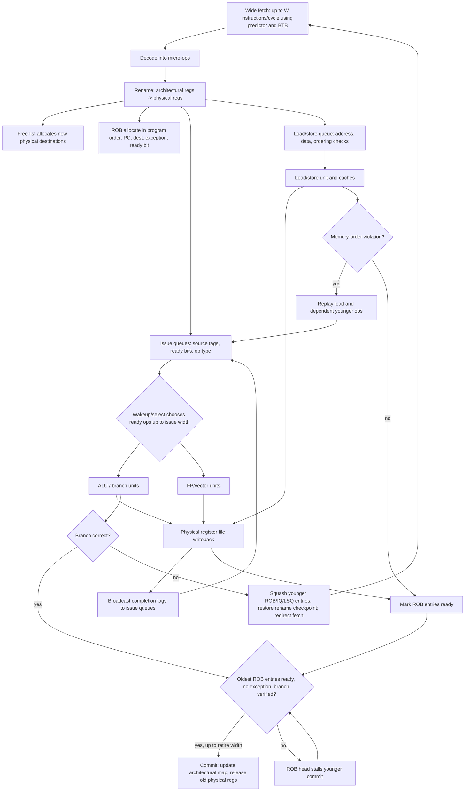

# Speculation, Renaming, and Multiple Issue

High-performance processors combine several ideas: they fetch and decode multiple instructions per cycle, rename architectural registers onto a larger pool of physical registers, issue ready operations out of order, speculate past unresolved branches, and commit results in program order. The goal is to expose instruction-level parallelism while preserving the precise architectural behavior expected by software.

This machinery is expensive. It consumes power, area, design effort, and verification effort. H&P emphasizes that ILP techniques eventually hit diminishing returns because branch prediction, memory dependence uncertainty, finite windows, and true data dependencies limit how many useful instructions can be kept in flight.

## Definitions

Multiple issue means the processor can start more than one instruction per cycle. A two-issue machine can ideally complete up to two instructions per cycle, so its ideal CPI is $0.5$. A four-issue machine has ideal CPI $0.25$. Real CPI is higher because of dependencies, branch misses, cache misses, and unavailable functional units.

Static multiple issue relies more on the compiler. VLIW and EPIC-style machines package independent operations into long instruction words or bundles. Dynamic multiple issue uses hardware scheduling to choose ready operations at runtime.

Speculation executes instructions before knowing they are definitely on the correct path or safe with respect to memory ordering. Branch speculation guesses control flow. Memory speculation may execute a load before an older store address is fully known, then check for violations.

Register renaming maps architectural registers to physical registers. The architectural register name is the ISA-visible name; the physical register or reorder-buffer entry holds a particular in-flight version. Renaming removes WAR and WAW hazards.

A reorder buffer, ROB, keeps instructions in program order for commit. Results can finish out of order, but they update architectural state only when all older instructions are known safe. This supports precise exceptions: if an exception occurs, the machine can report a state corresponding to a clean boundary between completed and uncompleted instructions.

## Key results

The basic out-of-order speculative loop is:

1. Fetch predicted instructions.
2. Decode and rename source and destination registers.
3. Dispatch operations into issue queues and the ROB.
4. Issue ready operations to functional units.
5. Write results to physical registers or ROB entries.
6. Commit completed instructions in program order.
7. On misprediction or exception, squash younger instructions and restore the rename map.

The maximum issue rate is not the same as sustained IPC. If a four-issue processor has branch misses every 50 instructions with a 12-cycle penalty, branch cost alone is:

$$
\frac{12}{50}=0.24\ \mathrm{cycles/instruction}
$$

This cost adds to the ideal CPI of $0.25$, nearly doubling CPI before considering cache misses or dependencies.

Speculation increases effective ILP only when predictions are accurate and recovery is cheap enough. A speculative instruction that is squashed consumes front-end bandwidth, issue slots, energy, and cache/TLB bandwidth without contributing useful work. This is one reason energy efficiency became a strong limit on ever-wider speculative cores.

Hardware speculation also interacts with memory consistency and security. The ISA may promise one ordering model, while the microarchitecture executes more aggressively underneath and inserts checks or fences to preserve the architectural contract.

Rename checkpoints are a practical detail behind fast branch recovery. When the processor fetches past a predicted branch, it can save a copy of the rename map. If the branch is later wrong, the map is restored and younger physical-register allocations are reclaimed. Without checkpointing, recovery may require walking the ROB, which is simpler but slower. The number of unresolved branches therefore affects both speculation depth and storage cost.

Commit bandwidth can become a bottleneck even when execution bandwidth is high. If a processor can execute six operations per cycle but retire only four, the ROB eventually fills during sustained high-throughput regions. Stores are often committed carefully because they update memory, and memory is visible to other cores and devices. This is why store queues hold speculative stores until commit conditions are satisfied.

The limits of ILP are not only hardware limits. Programs contain pointer chains, unpredictable branches, serial algorithms, and cache misses whose addresses depend on earlier misses. Compilers can unroll loops and schedule instructions, and hardware can speculate, but dependency graphs still have critical paths. Once the cost of finding more ILP exceeds the benefit, architects often shift transistors toward caches, SIMD, more cores, or accelerators.

## Visual



This speculative superscalar diagram labels the structures that let a wide core run ahead while still committing in order. Rename allocates physical registers and ROB entries, issue queues wake and select ready operations, the load/store queue enforces memory ordering, and completion tags update the physical register file and ROB readiness. The branch and memory-replay paths show how speculation is repaired without exposing wrong-path or prematurely executed state to the ISA.

| Technique | Main benefit | Required support | Main cost |
|---|---|---|---|
| Register renaming | Removes name hazards | Map table, free list, physical registers | Area and checkpointing |
| ROB commit | Precise state | In-order commit queue | Commit bandwidth limit |
| Branch speculation | Keeps front end busy | Predictor and recovery | Wrong-path energy |
| Multiple issue | More IPC | Wide fetch/decode/issue/execute | Complexity grows quickly |
| Memory speculation | Hides store-address delays | Load/store queue and replay | Violation recovery |

## Worked example 1: Ideal versus actual CPI on a four-issue core

Problem: A four-issue processor has ideal CPI $0.25$. In a workload, 20% of instructions are branches, branch prediction accuracy is 95%, and each misprediction costs 10 cycles. Data-cache misses add 0.12 CPI. Compute effective CPI and IPC.

Method:

1. Compute branch misprediction rate per instruction.

$$
\begin{aligned}
f_{branch} &= 0.20 \\
r_{mispredict} &= 1 - 0.95 = 0.05 \\
\mathrm{Misses/instruction} &= 0.20 \times 0.05 = 0.01
\end{aligned}
$$

2. Compute branch CPI cost.

$$
\mathrm{Branch\ CPI}=0.01 \times 10=0.10
$$

3. Add ideal CPI and data-cache CPI.

$$
\begin{aligned}
\mathrm{CPI}_{eff}
&= 0.25 + 0.10 + 0.12 \\
&= 0.47
\end{aligned}
$$

4. Convert CPI to IPC.

$$
\mathrm{IPC}=\frac{1}{0.47}=2.128
$$

Checked answer: Effective CPI is $0.47$, and IPC is about $2.13$. The four-issue machine sustains only a little over half of peak issue width under these assumptions.

## Worked example 2: ROB recovery after a branch miss

Problem: A processor has these ROB entries in order. Entries 1 and 2 are committed. Entry 3 is a branch predicted taken. Entries 4, 5, and 6 are younger wrong-path instructions. The branch resolves not taken. Which entries remain, and what happens to architectural state?

```text
1: add  r1, r2, r3   committed
2: ld   r4, 0(r5)    committed
3: beq  r6, r7, L    resolves not taken
4: mul  r8, r9, r10  wrong path
5: st   r8, 0(r11)   wrong path
6: add  r12,r12,1    wrong path
```

Method:

1. Entries 1 and 2 already updated architectural state. They are older than the branch and remain valid.

2. Entry 3 is the branch. Because the prediction was wrong, the processor records the correct next PC as the fall-through address and makes the branch itself complete.

3. Entries 4, 5, and 6 are younger than the mispredicted branch. They must be squashed even if some have executed.

4. Any physical registers allocated by entries 4 and 6 return to the free list. The store in entry 5 must not update memory because stores commit only when they become oldest and safe.

5. The rename map is restored to the checkpoint taken at the branch or reconstructed by walking committed state.

Checked answer: Entries 4 through 6 are discarded, architectural state includes only effects through entry 3, and fetch restarts at the not-taken fall-through PC.

## Code

```python
def effective_cpi(issue_width, branch_freq, accuracy, penalty, cache_cpi):
    ideal_cpi = 1.0 / issue_width
    branch_cpi = branch_freq * (1.0 - accuracy) * penalty
    return ideal_cpi + branch_cpi + cache_cpi

def recover_rob(entries, branch_index):
    kept = []
    squashed = []
    for entry in entries:
        if entry["index"] <= branch_index:
            kept.append(entry)
        else:
            squashed.append(entry)
    return kept, squashed

cpi = effective_cpi(4, branch_freq=0.20, accuracy=0.95, penalty=10, cache_cpi=0.12)
print(f"CPI={cpi:.3f}, IPC={1/cpi:.2f}")

rob = [{"index": i, "op": op} for i, op in enumerate(
    ["add", "ld", "beq", "mul", "st", "add"], start=1
)]
kept, squashed = recover_rob(rob, branch_index=3)
print("kept:", [e["op"] for e in kept])
print("squashed:", [e["op"] for e in squashed])
```

The ROB example treats every younger instruction as easy to remove. In real hardware, wrong-path instructions may have touched predictors, caches, TLBs, prefetchers, and other microarchitectural state. The architectural state must be restored exactly, but many microarchitectural side effects are only partially undone or are allowed to remain if they do not violate the ISA. This distinction is central to both performance and security discussions.

The CPI function also assumes independent penalty terms. In a real out-of-order core, a cache miss and a branch miss may overlap, or one may prevent the other from being observed. Cycle-level simulation, hardware performance counters, and careful experiments are needed when features interact. The formula is still useful because it gives a first-order budget and reveals which terms are large enough to justify deeper study.

## Common pitfalls

- Confusing issue width with guaranteed IPC.
- Letting speculative stores update memory before commit.
- Assuming register renaming removes true data dependencies.
- Forgeting that branch predictor misses waste energy as well as cycles.
- Ignoring the finite instruction window when estimating exploitable ILP.
- Treating precise exceptions as automatic in an out-of-order machine.

## Connections

- [Dynamic Scheduling and Tomasulo](/cs/computer-architecture/dynamic-scheduling-tomasulo)
- [Branch Prediction and Control Hazards](/cs/computer-architecture/branch-prediction)
- [Cache Organization and AMAT](/cs/computer-architecture/cache-organization-amat)
- [Multicore, Synchronization, and NUMA](/cs/computer-architecture/multicore-synchronization-numa)
