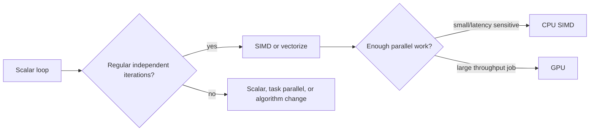

# Vector, SIMD, and GPU Architectures

Data-level parallelism appears when the same operation can be applied to many data elements. It is common in linear algebra, graphics, signal processing, image processing, machine learning, compression, and scientific simulation. Instead of finding independent scalar instructions one by one, data-parallel hardware exposes many lanes and asks software to feed them regular streams of work.


*Figure: Opening the package links instruction-set discussions to the physical die. Image: [Wikimedia Commons](https://commons.wikimedia.org/wiki/File:Intel_4004_open.jpg), Science Museum Group, CC BY 4.0.*

H&P's data-level parallelism chapter compares vector architectures, SIMD instruction extensions, and GPUs. They differ in programming model and implementation style, but they share a core idea: amortize instruction control over multiple data operations. This can deliver high throughput and good energy efficiency when work is regular, but it performs poorly when control flow diverges or memory access is irregular.

## Definitions

A vector architecture operates on vector registers, where one instruction specifies an operation over many elements:

$$
V3[i] = V1[i] + V2[i]\quad \mathrm{for}\ i=0,\ldots,VL-1
$$

The vector length, $VL$, controls how many elements are active. Vector chaining allows dependent vector operations to overlap by forwarding element results as they are produced.

SIMD, single instruction multiple data, uses one instruction to operate on packed elements in a register. For example, a 128-bit SIMD register can hold four 32-bit floats or sixteen 8-bit integers. Multimedia extensions in general-purpose CPUs use this style.

A GPU uses many lightweight threads grouped into execution units that run in SIMD-like fashion. NVIDIA terminology calls a group of threads executing together a warp; other vendors use wavefront. When threads in the group take different branches, execution diverges and paths are serialized with masks.

Arithmetic intensity is operations per byte of memory traffic:

$$
\mathrm{Arithmetic\ intensity}=
\frac{\mathrm{Operations}}{\mathrm{Bytes\ transferred}}
$$

The roofline model summarizes the bound:

$$
\mathrm{Attainable\ performance}=
\min(\mathrm{Peak\ compute},\ \mathrm{Bandwidth}\times\mathrm{Arithmetic\ intensity})
$$

Gather and scatter are vector memory operations that load from or store to non-contiguous addresses. They improve programmability but are usually slower than unit-stride accesses.

## Key results

Vector machines make memory latency manageable by issuing long streams of predictable accesses. Once a vector pipeline is full, it can produce one result per lane per cycle. Startup overhead matters for short vectors, so long regular loops are ideal.

SIMD extensions are efficient but expose fixed register widths. Code often needs separate versions for 128-bit, 256-bit, or 512-bit vectors, plus cleanup loops for remaining elements. Modern compilers can auto-vectorize simple loops, but aliasing, branches, and unknown alignment can block vectorization.

GPUs trade low single-thread latency for massive throughput. They use many resident threads to hide memory latency: while one warp waits for memory, another warp can execute. This works only if there is enough parallel work and enough memory bandwidth. GPU memory hierarchies are optimized for coalesced accesses where neighboring threads access neighboring addresses.

Control divergence reduces efficiency. If half a warp takes one branch and half takes another, both paths may execute serially under masks. Memory divergence also hurts: scattered addresses produce more memory transactions than coalesced accesses.

Data-level parallel hardware is often more energy-efficient than general out-of-order scalar hardware because it amortizes control, prediction, and scheduling over many operations. The price is less flexibility.

Vector length and masking are important for real loops. Arrays are not always exact multiples of the hardware width, so the last iteration may need a mask or scalar cleanup. Vector architectures with a vector-length register can express "operate on the remaining active elements" naturally. Fixed-width SIMD often uses a peeled cleanup loop, masked instructions, or compiler-generated remainder handling.

Memory layout can decide whether data-level parallelism is usable. An array-of-structures layout is natural for programmers, but a structure-of-arrays layout may be better for SIMD because each field is contiguous. For example, processing all `x` coordinates of particles vectorizes more cleanly if all `x` values are stored together. This is an architectural effect visible at the data-structure level.

GPUs need occupancy, but occupancy is not the final goal. High occupancy gives the scheduler more warps to run while others wait for memory. However, using too many registers per thread can reduce occupancy, while using too few can cause spills to memory. The best kernel balances occupancy, register use, shared memory use, memory coalescing, and arithmetic intensity.

Data transfers also shape heterogeneous systems. A kernel that runs $50\times$ faster on a GPU may still lose if input and output must cross a slow interconnect for a small problem. Batching many operations, keeping data resident on the device, and overlapping transfers with computation are standard techniques for making GPU acceleration pay off.

## Visual



| Style | Control | Best memory pattern | Strength | Weakness |
|---|---|---|---|---|
| Vector processor | One vector instruction | Long unit-stride streams | High sustained numeric throughput | Startup overhead for short vectors |
| CPU SIMD | Packed lanes in scalar core | Aligned contiguous data | Low overhead inside CPU code | Fixed width and cleanup cases |
| GPU SIMT | Many threads grouped into warps | Coalesced global accesses | Massive throughput | Divergence and transfer overhead |
| MIMD multicore | Independent threads | Partitioned locality | Flexible tasks | Higher control overhead |

## Worked example 1: SIMD speedup for array addition

Problem: A scalar loop adds two arrays of 1024 single-precision floats. A scalar processor performs one add per cycle. A SIMD unit has 128-bit registers, so it can add four 32-bit floats per instruction, one SIMD add per cycle. Ignore loads, stores, and loop overhead. Compute ideal speedup.

Method:

1. Scalar operations:

$$
1024\ \mathrm{float\ adds}
$$

At one add per cycle:

$$
T_{scalar}=1024\ \mathrm{cycles}
$$

2. SIMD lanes:

$$
\frac{128\ \mathrm{bits}}{32\ \mathrm{bits/float}}=4\ \mathrm{lanes}
$$

3. SIMD instructions:

$$
\frac{1024}{4}=256\ \mathrm{SIMD\ adds}
$$

4. SIMD cycles:

$$
T_{SIMD}=256\ \mathrm{cycles}
$$

5. Speedup:

$$
\mathrm{Speedup}=\frac{1024}{256}=4
$$

Checked answer: Ideal arithmetic speedup is $4\times$. Real speedup may be lower if loads, stores, alignment, or memory bandwidth dominate.

## Worked example 2: Roofline bound for a GPU kernel

Problem: A GPU has peak performance 10 TFLOP/s and memory bandwidth 500 GB/s. A kernel performs 20 floating-point operations for every 8 bytes loaded or stored. Estimate the roofline performance bound.

Method:

1. Compute arithmetic intensity.

$$
\begin{aligned}
AI &= \frac{20\ \mathrm{FLOP}}{8\ \mathrm{bytes}} \\
&= 2.5\ \mathrm{FLOP/byte}
\end{aligned}
$$

2. Compute bandwidth-bound performance.

$$
\begin{aligned}
P_{mem}
&= 500\ \mathrm{GB/s}\times 2.5\ \mathrm{FLOP/byte} \\
&= 1250\ \mathrm{GFLOP/s} \\
&= 1.25\ \mathrm{TFLOP/s}
\end{aligned}
$$

3. Compare with peak compute.

$$
\min(10,\ 1.25)=1.25\ \mathrm{TFLOP/s}
$$

4. Interpret. The kernel is memory-bandwidth bound unless data reuse is improved.

Checked answer: The roofline bound is 1.25 TFLOP/s. To approach 10 TFLOP/s, arithmetic intensity would need at least:

$$
\frac{10\ \mathrm{TFLOP/s}}{500\ \mathrm{GB/s}}=20\ \mathrm{FLOP/byte}
$$

## Code

```python
def simd_chunks(length, lanes):
    full_vectors = length // lanes
    remainder = length % lanes
    return full_vectors, remainder

def roofline(peak_flops, bandwidth_bytes_per_s, arithmetic_intensity):
    return min(peak_flops, bandwidth_bytes_per_s * arithmetic_intensity)

n = 1024
vectors, tail = simd_chunks(n, lanes=4)
print(f"SIMD vector instructions={vectors}, scalar tail={tail}")

peak = 10e12
bandwidth = 500e9
bound = roofline(peak, bandwidth, arithmetic_intensity=2.5)
print(f"roofline bound={bound/1e12:.2f} TFLOP/s")
```

The SIMD chunk calculation exposes a common boundary issue. If the array length is not divisible by the lane count, software must handle the tail. Masked vector instructions make this cleaner, while older SIMD code often uses a scalar cleanup loop. The overhead is tiny for long arrays but can matter for short vectors called repeatedly in inner application code.

The roofline function gives an upper bound, not a prediction. Real kernels may fall below the roofline because of instruction mix, memory coalescing failures, limited occupancy, bank conflicts, synchronization, or control divergence. The value of the model is diagnostic: if the arithmetic intensity places the kernel below the memory roof, optimizing arithmetic instructions alone cannot reach peak compute.

A second diagnostic is bytes per useful result. If each output element requires loading many inputs that are never reused, memory bandwidth dominates. If tiling lets each input be reused many times from local memory, arithmetic intensity rises and the same hardware can move from memory-bound toward compute-bound behavior.

Vectorization should also be checked for numerical and semantic changes. Reassociation of floating-point operations can change rounding, and predicated execution can touch memory addresses that scalar control flow would skip unless masking is precise. Correctness constraints may limit the transformations available to a compiler.

## Common pitfalls

- Counting vector lanes as speedup while ignoring memory bandwidth.
- Assuming GPU threads are independent MIMD threads rather than grouped SIMT execution.
- Ignoring branch divergence inside warps or wavefronts.
- Using scattered memory accesses that prevent coalescing.
- Forgetting CPU-GPU transfer overhead for small kernels.
- Expecting auto-vectorization when pointers may alias or loop bounds are unknown.

## Connections

- [Cache Optimization and Prefetching](/cs/computer-architecture/cache-optimization-and-prefetching)
- [Multicore, Synchronization, and NUMA](/cs/computer-architecture/multicore-synchronization-numa)
- [Domain-Specific Accelerators](/cs/computer-architecture/domain-specific-accelerators)
- [Warehouse-Scale Computers](/cs/computer-architecture/warehouse-scale-computers)
