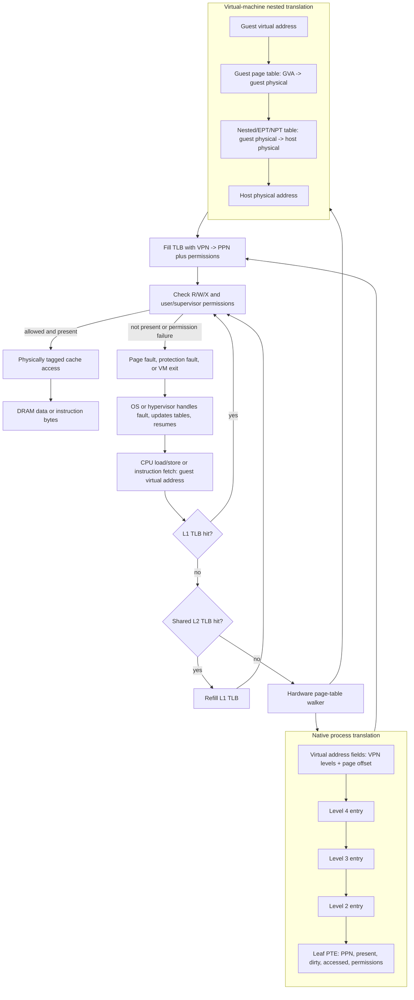

# Virtual Memory, TLBs, and VMs

Virtual memory lets each process run as if it owns a large private address space. The operating system and hardware translate virtual addresses into physical addresses, enforce protection, and move pages between memory and storage when necessary. This abstraction is essential for multiprogramming, process isolation, demand paging, and modern operating systems.

Translation must be fast because it is needed for almost every instruction fetch and data access. The translation lookaside buffer, TLB, is a cache of recent virtual-to-physical page translations. Virtual machines extend the same protection idea: a virtual machine monitor multiplexes physical hardware among guest operating systems while preserving isolation.

## Definitions

A virtual address is generated by a program. A physical address names a location in main memory. Page-based virtual memory splits addresses into a virtual page number and page offset:

$$
\mathrm{Virtual\ address} =
\mathrm{Virtual\ page\ number}\ \Vert\ \mathrm{Page\ offset}
$$

The page offset is unchanged by translation. The virtual page number is translated to a physical page number using a page table:

$$
\mathrm{Physical\ address} =
\mathrm{Physical\ page\ number}\ \Vert\ \mathrm{Page\ offset}
$$

A page table entry, PTE, commonly includes:

- Physical page number.
- Valid or present bit.
- Protection bits such as read, write, execute, and user/supervisor.
- Dirty bit indicating the page was written.
- Reference or accessed bit for replacement policies.

The TLB stores recent PTE information in associative hardware. On a TLB hit, translation is fast. On a TLB miss, hardware or the operating system walks the page table, checks permissions, and installs a translation. If the page is not present, a page fault transfers control to the OS, which may fetch the page from storage.

A virtual machine monitor, VMM or hypervisor, runs guest operating systems in isolated virtual machines. It must control privileged state, interrupts, address translation, and I/O devices. Modern processors include virtualization support so guests can run most instructions directly while trapping sensitive operations.

## Key results

The effective memory access time with a TLB can be modeled as:

$$
\mathrm{EAT}=
h(T_{TLB}+T_{mem})+
(1-h)(T_{TLB}+T_{walk}+T_{mem})
$$

where $h$ is TLB hit rate. If page faults are included, the miss term must include the page fault rate multiplied by a very large disk or SSD service time.

Page size is a trade-off. Larger pages reduce page-table size and increase TLB reach:

$$
\mathrm{TLB\ reach}=
\mathrm{TLB\ entries}\times\mathrm{Page\ size}
$$

But larger pages can waste memory through internal fragmentation and increase page fault transfer time.

Virtual-indexed, physically-tagged caches use the page offset to index the cache before physical translation completes, while checking the tag with the physical address. This can reduce L1 hit time, but it constrains cache size and associativity so that index bits fit within the page offset, avoiding synonyms or requiring hardware/software handling.

Virtualization adds another translation layer. A guest OS maps guest virtual addresses to guest physical addresses. The VMM maps guest physical addresses to host physical addresses. Shadow page tables or nested page tables avoid trapping on every memory reference. The central requirement is that guest software cannot access resources outside its assigned virtual machine.

Page faults are intentionally expensive because they cross several abstraction layers. The processor detects that a valid translation is absent or permissions fail, transfers control to the operating system, and supplies fault information. The OS decides whether the access is legal, finds or creates a physical page, may evict another page, updates the page table, and resumes the faulting instruction. This machinery is worthwhile because it gives processes isolation and the illusion of large memory.

The TLB is small compared with cache capacity, so TLB locality can become a bottleneck even when data locality is good. A program scanning a large array with 4 KiB pages may touch a new page every small number of cache blocks. Huge pages increase TLB reach and reduce misses, but they require larger contiguous physical allocations and can increase memory waste. Operating systems often use them selectively for databases, virtual machines, and large numerical workloads.

Virtual machines put pressure on both translation and I/O. CPU-bound user code can run near native speed because most instructions are not privileged. I/O-heavy workloads enter the OS frequently, touch device state, and require interrupt handling, making virtualization support more important. Device assignment, paravirtual drivers, and IOMMUs are architectural responses to this overhead.

## Visual



This translation diagram shows the fast TLB path, the multi-level native page-table walk, and the nested walk used by virtual machines. A hit returns permissions and a physical page number immediately, while a miss may traverse several levels and, under virtualization, compose guest and host translations. The fault/VM-exit path makes the protection contract explicit: illegal or nonresident mappings transfer control to the OS or hypervisor before the instruction can complete.

| Mechanism | Purpose | Fast path | Slow path |
|---|---|---|---|
| Page table | Full address mapping | Cached by TLB | Page-table walk |
| TLB | Translation cache | Associative hit | Refill or exception |
| Protection bits | Isolation | Permission check | Fault to OS |
| Page fault | Demand paging | None | OS fetches or allocates page |
| Nested translation | VM isolation | Hardware nested walk | Hypervisor intervention |

## Worked example 1: TLB reach and address fields

Problem: A system uses 4 KiB pages and has a 64-entry TLB. Virtual addresses are 32 bits. Find the page offset bits, virtual page number bits, and TLB reach.

Method:

1. Compute page offset bits.

$$
4\ \mathrm{KiB}=4096=2^{12}
$$

So the page offset has 12 bits.

2. Compute virtual page number bits.

$$
32-12=20
$$

3. Compute TLB reach.

$$
\begin{aligned}
\mathrm{TLB\ reach}
&=64 \times 4\ \mathrm{KiB} \\
&=256\ \mathrm{KiB}
\end{aligned}
$$

4. Interpret the result. If a program's active working set spans much more than 256 KiB of pages with little reuse, TLB misses may become significant even if the data cache is large enough.

Checked answer: The offset is 12 bits, the VPN is 20 bits, and the TLB reach is 256 KiB.

## Worked example 2: Effective access time with TLB misses

Problem: A TLB lookup takes 1 ns, memory access takes 50 ns, and a hardware page-table walk costs an additional 100 ns on a TLB miss. The TLB hit rate is 98%. Ignore page faults. Compute effective access time.

Method:

1. Hit time:

$$
T_{hit}=1+50=51\ \mathrm{ns}
$$

2. Miss time:

$$
T_{miss}=1+100+50=151\ \mathrm{ns}
$$

3. Weighted average:

$$
\begin{aligned}
\mathrm{EAT}
&=0.98(51)+0.02(151) \\
&=49.98+3.02 \\
&=53.00\ \mathrm{ns}
\end{aligned}
$$

4. Compare with perfect TLB:

$$
53-51=2\ \mathrm{ns}
$$

Checked answer: Effective access time is 53 ns. A 2% TLB miss rate adds 2 ns on average under these assumptions, but real page faults would be far more expensive.

## Code

```python
def split_virtual_address(va, page_bits):
    vpn = va >> page_bits
    offset = va & ((1 << page_bits) - 1)
    return vpn, offset

def translate(va, page_bits, tlb, page_table):
    vpn, offset = split_virtual_address(va, page_bits)
    if vpn in tlb:
        ppn = tlb[vpn]
        source = "tlb"
    else:
        if vpn not in page_table:
            raise MemoryError("page fault")
        ppn = page_table[vpn]
        tlb[vpn] = ppn
        source = "page table"
    return (ppn << page_bits) | offset, source

tlb = {}
page_table = {0x12345: 0x00ABC}
pa, source = translate(0x12345ABC, 12, tlb, page_table)
print(hex(pa), source)
```

The translation code omits permissions, dirty bits, accessed bits, address-space identifiers, and replacement. Those details are essential in a real TLB. Address-space identifiers allow entries from different processes to coexist without flushing on every context switch. Dirty and accessed bits help the operating system choose pages to evict and decide whether a page must be written back.

It also treats the page table as a flat dictionary. Real page tables are usually multi-level or inverted structures so that sparse virtual address spaces do not require enormous contiguous tables. Multi-level walks add memory references on a TLB miss, which is why processors include page-walk caches and why huge pages can improve performance for large working sets.

In virtualized systems, the hardware may perform nested walks. A guest page-table walk itself uses guest physical addresses that must be translated to host physical addresses. Hardware support caches intermediate results, but TLB reach and page-walk cost remain major performance concerns for VM-dense servers.

Translation interacts with caches even when every page is resident. The processor must check permissions and produce a physical address before it can safely use physically tagged data. Designs that overlap TLB lookup with cache indexing rely on page-offset bits and careful constraints, which is why virtual memory appears in both operating systems and processor microarchitecture.

This is why TLB misses can show up as processor performance events rather than only as operating-system events in profilers and traces.

## Common pitfalls

- Forgetting that the page offset is not translated.
- Confusing a TLB miss with a page fault.
- Ignoring permission checks when discussing address translation.
- Using large pages without considering internal fragmentation.
- Assuming virtualization requires interpreting every guest instruction.
- Overlooking synonym and alias problems in virtually indexed caches.

## Connections

- [Cache Organization and AMAT](/cs/computer-architecture/cache-organization-amat)
- [Instruction Set Principles](/cs/computer-architecture/instruction-set-principles)
- [Warehouse-Scale Computers](/cs/computer-architecture/warehouse-scale-computers)
- [Storage, RAID, and SSDs](/cs/computer-architecture/storage-raid-ssds)
