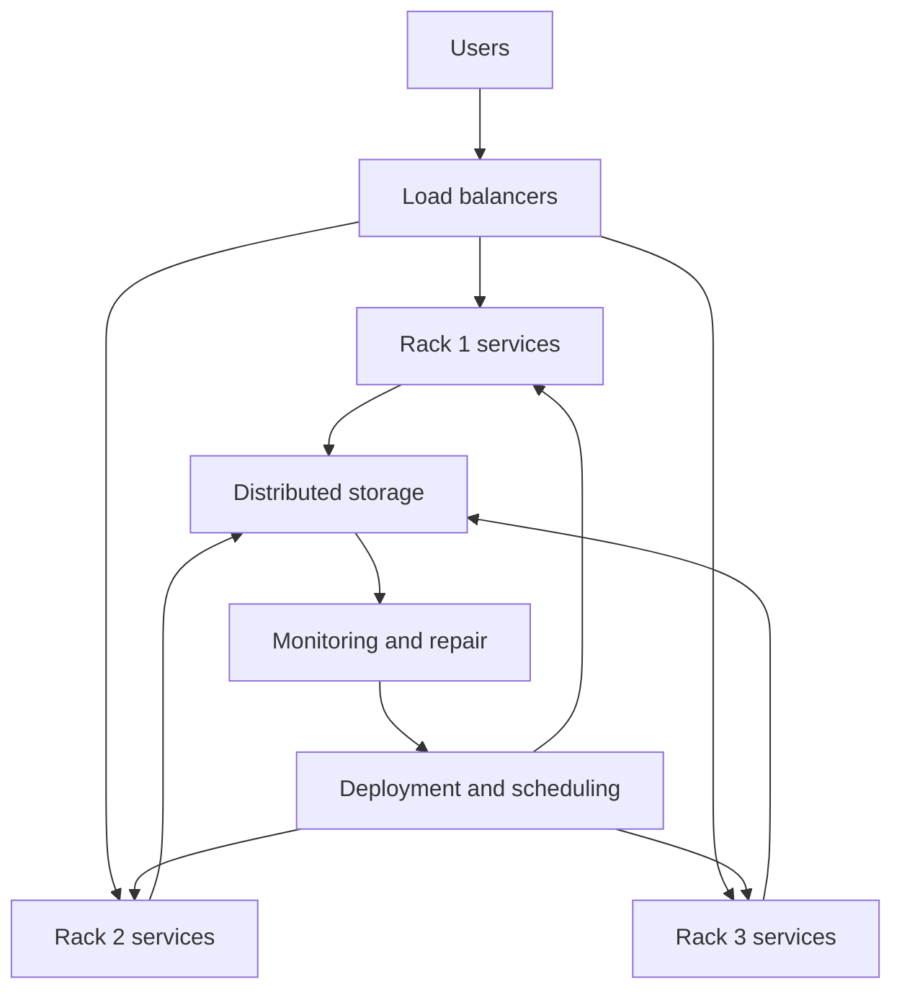

# Warehouse-Scale Computers

Warehouse-scale computers, WSCs, treat a building full of servers, networking, power distribution, cooling, and storage as one large computer. They are built to serve Internet-scale workloads: search, storage, maps, machine learning services, streaming, social applications, and many independent user requests. H&P separates WSCs from traditional supercomputers because their goals and constraints differ.


*Figure: ENIAC gives architecture pages a physical reference point before modern chips. Image: [Wikimedia Commons](https://commons.wikimedia.org/wiki/File:ENIAC_Penn1.jpg), Paul W. Shaffer and TexasDex, CC BY-SA 3.0/GFDL.*

A supercomputer often targets tightly coupled scientific jobs and expensive low-latency interconnects. A WSC targets request-level parallelism, data-level parallelism across huge datasets, operational cost, energy proportionality, fault tolerance, and software systems that survive component failures. The individual server matters, but the architecture of the whole facility matters more.

## Definitions

Request-level parallelism, RLP, is parallelism across independent or loosely coupled requests. A web service can handle many users at once because each request can often be assigned to a different server or process.

Warehouse-scale computer refers to the full system: servers, racks, networks, storage, power delivery, cooling, monitoring, deployment systems, and software frameworks. A cluster is a collection of connected machines; a WSC is a deliberately engineered datacenter-scale computer.

Energy proportionality is the ideal that a system's power consumption should scale linearly with load:

$$
P(u)=P_{idle}+u(P_{peak}-P_{idle})
$$

where $u$ is utilization. A perfectly energy-proportional system would have very low idle power. Real servers often consume a large fraction of peak power even when lightly loaded.

Power usage effectiveness, PUE, measures facility overhead:

$$
\mathrm{PUE}=
\frac{\mathrm{Total\ facility\ power}}{\mathrm{IT\ equipment\ power}}
$$

Lower PUE means less power is spent on cooling, conversion losses, and other non-compute infrastructure.

Service-level objectives, SLOs, specify latency, availability, or throughput targets. Tail latency is the high-percentile response time, such as 99th percentile latency. It matters because a user-visible request may depend on many subrequests; one slow component can delay the whole response.

## Key results

WSC design is dominated by total cost of ownership. Server purchase price, power, cooling, networking, building infrastructure, repair, and replacement cycles all matter. A small percentage improvement in energy efficiency or utilization can be worth a large absolute amount because it applies to thousands of servers.

RLP changes the performance metric. A single request's latency matters, but the system must also maximize useful throughput under latency constraints. If throughput rises only by violating tail-latency SLOs, it is not a valid improvement.

Fault tolerance is mandatory. At WSC scale, hardware failures are normal events. Software must replicate data, retry tasks, route around failures, and deploy changes gradually. The architecture assumes components fail and designs for service continuity.

Networking is part of architecture. Oversubscription, rack locality, bisection bandwidth, and congestion affect application placement. A data-intensive job that repeatedly crosses racks can be slower and more expensive than one scheduled near its data.

WSC workloads often mix online services and batch analytics. Online services need predictable latency. Batch systems want high throughput and can use spare capacity. Coordinating these workloads is a scheduling and isolation problem.

Tail latency is amplified by fan-out. A front-end request may query dozens or hundreds of back-end shards, then wait for the slowest required response. Even if each shard is fast most of the time, the probability that at least one shard is slow can be high. WSC software therefore uses replication, hedged requests, timeouts, partial results, and careful dependency graphs to control the tail.

Utilization is a cost problem as much as a performance problem. Servers bought for peak traffic sit partly idle during low demand, yet they still consume power and occupy capital. Workload consolidation improves utilization but can create interference in caches, memory bandwidth, storage, and networks. Isolation mechanisms and cluster schedulers try to pack work while preserving SLOs.

The network topology affects application architecture. Placing related services or data shards in the same rack can reduce latency and cross-rack traffic, but it may reduce fault isolation. Spreading replicas across failure domains improves availability but increases network distance. WSC design repeatedly balances locality, redundancy, and operational simplicity.

WSC dependability is usually achieved above individual hardware components. Instead of making every server extremely reliable, designers often use commodity servers with software replication and automatic recovery. This shifts complexity into distributed systems, monitoring, and deployment, but it can produce better cost-performance and faster hardware refresh cycles.

## Visual



| Metric | Meaning | Why architects care |
|---|---|---|
| Requests/s | Service throughput | Capacity planning |
| Median latency | Typical response | User experience baseline |
| 99th percentile latency | Tail behavior | Multi-service requests amplify tails |
| PUE | Facility efficiency | Power and cooling overhead |
| Utilization | Fraction of useful work | Low utilization wastes capital and power |
| Availability | Service accomplishment | Failures are routine at scale |

## Worked example 1: PUE and facility power

Problem: A datacenter has 20 MW of IT load and PUE 1.25. Compute total facility power and non-IT overhead power. Then compare with improving PUE to 1.15 at the same IT load.

Method:

1. Use the PUE definition.

$$
\mathrm{Total}=\mathrm{PUE}\times \mathrm{IT}
$$

2. Baseline total power:

$$
1.25 \times 20\ \mathrm{MW}=25\ \mathrm{MW}
$$

3. Baseline overhead:

$$
25-20=5\ \mathrm{MW}
$$

4. Improved total power:

$$
1.15 \times 20\ \mathrm{MW}=23\ \mathrm{MW}
$$

5. Improved overhead:

$$
23-20=3\ \mathrm{MW}
$$

6. Savings:

$$
25-23=2\ \mathrm{MW}
$$

Checked answer: Reducing PUE from 1.25 to 1.15 saves 2 MW continuously for the same IT work. Over a year, that is:

$$
2\ \mathrm{MW}\times8760\ \mathrm{h}=17520\ \mathrm{MWh}
$$

## Worked example 2: Tail latency amplification

Problem: A user request fans out to 50 independent backend services. Each backend meets its local 99th percentile target of 100 ms, meaning each one has a 1% chance of exceeding 100 ms. If the user response waits for all 50, what is the probability that at least one backend exceeds 100 ms?

Method:

1. Probability one backend does not exceed 100 ms:

$$
1-0.01=0.99
$$

2. Probability all 50 do not exceed 100 ms, assuming independence:

$$
0.99^{50}=0.605
$$

3. Probability at least one exceeds 100 ms:

$$
1-0.605=0.395
$$

4. Interpret. Even though each service has only 1% tail probability, the fan-out request sees a much larger tail risk.

Checked answer: There is about a 39.5% chance that at least one backend exceeds 100 ms. This is why WSC software uses hedged requests, careful fan-out control, caching, and tail-tolerant designs.

## Code

```python
def facility_power(it_mw, pue):
    total = it_mw * pue
    overhead = total - it_mw
    return total, overhead

def fanout_tail_probability(backends, per_backend_tail):
    all_fast = (1.0 - per_backend_tail) ** backends
    return 1.0 - all_fast

total, overhead = facility_power(20, 1.25)
print(f"total={total:.1f} MW overhead={overhead:.1f} MW")
print(f"tail risk={fanout_tail_probability(50, 0.01):.1%}")
```

The PUE calculation isolates facility overhead, but server efficiency still matters inside the IT load. A low PUE datacenter full of inefficient servers can waste more energy than a higher-PUE facility with better utilization and newer hardware. Architects therefore combine facility metrics with server-level performance per watt, workload placement, and power management policies.

The tail-probability function assumes independent back-end delays. Real delays are often correlated because many services share networks, storage systems, power events, software releases, or overloaded dependencies. Correlation can make tail behavior worse than the independent estimate. This is why monitoring systems track both per-service latency and fleet-wide events.

Capacity planning also needs headroom. Running close to saturation increases queueing delay and leaves little room for failures or traffic bursts. WSC operators often reserve capacity for maintenance, machine failures, and sudden demand. The unused headroom looks inefficient in a narrow utilization chart, but it is part of meeting availability and latency objectives.

Software deployment is another architectural workload. Rolling out a new binary to thousands of machines can create cache cold starts, load shifts, and correlated failures if done carelessly. Staged rollout, canaries, automatic rollback, and version skew handling are part of making the warehouse behave like a dependable computer rather than a collection of individually managed servers.

The same systems view applies to hardware refresh. Replacing servers gradually means several generations of processors, disks, and network cards may run one service at the same time. Software must tolerate heterogeneity, and capacity models must account for mixed performance instead of assuming every machine is identical.

Even naming, inventory, and monitoring data become architectural inputs at this scale for daily service operation.

## Common pitfalls

- Treating WSCs as just large supercomputers.
- Optimizing average latency while ignoring tail latency.
- Reporting throughput without the SLO under which it was achieved.
- Ignoring idle power and poor energy proportionality.
- Assuming hardware failures are exceptional rather than routine.
- Moving data across the network repeatedly instead of scheduling work near data.

## Connections

- [Power, Energy, Cost, and Dependability](/cs/computer-architecture/power-energy-cost-dependability)
- [Multicore, Synchronization, and NUMA](/cs/computer-architecture/multicore-synchronization-numa)
- [Storage, RAID, and SSDs](/cs/computer-architecture/storage-raid-ssds)
- [Vector, SIMD, and GPU Architectures](/cs/computer-architecture/vector-simd-gpu)
