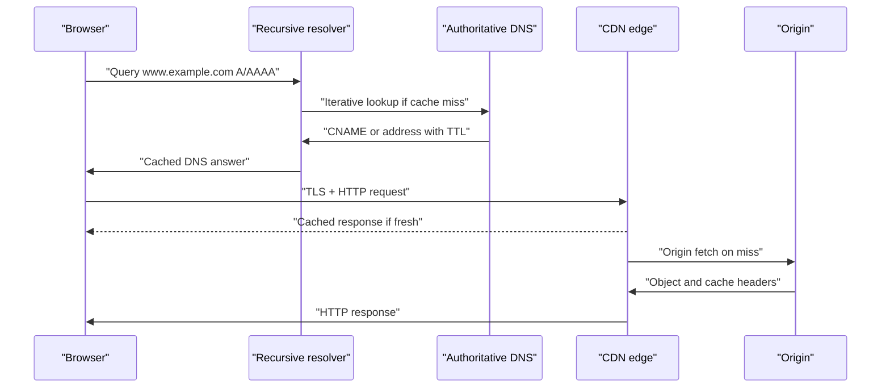

# Application Layer and Naming


*Figure: A typical DNS resolution path traverses recursive resolver, root, TLD, and authoritative servers, with caching at each step. Image: [Wikimedia Commons](https://commons.wikimedia.org/wiki/File:DNS_in_the_real_world.svg), Lion Kimbro, CC BY-SA.*

Application-layer protocols define the conversations users actually recognize: web requests, name lookups, email delivery, file transfer, remote procedure calls, live updates, and content distribution. Peterson-Davie put applications at the end of the book after the lower layers are in place, but they also use application requirements from the beginning to motivate network design [1].

This page covers DNS, DNSSEC, encrypted DNS transports, HTTP/1.1, HTTP/2, HTTP/3, email protocols, file and storage access, WebSocket, gRPC, REST, RPC, CDNs, anycast, and geo-DNS. It emphasizes that the application layer is where naming, caching, consistency, latency hiding, and security policy often become visible.

## Definitions

**DNS** is the Domain Name System, a distributed hierarchical database that maps names to resource records [2]. The root delegates to top-level domains, TLDs delegate to authoritative zones, and recursive resolvers cache answers for clients. Common records include `A`, `AAAA`, `CNAME`, `MX`, `NS`, `TXT`, `SRV`, `CAA`, and DNSSEC records such as `DNSKEY` and `RRSIG`.

**DNSSEC** adds origin authentication and integrity for DNS data using signed zones and a chain of trust [3]. It does not encrypt queries. **DoT** carries DNS over TLS [4]. **DoH** carries DNS over HTTPS [5]. These protect DNS transport privacy and integrity between client and resolver, but the resolver still sees the query unless additional privacy systems are used.

**HTTP/1.1** is a text-oriented request/response protocol with persistent connections, caching headers, chunked transfer, virtual hosting through the `Host` header, and methods such as `GET`, `POST`, `PUT`, and `DELETE` [6]. **HTTP/2** uses binary framing and multiplexes streams over one TCP connection [7]. **HTTP/3** maps HTTP semantics onto QUIC streams over UDP [8].

**SMTP** transfers email between mail clients and servers or among mail servers. **IMAP** lets a client access and synchronize mailbox state on a server. **POP3** is a simpler download-oriented mailbox protocol. **MIME** describes typed email bodies and attachments.

**FTP** is an older file transfer protocol with separate control and data channels. **SFTP** is file transfer over SSH, not FTP over TLS. **NFS** exposes remote filesystems, with client-side caching and consistency semantics that differ from local disks.

**WebSocket** upgrades an HTTP connection to a bidirectional message channel. **gRPC** is an RPC framework commonly using HTTP/2, Protocol Buffers, deadlines, streaming, and generated stubs. **REST** is an architectural style that exposes resources through uniform HTTP semantics. RPC exposes procedures or methods; REST emphasizes resources and representations.

**CDNs** place content near users through caches, anycast, DNS steering, and private backbones. **Anycast** advertises the same IP prefix from multiple locations so routing sends a client to a nearby or policy-preferred site. **Geo-DNS** returns different DNS answers based on resolver or client location signals.

## Key results

The first result is that naming is layered. A URL may contain a DNS name; DNS maps that name to addresses; routing maps addresses to paths; TLS authenticates a certificate name; HTTP selects a virtual host; an application maps a path or object key to content. A failure at any layer can look like "the site is down," so diagnostics must separate name resolution, routing, transport, TLS, and application status.

The second result is that caching is both a performance tool and a correctness risk. DNS TTLs reduce authoritative load and latency but delay changes. HTTP caches reduce origin traffic but require validators, freshness rules, invalidation strategy, and content negotiation. CDNs amplify this: a cached object may be replicated across hundreds of points of presence.

The third result is that HTTP evolution is largely about latency and multiplexing. HTTP/1.1 persistent connections avoid repeated TCP handshakes but still suffer head-of-line blocking when multiple requests share a connection sequentially. HTTP/2 multiplexes streams over one TCP connection, but TCP-level loss still blocks all streams behind the lost byte. HTTP/3 over QUIC keeps HTTP-level multiplexing while avoiding cross-stream head-of-line blocking at the transport stream layer.

The fourth result is that application protocols must define idempotence, retry, and deadlines. A retry of `GET` is usually safe; a retry of `POST /charge-card` may duplicate work unless the application uses idempotency keys. Distributed systems fail partially, and the network cannot tell an application whether a timed-out request was never received, received but not processed, processed but response lost, or processed twice.

The fifth result is that DNS is part of security, not only convenience. DNSSEC signs records but deployment is uneven and operationally demanding. Certificate issuance relies partly on DNS names and CAA records. CDNs and SaaS products depend on CNAME delegation. DoH and DoT change who can observe DNS queries, which has operational and policy consequences.

The sixth result is that application design depends on transport behavior. RTP over UDP prefers timeliness. HTTP/3 over QUIC benefits from 0-RTT for repeat connections but must handle replay risk. gRPC over HTTP/2 needs deadlines and flow control to prevent slow consumers from exhausting memory. WebSocket creates long-lived state that load balancers must track.

A seventh result is that application protocols often carry their own control planes. SMTP has MX lookup, retry queues, bounce messages, spam controls, and reputation systems. HTTP has redirects, cache validation, cookies, authentication challenges, and content negotiation. CDNs have purge APIs, origin shielding, health checks, and routing rules. These control-plane features are not incidental; they determine how the application behaves during failures, migrations, and attacks.

An eighth result is that naming choices become API commitments. A domain name printed in a mobile app, a URL embedded in a document, an object key stored in a database, or an email address used as an identity may survive for years. Renaming is therefore a distributed-systems problem. Good designs separate stable public names from movable backends through DNS, redirects, service discovery, and versioned APIs.

## Visual



| Protocol | Default transport | Main abstraction | Common performance lever |
|---|---|---|---|
| DNS | UDP/TCP 53; DoT/DoH variants | Resource records | TTL, cache locality, anycast |
| HTTP/1.1 | TCP | Request/response | Persistent connections and caching |
| HTTP/2 | TCP | Multiplexed streams | Header compression and stream concurrency |
| HTTP/3 | QUIC/UDP | Multiplexed streams | 0-RTT, migration, no TCP stream HOL |
| SMTP | TCP | Store-and-forward mail | Queues, retries, MX preference |
| IMAP | TCP | Remote mailbox state | Server search and sync |
| WebSocket | TCP or TLS over TCP | Bidirectional messages | Long-lived connection handling |
| gRPC | HTTP/2 or HTTP/3 | Typed RPC streams | Deadlines, flow control, load balancing |

## Worked example 1: DNS recursive resolution and caching

Problem: A client asks for `www.example.com`. The recursive resolver has no cached data. The authoritative answer is a CNAME to `edge.cdn.example.net` with TTL 300 seconds, and `edge.cdn.example.net` has an A record `203.0.113.20` with TTL 60 seconds. Describe the lookup and cache behavior.

1. The client sends one query to its recursive resolver:

```text
Q: www.example.com A
```

2. On a cold cache, the recursive resolver follows delegation from root to the `.com` TLD to the `example.com` authoritative servers.

3. The authoritative server returns:

```text
www.example.com CNAME edge.cdn.example.net TTL=300
```

4. The resolver must now resolve `edge.cdn.example.net A`, following delegation for `example.net` if needed.

5. The CDN authoritative server returns:

```text
edge.cdn.example.net A 203.0.113.20 TTL=60
```

6. The recursive resolver returns both useful records to the client and caches them.

7. For the next 60 seconds, the resolver can answer the A record from cache. From 60 to 300 seconds, it may still know the CNAME but must refresh the CDN A record.

Answer: the effective address steering TTL is 60 seconds, not 300, because the final address record expires sooner. This lets the CDN move clients quickly while keeping the alias stable.

## Worked example 2: HTTP/2 multiplexing versus HTTP/1.1 connections

Problem: A page needs 12 small objects from the same origin. Each object takes 10 ms of server time and 20 ms RTT. Ignore transmission time. Compare a single sequential HTTP/1.1 connection, six parallel HTTP/1.1 connections, and one HTTP/2 connection with enough stream concurrency.

1. Sequential HTTP/1.1 over one persistent connection sends one request, waits for a response, then sends the next:

$$
12 \times (20\ \mathrm{ms} + 10\ \mathrm{ms}) = 360\ \mathrm{ms}
$$

2. Six parallel HTTP/1.1 connections can process six objects at a time, so there are two waves:

$$
2 \times (20\ \mathrm{ms} + 10\ \mathrm{ms}) = 60\ \mathrm{ms}
$$

3. HTTP/2 can multiplex all 12 streams on one connection. If the server processes them concurrently and the congestion window is sufficient:

$$
20\ \mathrm{ms} + 10\ \mathrm{ms} = 30\ \mathrm{ms}
$$

4. Interpret the simplified result. HTTP/2 reduces application-layer queuing and connection overhead, but packet loss on the underlying TCP connection can still delay all streams until missing bytes are recovered.

Answer: the idealized times are 360 ms, 60 ms, and 30 ms. Real measurements include TLS, congestion windows, prioritization, packet loss, and browser limits.

## Code

```python
import http.client
import time

def fetch_head(host, path="/"):
    start = time.perf_counter()
    conn = http.client.HTTPSConnection(host, timeout=5)
    conn.request("HEAD", path, headers={"User-Agent": "sj-wiki-demo"})
    resp = conn.getresponse()
    elapsed = time.perf_counter() - start
    headers = {k.lower(): v for k, v in resp.getheaders()}
    conn.close()
    return resp.status, headers.get("cache-control"), elapsed

status, cache_control, seconds = fetch_head("example.com")
print(status, cache_control, f"{seconds * 1000:.1f} ms")
```

## Common pitfalls

- Treating DNS as a single server lookup. Recursive resolution can involve root, TLD, authoritative, cache, and CNAME steps.
- Forgetting that DNS TTLs are upper bounds on cache freshness, not propagation guarantees to every resolver.
- Assuming DNSSEC encrypts DNS. It signs data; DoT and DoH encrypt transport to a resolver.
- Ignoring negative caching for nonexistent names.
- Thinking HTTP methods define safety automatically. Application semantics must make retries safe.
- Retrying non-idempotent requests without idempotency keys.
- Treating HTTP/2 multiplexing as a cure for TCP loss. TCP head-of-line blocking still exists beneath it.
- Assuming HTTP/3 removes all head-of-line blocking. It removes transport blocking across streams, but application dependencies can still block.
- Forgetting `Host` and SNI when multiple sites share one address.
- Confusing FTP, FTPS, and SFTP. They are different protocols.
- Using WebSocket without planning load balancing, idle timeouts, and backpressure.
- Treating REST versus RPC as a syntax choice only. The deeper issue is resource semantics versus method semantics.
- Ignoring CDN cache keys. Headers, query strings, cookies, and compression variants can change what is cached.
- Assuming anycast always reaches the geographically nearest site. BGP policy chooses the route.

## Connections

- [Transport Layer: TCP and UDP](/cs/computer-networks/transport-layer-tcp-udp) explains the TCP, UDP, and QUIC services applications use.
- [Network Security and TLS](/cs/computer-networks/network-security-and-tls) covers HTTPS, certificates, DoH/DoT, DNSSEC context, and application authentication.
- [Congestion Control and Queue Management](/cs/computer-networks/congestion-control-and-queue-management) explains why retries, streaming, and CDN traffic affect shared bottlenecks.
- [Modern Data Center Networks and SDN](/cs/computer-networks/modern-data-center-and-sdn) connects service meshes, load balancers, and east-west RPC traffic.
- [Cryptography](/cs/cryptography/intro) supplies TLS, DNSSEC, SSH, and signed token primitives.
- [Distributed Systems](/cs/distributed-systems/intro) covers RPC, retries, idempotence, caching, consistency, and service discovery.
- [Operating Systems](/cs/operating-systems/intro) explains event loops, file descriptors, socket buffers, and server concurrency.
- [Computer Architecture](/cs/computer-architecture/intro) influences TLS offload, compression, cache servers, and high-throughput proxies.

## References

[1] L. L. Peterson and B. S. Davie, *Computer Networks: A Systems Approach*, supplied edition, ch. 9.

[2] P. Mockapetris, "Domain names - concepts and facilities," RFC 1034, Nov. 1987.

[3] R. Arends, R. Austein, M. Larson, D. Massey, and S. Rose, "DNS Security Introduction and Requirements," RFC 4033, Mar. 2005.

[4] Z. Hu, L. Zhu, J. Heidemann, A. Mankin, D. Wessels, and P. Hoffman, "Specification for DNS over Transport Layer Security," RFC 7858, May 2016.

[5] P. Hoffman and P. McManus, "DNS Queries over HTTPS," RFC 8484, Oct. 2018.

[6] R. Fielding, M. Nottingham, and J. Reschke, "HTTP Semantics," RFC 9110, Jun. 2022.

[7] M. Thomson and C. Benfield, "HTTP/2," RFC 9113, Jun. 2022.

[8] M. Bishop, "HTTP/3," RFC 9114, Jun. 2022.
