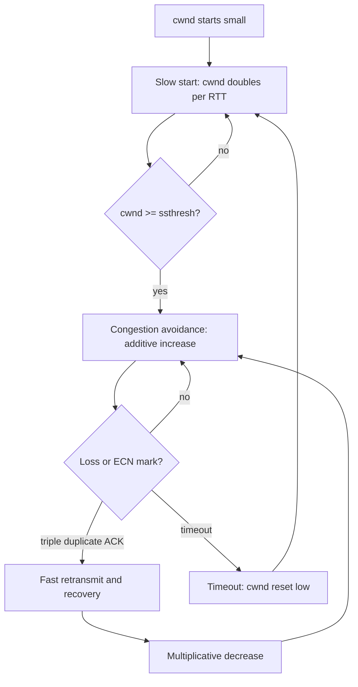

# Congestion Control and Queue Management

Congestion occurs when offered traffic exceeds some resource along a path: link bandwidth, router buffers, scheduler time, receiver capacity, or policy. Packet switching is efficient because many flows share resources statistically, but that same sharing creates collapse if senders inject traffic faster than the network can drain it. Peterson-Davie place congestion control in its own chapter because it cuts across link, network, transport, and application design [1].

This page explains slow start, AIMD, fast retransmit, fast recovery, throughput models, active queue management, ECN, DCTCP, CoDel, FQ-CoDel, and bufferbloat. The central theme is feedback: endpoints and queues must expose congestion early enough for senders to reduce load before latency and loss explode.

## Definitions

**Congestion control** regulates how much data senders inject into the network. TCP's classic control variable is the **congestion window** (`cwnd`), the maximum unacknowledged data allowed due to network conditions. **Slow start threshold** (`ssthresh`) separates exponential startup from linear congestion avoidance.

**AIMD** means additive increase, multiplicative decrease. A sender increases its window gradually when the path appears healthy and cuts it sharply when congestion is detected. AIMD tends toward fairness among similar flows sharing a bottleneck.

**Slow start** begins with a small congestion window and roughly doubles it every RTT as ACKs arrive, until reaching `ssthresh` or detecting congestion. **Congestion avoidance** then increases more slowly, roughly one MSS per RTT in classic TCP. **Fast retransmit** uses duplicate ACKs to infer loss before timeout. **Fast recovery** reduces the window and avoids returning all the way to initial slow start after certain losses.

**Active queue management (AQM)** drops or marks packets before a queue is full. **RED** computes an average queue length and probabilistically drops or marks as the average grows [4]. **CoDel** uses packet sojourn time to detect persistent queueing delay [5]. **FQ-CoDel** combines flow queueing with CoDel so sparse flows are protected from bulk flows.

**ECN** is explicit congestion notification: routers mark packets instead of dropping them when endpoints negotiate ECN capability [6]. **DCTCP** is a data-center TCP variant that uses the fraction of ECN-marked packets to keep queues shallow while maintaining high throughput [7].

**Bufferbloat** is excessive latency caused by oversized queues that fill under load. More buffering can reduce loss but can also create seconds of delay, breaking interactive applications even when throughput looks high.

## Key results

The first result is that uncontrolled retransmission can cause congestion collapse. If loss triggers every sender to retransmit aggressively without reducing rate, the network spends capacity carrying packets that are dropped again. Jacobson's congestion-control work showed that endpoints need to infer congestion and reduce offered load, not merely recover lost bytes [2].

The second result is the AIMD sawtooth. In congestion avoidance, a Reno-like flow increases `cwnd` linearly until a loss signal, then reduces it multiplicatively. A simplified model says the average window is about three-fourths of the maximum window if the window halves on loss. This sawtooth is not perfect fairness, but it is stable enough to share bottlenecks among many elastic flows.

The third result is the Mathis throughput model for Reno-like TCP:

$$
T \approx \frac{1.22 \times MSS}{RTT \sqrt{p}}
$$

Here $p$ is packet loss probability [3]. The model is simplified, but it captures the painful fact that throughput falls with RTT and with the square root of loss. High-speed long-distance flows need very low loss rates or different congestion control.

The fourth result is that queue management determines latency under load. Tail drop waits until a queue is full, causing burst losses and global synchronization. RED tried to signal earlier through random drops or ECN marks based on average queue length. CoDel avoids hand-tuned byte thresholds by asking whether packets have spent too long in the queue for a sustained interval.

The fifth result is that ECN separates congestion signal from packet loss. Loss is both a congestion signal and a reliability event. ECN lets routers say "slow down" while still delivering the packet. This matters in data centers, where shallow buffers, high rates, and incast traffic can cause loss storms. DCTCP uses ECN marking proportion, not just binary loss events, to adjust more smoothly.

The sixth result is that congestion control is a game among independent senders. If one flow ignores congestion signals, it can harm others. TCP friendliness, policing, fair queueing, and application rate control exist because the Internet cannot assume all endpoints are altruistic or identical.

A seventh result is that pacing and windowing solve different parts of the problem. A congestion window limits how much data may be in flight over an RTT. Pacing controls the rate at which packets leave the sender within that RTT. Without pacing, a sender can release a burst of packets when ACKs arrive, causing short queues, microbursts, or packet drops even when the average window is reasonable. Modern TCP and QUIC stacks often use pacing, especially with BBR, high-speed NICs, and shallow data-center buffers.

An eighth result is that application-level retries can defeat transport-level control. If many clients time out and retry simultaneously during overload, they can multiply offered load just when the service and network need relief. Good distributed systems add exponential backoff, jitter, retry budgets, circuit breakers, admission control, and server overload signals. These are congestion-control ideas lifted above the transport layer.

A ninth result is that fairness is policy-dependent. Equal bandwidth per flow is not always equal fairness per user, host, tenant, or application. One user can open many flows; one video stream may need a minimum rate; one storage replication job may be intentionally deprioritized. Queue disciplines such as fair queueing, hierarchical token buckets, and priority scheduling encode policy choices. The technical question is not only how to share, but what entity is being shared among.

Finally, congestion signals must be observable to be useful. Packet loss, ECN marks, RTT inflation, queue delay, receiver rate, and application latency are different signals with different noise. A well-instrumented network collects interface counters, queue drops, ECN marks, flow telemetry, and end-user latency so operators can tell the difference between insufficient capacity, bad queue management, path changes, and receiver bottlenecks.

This is why congestion control should be evaluated with both microbenchmarks and workload traces. A single long flow can show steady-state throughput, but it will not reveal web-page latency, RPC fanout behavior, incast, short-flow completion time, or the effect of synchronized application retries. The correct algorithm for a backbone transfer, a home uplink, and a GPU training fabric may differ because the objective function differs.

## Visual



| Mechanism | Signal | Strength | Tradeoff |
|---|---|---|---|
| Tail drop | Full queue loss | Simple | High latency and burst loss |
| RED | Average queue length | Early probabilistic signal | Hard to tune |
| CoDel | Persistent sojourn delay | Targets latency directly | Needs correct timestamping |
| FQ-CoDel | Flow queues plus delay | Protects sparse flows | More per-flow state |
| ECN | Congestion mark | Avoids loss as signal | Requires endpoint and network support |
| DCTCP | Fraction of ECN marks | Shallow data-center queues | Designed for controlled domains |

## Worked example 1: TCP window evolution

Problem: A TCP flow starts with `cwnd = 1 MSS` and `ssthresh = 16 MSS`. It receives full ACKs each RTT. Show the window through slow start and congestion avoidance. Then suppose loss is detected by triple duplicate ACK when `cwnd = 20 MSS`; compute the new threshold and window in a simplified Reno model.

1. During slow start, `cwnd` doubles each RTT:

| RTT | cwnd |
|---:|---:|
| 0 | 1 MSS |
| 1 | 2 MSS |
| 2 | 4 MSS |
| 3 | 8 MSS |
| 4 | 16 MSS |

2. At `16 MSS`, `cwnd` has reached `ssthresh`, so congestion avoidance begins.

3. During congestion avoidance, classic TCP increases by roughly 1 MSS per RTT:

| RTT | cwnd |
|---:|---:|
| 5 | 17 MSS |
| 6 | 18 MSS |
| 7 | 19 MSS |
| 8 | 20 MSS |

4. Loss at `20 MSS` triggers multiplicative decrease:

$$
ssthresh = 20/2 = 10\ \mathrm{MSS}
$$

5. In a simplified Reno view after fast recovery:

$$
cwnd \approx 10\ \mathrm{MSS}
$$

Answer: the flow grows exponentially to 16 MSS, linearly to 20 MSS, then halves its congestion window and threshold to about 10 MSS after the loss signal.

## Worked example 2: Throughput estimate with the Mathis model

Problem: Estimate Reno-like TCP throughput for `MSS = 1460 bytes`, `RTT = 80 ms`, and packet loss probability $p = 10^{-3}$.

1. Convert MSS to bits:

$$
1460\ \mathrm{bytes} \times 8 = 11{,}680\ \mathrm{bits}
$$

2. Compute the square root of loss:

$$
\sqrt{10^{-3}} \approx 0.03162
$$

3. Substitute into the model:

$$
\begin{aligned}
T &\approx \frac{1.22 \times 11{,}680}{0.080 \times 0.03162} \\
&= \frac{14{,}249.6}{0.0025296} \\
&\approx 5{,}633{,}000\ \mathrm{bits/s}
\end{aligned}
$$

4. Convert:

$$
5{,}633{,}000\ \mathrm{bits/s} \approx 5.6\ \mathrm{Mb/s}
$$

Answer: the simplified model predicts about 5.6 Mb/s. Even a 0.1 percent packet loss rate is costly on an 80 ms path, which explains why high-BDP networks need low loss, SACK, modern congestion control, pacing, or explicit marking.

## Code

```python
def simulate_aimd(rounds=20, loss_rounds={8, 15}, start=1, ssthresh=16):
    cwnd = start
    history = []
    for r in range(rounds):
        phase = "slow-start" if cwnd < ssthresh else "avoidance"
        history.append((r, cwnd, ssthresh, phase))
        if r in loss_rounds:
            ssthresh = max(cwnd // 2, 2)
            cwnd = ssthresh
        elif cwnd < ssthresh:
            cwnd *= 2
        else:
            cwnd += 1
    return history

for row in simulate_aimd():
    print(row)
```

## Common pitfalls

- Treating every packet loss as corruption. In wired IP networks, congestion is often the intended inference.
- Treating every wireless loss as congestion. Link behavior can confuse end-to-end congestion control.
- Confusing flow control with congestion control. Receive windows protect receivers; congestion windows protect the network.
- Using throughput tests without measuring latency under load. Bufferbloat can hide behind good bulk throughput.
- Assuming large buffers are always safer. Oversized queues can destroy interactive performance.
- Assuming tiny buffers are always better. Too little buffering can underutilize links under bursty traffic.
- Enabling RED without tuning or observing whether it actually marks/drops at useful queue levels.
- Ignoring ECN negotiation. Routers marking packets helps only if endpoints understand and react.
- Applying DCTCP expectations to the open Internet. It assumes a controlled data-center environment.
- Comparing congestion algorithms without matching RTT, pacing, loss, and queue discipline.
- Forgetting ACK path congestion. ACK compression and reverse-path loss can change sender behavior.
- Assuming fairness across different RTTs. Classic AIMD often gives shorter-RTT flows an advantage.
- Letting application retries amplify congestion during outages.

## Connections

- [Transport Layer: TCP and UDP](/cs/computer-networks/transport-layer-tcp-udp) provides the TCP mechanisms that use congestion signals.
- [Foundations and Layered Architecture](/cs/computer-networks/foundations-and-layered-architecture) introduces BDP, throughput, loss, jitter, and end-to-end design.
- [Internetworking and IP Routing](/cs/computer-networks/internetworking-and-ip-routing) shows where queues and bottlenecks appear along routed paths.
- [Modern Data Center Networks and SDN](/cs/computer-networks/modern-data-center-and-sdn) applies ECN and DCTCP to shallow-buffer, high-speed fabrics.
- [Application Layer and Naming](/cs/computer-networks/application-layer-and-naming) shows how HTTP, video, and RPC workloads experience congestion.
- [Cryptography](/cs/cryptography/intro) matters because encrypted transports still need visible congestion signals.
- [Distributed Systems](/cs/distributed-systems/intro) connects congestion with retry storms, backpressure, and overload control.
- [Operating Systems](/cs/operating-systems/intro) implements pacing, socket buffers, queue disciplines, and packet schedulers.
- [Computer Architecture](/cs/computer-architecture/intro) affects queue memory, NIC offload, timestamping, and line-rate scheduling.

## References

[1] L. L. Peterson and B. S. Davie, *Computer Networks: A Systems Approach*, supplied edition, ch. 6.

[2] V. Jacobson, "Congestion avoidance and control," in *Proc. ACM SIGCOMM*, 1988.

[3] M. Mathis, J. Semke, J. Mahdavi, and T. Ott, "The macroscopic behavior of the TCP congestion avoidance algorithm," *Computer Communication Review*, vol. 27, no. 3, pp. 67-82, 1997.

[4] S. Floyd and V. Jacobson, "Random early detection gateways for congestion avoidance," *IEEE/ACM Transactions on Networking*, vol. 1, no. 4, pp. 397-413, 1993.

[5] K. Nichols and V. Jacobson, "Controlling queue delay," *Communications of the ACM*, vol. 55, no. 7, pp. 42-50, 2012.

[6] K. Ramakrishnan, S. Floyd, and D. Black, "The Addition of Explicit Congestion Notification (ECN) to IP," RFC 3168, Sep. 2001.

[7] M. Alizadeh et al., "Data center TCP (DCTCP)," in *Proc. ACM SIGCOMM*, 2010.

[8] I. Rhee et al., "CUBIC for Fast Long-Distance Networks," RFC 9438, Aug. 2023.
