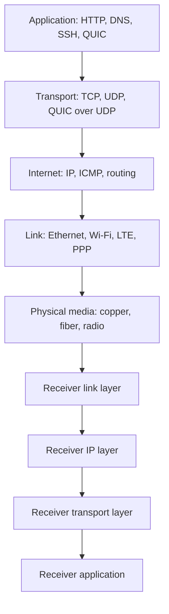

# Foundations and Layered Architecture


*Figure: The OSI seven-layer model. TCP/IP collapses several of these layers but the layering principle (each layer offers a service to the one above and uses the one below) is shared. Image: [Wikimedia Commons](https://commons.wikimedia.org/wiki/File:OSI-model-Communication.svg), Offnfopt, public domain.*

Computer networks are engineered systems for moving information between processes that may be separated by a room, a continent, or many administrative domains. Peterson and Davie frame the subject as a systems problem: the Internet is not only a collection of links and routers, but also a set of abstractions that let application writers, network operators, and protocol designers reason about scale without seeing every detail at once [1].

This page sets the vocabulary used by the rest of the Computer Networks section. It explains why layers exist, why they are useful but imperfect, and how the basic performance quantities of bandwidth, latency, throughput, jitter, packet loss, and bandwidth-delay product shape protocol design. It also introduces the end-to-end argument, which is the main design principle behind much of TCP/IP and a useful bridge to [distributed systems](/cs/distributed-systems/intro) and [operating systems](/cs/operating-systems/intro).

## Definitions

A **network** is a collection of nodes connected by links, where a node may be an end host, switch, router, access point, firewall, load balancer, or virtual network function. A **link** is the communication medium between adjacent nodes. Links may be point-to-point, such as a fiber between two routers, or shared, such as a Wi-Fi channel.

A **protocol** is a distributed agreement about message syntax, message meaning, state transitions, timers, and error behavior. The wire format alone is not enough. TCP, for example, includes segment fields, sequence number rules, retransmission timers, flow-control windows, congestion-control behavior, connection states, and compatibility rules across many implementations [2].

A **service** is what one layer offers to the layer above. IP offers a best-effort datagram service: it tries to deliver each packet independently, but it may lose, reorder, duplicate, or corrupt packets unless lower layers catch the corruption. TCP offers a reliable byte-stream service above IP by adding sequence numbers, acknowledgments, retransmission, and flow control [2].

A **layer** is a boundary around a set of responsibilities. The ISO/OSI model traditionally names seven layers: physical, data link, network, transport, session, presentation, and application. The Internet stack is usually described with fewer layers: link, internet, transport, and application. Peterson-Davie use layering but warn against treating it as theology: performance, security, reliability, and management cut across layers [1].

**Encapsulation** is the process of wrapping data from an upper layer in a lower-layer header, and sometimes a trailer. An HTTP request becomes TCP payload; TCP adds a segment header; IP adds a datagram header; Ethernet adds a frame header and frame check sequence. At the receiver, decapsulation removes these headers in reverse order.

**Bandwidth** is the maximum transmission rate of a link, usually in bits per second. **Latency** is the elapsed time for a message to travel from sender to receiver. Common latency components are propagation delay, transmission delay, queuing delay, and processing delay. **Throughput** is the delivered rate achieved by an application or flow, which may be lower than link bandwidth. **Jitter** is variation in delay. **Packet loss** is the fraction or pattern of packets that fail to arrive correctly. **Bandwidth-delay product (BDP)** is the amount of data needed to fill the path:

$$
\mathrm{BDP} = \mathrm{bandwidth} \times \mathrm{round\ trip\ time}
$$

A **header** contains metadata interpreted by a protocol: addresses, ports, sequence numbers, length fields, checksums, flags, hop limits, and options. A **payload** is the data being carried for the next higher layer. The distinction is relative: a TCP header and application bytes are both IP payload.

## Key results

The first architectural result is that layering trades performance and flexibility for modularity. A layer hides details below it, allowing application code to use sockets without knowing whether the path includes Ethernet, Wi-Fi, fiber, LTE, MPLS, VXLAN, or satellite. The cost is that a strict layer may hide information that would improve behavior. For example, TCP interprets packet loss as congestion, but wireless loss may be caused by interference. Modern stacks often keep the layered interface while adding careful cross-layer hints, such as explicit congestion notification, path MTU discovery, and link-layer retransmission.

The second result is the **end-to-end argument**. Saltzer, Reed, and Clark argued that functions should be placed in the network only when they can be completely and correctly implemented there; otherwise the function belongs at the endpoints, perhaps with network support for performance [3]. Reliable file transfer is the standard example. Even if every link checks frames, the application still needs an end-to-end check that the correct file reached the correct destination and storage. Link checks help performance by catching local corruption early, but they do not remove the endpoint's responsibility.

The third result is the basic delay decomposition for a packet of length $L$ bits over one hop:

$$
\begin{aligned}
D_{\mathrm{one\ hop}} &=
D_{\mathrm{processing}} +
D_{\mathrm{queue}} +
D_{\mathrm{transmission}} +
D_{\mathrm{propagation}} \\
D_{\mathrm{transmission}} &= \frac{L}{R} \\
D_{\mathrm{propagation}} &= \frac{d}{s}
\end{aligned}
$$

Here $R$ is the link rate, $d$ is distance, and $s$ is signal propagation speed in the medium. In fiber, $s$ is roughly $2 \times 10^8$ m/s. On a multi-hop store-and-forward path, transmission delay is paid at each hop for a full packet unless cut-through switching or segmentation changes the model.

The fourth result is that throughput is limited by the narrowest resource and by protocol windows. A TCP sender with a congestion window or receive window of $W$ bytes cannot sustain more than approximately $W/\mathrm{RTT}$ bytes per second. This is why high-speed long-distance networks need large windows and accurate congestion control. A 10 Gb/s path with 80 ms RTT has an 800 Mb BDP, so a sender must keep about 100 MB in flight to fully utilize the path.

The fifth result is that packetization creates both efficiency and overhead. Smaller packets reduce serialization delay, improve fairness, and reduce head-of-line blocking on a shared link. Larger packets reduce header overhead and per-packet processing. This tension appears in Ethernet MTU choices, TCP maximum segment size, QUIC packetization, and data-center jumbo frames.

Finally, the Internet architecture separates global reachability from application semantics. IP names interfaces and forwards datagrams. TCP and UDP identify transport endpoints with ports. DNS maps human-meaningful names to addresses and service records. Applications create their own names, sessions, authorization rules, and recovery behavior above these lower-level services.

## Visual



| Quantity | Formula or unit | Main design consequence |
|---|---:|---|
| Transmission delay | $L/R$ | Larger packets take longer to put on a slow link |
| Propagation delay | $d/s$ | Long paths have delay even with empty queues |
| RTT | roughly two one-way delays | Controls handshakes, retransmission, and window sizing |
| BDP | $R \times RTT$ | Amount of in-flight data needed for full utilization |
| Goodput | useful application bytes/sec | Excludes retransmissions and headers |
| Jitter | variation in delay | Critical for voice, video, games, and control loops |

## Worked example 1: Bandwidth-delay product for a transcontinental path

Problem: A client sends data over a 10 Gb/s path with an 80 ms round-trip time. Estimate the BDP in bits, bytes, and 1460-byte TCP segments. Then decide whether a 16 MB receive window can fill the path.

1. Start with the definition:

$$
\mathrm{BDP} = R \times RTT
$$

2. Substitute the values:

$$
\begin{aligned}
\mathrm{BDP} &= 10 \times 10^9\ \mathrm{bits/s} \times 0.080\ \mathrm{s} \\
&= 800 \times 10^6\ \mathrm{bits}
\end{aligned}
$$

3. Convert to bytes:

$$
800 \times 10^6\ \mathrm{bits} / 8 = 100 \times 10^6\ \mathrm{bytes}
$$

Using decimal networking units, the path holds about 100 MB in flight.

4. Convert to 1460-byte TCP payload segments:

$$
100{,}000{,}000 / 1460 \approx 68{,}493\ \mathrm{segments}
$$

5. Check the 16 MB receive window:

$$
16{,}000{,}000\ \mathrm{bytes} \times 8 / 0.080\ \mathrm{s}
= 1.6 \times 10^9\ \mathrm{bits/s}
$$

Answer: a 16 MB window supports only about 1.6 Gb/s on this path, before considering congestion control and losses. To approach 10 Gb/s, the transport needs a window near 100 MB and enough congestion window to match it.

## Worked example 2: One-hop delay budget

Problem: A 1500-byte packet crosses one 1 Gb/s Ethernet link between routers 600 km apart over fiber. Ignore queuing and processing. Estimate one-way delay.

1. Convert packet length to bits:

$$
1500\ \mathrm{bytes} \times 8 = 12{,}000\ \mathrm{bits}
$$

2. Compute transmission delay:

$$
D_{\mathrm{tx}} = 12{,}000 / 10^9 = 12 \times 10^{-6}\ \mathrm{s} = 12\ \mu s
$$

3. Use propagation speed in fiber:

$$
s \approx 2 \times 10^8\ \mathrm{m/s}
$$

4. Convert distance:

$$
600\ \mathrm{km} = 600{,}000\ \mathrm{m}
$$

5. Compute propagation delay:

$$
D_{\mathrm{prop}} = 600{,}000 / (2 \times 10^8) = 0.003\ \mathrm{s} = 3\ \mathrm{ms}
$$

6. Add the components:

$$
D_{\mathrm{one-way}} = 3\ \mathrm{ms} + 12\ \mu s = 3.012\ \mathrm{ms}
$$

Answer: propagation dominates. Upgrading from 1 Gb/s to 10 Gb/s reduces the 12 microseconds of serialization to 1.2 microseconds, but it cannot remove the 3 ms physical delay.

## Code

```python
from dataclasses import dataclass

@dataclass
class Link:
    rate_bps: float
    distance_m: float
    propagation_speed_mps: float = 2e8

    def delay_seconds(self, packet_bytes: int) -> float:
        tx = packet_bytes * 8 / self.rate_bps
        prop = self.distance_m / self.propagation_speed_mps
        return tx + prop

def bdp_bytes(rate_bps: float, rtt_seconds: float) -> float:
    return rate_bps * rtt_seconds / 8

wan = Link(rate_bps=1e9, distance_m=600_000)
print(f"one-way delay: {wan.delay_seconds(1500) * 1000:.3f} ms")
print(f"10 Gb/s, 80 ms BDP: {bdp_bytes(10e9, 0.080) / 1e6:.1f} MB")
```

## Common pitfalls

- Treating the OSI model as an implementation rule instead of a teaching model. Real Internet systems often combine, bypass, or tunnel layers.
- Confusing bandwidth with latency. A high-bandwidth satellite link can still feel slow because RTT is high.
- Measuring throughput with application bytes but comparing it to link bandwidth without accounting for headers, retransmissions, and idle handshakes.
- Forgetting that BDP uses RTT for transport windows but one-way delay for propagation estimates.
- Assuming packet loss always means corruption. In IP networks, loss is often caused by congestion, queue overflow, policy, or route changes.
- Assuming a header field is globally meaningful. Ethernet addresses, IP addresses, ports, DNS names, and application identities live at different layers.
- Believing that adding reliability at every layer automatically gives better reliability. It may add latency, duplicate work, and failure interactions.
- Ignoring queuing delay. Under load, queues can dominate propagation and transmission delays.
- Confusing a protocol with an API. Sockets expose TCP and UDP services, but the socket API is not itself the TCP or UDP wire protocol.
- Forgetting that a packet can be valid at one layer and invalid at another, such as a correct Ethernet frame carrying an IP packet with an expired TTL.
- Treating cost and manageability as afterthoughts. Network designs that are elegant on paper often fail operationally if addressing, monitoring, and upgrades are awkward.
- Assuming all applications prefer reliability over timeliness. Voice, live video, and games often prefer a late packet to be discarded.

## Connections

- [Physical and Data Link Layer](/cs/computer-networks/physical-and-data-link-layer) adds the first concrete mechanisms for bits, frames, errors, and retransmission.
- [Transport Layer: TCP and UDP](/cs/computer-networks/transport-layer-tcp-udp) shows how end-to-end reliability and flow control are built over IP.
- [Congestion Control and Queue Management](/cs/computer-networks/congestion-control-and-queue-management) develops the performance consequences of shared resources.
- [Application Layer and Naming](/cs/computer-networks/application-layer-and-naming) connects network services to DNS, HTTP, email, and CDNs.
- [Cryptography](/cs/cryptography/intro) supplies the primitives used by TLS, QUIC, DNSSEC, VPNs, and secure routing.
- [Distributed Systems](/cs/distributed-systems/intro) uses networking assumptions for replication, consensus, RPC, and failure detection.
- [Operating Systems](/cs/operating-systems/intro) explains sockets, buffers, interrupts, timers, and kernel networking paths.
- [Computer Architecture](/cs/computer-architecture/intro) matters for NICs, DMA, cache behavior, offload, and router forwarding performance.

## References

[1] L. L. Peterson and B. S. Davie, *Computer Networks: A Systems Approach*, supplied edition, ch. 1.

[2] W. Eddy, Ed., "Transmission Control Protocol (TCP)," RFC 9293, Aug. 2022.

[3] J. H. Saltzer, D. P. Reed, and D. D. Clark, "End-to-end arguments in system design," *ACM Transactions on Computer Systems*, vol. 2, no. 4, pp. 277-288, 1984.

[4] J. Postel, Ed., "Internet Protocol," RFC 791, Sep. 1981.

[5] J. Postel, "User Datagram Protocol," RFC 768, Aug. 1980.

[6] R. Braden, Ed., "Requirements for Internet Hosts - Communication Layers," RFC 1122, Oct. 1989.
