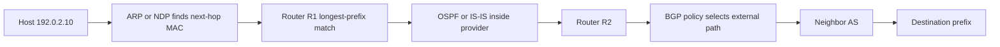

# Internetworking and IP Routing


*Figure: Network Address Translation (NAT) lets many private hosts share a public IP by rewriting source addresses and tracking port mappings — central to IPv4 longevity. Image: [Wikimedia Commons](https://commons.wikimedia.org/wiki/File:NAT_Concept-en.svg), Public-Domain.*


*Figure: IPv6 fixed header layout — simpler than IPv4 (no checksum, no fragmentation in middleboxes) with extension headers carrying optional features. Image: [Wikimedia Commons](https://commons.wikimedia.org/wiki/File:IPv6_header-en.svg), Public-Domain.*

Internetworking is the idea that many different local networks can be joined by a common packet layer. IP does not require every link to look the same. It requires each link to carry an IP datagram to the next hop, while routers make hop-by-hop forwarding decisions toward a destination prefix. This narrow waist is one of the central reasons the Internet scaled [1].

This page covers IPv4, IPv6, addressing, subnetting, CIDR, ARP, DHCP, ICMP, NAT, distance-vector routing, link-state routing, BGP, MPLS, and segment routing. Peterson-Davie divide basic and advanced internetworking across chapters; this page synthesizes them because addressing, forwarding, and routing are inseparable in operational networks.

## Definitions

An **IP datagram** is a network-layer packet carried independently through the internetwork. IPv4 is specified by RFC 791 [2]. IPv6 is specified by RFC 8200 [3]. IP offers a best-effort service: no delivery guarantee, no ordering guarantee, and no built-in retransmission.

An **IP address** identifies an interface or a set of interfaces, depending on unicast, multicast, or anycast use. An IPv4 address is 32 bits. An IPv6 address is 128 bits. A **prefix** is an address block written with slash notation, such as `192.0.2.0/24` or `2001:db8::/32`. A **subnet** is a prefix used as a local link or site segment. **CIDR** aggregates routes by variable-length prefixes rather than fixed classful networks.

**Longest-prefix match** is the forwarding rule used by IP routers: among matching prefixes, choose the route with the longest mask. A default route is `0.0.0.0/0` for IPv4 or `::/0` for IPv6.

**ARP** maps IPv4 addresses to link-layer MAC addresses on a LAN [4]. **NDP**, the IPv6 Neighbor Discovery Protocol, performs neighbor discovery, router discovery, and address-related functions using ICMPv6 [5]. **DHCP** assigns host configuration such as addresses, gateways, DNS servers, and lease times [6]. **ICMP** reports network-layer errors and diagnostic information.

**NAT** translates addresses and often ports at an administrative boundary. It conserves IPv4 addresses and hides internal topology, but it breaks the clean end-to-end addressing model and complicates inbound connections, peer-to-peer protocols, and some security protocols.

**Distance-vector routing** shares distances to destinations with neighbors; RIP is a classic example. **Link-state routing** floods link-state advertisements and lets each router compute shortest paths; OSPF and IS-IS are examples. **Path-vector routing** advertises paths plus policy attributes; BGP is the interdomain routing protocol of the Internet [7]. **MPLS** forwards packets using labels rather than only IP prefixes [8]. **Segment routing** encodes a path as a list of segments, often using MPLS labels or IPv6 segment routing headers.

## Key results

The first result is that IP forwarding is local and stateless with respect to flows. A router does not need to remember every connection; it examines the destination address, finds the best matching prefix, decrements TTL or hop limit, updates checksums where applicable, and forwards to the next hop. This design supports scale, although routers still maintain large forwarding tables and control-plane state.

The second result is that CIDR makes aggregation possible. Without aggregation, every router would need a route for every subnet. With aggregation, an ISP can announce a larger prefix that covers many customer networks. Aggregation is limited by topology, multihoming, traffic engineering, and policy. The global BGP table grows when organizations announce more-specific prefixes for reachability or policy reasons.

The third result is that IPv6 expands address space and simplifies some header behavior, but it does not remove routing complexity. IPv6 has fixed-length 128-bit addresses, extension headers, ICMPv6 dependence, stateless address autoconfiguration, and no IPv4-style header checksum [3]. Transition mechanisms include dual stack, tunneling, and translation. Dual stack is operationally simplest when both IPv4 and IPv6 connectivity are available.

The fourth result is the contrast between intra-domain and inter-domain routing. Within one administrative domain, the goal is usually shortest or policy-weighted paths under a common operator. Between domains, the goal is business policy: customer routes are preferred over peers, valley-free routing is common, and path attributes may matter more than metric distance. BGP's AS path is both loop-prevention mechanism and policy signal [7].

The fifth result is that distance-vector protocols are simple but vulnerable to count-to-infinity and slow convergence. Split horizon, poison reverse, hold-down timers, and bounded metrics mitigate but do not eliminate the issue. Link-state protocols converge by flooding topology and running Dijkstra's shortest-path algorithm, at the cost of more memory and CPU.

The sixth result is that MPLS and segment routing separate service paths from ordinary destination-based forwarding. MPLS labels can steer VPNs, traffic-engineered paths, and fast reroute. Segment routing reduces per-flow state in the network by placing ordered instructions in the packet or label stack. These tools are common in provider and data-center backbones even though the public Internet service remains IP.

A seventh result is that the control plane and forwarding plane have different failure modes. A router can keep forwarding packets using an existing forwarding information base while its routing process restarts, or it can have a healthy routing adjacency but install the wrong route because of policy. Operators therefore distinguish reachability, adjacency state, route selection, forwarding entries, ARP or NDP resolution, and actual packet delivery. Tools such as ping and traceroute test symptoms, not the whole routing system.

An eighth result is that address assignment is an operational protocol, not clerical bookkeeping. DHCP lease duration affects mobility and outage recovery. IPv6 router advertisements affect default-route selection and address formation. NAT port pools can be exhausted by many short-lived flows. Address summarization can reduce routing state, but only when topology and allocation align. Poor addressing plans create long-term costs because route filters, firewall rules, DNS records, monitoring, and documentation accumulate around them.

Finally, routing security is inseparable from routing correctness. Prefix filters, max-prefix limits, route dampening, RPKI validation, BGP communities, and monitoring systems are part of the practical routing design. The base protocols were designed for cooperation among administrative domains, but the modern Internet needs explicit defenses against leaks, hijacks, misconfiguration, and accidental route amplification.

The practical test of an IP design is whether it fails intelligibly. A good design makes it clear which router owns a prefix, which DHCP scope serves a link, where NAT state is created, which routing protocol installed a path, and which policy may discard traffic. That clarity is as important as the forwarding algorithm because most outages are repaired by humans using imperfect evidence.

## Visual



| Protocol | Scope | Information exchanged | Typical use |
|---|---|---|---|
| ARP | One IPv4 LAN | IP-to-MAC binding | Deliver to local next hop |
| DHCP | Access network | Host configuration leases | Address and option assignment |
| ICMP/ICMPv6 | Network layer | Errors and diagnostics | Ping, traceroute, PMTU signals |
| RIP | Small domain | Distance vectors | Simple legacy routing |
| OSPF | One administrative domain | Link-state database | Enterprise/provider IGP |
| IS-IS | One administrative domain | Link-state database | Provider IGP |
| BGP | Between autonomous systems | Prefix paths and attributes | Internet interdomain routing |
| MPLS | Provider/core | Labels and label bindings | VPNs, traffic engineering |

## Worked example 1: Subnetting and longest-prefix match

Problem: Split `192.0.2.0/24` into four equal subnets. Then choose the route for destination `192.0.2.130` from this table:

| Prefix | Next hop |
|---|---|
| `192.0.2.0/24` | R0 |
| `192.0.2.128/25` | R1 |
| `192.0.2.128/26` | R2 |
| `0.0.0.0/0` | R3 |

1. Four equal subnets require two extra subnet bits because $2^2 = 4$.

2. The new prefix length is:

$$
/24 + 2 = /26
$$

3. A `/26` has:

$$
2^{32-26} = 64\ \mathrm{addresses}
$$

4. The four subnets are:

| Subnet | Address range |
|---|---|
| `192.0.2.0/26` | `192.0.2.0` to `192.0.2.63` |
| `192.0.2.64/26` | `192.0.2.64` to `192.0.2.127` |
| `192.0.2.128/26` | `192.0.2.128` to `192.0.2.191` |
| `192.0.2.192/26` | `192.0.2.192` to `192.0.2.255` |

5. Destination `192.0.2.130` matches all of `192.0.2.0/24`, `192.0.2.128/25`, and `192.0.2.128/26`.

6. Longest-prefix match selects `/26`, so the router chooses next hop R2.

Answer: the equal subnets are the four `/26` blocks above, and `192.0.2.130` forwards to R2.

## Worked example 2: Dijkstra shortest paths for link-state routing

Problem: Router A receives this topology: A-B cost 2, A-C cost 5, B-C cost 1, B-D cost 2, C-D cost 3. Compute shortest paths from A.

1. Initialize distances:

| Node | Tentative distance | Previous |
|---|---:|---|
| A | 0 | - |
| B | infinity | - |
| C | infinity | - |
| D | infinity | - |

2. Visit A. Relax A-B and A-C:

| Node | Distance | Previous |
|---|---:|---|
| B | 2 | A |
| C | 5 | A |
| D | infinity | - |

3. Choose B, the smallest tentative node. Relax B-C and B-D:

$$
A \to B \to C = 2 + 1 = 3 < 5
$$

$$
A \to B \to D = 2 + 2 = 4
$$

4. Table becomes:

| Node | Distance | Previous |
|---|---:|---|
| C | 3 | B |
| D | 4 | B |

5. Choose C. Relax C-D:

$$
A \to B \to C \to D = 3 + 3 = 6 > 4
$$

No update.

6. Choose D. Done.

Answer: shortest path to B is A-B cost 2; to C is A-B-C cost 3; to D is A-B-D cost 4.

## Code

```python
import ipaddress

routes = [
    ("192.0.2.0/24", "R0"),
    ("192.0.2.128/25", "R1"),
    ("192.0.2.128/26", "R2"),
    ("0.0.0.0/0", "R3"),
]

def longest_prefix_match(destination, table):
    ip = ipaddress.ip_address(destination)
    candidates = []
    for prefix, next_hop in table:
        net = ipaddress.ip_network(prefix)
        if ip in net:
            candidates.append((net.prefixlen, next_hop, prefix))
    return max(candidates)

print(longest_prefix_match("192.0.2.130", routes))
for net in ipaddress.ip_network("192.0.2.0/24").subnets(new_prefix=26):
    print(net)
```

## Common pitfalls

- Treating IP addresses as host identities rather than interface or locator identifiers.
- Forgetting longest-prefix match and choosing the first route that matches.
- Mixing classful assumptions with CIDR. Prefix length, not old class A/B/C categories, controls the block.
- Counting usable IPv4 host addresses without considering network, broadcast, and point-to-point exceptions.
- Assuming NAT is a firewall. NAT may block unsolicited inbound flows as a side effect, but policy enforcement needs filtering.
- Blocking all ICMP and then breaking path MTU discovery, diagnostics, and IPv6 neighbor discovery.
- Treating ARP or NDP as secure. Both require local-link protections in hostile LANs.
- Believing IPv6 is just "IPv4 with longer addresses." Neighbor discovery, extension headers, address scope, and operational practices differ.
- Confusing an IGP metric with BGP preference. Interdomain routing follows policy, not simply shortest path.
- Forgetting that BGP route reflectors reduce session scale but add path-hiding and convergence considerations.
- Assuming MPLS encrypts traffic. Labels steer packets; encryption requires separate mechanisms.
- Announcing more-specific prefixes without understanding global table impact and route filtering.
- Ignoring reverse paths. Forward reachability does not guarantee return reachability.

## Connections

- [MAC and Local Area Networks](/cs/computer-networks/mac-and-local-area-networks) explains how IP packets reach the next hop on Ethernet and Wi-Fi.
- [Transport Layer: TCP and UDP](/cs/computer-networks/transport-layer-tcp-udp) depends on IP's best-effort datagram service.
- [Congestion Control and Queue Management](/cs/computer-networks/congestion-control-and-queue-management) explains how routing and queueing interact under load.
- [Modern Data Center Networks and SDN](/cs/computer-networks/modern-data-center-and-sdn) extends routing into ECMP fabrics, overlays, and programmable control planes.
- [Cryptography](/cs/cryptography/intro) supports IPsec, RPKI, DNSSEC, and secure routing control channels.
- [Distributed Systems](/cs/distributed-systems/intro) depends on addressing, routing failure modes, and partial connectivity assumptions.
- [Operating Systems](/cs/operating-systems/intro) implements routing tables, ARP caches, firewall hooks, and network namespaces.
- [Computer Architecture](/cs/computer-architecture/intro) matters for TCAM, forwarding ASICs, and route lookup performance.

## References

[1] L. L. Peterson and B. S. Davie, *Computer Networks: A Systems Approach*, supplied edition, chs. 3-4.

[2] J. Postel, Ed., "Internet Protocol," RFC 791, Sep. 1981.

[3] S. Deering and R. Hinden, "Internet Protocol, Version 6 (IPv6) Specification," RFC 8200, Jul. 2017.

[4] D. Plummer, "Ethernet Address Resolution Protocol," RFC 826, Nov. 1982.

[5] T. Narten, E. Nordmark, W. Simpson, and H. Soliman, "Neighbor Discovery for IP version 6," RFC 4861, Sep. 2007.

[6] R. Droms, "Dynamic Host Configuration Protocol," RFC 2131, Mar. 1997.

[7] Y. Rekhter, T. Li, and S. Hares, "A Border Gateway Protocol 4 (BGP-4)," RFC 4271, Jan. 2006.

[8] E. Rosen, A. Viswanathan, and R. Callon, "Multiprotocol Label Switching Architecture," RFC 3031, Jan. 2001.
