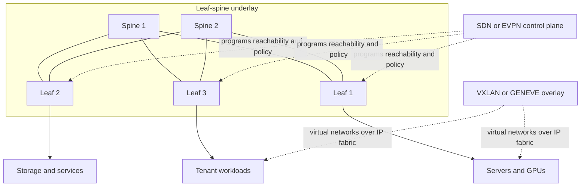

# Modern Data Center Networks and SDN

Modern data-center networks are built for dense east-west traffic, automation, and predictable failure handling. Peterson-Davie include cloud computing as a forward-looking thread, but many production patterns became central after the textbook era: leaf-spine Clos fabrics, overlays, SDN controllers, programmable data planes, service meshes, RDMA fabrics, SmartNICs, and AI cluster networking. This page is therefore a supplementary modern-context chapter grounded in the same systems approach [1].

The key shift is that a data center is not a small enterprise LAN. It is a warehouse-scale computer where the network connects storage, compute, accelerators, control planes, tenants, and services. Low tail latency, high bisection bandwidth, automation safety, and failure containment often matter more than raw link speed alone.

## Definitions

A **Clos network** is a multi-stage switching topology originally designed for telephony and now used for scalable packet fabrics. A **fat-tree** is a Clos-like topology with bandwidth increasing toward the root. A **leaf-spine** fabric is a two-stage Clos: servers attach to leaf switches, and every leaf connects to every spine. Traffic between servers under different leaves crosses leaf-spine-leaf.

**East-west traffic** moves between servers or services inside the data center. **North-south traffic** enters or leaves the data center. Modern microservice, storage, and machine-learning workloads often produce dominant east-west traffic.

**ECMP** is equal-cost multipath routing. If several next hops have equal routing cost, switches hash flows across them. This uses many parallel links without per-flow controller decisions. **Flowlet switching** and adaptive routing refine this idea when traffic bursts and congestion vary.

**Overlay networks** create virtual networks over an underlay IP fabric. **VXLAN** encapsulates Ethernet frames in UDP with a 24-bit virtual network identifier (VNI) [2]. **GENEVE** is a flexible network virtualization encapsulation designed for extensible metadata [3]. Overlays let tenants or applications keep virtual layer-2 segments while the physical network routes IP.

**SDN** is software-defined networking: separation of control-plane decisions from data-plane forwarding, often through a controller and programmable switches. **OpenFlow** is an early SDN protocol for installing match-action rules [4]. **P4** is a language for programming packet parsers and match-action pipelines [5].

**NFV** is network function virtualization: firewalls, load balancers, NATs, intrusion systems, and WAN optimizers run as software appliances or cloud services. A **service mesh** such as Envoy/Istio moves service-to-service policy, retries, telemetry, and mTLS into sidecars or node proxies.

**RDMA** allows one host to read or write another host's memory with low CPU involvement. **RoCE** carries RDMA over Converged Ethernet. **InfiniBand** is a high-performance interconnect common in HPC and AI clusters. **PFC** is priority flow control, an Ethernet mechanism that pauses selected traffic classes to approximate lossless behavior. **DPU/SmartNIC** devices offload packet processing, storage, security, and virtualization tasks.

## Key results

The first result is that leaf-spine fabrics provide predictable path length and scalable bandwidth. In a full two-tier leaf-spine, every leaf is one hop from every spine and two switching hops from every other leaf. Adding spines increases aggregate inter-leaf bandwidth. Adding leaves increases server capacity, but only within the port and oversubscription limits of the spine layer.

The second result is that oversubscription is an explicit design choice. If a leaf has 1.2 Tb/s of server-facing ports and 400 Gb/s of uplinks, its oversubscription ratio is 3:1. This may be acceptable for web front ends but harmful for storage, distributed databases, or GPU training traffic. AI clusters often target low or no oversubscription because collective communication can synchronize on the slowest path.

The third result is that ECMP works best when there are many independent flows. A hash usually maps each flow to one path to preserve packet order. A single huge flow may use only one path, while many smaller flows spread well. Transport protocols, flowlet switching, multipath TCP, QUIC connection behavior, and application sharding can all affect ECMP utilization.

The fourth result is that overlays separate tenant topology from physical topology. VXLAN lets virtual machines or containers appear on the same virtual segment while the underlay routes IP packets. The cost is encapsulation overhead, MTU planning, endpoint mapping, and troubleshooting across two layers of forwarding. Control planes such as EVPN distribute MAC, IP, and VNI reachability information.

The fifth result is that SDN centralizes intent but not physics. A controller can compute policy, push rules, and observe state. Packets still traverse finite buffers, links, ASIC tables, and failure domains. Robust SDN systems handle controller failure, stale rules, switch reboot, partial deployment, and telemetry lag. P4 and programmable NICs extend what the data plane can parse and count, but resource limits remain strict.

The sixth result is that lossless Ethernet is a tradeoff, not a free upgrade. RoCE benefits from low loss because RDMA transports are sensitive to drops. PFC can prevent drops by pausing priorities, but pause frames can spread congestion and cause head-of-line blocking or deadlock if misconfigured. ECN with DCTCP-style control, careful buffer thresholds, and traffic isolation are used to keep queues shallow for high-performance workloads.

A seventh result is that automation must be treated as a distributed system. A controller or configuration pipeline can change thousands of devices quickly, which is useful during normal operations and dangerous during mistakes. Safe systems stage changes, validate intent, check invariants, canary deployments, and keep rollback paths. The underlay, overlay, DNS, load balancers, firewalls, and service mesh must converge on compatible state, or packets disappear into a gap between control planes.

An eighth result is that observability is part of the architecture. Leaf-spine fabrics need interface counters, flow samples, queue depth, ECN marking rates, drop reasons, routing adjacency state, overlay endpoint state, and application latency. Programmable telemetry and in-band network telemetry can expose path and queue information, but they also consume pipeline resources and require careful sampling. Without observability, ECMP imbalance, incast, bad optics, MTU errors, and PFC storms look like random application slowness.

## Visual



| Design element | What it buys | What it costs |
|---|---|---|
| Leaf-spine Clos | Predictable paths and horizontal scale | More optics, cabling, and routing state |
| ECMP | Uses parallel equal-cost paths | Hash imbalance and single-flow limits |
| VXLAN/GENEVE | Tenant isolation and virtual topology | Encapsulation overhead and MTU complexity |
| SDN controller | Central policy and automation | Controller availability and stale-state risk |
| P4 data plane | Custom parsing and telemetry | Hardware pipeline constraints |
| Service mesh | Uniform L7 policy and mTLS | Proxy overhead and operational complexity |
| RoCE/PFC | Low-latency RDMA over Ethernet | Pause propagation and lossless tuning risk |
| DPU/SmartNIC | Offload and isolation | Debuggability and lifecycle complexity |

## Worked example 1: Leaf-spine oversubscription

Problem: A leaf switch has forty-eight 25 Gb/s server ports and four 100 Gb/s uplinks to spines. Compute the oversubscription ratio. Then compute the ratio if the design uses eight 100 Gb/s uplinks.

1. Compute downlink capacity:

$$
48 \times 25\ \mathrm{Gb/s} = 1200\ \mathrm{Gb/s}
$$

2. Compute uplink capacity with four uplinks:

$$
4 \times 100\ \mathrm{Gb/s} = 400\ \mathrm{Gb/s}
$$

3. Compute oversubscription:

$$
1200 / 400 = 3
$$

So the leaf is 3:1 oversubscribed.

4. With eight uplinks:

$$
8 \times 100\ \mathrm{Gb/s} = 800\ \mathrm{Gb/s}
$$

5. New oversubscription:

$$
1200 / 800 = 1.5
$$

Answer: four uplinks produce 3:1 oversubscription; eight uplinks produce 1.5:1. The right choice depends on workload. Web tiers may tolerate 3:1, while storage and AI training may need closer to 1:1.

## Worked example 2: VXLAN overhead and MTU

Problem: A VM sends a 1500-byte Ethernet frame into a VXLAN overlay over IPv4. Estimate the extra outer encapsulation overhead and the underlay MTU needed to avoid fragmentation. Ignore preamble and inter-frame gap.

1. VXLAN typically adds an outer Ethernet header, outer IP header, UDP header, and VXLAN header:

| Header | Bytes |
|---|---:|
| Outer Ethernet | 14 |
| Outer IPv4 | 20 |
| UDP | 8 |
| VXLAN | 8 |

2. Add overhead:

$$
14 + 20 + 8 + 8 = 50\ \mathrm{bytes}
$$

3. Add overhead to inner frame:

$$
1500 + 50 = 1550\ \mathrm{bytes}
$$

4. If the underlay MTU is only 1500 bytes, the encapsulated packet is too large. Fragmentation may occur or packets may be dropped depending on DF behavior and device policy.

5. Operators commonly configure a larger underlay MTU, often called jumbo or baby-jumbo depending on size, so the overlay can carry a normal tenant MTU.

Answer: the underlay needs at least about 1550 bytes, plus any extra tags or headers in the real environment. MTU mismatches are a common overlay failure mode.

## Code

```python
import hashlib
from collections import Counter

def ecmp_path(src, dst, sport, dport, spines):
    key = f"{src}-{dst}-{sport}-{dport}".encode()
    digest = hashlib.blake2s(key, digest_size=4).digest()
    value = int.from_bytes(digest, "big")
    return spines[value % len(spines)]

spines = ["spine1", "spine2", "spine3", "spine4"]
flows = [
    ("10.0.1.1", "10.0.9.9", 10_000 + i, 443)
    for i in range(10_000)
]
counts = Counter(ecmp_path(*flow, spines) for flow in flows)
for spine, count in sorted(counts.items()):
    print(spine, count)
```

## Common pitfalls

- Treating a data-center network like a large campus LAN. Failure, scale, and traffic patterns are different.
- Designing leaf-spine port counts without calculating oversubscription and failure capacity.
- Assuming ECMP perfectly balances bytes. It balances hashes, often by flow, not actual traffic volume.
- Letting a single elephant flow dominate one path while other paths are idle.
- Forgetting overlay MTU overhead and then debugging mysterious large-packet drops.
- Assuming VXLAN provides encryption. It provides encapsulation and segmentation; encryption is separate.
- Running a controller-centered design without planning controller failure, rollback, and partial deployment.
- Treating OpenFlow, SDN, and automation as synonyms. SDN is an architecture family; OpenFlow is one protocol.
- Adding service mesh proxies without measuring tail latency, memory, and connection count impact.
- Assuming PFC makes Ethernet safe for every workload. Pause can spread congestion and create deadlocks.
- Deploying RoCE without ECN, buffer thresholds, priority mapping, and congestion testing.
- Hiding too much in SmartNICs or DPUs without observability and upgrade procedures.
- Forgetting that east-west security needs identity and policy, not just perimeter firewalls.
- Optimizing for average latency while ignoring tail latency during link failures or incast.

## Connections

- [Internetworking and IP Routing](/cs/computer-networks/internetworking-and-ip-routing) provides ECMP, BGP, IS-IS, OSPF, MPLS, and segment-routing background.
- [MAC and Local Area Networks](/cs/computer-networks/mac-and-local-area-networks) explains why large data centers avoid relying on spanning-tree layer-2 domains.
- [Congestion Control and Queue Management](/cs/computer-networks/congestion-control-and-queue-management) connects ECN, DCTCP, PFC, shallow buffers, and bufferbloat.
- [Application Layer and Naming](/cs/computer-networks/application-layer-and-naming) links service mesh, gRPC, load balancing, DNS, and CDN design.
- [Network Security and TLS](/cs/computer-networks/network-security-and-tls) covers segmentation, mTLS, Zero Trust, and VPN policy for east-west traffic.
- [Cryptography](/cs/cryptography/intro) supplies mTLS, workload identity, signed control-plane messages, and secure bootstrapping.
- [Distributed Systems](/cs/distributed-systems/intro) explains microservices, consensus, storage replication, and failure domains that drive east-west traffic.
- [Operating Systems](/cs/operating-systems/intro) covers containers, virtual switches, eBPF, kernel bypass, and RDMA verbs.
- [Computer Architecture](/cs/computer-architecture/intro) connects GPUs, PCIe, NIC queues, DPUs, memory bandwidth, and accelerator clusters.

## References

[1] L. L. Peterson and B. S. Davie, *Computer Networks: A Systems Approach*, supplied edition, cloud and switching/routing discussions.

[2] M. Mahalingam et al., "Virtual eXtensible Local Area Network (VXLAN)," RFC 7348, Aug. 2014.

[3] J. Gross et al., "Geneve: Generic Network Virtualization Encapsulation," RFC 8926, Nov. 2020.

[4] N. McKeown et al., "OpenFlow: Enabling innovation in campus networks," *ACM SIGCOMM Computer Communication Review*, vol. 38, no. 2, pp. 69-74, 2008.

[5] P. Bosshart et al., "P4: Programming protocol-independent packet processors," *ACM SIGCOMM Computer Communication Review*, vol. 44, no. 3, pp. 87-95, 2014.

[6] M. Al-Fares, A. Loukissas, and A. Vahdat, "A scalable, commodity data center network architecture," in *Proc. ACM SIGCOMM*, 2008.

[7] M. Alizadeh et al., "Data center TCP (DCTCP)," in *Proc. ACM SIGCOMM*, 2010.

[8] C. Guo et al., "RDMA over commodity Ethernet at scale," in *Proc. ACM SIGCOMM*, 2016.
