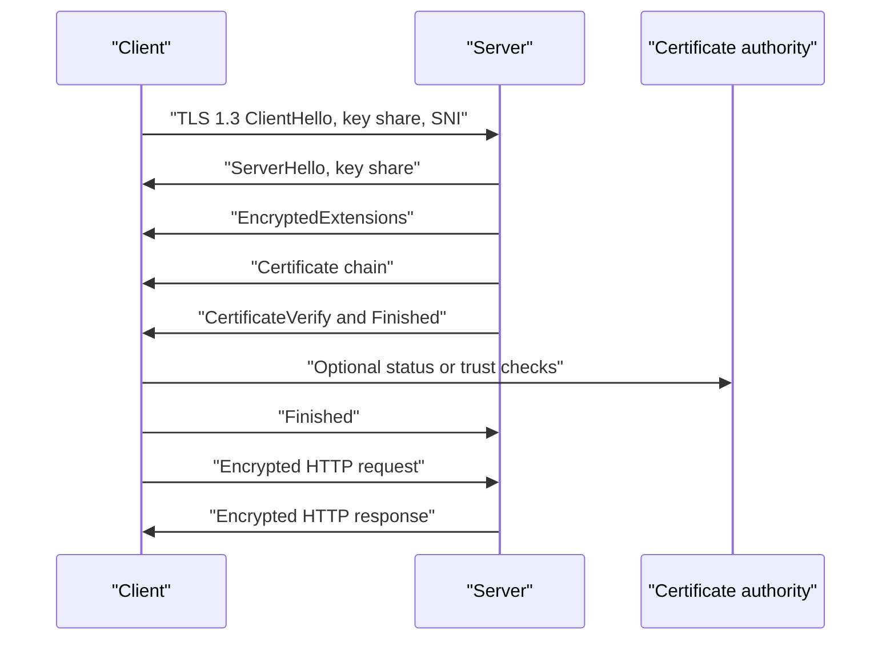

# Network Security and TLS

Network security starts from an uncomfortable assumption: packets cross machines, links, operators, software stacks, and administrative domains that may be buggy, compromised, curious, or malicious. Peterson-Davie introduce cryptographic building blocks, authentication, TLS, IPsec, SSH, and firewalls as system components, not as decorative add-ons [1].

This page covers network threat models, symmetric and public-key cryptography, AEAD, TLS 1.2, TLS 1.3, PKI, certificates, OCSP, IPsec, IKEv2, WireGuard, VPNs, firewalls, IDS/IPS, Zero Trust, DDoS mitigation, BGP hijacking, and RPKI. It cross-links naturally to [Cryptography](/cs/cryptography/intro), but the emphasis here is protocol placement and operational failure modes.

## Definitions

An **eavesdropper** reads traffic. A **spoofing attacker** sends packets with forged addresses or identities. A **man-in-the-middle (MITM)** intercepts and modifies communication while impersonating each side to the other. A **denial-of-service (DoS)** attacker exhausts a resource. A **distributed denial-of-service (DDoS)** attack uses many sources to overwhelm capacity or state.

**Symmetric cryptography** uses the same secret key for encryption and decryption or for message authentication. **Public-key cryptography** uses a public key and private key for encryption, signatures, or key agreement. **Diffie-Hellman** lets parties derive a shared secret over an insecure channel. **Forward secrecy** means compromise of a long-term key does not reveal old session keys.

**AEAD** means authenticated encryption with associated data. It provides confidentiality and integrity for ciphertext while authenticating unencrypted metadata. Examples include AES-GCM and ChaCha20-Poly1305. AEAD requires nonce uniqueness under the same key; nonce reuse can be catastrophic.

**TLS** secures application streams, most visibly HTTPS. TLS 1.2 supports several handshake and cipher-suite patterns [2]. TLS 1.3 removes many legacy choices, encrypts more handshake metadata, uses ephemeral key agreement by default, and reduces handshake latency [3]. **PKI** is the public-key infrastructure of certificate authorities, certificates, validation rules, and revocation mechanisms. **OCSP** is the Online Certificate Status Protocol for checking certificate status [4].

**IPsec** secures IP packets using AH or ESP and is commonly negotiated by IKEv2 [5]. **WireGuard** is a modern VPN protocol with a small design, static public keys, and Noise-based handshakes [6]. **Firewalls** enforce traffic policy. **IDS/IPS** systems detect or block suspicious traffic. **Zero Trust** is an architecture principle that treats network location as insufficient proof of trust.

**RPKI** is Resource Public Key Infrastructure, used to authorize which autonomous systems may originate IP prefixes. Route origin validation can reduce accidental leaks and some BGP hijacks [7].

## Key results

The first result is that security properties must be named precisely. Encryption without authentication permits active modification. Authentication without freshness permits replay. Integrity without authorization still lets a valid but unauthorized principal act. Network protocols should define confidentiality, integrity, endpoint authentication, replay protection, downgrade protection, and denial-of-service assumptions separately.

The second result is that TLS 1.3 is not merely a stronger TLS 1.2 cipher list. TLS 1.3 redesigns the handshake around ephemeral Diffie-Hellman, removes static RSA key exchange, removes many obsolete algorithms, encrypts most handshake messages after ServerHello, and supports 1-RTT handshakes with optional 0-RTT resumption. The 0-RTT mode improves latency but does not provide replay protection by itself, so applications must restrict it to replay-safe operations [3].

The third result is that certificate validation is path validation plus name validation plus time and policy checks. A client verifies signatures from the leaf certificate through intermediates to a trusted root, checks validity intervals, key usage and extended key usage, certificate transparency or platform policy where required, revocation signals where used, and hostname match against Subject Alternative Name entries.

The fourth result is that VPN placement changes what is protected. TLS protects application data between endpoints such as browser and origin or edge. IPsec tunnel mode protects IP packets between gateways or hosts. WireGuard creates encrypted network interfaces and routes selected prefixes through peers. A VPN does not automatically secure compromised endpoints, malicious applications, or traffic after it exits the tunnel.

The fifth result is that firewalls are necessary but incomplete. They reduce exposed attack surface and enforce segmentation. They cannot prove application correctness, stop attacks over allowed ports by themselves, or replace identity-aware authorization. Zero Trust designs combine device posture, user identity, service identity, least privilege, continuous evaluation, and encrypted transport.

The sixth result is that routing security is part of network security. A BGP hijack can redirect or blackhole traffic before TLS even begins. TLS can detect many MITM attempts when certificates fail, but traffic interception can still cause outages, downgrade attempts, or metadata exposure. RPKI route origin validation helps reject unauthorized origin announcements, though it does not solve every path manipulation problem.

A seventh result is that security protocols need downgrade resistance. If a client and server support several versions or cipher suites, an active attacker may try to force both sides onto the weakest mutually accepted option. Modern TLS handshakes authenticate the negotiated parameters as part of the transcript, and TLS 1.3 includes compatibility mechanisms designed to prevent silent rollback. Operators still need to disable obsolete protocol versions and monitor unexpected negotiation patterns.

An eighth result is that metadata is difficult to hide. TLS protects application bytes, but observers may still see IP addresses, packet sizes, timing, DNS queries unless encrypted, and sometimes server names depending on deployment. VPNs hide traffic from the local network but reveal aggregate traffic to the VPN endpoint. Privacy-sensitive systems therefore combine encryption with traffic analysis resistance, careful DNS choices, padding where useful, and minimization of exposed identifiers.

Finally, key management is often the real system. Strong algorithms fail when private keys are copied widely, certificates expire unnoticed, random number generators are weak, secrets are logged, or emergency rotation is untested. Production security depends on inventory, automation, hardware-backed storage where appropriate, short-lived credentials, revocation plans, and clear ownership.

Security monitoring closes the loop. Logs from certificate issuance, TLS termination, VPN peers, firewall decisions, DNS changes, route announcements, and identity providers let operators distinguish attack, outage, and misconfiguration. Without that evidence, even a well-designed protocol stack is difficult to defend in production.

## Visual



| Threat | Example | Primary controls | Residual concern |
|---|---|---|---|
| Eavesdropping | Passive Wi-Fi sniffing | TLS, VPN, WPA, SSH | Metadata remains visible |
| Spoofing | Forged source packets | Ingress filtering, authentication | Reflection attacks still exist |
| MITM | Rogue proxy or DNS attack | TLS validation, HSTS, DNSSEC where used | User-installed roots can alter trust |
| DoS/DDoS | SYN flood, UDP flood | Scrubbing, rate limits, SYN cookies | Capacity can still be exhausted |
| Route hijack | False BGP origin | RPKI ROV, monitoring | Path attacks beyond origin remain hard |
| Lateral movement | Compromised internal host | Segmentation, Zero Trust, least privilege | Identity systems become critical |

## Worked example 1: TLS 1.3 handshake flight count

Problem: A client connects to a server for the first time using TLS 1.3 over TCP. Count the network round trips before encrypted application data can be sent, ignoring DNS and TCP Fast Open.

1. TCP requires a three-way handshake:

```text
Client -> Server: SYN
Server -> Client: SYN-ACK
Client -> Server: ACK
```

After one RTT, TCP is established. The client's final ACK may carry the TLS ClientHello in some stacks, but count the conventional sequence separately for clarity.

2. TLS 1.3 full handshake begins with:

```text
Client -> Server: ClientHello with key share
```

3. Server responds:

```text
Server -> Client: ServerHello, encrypted handshake messages, certificate, Finished
```

4. Client verifies the certificate chain, signature, transcript, and Finished message, then sends:

```text
Client -> Server: Finished
```

5. At this point both sides have application traffic keys. The client can send encrypted application data with or after its Finished.

Answer: first contact usually costs one TCP RTT plus one TLS 1.3 RTT before normal encrypted application data, so about two RTTs before the first protected request if DNS is already done. QUIC combines transport and TLS handshakes, reducing this layering cost.

## Worked example 2: Certificate chain validation

Problem: A browser connects to `www.example.com` and receives a leaf certificate, one intermediate certificate, and a root name. Outline the validation checks.

1. Build a candidate chain:

```text
Leaf: www.example.com
Intermediate: Example Issuing CA
Root: Trusted Root CA in local trust store
```

2. Verify the leaf signature using the intermediate public key.

3. Verify the intermediate signature using the trusted root public key. The root is trusted because it is already in the operating system or browser trust store, not because the server sent it.

4. Check time validity:

```text
notBefore <= current time <= notAfter
```

5. Check name binding. The hostname `www.example.com` must match a DNS Subject Alternative Name in the leaf certificate. Common Name fallback is obsolete in modern validation.

6. Check key usage and extended key usage. The leaf should be valid for server authentication.

7. Check policy signals used by the client, such as revocation status, OCSP stapling, certificate transparency requirements, and algorithm restrictions.

Answer: the connection is authenticated only if the chain signatures, trust anchor, time, hostname, key usage, and relevant policy checks all pass. A valid signature alone is not enough.

## Code

```python
import socket
import ssl

def tls_summary(hostname, port=443):
    ctx = ssl.create_default_context()
    with socket.create_connection((hostname, port), timeout=5) as raw:
        with ctx.wrap_socket(raw, server_hostname=hostname) as tls:
            cert = tls.getpeercert()
            return {
                "version": tls.version(),
                "cipher": tls.cipher(),
                "subject": cert.get("subject"),
                "issuer": cert.get("issuer"),
                "notAfter": cert.get("notAfter"),
            }

for key, value in tls_summary("example.com").items():
    print(key, value)
```

## Common pitfalls

- Saying "encrypted" when the protocol also needs authentication and integrity.
- Reusing AEAD nonces with the same key. This can destroy confidentiality and integrity.
- Treating a certificate as trustworthy just because it is syntactically valid.
- Forgetting hostname validation. A certificate for another name should not authenticate this server.
- Ignoring clock correctness. Certificate validation depends on time.
- Assuming TLS protects DNS, IP addresses, packet timing, or SNI in all deployments.
- Enabling TLS 1.2 legacy cipher suites without understanding downgrade and compatibility risk.
- Using TLS 1.3 0-RTT for non-idempotent operations without replay defenses.
- Treating VPNs as endpoint security. VPNs protect tunnels, not compromised hosts.
- Assuming a firewall on the perimeter is enough for internal services.
- Blocking ICMP or PMTU signals in ways that break secure transports.
- Treating IDS alerts as proof of compromise without context and packet capture.
- Assuming RPKI prevents all BGP attacks. It mainly validates route origin authorization.
- Forgetting DDoS economics. The defense needs capacity, filtering, and operational playbooks.

## Connections

- [Application Layer and Naming](/cs/computer-networks/application-layer-and-naming) covers HTTPS, DNS, DoH, CDNs, and application-level authentication choices.
- [Transport Layer: TCP and UDP](/cs/computer-networks/transport-layer-tcp-udp) explains TLS over TCP and QUIC over UDP.
- [Internetworking and IP Routing](/cs/computer-networks/internetworking-and-ip-routing) provides IPsec, BGP, and routing context for hijack defenses.
- [Modern Data Center Networks and SDN](/cs/computer-networks/modern-data-center-and-sdn) connects segmentation, service mesh mTLS, and programmable policy.
- [Cryptography](/cs/cryptography/intro) gives the mathematical details of AEAD, signatures, key exchange, and hash functions.
- [Distributed Systems](/cs/distributed-systems/intro) relies on identity, secure channels, secret distribution, and authorization.
- [Operating Systems](/cs/operating-systems/intro) covers kernel packet filters, process isolation, key storage, and TLS libraries.
- [Computer Architecture](/cs/computer-architecture/intro) affects AES acceleration, random number generation, trusted execution, and NIC offload.

## References

[1] L. L. Peterson and B. S. Davie, *Computer Networks: A Systems Approach*, supplied edition, ch. 8.

[2] T. Dierks and E. Rescorla, "The Transport Layer Security (TLS) Protocol Version 1.2," RFC 5246, Aug. 2008.

[3] E. Rescorla, "The Transport Layer Security (TLS) Protocol Version 1.3," RFC 8446, Aug. 2018.

[4] S. Santesson, M. Myers, R. Ankney, A. Malpani, S. Galperin, and C. Adams, "X.509 Internet Public Key Infrastructure Online Certificate Status Protocol - OCSP," RFC 6960, Jun. 2013.

[5] C. Kaufman, P. Hoffman, Y. Nir, P. Eronen, and T. Kivinen, "Internet Key Exchange Protocol Version 2 (IKEv2)," RFC 7296, Oct. 2014.

[6] J. A. Donenfeld, "WireGuard: Next Generation Kernel Network Tunnel," in *Proc. NDSS*, 2017.

[7] M. Lepinski and S. Kent, "An Infrastructure to Support Secure Internet Routing," RFC 6480, Feb. 2012.

[8] P. Ferguson and D. Senie, "Network Ingress Filtering," RFC 2827, May 2000.
