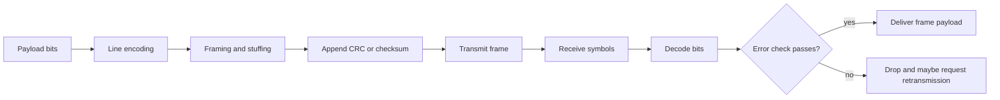

# Physical and Data Link Layer

The physical and data link layers turn a raw medium into a usable local communication service. The physical side decides how bits are represented as voltage, light, or radio symbols. The data link side decides where frames start and end, how receivers detect damaged frames, and when a sender should retransmit. Peterson-Davie present these mechanisms early because every higher protocol quietly depends on them [1].

This page focuses on the common design pattern: encode bits so the receiver can recover clock and data, frame a byte or bit stream into packets, detect errors with redundancy, and optionally recover from loss with automatic repeat request (ARQ). These ideas reappear in Ethernet, Wi-Fi, PPP, TCP, QUIC, storage protocols, and distributed log replication.

## Definitions

**Encoding** maps data bits to physical signals. **NRZ** sends one signal level for 1 and another for 0, but long runs make clock recovery hard. **NRZI** changes level for a 1 and keeps the level for a 0, which helps when transitions are frequent. **Manchester encoding** places a transition in every bit period, improving clock recovery at the cost of bandwidth efficiency. **4B/5B** maps each 4-bit nibble to a 5-bit code with enough transitions and reserved control symbols.

**Framing** marks the boundaries of a message. Byte-oriented protocols may use sentinel bytes and byte stuffing, as PPP does with flag byte `0x7e` [2]. Bit-oriented protocols such as HDLC use bit flags and bit stuffing. Length-based framing puts a length in the header. Clock-based framing, such as SONET/SDH, uses a repeating synchronous frame structure.

An **error-detecting code** adds redundant bits so the receiver can detect likely corruption. A **parity bit** detects any odd number of bit flips in a protected word. **Two-dimensional parity** arranges bits in rows and columns to detect more patterns and locate many single-bit errors. The **Internet checksum** adds 16-bit words using one's-complement arithmetic [3]. A **cyclic redundancy check (CRC)** treats a bit string as a polynomial over $GF(2)$ and divides by a generator polynomial; the remainder is appended to the frame.

**ARQ** is automatic repeat request: a sender retransmits data that is not acknowledged. **Stop-and-wait** allows one outstanding frame. **Sliding window** allows multiple outstanding frames. **Go-Back-N** retransmits from the first missing frame onward. **Selective Repeat** retransmits only the missing frames, requiring a receiver buffer and enough sequence number space.

## Key results

The first result is that clock recovery is a protocol problem, not just an electrical problem. If the receiver samples at the wrong instant, perfectly transmitted voltage levels become wrong bits. Encodings such as Manchester or 4B/5B spend extra signal changes to keep sender and receiver synchronized.

The second result is that transparent framing needs an escape rule. If a sentinel byte marks frame boundaries, that same byte may appear inside the payload. Byte stuffing solves this by inserting an escape byte before data bytes that would otherwise be misread as control bytes. At the receiver, the escape is removed. Bit stuffing is the same idea at bit granularity: after five consecutive 1 bits in HDLC-style framing, the sender inserts a 0 so the flag pattern cannot appear accidentally [1].

The third result is that CRCs detect burst errors much better than simple checksums for link frames. With generator $G(x)$ of degree $r$, the sender appends $r$ check bits so the transmitted polynomial is divisible by $G(x)$. The receiver divides the whole received frame by $G(x)$. A nonzero remainder indicates an error. Good generator polynomials detect all single-bit errors, many multi-bit errors, and all burst errors shorter than or equal to $r$ bits under standard assumptions.

The fourth result is the stop-and-wait utilization bound. If the sender transmits a frame of $L$ bits at rate $R$ over RTT $T$, and acknowledgments are small, maximum utilization is approximately:

$$
U_{\mathrm{stop-wait}} \approx \frac{L/R}{T + L/R}
$$

On long-delay paths this is terrible. Sliding windows improve utilization by keeping multiple frames in flight. To fill a path, the sender window in bits must be at least the BDP.

The fifth result is the sequence number rule for Selective Repeat. If the sequence number space has size $S$, the sender and receiver windows should be no larger than $S/2$. Otherwise, an old delayed frame can be confused with a new frame after sequence numbers wrap.

The sixth result is that link reliability and end-to-end reliability solve different problems. Link ARQ can hide local wireless or copper errors from IP and improve throughput. It cannot prove that an application transaction completed correctly after routing changes, host crashes, NAT timeouts, or storage errors. This is the end-to-end argument in a concrete link-layer setting.

A seventh result is that framing choices influence recovery after corruption. Length-based framing is compact, but a corrupted length field can make the receiver skip too far or too little unless the protocol has an outer check, a maximum frame size, or a resynchronization marker. Sentinel-based framing spends escape bytes but gives the receiver a recognizable boundary to search for after an error. Synchronous systems such as SONET spend fixed overhead continuously so receivers can lock onto a repeated structure. These tradeoffs matter whenever data is streamed from a serial source, including UARTs, tunnels, storage links, and packet capture formats.

An eighth result is that error detection should match the fault model. Independent random bit errors, burst errors from noise, dropped frames from buffer pressure, and adversarial modification require different tools. CRCs are excellent for accidental link corruption, but they are linear and unauthenticated. A malicious sender can deliberately alter data and recompute the CRC. That is why secure transports and VPNs use MACs or AEAD constructions from cryptography rather than relying on frame check sequences.

Finally, ARQ changes latency as well as reliability. A single local retransmission may hide a wireless loss and improve TCP throughput. Many link retries in a row can create a sudden delay spike that arrives at the transport as jitter. Real systems therefore tune retry limits, aggregation, interleaving, and rate adaptation according to whether the traffic is bulk data, voice, control, or interactive video.

These mechanisms also influence hardware design. A NIC, modem, or radio often performs encoding, CRC verification, frame filtering, and retransmission assistance before the host CPU sees the packet. Offload improves throughput and power use, but it can hide details from packet captures taken above the device. When debugging link problems, it matters whether the observation point is on the wire, in the driver, after checksum offload, or inside the application.

## Visual



| Mechanism | Main purpose | Strength | Weakness |
|---|---|---|---|
| NRZ | Simple bit representation | Efficient and cheap | Long runs hurt clock recovery |
| Manchester | Clock recovery | Transition every bit | Uses more signal bandwidth |
| 4B/5B | Transition density plus controls | Good for block coding | 25 percent coding overhead |
| Sentinel framing | Boundary marking | Simple parsing | Needs escaping or stuffing |
| Length framing | Boundary marking | Efficient for binary data | Corrupt length can desynchronize |
| CRC | Error detection | Strong burst detection | Detection only, not correction |
| Sliding window ARQ | Reliability and utilization | Keeps pipe full | Needs sequence numbers and buffers |

## Worked example 1: CRC remainder by polynomial division

Problem: Compute the CRC for data `1011` using generator `1101`. The generator has degree 3, so the CRC has 3 bits.

1. Append three zeros to the data:

```text
data:       1011
augmented: 1011000
generator: 1101
```

2. Divide using XOR subtraction. Start at the leftmost 1:

```text
1011000
1101
----
0110000
```

3. Shift to the next 1 and XOR again:

```text
11000
1101
----
00100
```

4. The final three bits are the remainder:

```text
remainder = 100
```

5. Append the remainder to the original data:

```text
transmitted codeword = 1011 100
```

6. Check: dividing `1011100` by `1101` gives remainder `000`, so the receiver accepts the frame if no detected error occurred.

Answer: the CRC bits are `100`, and the transmitted bit string is `1011100`.

## Worked example 2: Sliding window size on a long link

Problem: A 50 Mb/s link has RTT 40 ms. Frames carry 1000 bytes of payload. How many frames must a sliding-window sender keep in flight to fully utilize the link, ignoring headers and ACK transmission time?

1. Compute BDP:

$$
50 \times 10^6\ \mathrm{bits/s} \times 0.040\ \mathrm{s}
= 2{,}000{,}000\ \mathrm{bits}
$$

2. Convert one frame payload to bits:

$$
1000\ \mathrm{bytes} \times 8 = 8000\ \mathrm{bits}
$$

3. Divide BDP by frame size:

$$
2{,}000{,}000 / 8000 = 250\ \mathrm{frames}
$$

4. Interpret the result. A stop-and-wait sender has only one frame in flight, so its utilization is roughly $1/250 = 0.4$ percent before overhead. A sliding window of at least 250 frames is needed to keep the link busy.

Answer: the sender window must be at least 250 frames. In practice it should be larger enough to absorb ACK compression, timer granularity, and implementation overhead.

## Code

```python
def crc_remainder(data: str, generator: str) -> str:
    r = len(generator) - 1
    work = [int(bit) for bit in data] + [0] * r
    gen = [int(bit) for bit in generator]
    for i in range(len(data)):
        if work[i] == 1:
            for j, bit in enumerate(gen):
                work[i + j] ^= bit
    return "".join(str(bit) for bit in work[-r:])

def internet_checksum(words):
    total = 0
    for word in words:
        total += word
        total = (total & 0xFFFF) + (total >> 16)
    return (~total) & 0xFFFF

print(crc_remainder("1011", "1101"))
print(hex(internet_checksum([0x4500, 0x003c, 0x1c46, 0x4000])))
```

## Common pitfalls

- Thinking physical encoding and character encoding are the same thing. Line codes represent bits on media; UTF-8 represents text as bytes.
- Forgetting that a receiver needs timing information, not only signal levels.
- Using sentinel framing without specifying how the sentinel is escaped inside payload data.
- Trusting a length field without a resynchronization strategy after corruption.
- Treating parity as strong protection. A simple parity bit misses any even number of flipped bits.
- Confusing checksums with cryptographic hashes. CRCs and Internet checksums are not authentication mechanisms.
- Appending too few zeros before CRC division. The number of zeros must equal the generator degree.
- Performing CRC subtraction with decimal arithmetic instead of XOR over $GF(2)$.
- Assuming a link-layer ACK means the application received the data. It only means a neighboring link peer did.
- Choosing a sliding window without checking BDP. Small windows waste high-delay links.
- Making Selective Repeat windows too large for the sequence number space.
- Ignoring ACK loss. Data and acknowledgments both need sequence/timer logic in real protocols.
- Letting link-layer retransmission hide congestion for too long. Excessive local retry can create latency spikes for upper layers.

## Connections

- [Foundations and Layered Architecture](/cs/computer-networks/foundations-and-layered-architecture) explains how link functions fit into layered design.
- [MAC and Local Area Networks](/cs/computer-networks/mac-and-local-area-networks) builds shared-medium access, Ethernet, switching, Wi-Fi, and VLANs on top of framing.
- [Transport Layer: TCP and UDP](/cs/computer-networks/transport-layer-tcp-udp) reuses sliding-window ideas at end-to-end scope.
- [Congestion Control and Queue Management](/cs/computer-networks/congestion-control-and-queue-management) explains why retransmission must be separated from congestion response.
- [Cryptography](/cs/cryptography/intro) contrasts error detection with authentication and integrity.
- [Distributed Systems](/cs/distributed-systems/intro) uses checksums, framing, and retransmission inside RPC and replication logs.
- [Operating Systems](/cs/operating-systems/intro) covers device drivers, interrupts, DMA rings, and kernel buffer management.
- [Computer Architecture](/cs/computer-architecture/intro) connects signal representation to buses, memory bandwidth, and NIC offload.

## References

[1] L. L. Peterson and B. S. Davie, *Computer Networks: A Systems Approach*, supplied edition, ch. 2.

[2] W. Simpson, Ed., "The Point-to-Point Protocol (PPP)," RFC 1661, Jul. 1994.

[3] R. Braden, D. Borman, and C. Partridge, "Computing the Internet Checksum," RFC 1071, Sep. 1988.

[4] ISO/IEC, "High-level data link control (HDLC) procedures," ISO/IEC 13239.

[5] IEEE, "IEEE Standard for Ethernet," IEEE Std 802.3.

[6] A. Tanenbaum and D. Wetherall, *Computer Networks*, 5th ed., Pearson, 2011, data link layer sections.
