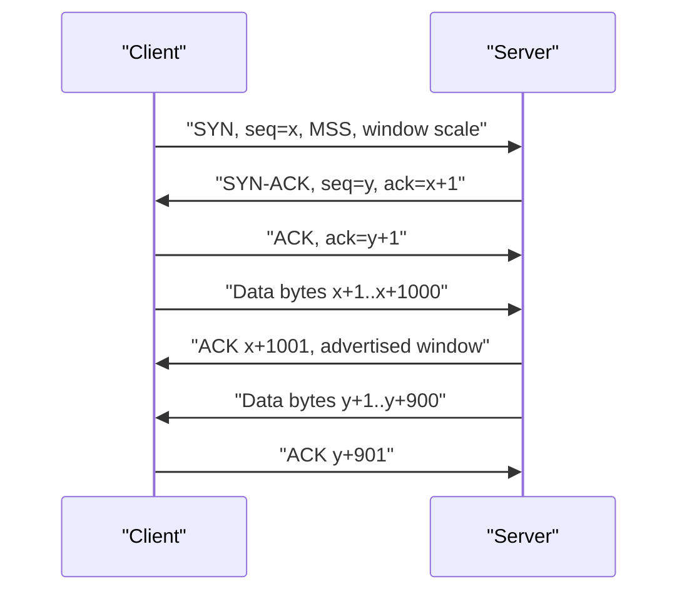

# Transport Layer: TCP and UDP


*Figure: Wireshark is the canonical tool for inspecting TCP/UDP traffic at the byte level — useful for debugging sliding windows, handshakes, retransmissions, and RST behavior. Image: [Wikimedia Commons](https://commons.wikimedia.org/wiki/File:Wireshark_screenshot.png), Wireshark Foundation, GPL.*

The transport layer is where host-to-host packet delivery becomes process-to-process communication. UDP gives applications a minimal datagram interface. TCP builds a reliable ordered byte stream over IP's unreliable datagrams. Peterson-Davie emphasize that transport protocols are end-to-end protocols: they run primarily in hosts, not routers, and they must tolerate loss, reordering, duplication, delay variation, and changing paths [1].

This page covers UDP, TCP connection management, sequence and acknowledgment numbers, sliding-window flow control, retransmission, TCP variants, PMTU and MSS, and QUIC. Congestion control is introduced here but developed more fully in [Congestion Control and Queue Management](/cs/computer-networks/congestion-control-and-queue-management).

## Definitions

**UDP** is the User Datagram Protocol [2]. It adds source port, destination port, length, and checksum around application data. UDP preserves message boundaries, does not establish a connection, and does not provide retransmission, ordering, congestion control, or flow control by itself. DNS, DHCP, RTP, gaming protocols, telemetry, and QUIC commonly use UDP when applications need control over timing or reliability.

**TCP** is the Transmission Control Protocol [3]. It provides a reliable, ordered, full-duplex byte stream between two sockets identified by source IP, source port, destination IP, destination port, and protocol. TCP uses sequence numbers for bytes, acknowledgments for received data, retransmission timers, cumulative ACKs, optional selective acknowledgments, receive windows for flow control, and congestion windows for network stability.

A **three-way handshake** establishes a TCP connection: client sends SYN with initial sequence number (ISN), server replies SYN-ACK with its ISN and acknowledgment, and client sends ACK. The handshake proves both directions work and synchronizes sequence spaces. Connection teardown commonly uses FIN and ACK in each direction, though RST aborts a connection.

**Flow control** protects the receiver by limiting how much unacknowledged data the sender may place in flight according to the advertised receive window. **Congestion control** protects the network by limiting in-flight data according to inferred or explicit congestion. The actual send window is roughly:

$$
\min(\mathrm{receive\ window}, \mathrm{congestion\ window})
$$

**MSS** is maximum segment size, the largest TCP payload normally sent in one segment. **PMTU discovery** tries to find the largest IP packet size that can cross the path without fragmentation. **TCP options** include MSS, window scale, timestamps, SACK permitted, and selective acknowledgment blocks.

**QUIC** is a transport protocol running over UDP with integrated TLS 1.3, stream multiplexing, connection migration, packet number spaces, loss recovery, and optional 0-RTT data [4]. HTTP/3 runs over QUIC [5].

## Key results

The first result is that UDP is not "unreliable TCP"; it is a minimal transport substrate. For DNS queries, one request and one response may be enough, with application-level retry on timeout. For real-time media, retransmitting old audio may be worse than skipping it. For QUIC, UDP is a deployable envelope that passes through NATs and middleboxes while QUIC implements modern transport features in user space.

The second result is that TCP sequence numbers count bytes, not packets. If a TCP segment carries 1000 bytes beginning at sequence number 1001, the next expected byte is 2001. SYN and FIN each consume one sequence number even when they carry no application data. This byte-oriented model lets TCP split, coalesce, retransmit, or reorder segments without changing the application stream.

The third result is that cumulative ACKs are simple but ambiguous under loss. If the receiver ACKs 5001 repeatedly, the sender knows all bytes before 5001 arrived, but not which later out-of-order bytes may have arrived. Selective acknowledgment (SACK) adds blocks describing out-of-order data, allowing the sender to retransmit missing ranges rather than guessing [6].

The fourth result is that retransmission timeout must adapt to measured RTT. A fixed timeout is either too aggressive on long paths or too slow on short paths. TCP estimates smoothed RTT and variation, then sets RTO conservatively. Karn's algorithm avoids using RTT samples from retransmitted data when ambiguity exists.

The fifth result is that TCP variants differ mainly in congestion control, not in the reliable byte-stream abstraction. Reno and NewReno use loss as congestion signal and AIMD-style growth. SACK improves loss recovery. CUBIC changes window growth to perform better on high-BDP networks and is widely deployed [7]. BBR estimates bottleneck bandwidth and RTT, pacing traffic to operate near a model of the path [8].

The sixth result is that QUIC fixes several transport deployment problems. Because it encrypts most transport metadata, middleboxes cannot ossify as easily around internal fields. Because streams are multiplexed above UDP but below HTTP semantics, loss on one stream does not create TCP-level head-of-line blocking for other streams. Because connection IDs are not tied to a 4-tuple, a mobile client can migrate across networks.

A seventh result is that transport protocols define backpressure boundaries. TCP receive windows tell the sender how much buffer space remains at the receiver, but applications still need to read from sockets promptly. If a server stops reading, the receive buffer fills, the advertised window shrinks, and the sender eventually stalls. This is useful backpressure. It becomes a bug when application code accidentally blocks an event loop, forgets to drain a stream, or buffers unbounded responses in memory.

An eighth result is that transport APIs expose less than transport protocols know. A socket may report a timeout, reset, or end-of-file, but it cannot always tell whether a remote application processed a request before the failure. That ambiguity is why RPC systems add request IDs, deadlines, cancellation, idempotency tokens, and retry budgets above TCP or QUIC. The transport can deliver bytes reliably; it cannot define business-level success.

Finally, middleboxes strongly shape deployability. TCP options, new congestion-control behavior, UDP flows, and unusual packet sizes may encounter NATs, firewalls, proxies, and load balancers. QUIC's design reflects this history: it uses UDP for reachability, encrypts most internals to reduce ossification, and includes version negotiation so the protocol can evolve without every router understanding it.

Transport design also interacts with server architecture. A thread-per-connection server, an event-loop server, and a kernel-bypass dataplane may expose the same TCP service while behaving differently under many idle connections, slow readers, or bursty writes. The protocol defines the bytes on the wire; the implementation determines buffer pressure, scheduling delay, accept-queue overflow, and how quickly backpressure reaches the application.

## Visual



| Feature | UDP | TCP | QUIC |
|---|---|---|---|
| Service model | Datagram | Reliable byte stream | Reliable streams plus datagrams extension |
| Handshake | None | TCP three-way | QUIC plus TLS 1.3 |
| Encryption | External | External via TLS | Built in |
| Stream multiplexing | Application-defined | One byte stream | Multiple streams |
| Head-of-line blocking | Application-dependent | Yes within connection | Per stream, not across streams |
| Connection migration | Application-defined | Difficult | Designed with connection IDs |
| Congestion control | Application-defined | Required | Required |

## Worked example 1: TCP sequence and acknowledgment numbers

Problem: A TCP client has ISN 1000. A server has ISN 7000. After the handshake, the client sends three 1000-byte segments. Compute the main sequence and ACK numbers.

1. Client sends SYN:

```text
C -> S: SYN, seq=1000
```

2. SYN consumes one sequence number. Server acknowledges:

```text
S -> C: SYN-ACK, seq=7000, ack=1001
```

3. Server SYN also consumes one sequence number. Client acknowledges:

```text
C -> S: ACK, seq=1001, ack=7001
```

4. Client sends first 1000 bytes:

```text
C -> S: seq=1001, bytes 1001..2000
S -> C: ack=2001
```

5. Client sends second 1000 bytes:

```text
C -> S: seq=2001, bytes 2001..3000
S -> C: ack=3001
```

6. Client sends third 1000 bytes:

```text
C -> S: seq=3001, bytes 3001..4000
S -> C: ack=4001
```

Answer: after the three data segments are received in order, the server's cumulative ACK is 4001, meaning "I have all client bytes before 4001; send byte 4001 next."

## Worked example 2: Send window limited by receiver and congestion

Problem: A TCP receiver advertises a 64 KB receive window. The sender's congestion window is 40 KB. RTT is 50 ms. Estimate maximum sending rate before headers and losses. Then repeat after window scaling lets the receiver advertise 512 KB while congestion window remains 40 KB.

1. The sender is limited by the smaller window:

$$
W = \min(64\ \mathrm{KB}, 40\ \mathrm{KB}) = 40\ \mathrm{KB}
$$

2. Convert to bytes per second:

$$
40\ \mathrm{KB} / 0.050\ \mathrm{s} = 800\ \mathrm{KB/s}
$$

3. Convert to bits per second using decimal approximation:

$$
800\ \mathrm{KB/s} \times 8 \approx 6.4\ \mathrm{Mb/s}
$$

4. After receiver window increases to 512 KB:

$$
W = \min(512\ \mathrm{KB}, 40\ \mathrm{KB}) = 40\ \mathrm{KB}
$$

5. The rate is unchanged:

$$
40\ \mathrm{KB} / 0.050\ \mathrm{s} \approx 6.4\ \mathrm{Mb/s}
$$

Answer: increasing only the receive window does not help when congestion window is the limiting factor. To improve throughput, congestion control must safely grow the congestion window or the path RTT/loss conditions must improve.

## Code

```python
import socket
import threading

def tcp_echo_server(host="127.0.0.1", port=9000):
    with socket.socket(socket.AF_INET, socket.SOCK_STREAM) as srv:
        srv.setsockopt(socket.SOL_SOCKET, socket.SO_REUSEADDR, 1)
        srv.bind((host, port))
        srv.listen()
        conn, addr = srv.accept()
        with conn:
            print("connected", addr)
            while data := conn.recv(4096):
                conn.sendall(data)

threading.Thread(target=tcp_echo_server, daemon=True).start()

with socket.create_connection(("127.0.0.1", 9000)) as client:
    client.sendall(b"transport test")
    print(client.recv(4096))
```

## Common pitfalls

- Saying TCP packets instead of TCP segments. IP carries packets; TCP creates segments over a byte stream.
- Forgetting that SYN and FIN consume sequence numbers.
- Treating ACK number as "the last byte received" rather than "the next byte expected."
- Assuming UDP means unreliable application behavior. Applications can implement their own acknowledgments, FEC, or retries.
- Assuming TCP preserves message boundaries. It preserves byte order, not application record boundaries.
- Ignoring Nagle's algorithm, delayed ACKs, and buffering when debugging small-message latency.
- Setting socket timeouts without understanding retransmission timeout and application-level deadlines.
- Confusing flow control with congestion control. Receiver capacity and network capacity are different constraints.
- Disabling PMTU discovery and then creating fragmentation or black-hole behavior.
- Assuming all TCP variants behave the same under loss, high BDP, or shallow buffers.
- Thinking QUIC is only "TCP over UDP." QUIC changes handshake, encryption, streams, migration, and deployability.
- Using 0-RTT data without considering replay risk at the application layer.
- Forgetting NAT and firewall idle timeouts for long-lived UDP and TCP flows.

## Connections

- [Foundations and Layered Architecture](/cs/computer-networks/foundations-and-layered-architecture) explains the end-to-end placement of transport logic.
- [Internetworking and IP Routing](/cs/computer-networks/internetworking-and-ip-routing) provides the datagram service TCP, UDP, and QUIC use.
- [Congestion Control and Queue Management](/cs/computer-networks/congestion-control-and-queue-management) expands AIMD, slow start, CUBIC, BBR, ECN, and AQM.
- [Application Layer and Naming](/cs/computer-networks/application-layer-and-naming) shows how DNS, HTTP, RTP, and gRPC choose transport behavior.
- [Network Security and TLS](/cs/computer-networks/network-security-and-tls) explains TLS over TCP and TLS 1.3 inside QUIC.
- [Cryptography](/cs/cryptography/intro) supplies AEAD and key exchange for TLS and QUIC.
- [Distributed Systems](/cs/distributed-systems/intro) builds RPC, replication, and membership protocols on transport assumptions.
- [Operating Systems](/cs/operating-systems/intro) covers sockets, kernel TCP, buffers, event loops, and zero-copy I/O.
- [Computer Architecture](/cs/computer-architecture/intro) matters for checksum offload, TSO/GSO, RSS, and NIC queues.

## References

[1] L. L. Peterson and B. S. Davie, *Computer Networks: A Systems Approach*, supplied edition, ch. 5.

[2] J. Postel, "User Datagram Protocol," RFC 768, Aug. 1980.

[3] W. Eddy, Ed., "Transmission Control Protocol (TCP)," RFC 9293, Aug. 2022.

[4] J. Iyengar and M. Thomson, "QUIC: A UDP-Based Multiplexed and Secure Transport," RFC 9000, May 2021.

[5] M. Bishop, "HTTP/3," RFC 9114, Jun. 2022.

[6] M. Mathis, J. Mahdavi, S. Floyd, and A. Romanow, "TCP Selective Acknowledgment Options," RFC 2018, Oct. 1996.

[7] I. Rhee, L. Xu, S. Ha, A. Zimmermann, L. Eggert, and R. Scheffenegger, "CUBIC for Fast Long-Distance Networks," RFC 9438, Aug. 2023.

[8] N. Cardwell, Y. Cheng, C. S. Gunn, S. H. Yeganeh, and V. Jacobson, "BBR: Congestion-based congestion control," *Communications of the ACM*, vol. 60, no. 2, pp. 58-66, 2017.
